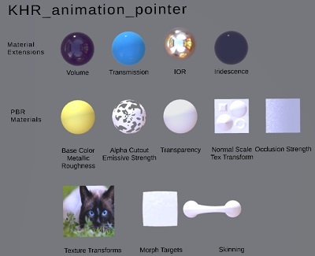
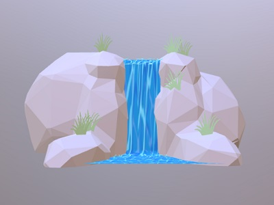
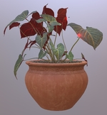
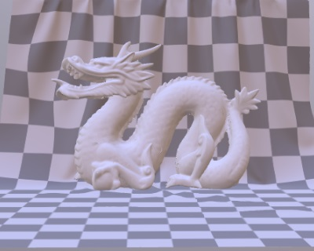
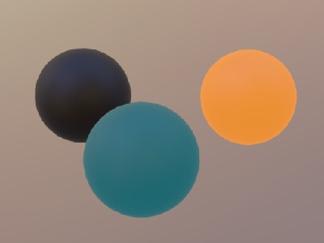
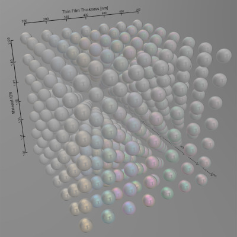
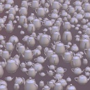

# gltf-test

The status of loading and viewing various glTF models using different [WebGL](https://www.khronos.org/webgl/) libraries.

## All Tests

[All Tests]( https://cx20.github.io/gltf-test/index.html ) : https://cx20.github.io/gltf-test/ 

If you want to narrow down the engine you can specify it with arguments. See below for usage of arguments.

```
https://cx20.github.io/gltf-test/?engines=Three.js,Babylon.js,Hilo3d
```

|Model Name           |Models  |Formats  |Libraries|Tests  |
|:--------------------|:------:|:-------:|:-------:|:-----:|
|Simple models        |  11    |   2     |   21    |   440 |
|More complex models  |  18    |   4     |   21    | 1,440 |
|PBR Sample           |   9    |   4     |   21    |   720 |
|Further PBR Sample   |   6    |   1     |   21    |   120 |
|Feature Test models  |  16    |   3     |   21    | 1,008 |
|Extension Test models|  16    |   1     |   21    |   336 |

The number of tests is approximate.

## Format Tests

Test environment : Windows 11 + Chrome 138

|Format and Sample Model                                                                                                                                                                                                               |[Three.js r179](https://github.com/mrdoob/three.js)                                                                                         |[Babylon.js 8.20.0](https://github.com/BabylonJS/Babylon.js)                                                                                     |[Filament v1.62.2](https://github.com/google/filament)                                                                           |[PlayCanvas 2.10.3](https://github.com/playcanvas/engine)                                                                                      |[Cesium.js 1.131](https://github.com/AnalyticalGraphicsInc/cesium/)                                                                |[ArcGIS JS API 4.31](https://developers.arcgis.com/javascript/)                                                                    |[Khronos glTF Viewer 2.0](https://github.com/KhronosGroup/glTF-Sample-Viewer)                                                                         |[ClayGL v1.3.0](https://github.com/pissang/claygl/blob/master/src/loader/GLTF.js)                                                              |[Hilo3d v1.18.0](https://github.com/hiloteam/Hilo3d)                                                                                           |[CZPG.js 2018.05.17](https://github.com/PrincessGod/CraZyPG)                                                                                |[RedCube.js v5.0.1](https://github.com/Reon90/redcube)                                                                                         |[RedGL 2021.07.19](https://github.com/redcamel/RedGL2)                                                                                        |[Ashes v0.5.0](https://github.com/but0n/Ashes)                                                                                                |[pex-renderer 3.0.0-34](https://github.com/pex-gl/pex-renderer)                                                                             |[RhodoniteTS v0.17.0](https://github.com/actnwit/RhodoniteTS)                                                                                     |
|--------------------------------------------------------------------------------------------------------------------------------------------------------------------------------------------------------------------------------------|--------------------------------------------------------------------------------------------------------------------------------------------|-------------------------------------------------------------------------------------------------------------------------------------------------|---------------------------------------------------------------------------------------------------------------------------------|-----------------------------------------------------------------------------------------------------------------------------------------------|-----------------------------------------------------------------------------------------------------------------------------------|-----------------------------------------------------------------------------------------------------------------------------------|------------------------------------------------------------------------------------------------------------------------------------------------------|-----------------------------------------------------------------------------------------------------------------------------------------------|-----------------------------------------------------------------------------------------------------------------------------------------------|--------------------------------------------------------------------------------------------------------------------------------------------|-----------------------------------------------------------------------------------------------------------------------------------------------|----------------------------------------------------------------------------------------------------------------------------------------------|----------------------------------------------------------------------------------------------------------------------------------------------|--------------------------------------------------------------------------------------------------------------------------------------------|--------------------------------------------------------------------------------------------------------------------------------------------------|
|[glTF 2.0](https://github.com/KhronosGroup/glTF/tree/master/specification/2.0)<br>[Duck/glTF](sampleModels/Duck/glTF)                                                                                                                 |:white_check_mark: [Sample](https://cx20.github.io/gltf-test/examples/threejs/index.html?model=Duck&scale=1&type=glTF)                      |:white_check_mark: [Sample](https://cx20.github.io/gltf-test/examples/babylonjs/index.html?model=Duck&scale=1&type=glTF)                         |:white_check_mark: [Sample](https://cx20.github.io/gltf-test/examples/filament/index.html?model=Duck&scale=1&type=glTF)          |:white_check_mark: [Sample](https://cx20.github.io/gltf-test/examples/playcanvas/index.html?model=Duck&scale=1&type=glTF)                      |:white_check_mark: [Sample](https://cx20.github.io/gltf-test/examples/cesium/index.html?model=Duck&type=glTF)                      |:white_check_mark: [Sample](https://cx20.github.io/gltf-test/examples/arcgisjsapi/index.html?model=Duck&type=glTF)                 |:white_check_mark: [Sample](https://cx20.github.io/gltf-test/examples/khronos-gltf-rv/index.html?model=Duck&scale=1&type=glTF)                        |:white_check_mark: [Sample](https://cx20.github.io/gltf-test/examples/claygl/index.html?model=Duck&scale=1&type=glTF)                          |:white_check_mark: [Sample](https://cx20.github.io/gltf-test/examples/Hilo3d/index.html?model=Duck&scale=1&type=glTF)                          |:white_check_mark: [Sample](https://cx20.github.io/gltf-test/examples/czpg/index.html?model=Duck&scale=1&type=glTF)                         |:white_check_mark: [Sample](https://cx20.github.io/gltf-test/examples/redcube/index.html?model=Duck&scale=1&type=glTF)                         |:white_check_mark: [Sample](https://cx20.github.io/gltf-test/examples/redgl2/index.html?model=Duck&scale=1&type=glTF)                         |:white_check_mark: [Sample](https://cx20.github.io/gltf-test/examples/ashes3d/index.html?model=Duck&scale=1&type=glTF)                        |:white_check_mark: [Sample](https://cx20.github.io/gltf-test/examples/pex/index.html?model=Duck&scale=1&type=glTF)                          |:white_check_mark: [Sample](https://cx20.github.io/gltf-test/examples/rhodonite/index.html?model=Duck&scale=1&type=glTF)                          |
|[glTF 2.0](https://github.com/KhronosGroup/glTF/tree/master/specification/2.0#uris) (Embedded resources)<br>[Duck/glTF-Embedded](sampleModels/Duck/glTF-Embedded)                                                                     |:white_check_mark: [Sample](https://cx20.github.io/gltf-test/examples/threejs/index.html?model=Duck&scale=1&type=glTF-Embedded)             |:white_check_mark: [Sample](https://cx20.github.io/gltf-test/examples/babylonjs/index.html?model=Duck&scale=1&type=glTF-Embedded)                |:white_check_mark: [Sample](https://cx20.github.io/gltf-test/examples/filament/index.html?model=Duck&scale=1&type=glTF-Embedded) |:white_check_mark: [Sample](https://cx20.github.io/gltf-test/examples/playcanvas/index.html?model=Duck&scale=1&type=glTF-Embedded)             |:white_check_mark: [Sample](https://cx20.github.io/gltf-test/examples/cesium/index.html?model=Duck&type=glTF-Embedded)             |:white_check_mark: [Sample](https://cx20.github.io/gltf-test/examples/arcgisjsapi/index.html?model=Duck&type=glTF-Embedded)        |:white_check_mark: [Sample](https://cx20.github.io/gltf-test/examples/khronos-gltf-rv/index.html?model=Duck&scale=1&type=glTF-Embedded)               |:white_check_mark: [Sample](https://cx20.github.io/gltf-test/examples/claygl/index.html?model=Duck&scale=1&type=glTF-Embedded)                 |:white_check_mark: [Sample](https://cx20.github.io/gltf-test/examples/Hilo3d/index.html?model=Duck&scale=1&type=glTF-Embedded)                 |:white_check_mark: [Sample](https://cx20.github.io/gltf-test/examples/czpg/index.html?model=Duck&scale=1&type=glTF-Embedded)                |:white_check_mark: [Sample](https://cx20.github.io/gltf-test/examples/redcube/index.html?model=Duck&scale=1&type=glTF-Embedded)                |:white_check_mark: [Sample](https://cx20.github.io/gltf-test/examples/redgl2/index.html?model=Duck&scale=1&type=glTF-Embedded)                |:white_check_mark: [Sample](https://cx20.github.io/gltf-test/examples/ashes3d/index.html?model=Duck&scale=1&type=glTF-Embedded)               |:white_check_mark: [Sample](https://cx20.github.io/gltf-test/examples/pex/index.html?model=Duck&scale=1&type=glTF-Embedded)                 |:white_check_mark: [Sample](https://cx20.github.io/gltf-test/examples/rhodonite/index.html?model=Duck&scale=1&type=glTF-Embedded)                 |
|[glTF 2.0](https://github.com/KhronosGroup/glTF/tree/master/specification/2.0#glb-file-format-specification) (Binary container) <br>[Duck/glTF-Binary](sampleModels/Duck/glTF-Binary)                                                 |:white_check_mark: [Sample](https://cx20.github.io/gltf-test/examples/threejs/index.html?model=Duck&scale=1&type=glTF-Binary)               |:white_check_mark: [Sample](https://cx20.github.io/gltf-test/examples/babylonjs/index.html?model=Duck&scale=1&type=glTF-Binary)                  |:white_check_mark: [Sample](https://cx20.github.io/gltf-test/examples/filament/index.html?model=Duck&scale=1&type=glTF-Binary)   |:white_check_mark: [Sample](https://cx20.github.io/gltf-test/examples/playcanvas/index.html?model=Duck&scale=1&type=glTF-Binary)               |:white_check_mark: [Sample](https://cx20.github.io/gltf-test/examples/cesium/index.html?model=Duck&type=glTF-Binary)               |:white_check_mark: [Sample](https://cx20.github.io/gltf-test/examples/arcgisjsapi/index.html?model=Duck&type=glTF-Binary)          |:white_check_mark: [Sample](https://cx20.github.io/gltf-test/examples/khronos-gltf-rv/index.html?model=Duck&scale=1&type=glTF-Binary)                 |:white_check_mark: [Sample](https://cx20.github.io/gltf-test/examples/claygl/index.html?model=Duck&scale=1&type=glTF-Binary)                   |:white_check_mark: [Sample](https://cx20.github.io/gltf-test/examples/Hilo3d/index.html?model=Duck&scale=1&type=glTF-Binary)                   |:white_check_mark: [Sample](https://cx20.github.io/gltf-test/examples/czpg/index.html?model=Duck&scale=1&type=glTF-Binary)                  |:white_check_mark: [Sample](https://cx20.github.io/gltf-test/examples/redcube/index.html?model=Duck&scale=1&type=glTF-Binary)                  |:white_check_mark: [Sample](https://cx20.github.io/gltf-test/examples/redgl2/index.html?model=Duck&scale=1&type=glTF-Binary)                  |:white_check_mark: [Sample](https://cx20.github.io/gltf-test/examples/ashes3d/index.html?model=Duck&scale=1&type=glTF-Binary)                 |:white_check_mark: [Sample](https://cx20.github.io/gltf-test/examples/pex/index.html?model=Duck&scale=1&type=glTF-Binary)                   |:white_check_mark: [Sample](https://cx20.github.io/gltf-test/examples/rhodonite/index.html?model=Duck&scale=1&type=glTF-Binary)                   |
|[KHR_draco_mesh_compression](https://github.com/KhronosGroup/glTF/tree/main/extensions/2.0/Khronos/KHR_draco_mesh_compression) <br>[Duck/glTF-Draco](sampleModels/Duck/glTF-Draco)                                                    |:white_check_mark: [Sample](https://cx20.github.io/gltf-test/examples/threejs/index.html?model=Duck&scale=1&type=glTF-Draco)                |:white_check_mark: [Sample](https://cx20.github.io/gltf-test/examples/babylonjs/index.html?model=Duck&scale=1&type=glTF-Draco)                   |:white_check_mark: [Sample](https://cx20.github.io/gltf-test/examples/filament/index.html?model=Duck&scale=1&type=glTF-Draco)    |:white_check_mark: [Sample](https://cx20.github.io/gltf-test/examples/playcanvas/index.html?model=Duck&scale=1&type=glTF-Draco)                |:white_check_mark: [Sample](https://cx20.github.io/gltf-test/examples/cesium/index.html?model=Duck&type=glTF-Draco)                |:x: [Sample](https://cx20.github.io/gltf-test/examples/arcgisjsapi/index.html?model=Duck&type=glTF-Draco)                          |:white_check_mark: [Sample](https://cx20.github.io/gltf-test/examples/khronos-gltf-rv/index.html?model=Duck&scale=1&type=glTF-Draco)                  |:x: [Sample](https://cx20.github.io/gltf-test/examples/claygl/index.html?model=Duck&scale=1&type=glTF-Draco)                                   |:white_check_mark: [Sample](https://cx20.github.io/gltf-test/examples/Hilo3d/index.html?model=Duck&scale=1&type=glTF-Draco)                    |:x: [Sample](https://cx20.github.io/gltf-test/examples/czpg/index.html?model=Duck&scale=1&type=glTF-Draco)                                  |:white_check_mark: [Sample](https://cx20.github.io/gltf-test/examples/redcube/index.html?model=Duck&scale=1&type=glTF-Draco)                   |:x: [Sample](https://cx20.github.io/gltf-test/examples/redgl2/index.html?model=Duck&scale=1&type=glTF-Draco)                                  |:x: [Sample](https://cx20.github.io/gltf-test/examples/ashes3d/index.html?model=Duck&scale=1&type=glTF-Draco)                                 |:x: [Sample](https://cx20.github.io/gltf-test/examples/pex/index.html?model=Duck&scale=1&type=glTF-Draco)                                   |:white_check_mark: [Sample](https://cx20.github.io/gltf-test/examples/rhodonite/index.html?model=Duck&scale=1&type=glTF-Draco)                    |
|[KHR_mesh_quantization](https://github.com/KhronosGroup/glTF/tree/main/extensions/2.0/Khronos/KHR_mesh_quantization) <br>[Duck/glTF-Quantized](sampleModels/Duck/glTF-Quantized)                                                      |:white_check_mark: [Sample](https://cx20.github.io/gltf-test/examples/threejs/index.html?model=Duck&scale=1&type=glTF-Quantized)            |:white_check_mark: [Sample](https://cx20.github.io/gltf-test/examples/babylonjs/index.html?model=Duck&scale=1&type=glTF-Quantized)               |:white_check_mark: [Sample](https://cx20.github.io/gltf-test/examples/filament/index.html?model=Duck&scale=1&type=glTF-Quantized)|:white_check_mark: [Sample](https://cx20.github.io/gltf-test/examples/playcanvas/index.html?model=Duck&scale=1&type=glTF-Quantized)            |:white_check_mark: [Sample](https://cx20.github.io/gltf-test/examples/cesium/index.html?model=Duck&type=glTF-Quantized)            |:x: [Sample](https://cx20.github.io/gltf-test/examples/arcgisjsapi/index.html?model=Duck&type=glTF-Quantized)                      |:white_check_mark: [Sample](https://cx20.github.io/gltf-test/examples/khronos-gltf-rv/index.html?model=Duck&scale=1&type=glTF-Quantized)              |:x: [Sample](https://cx20.github.io/gltf-test/examples/claygl/index.html?model=Duck&scale=1&type=glTF-Quantized)                               |:white_check_mark: [Sample](https://cx20.github.io/gltf-test/examples/Hilo3d/index.html?model=Duck&scale=1&type=glTF-Quantized)                |:x: [Sample](https://cx20.github.io/gltf-test/examples/czpg/index.html?model=Duck&scale=1&type=glTF-Quantized)                              |:white_check_mark: [Sample](https://cx20.github.io/gltf-test/examples/redcube/index.html?model=Duck&scale=1&type=glTF-Quantized)               |:x: [Sample](https://cx20.github.io/gltf-test/examples/redgl2/index.html?model=Duck&scale=1&type=glTF-Quantized)                              |:x: [Sample](https://cx20.github.io/gltf-test/examples/ashes3d/index.html?model=Duck&scale=1&type=glTF-Quantized)                             |:white_check_mark: [Sample](https://cx20.github.io/gltf-test/examples/pex/index.html?model=Duck&scale=1&type=glTF-Quantized)                |:white_check_mark: [Sample](https://cx20.github.io/gltf-test/examples/rhodonite/index.html?model=Duck&scale=1&type=glTF-Quantized)                |
|[KHR_texture_basisu](https://github.com/KhronosGroup/glTF/tree/main/extensions/2.0/Khronos/KHR_texture_basisu) <br>[FlightHelmet/glTF-KTX-BasisU](tutorialModels/FlightHelmet/glTF-KTX-BasisU)                                        |:white_check_mark: [Sample](https://cx20.github.io/gltf-test/examples/threejs/index.html?model=FlightHelmet&scale=3&type=glTF-KTX-BasisU)   |:white_check_mark: [Sample](https://cx20.github.io/gltf-test/examples/babylonjs/index.html?model=FlightHelmet&scale=3&type=glTF-KTX-BasisU)      |:white_check_mark: [Sample](https://cx20.github.io/gltf-test/examples/filament/index.html?model=FlightHelmet&scale=3&type=glTF-KTX-BasisU) |:white_check_mark: [Sample](https://cx20.github.io/gltf-test/examples/playcanvas/index.html?model=FlightHelmet&scale=3&type=glTF-KTX-BasisU)  |:white_check_mark: [Sample](https://cx20.github.io/gltf-test/examples/cesium/index.html?model=FlightHelmet&type=glTF-KTX-BasisU) |:x: [Sample](https://cx20.github.io/gltf-test/examples/arcgisjsapi/index.html?model=FlightHelmet&type=glTF-KTX-BasisU)      |:white_check_mark: [Sample](https://cx20.github.io/gltf-test/examples/khronos-gltf-rv/index.html?model=FlightHelmet&scale=3&type=glTF-KTX-BasisU)     |:x: [Sample](https://cx20.github.io/gltf-test/examples/claygl/index.html?model=FlightHelmet&scale=3&type=glTF-KTX-BasisU)                      |:x: [Sample](https://cx20.github.io/gltf-test/examples/Hilo3d/index.html?model=FlightHelmet&scale=3&type=glTF-KTX-BasisU)                      |:x: [Sample](https://cx20.github.io/gltf-test/examples/czpg/index.html?model=FlightHelmet&scale=3&type=glTF-KTX-BasisU)                     |:white_check_mark: [Sample](https://cx20.github.io/gltf-test/examples/redcube/index.html?model=FlightHelmet&scale=3&type=glTF-KTX-BasisU)      |:x: [Sample](https://cx20.github.io/gltf-test/examples/redgl2/index.html?model=FlightHelmet&scale=3&type=glTF-KTX-BasisU)                     |:x: [Sample](https://cx20.github.io/gltf-test/examples/ashes3d/index.html?model=FlightHelmet&scale=3&type=glTF-KTX-BasisU)                    |:x: [Sample](https://cx20.github.io/gltf-test/examples/pex/index.html?model=FlightHelmet&scale=3&type=glTF-KTX-BasisU)                          |:white_check_mark: [Sample](https://cx20.github.io/gltf-test/examples/rhodonite/index.html?model=FlightHelmet&scale=3&type=glTF-KTX-BasisU)           |

# [glTF 2.0 Sample Models](https://github.com/KhronosGroup/glTF-Sample-Models/blob/master/2.0/README.md#gltf-20-sample-models)

## [Simple models for testing individual features](https://github.com/KhronosGroup/glTF-Sample-Models/blob/master/2.0/README.md#simple-models-for-testing-individual-features)

Test environment : Windows 11 + Chrome 138

|Model                                                                 |Screenshot                                                          |[Three.js r179](https://github.com/mrdoob/three.js)                                                                                                             |[Babylon.js 8.20.0](https://github.com/BabylonJS/Babylon.js)                                                                                                            |[Filament v1.62.2](https://github.com/google/filament)                                                                                                             |[PlayCanvas 2.10.3](https://github.com/playcanvas/engine)                                                                                                          |[Cesium.js 1.131](https://github.com/AnalyticalGraphicsInc/cesium/)                                                                                                      |[ArcGIS JS API 4.31](https://developers.arcgis.com/javascript/)                                                                                                               |[Khronos glTF Viewer 2.0](https://github.com/KhronosGroup/glTF-Sample-Viewer)                                                                                               |[ClayGL v1.3.0](https://github.com/pissang/claygl/blob/master/src/loader/GLTF.js)                                                                              |[Hilo3d v1.18.0](https://github.com/hiloteam/Hilo3d)                                                                                                           |[X3DOM 1.8.3](https://github.com/x3dom/x3dom/blob/master/src/util/glTF/glTF2Loader.js)                                                                        |[CZPG.js 2018.05.17](https://github.com/PrincessGod/CraZyPG)                                                                                                  |[RedCube.js v5.0.1](https://github.com/Reon90/redcube)                                                                                                           |[RedGL 2021.07.19](https://github.com/redcamel/RedGL2)                                                                                                                   |[Ashes v0.5.0](https://github.com/but0n/Ashes)                                                                                                                    |[pex-renderer 3.0.0-34](https://github.com/pex-gl/pex-renderer)                                                                                               |[RhodoniteTS v0.17.0](https://github.com/actnwit/RhodoniteTS)                                                                                                       |
|----------------------------------------------------------------------|--------------------------------------------------------------------|----------------------------------------------------------------------------------------------------------------------------------------------------------------|------------------------------------------------------------------------------------------------------------------------------------------------------------------------|-------------------------------------------------------------------------------------------------------------------------------------------------------------------|-------------------------------------------------------------------------------------------------------------------------------------------------------------------|-------------------------------------------------------------------------------------------------------------------------------------------------------------------------|------------------------------------------------------------------------------------------------------------------------------------------------------------------------------|----------------------------------------------------------------------------------------------------------------------------------------------------------------------------|---------------------------------------------------------------------------------------------------------------------------------------------------------------|---------------------------------------------------------------------------------------------------------------------------------------------------------------|--------------------------------------------------------------------------------------------------------------------------------------------------------------|--------------------------------------------------------------------------------------------------------------------------------------------------------------|-----------------------------------------------------------------------------------------------------------------------------------------------------------------|-------------------------------------------------------------------------------------------------------------------------------------------------------------------------|------------------------------------------------------------------------------------------------------------------------------------------------------------------|--------------------------------------------------------------------------------------------------------------------------------------------------------------|--------------------------------------------------------------------------------------------------------------------------------------------------------------------|
|[Triangle Without Indices](tutorialModels/TriangleWithoutIndices)     ||:white_check_mark: [Sample](https://cx20.github.io/gltf-test/examples/threejs/index.html?category=tutorialModels&model=TriangleWithoutIndices&scale=1&type=glTF)|:white_check_mark: [Sample](https://cx20.github.io/gltf-test/examples/babylonjs/index.html?category=tutorialModels&model=TriangleWithoutIndices&scale=1&type=glTF)      |:white_check_mark: [Sample](https://cx20.github.io/gltf-test/examples/filament/index.html?category=tutorialModels&model=TriangleWithoutIndices&scale=1&type=glTF)  |:white_check_mark: [Sample](https://cx20.github.io/gltf-test/examples/playcanvas/index.html?category=tutorialModels&model=TriangleWithoutIndices&scale=1&type=glTF)|:white_check_mark: [Sample](https://cx20.github.io/gltf-test/examples/cesium/index.html?category=tutorialModels&model=TriangleWithoutIndices&scale=1&type=glTF)          |:white_check_mark: [Sample](https://cx20.github.io/gltf-test/examples/arcgisjsapi/index.html?category=tutorialModels&model=TriangleWithoutIndices&scale=1&type=glTF)          |:white_check_mark: [Sample](https://cx20.github.io/gltf-test/examples/khronos-gltf-rv/index.html?category=tutorialModels&model=TriangleWithoutIndices&scale=1&type=glTF)    |:white_check_mark: [Sample](https://cx20.github.io/gltf-test/examples/claygl/index.html?category=tutorialModels&model=TriangleWithoutIndices&scale=1&type=glTF)|:white_check_mark: [Sample](https://cx20.github.io/gltf-test/examples/Hilo3d/index.html?category=tutorialModels&model=TriangleWithoutIndices&scale=1&type=glTF)|:white_check_mark: [Sample](https://cx20.github.io/gltf-test/examples/x3dom/index.html?category=tutorialModels&model=TriangleWithoutIndices&scale=1&type=glTF)|:white_check_mark: [Sample](https://cx20.github.io/gltf-test/examples/czpg/index.html?category=tutorialModels&model=TriangleWithoutIndices&scale=1&type=glTF) |:white_check_mark: [Sample](https://cx20.github.io/gltf-test/examples/redcube/index.html?category=tutorialModels&model=TriangleWithoutIndices&scale=1&type=glTF) |:white_check_mark: [Sample](https://cx20.github.io/gltf-test/examples/redgl2/index.html?category=tutorialModels&model=TriangleWithoutIndices&scale=1&type=glTF)          |:x: [Sample](https://cx20.github.io/gltf-test/examples/ashes3d/index.html?category=tutorialModels&model=TriangleWithoutIndices&scale=1&type=glTF)                 |:white_check_mark: [Sample](https://cx20.github.io/gltf-test/examples/pex/index.html?category=tutorialModels&model=TriangleWithoutIndices&scale=1&type=glTF)  |:white_check_mark: [Sample](https://cx20.github.io/gltf-test/examples/rhodonite/index.html?category=tutorialModels&model=TriangleWithoutIndices&scale=1&type=glTF)  |
|[Triangle](tutorialModels/Triangle)                                   |              |:white_check_mark: [Sample](https://cx20.github.io/gltf-test/examples/threejs/index.html?category=tutorialModels&model=Triangle&scale=1&type=glTF)              |:white_check_mark: [Sample](https://cx20.github.io/gltf-test/examples/babylonjs/index.html?category=tutorialModels&model=Triangle&scale=1&type=glTF)                    |:white_check_mark: [Sample](https://cx20.github.io/gltf-test/examples/filament/index.html?category=tutorialModels&model=Triangle&scale=1&type=glTF)                |:white_check_mark: [Sample](https://cx20.github.io/gltf-test/examples/playcanvas/index.html?category=tutorialModels&model=Triangle&scale=1&type=glTF)              |:white_check_mark: [Sample](https://cx20.github.io/gltf-test/examples/cesium/index.html?category=tutorialModels&model=Triangle&scale=1&type=glTF)                        |:white_check_mark: [Sample](https://cx20.github.io/gltf-test/examples/arcgisjsapi/index.html?category=tutorialModels&model=Triangle&scale=1&type=glTF)                        |:white_check_mark: [Sample](https://cx20.github.io/gltf-test/examples/khronos-gltf-rv/index.html?category=tutorialModels&model=Triangle&scale=1&type=glTF)                  |:white_check_mark: [Sample](https://cx20.github.io/gltf-test/examples/claygl/index.html?category=tutorialModels&model=Triangle&scale=1&type=glTF)              |:white_check_mark: [Sample](https://cx20.github.io/gltf-test/examples/Hilo3d/index.html?category=tutorialModels&model=Triangle&scale=1&type=glTF)              |:white_check_mark: [Sample](https://cx20.github.io/gltf-test/examples/x3dom/index.html?category=tutorialModels&model=Triangle&scale=1&type=glTF)              |:white_check_mark: [Sample](https://cx20.github.io/gltf-test/examples/czpg/index.html?category=tutorialModels&model=Triangle&scale=1&type=glTF)               |:white_check_mark: [Sample](https://cx20.github.io/gltf-test/examples/redcube/index.html?category=tutorialModels&model=Triangle&scale=1&type=glTF)               |:white_check_mark: [Sample](https://cx20.github.io/gltf-test/examples/redgl2/index.html?category=tutorialModels&model=Triangle&scale=1&type=glTF)                        |:white_check_mark: [Sample](https://cx20.github.io/gltf-test/examples/ashes3d/index.html?category=tutorialModels&model=Triangle&scale=1&type=glTF)                |:white_check_mark: [Sample](https://cx20.github.io/gltf-test/examples/pex/index.html?category=tutorialModels&model=Triangle&scale=1&type=glTF)                |:white_check_mark: [Sample](https://cx20.github.io/gltf-test/examples/rhodonite/index.html?category=tutorialModels&model=Triangle&scale=1&type=glTF)                |
|[Animated Triangle](tutorialModels/AnimatedTriangle)                  |      |:white_check_mark: [Sample](https://cx20.github.io/gltf-test/examples/threejs/index.html?category=tutorialModels&model=AnimatedTriangle&scale=1&type=glTF)      |:white_check_mark: [Sample](https://cx20.github.io/gltf-test/examples/babylonjs/index.html?category=tutorialModels&model=AnimatedTriangle&scale=1&type=glTF)            |:white_check_mark: [Sample](https://cx20.github.io/gltf-test/examples/filament/index.html?category=tutorialModels&model=AnimatedTriangle&scale=1&type=glTF)        |:white_check_mark: [Sample](https://cx20.github.io/gltf-test/examples/playcanvas/index.html?category=tutorialModels&model=AnimatedTriangle&scale=1&type=glTF)      |:white_check_mark: [Sample](https://cx20.github.io/gltf-test/examples/cesium/index.html?category=tutorialModels&model=AnimatedTriangle&scale=1&type=glTF)                |:x: [Sample](https://cx20.github.io/gltf-test/examples/arcgisjsapi/index.html?category=tutorialModels&model=AnimatedTriangle&scale=1&type=glTF) no animation support          |:white_check_mark: [Sample](https://cx20.github.io/gltf-test/examples/khronos-gltf-rv/index.html?category=tutorialModels&model=AnimatedTriangle&scale=1&type=glTF)          |:white_check_mark: [Sample](https://cx20.github.io/gltf-test/examples/claygl/index.html?category=tutorialModels&model=AnimatedTriangle&scale=1&type=glTF)      |:white_check_mark: [Sample](https://cx20.github.io/gltf-test/examples/Hilo3d/index.html?category=tutorialModels&model=AnimatedTriangle&scale=1&type=glTF)      |:white_check_mark: [Sample](https://cx20.github.io/gltf-test/examples/x3dom/index.html?category=tutorialModels&model=AnimatedTriangle&scale=1&type=glTF)      |:white_check_mark: [Sample](https://cx20.github.io/gltf-test/examples/czpg/index.html?category=tutorialModels&model=AnimatedTriangle&scale=1&type=glTF)       |:white_check_mark: [Sample](https://cx20.github.io/gltf-test/examples/redcube/index.html?category=tutorialModels&model=AnimatedTriangle&scale=1&type=glTF)       |:white_check_mark: [Sample](https://cx20.github.io/gltf-test/examples/redgl2/index.html?category=tutorialModels&model=AnimatedTriangle&scale=1&type=glTF)                |:white_check_mark: [Sample](https://cx20.github.io/gltf-test/examples/ashes3d/index.html?category=tutorialModels&model=AnimatedTriangle&scale=1&type=glTF)        |:white_check_mark: [Sample](https://cx20.github.io/gltf-test/examples/pex/index.html?category=tutorialModels&model=AnimatedTriangle&scale=1&type=glTF)        |:white_check_mark: [Sample](https://cx20.github.io/gltf-test/examples/rhodonite/index.html?category=tutorialModels&model=AnimatedTriangle&scale=1&type=glTF)        |
|[Simple Morph](tutorialModels/SimpleMorph)                            |           |:white_check_mark: [Sample](https://cx20.github.io/gltf-test/examples/threejs/index.html?category=tutorialModels&model=SimpleMorph&scale=1&type=glTF)           |:white_check_mark: [Sample](https://cx20.github.io/gltf-test/examples/babylonjs/index.html?category=tutorialModels&model=SimpleMorph&scale=1&type=glTF)                 |:white_check_mark: [Sample](https://cx20.github.io/gltf-test/examples/filament/index.html?category=tutorialModels&model=SimpleMorph&scale=1&type=glTF)             |:white_check_mark: [Sample](https://cx20.github.io/gltf-test/examples/playcanvas/index.html?category=tutorialModels&model=SimpleMorph&scale=1&type=glTF)           |:white_check_mark: [Sample](https://cx20.github.io/gltf-test/examples/cesium/index.html?category=tutorialModels&model=SimpleMorph&scale=1&type=glTF)                     |:x: [Sample](https://cx20.github.io/gltf-test/examples/arcgisjsapi/index.html?category=tutorialModels&model=SimpleMorph&scale=1&type=glTF)                                    |:white_check_mark: [Sample](https://cx20.github.io/gltf-test/examples/khronos-gltf-rv/index.html?category=tutorialModels&model=SimpleMorph&scale=1&type=glTF)               |:x: [Sample](https://cx20.github.io/gltf-test/examples/claygl/index.html?category=tutorialModels&model=SimpleMorph&scale=1&type=glTF)                          |:white_check_mark: [Sample](https://cx20.github.io/gltf-test/examples/Hilo3d/index.html?category=tutorialModels&model=SimpleMorph&scale=1&type=glTF)           |:x: [Sample](https://cx20.github.io/gltf-test/examples/x3dom/index.html?category=tutorialModels&model=SimpleMorph&scale=1&type=glTF)                          |:white_check_mark: [Sample](https://cx20.github.io/gltf-test/examples/czpg/index.html?category=tutorialModels&model=SimpleMorph&scale=1&type=glTF)            |:white_check_mark: [Sample](https://cx20.github.io/gltf-test/examples/redcube/index.html?category=tutorialModels&model=SimpleMorph&scale=1&type=glTF)            |:white_check_mark: [Sample](https://cx20.github.io/gltf-test/examples/redgl2/index.html?category=tutorialModels&model=SimpleMorph&scale=1&type=glTF)                     |:x: [Sample](https://cx20.github.io/gltf-test/examples/ashes3d/index.html?category=tutorialModels&model=SimpleMorph&scale=1&type=glTF)                            |:white_check_mark: [Sample](https://cx20.github.io/gltf-test/examples/pex/index.html?category=tutorialModels&model=SimpleMorph&scale=1&type=glTF)             |:white_check_mark: [Sample](https://cx20.github.io/gltf-test/examples/rhodonite/index.html?category=tutorialModels&model=SimpleMorph&scale=1&type=glTF)             |
|[Simple Sparse Accessor](tutorialModels/SimpleSparseAccessor)         |  |:white_check_mark: [Sample](https://cx20.github.io/gltf-test/examples/threejs/index.html?category=tutorialModels&model=SimpleSparseAccessor&scale=1&type=glTF)  |:white_check_mark: [Sample](https://cx20.github.io/gltf-test/examples/babylonjs/index.html?category=tutorialModels&model=SimpleSparseAccessor&scale=1&type=glTF)        |:white_check_mark: [Sample](https://cx20.github.io/gltf-test/examples/filament/index.html?category=tutorialModels&model=SimpleSparseAccessor&scale=1&type=glTF)    |:white_check_mark: [Sample](https://cx20.github.io/gltf-test/examples/playcanvas/index.html?category=tutorialModels&model=SimpleSparseAccessor&scale=1&type=glTF)  |:x: [Sample](https://cx20.github.io/gltf-test/examples/cesium/index.html?category=tutorialModels&model=SimpleSparseAccessor&scale=1&type=glTF)                           |:x: [Sample](https://cx20.github.io/gltf-test/examples/arcgisjsapi/index.html?category=tutorialModels&model=SimpleSparseAccessor&scale=1&type=glTF)                           |:white_check_mark: [Sample](https://cx20.github.io/gltf-test/examples/khronos-gltf-rv/index.html?category=tutorialModels&model=SimpleSparseAccessor&scale=1&type=glTF)      |:x: [Sample](https://cx20.github.io/gltf-test/examples/claygl/index.html?category=tutorialModels&model=SimpleSparseAccessor&scale=1&type=glTF)                 |:white_check_mark: [Sample](https://cx20.github.io/gltf-test/examples/Hilo3d/index.html?category=tutorialModels&model=SimpleSparseAccessor&scale=1&type=glTF)  |:x: [Sample](https://cx20.github.io/gltf-test/examples/x3dom/index.html?category=tutorialModels&model=SimpleSparseAccessor&scale=1&type=glTF)                 |:white_check_mark: [Sample](https://cx20.github.io/gltf-test/examples/czpg/index.html?category=tutorialModels&model=SimpleSparseAccessor&scale=1&type=glTF)   |:white_check_mark: [Sample](https://cx20.github.io/gltf-test/examples/redcube/index.html?category=tutorialModels&model=SimpleSparseAccessor&scale=1&type=glTF)   |:white_check_mark: [Sample](https://cx20.github.io/gltf-test/examples/redgl2/index.html?category=tutorialModels&model=SimpleSparseAccessor&scale=1&type=glTF)            |:x: [Sample](https://cx20.github.io/gltf-test/examples/ashes3d/index.html?category=tutorialModels&model=SimpleSparseAccessor&scale=1&type=glTF)                   |:white_check_mark: [Sample](https://cx20.github.io/gltf-test/examples/pex/index.html?category=tutorialModels&model=SimpleSparseAccessor&scale=1&type=glTF)    |:white_check_mark: [Sample](https://cx20.github.io/gltf-test/examples/rhodonite/index.html?category=tutorialModels&model=SimpleSparseAccessor&scale=1&type=glTF)    |
|[Animated Morph Cube](tutorialModels/AnimatedMorphCube)               |     |:white_check_mark: [Sample](https://cx20.github.io/gltf-test/examples/threejs/index.html?category=tutorialModels&model=AnimatedMorphCube&scale=1&type=glTF)     |:white_check_mark: [Sample](https://cx20.github.io/gltf-test/examples/babylonjs/index.html?category=tutorialModels&model=AnimatedMorphCube&scale=1&type=glTF)           |:white_check_mark: [Sample](https://cx20.github.io/gltf-test/examples/filament/index.html?category=tutorialModels&model=AnimatedMorphCube&scale=1&type=glTF)       |:white_check_mark: [Sample](https://cx20.github.io/gltf-test/examples/playcanvas/index.html?category=tutorialModels&model=AnimatedMorphCube&scale=1&type=glTF)     |:white_check_mark: [Sample](https://cx20.github.io/gltf-test/examples/cesium/index.html?category=tutorialModels&model=AnimatedMorphCube&scale=1&type=glTF)               |:x: [Sample](https://cx20.github.io/gltf-test/examples/arcgisjsapi/index.html?category=tutorialModels&model=AnimatedMorphCube&scale=1&type=glTF) no animation support         |:white_check_mark: [Sample](https://cx20.github.io/gltf-test/examples/khronos-gltf-rv/index.html?category=tutorialModels&model=AnimatedMorphCube&scale=1&type=glTF)         |:x: [Sample](https://cx20.github.io/gltf-test/examples/claygl/index.html?category=tutorialModels&model=AnimatedMorphCube&scale=1&type=glTF)                    |:white_check_mark: [Sample](https://cx20.github.io/gltf-test/examples/Hilo3d/index.html?category=tutorialModels&model=AnimatedMorphCube&scale=1&type=glTF)     |:x: [Sample](https://cx20.github.io/gltf-test/examples/x3dom/index.html?category=tutorialModels&model=AnimatedMorphCube&scale=1&type=glTF)                    |:white_check_mark: [Sample](https://cx20.github.io/gltf-test/examples/czpg/index.html?category=tutorialModels&model=AnimatedMorphCube&scale=1&type=glTF)      |:white_check_mark: [Sample](https://cx20.github.io/gltf-test/examples/redcube/index.html?category=tutorialModels&model=AnimatedMorphCube&scale=1&type=glTF)      |:white_check_mark: [Sample](https://cx20.github.io/gltf-test/examples/redgl2/index.html?category=tutorialModels&model=AnimatedMorphCube&scale=1&type=glTF)               |:x: [Sample](https://cx20.github.io/gltf-test/examples/ashes3d/index.html?category=tutorialModels&model=AnimatedMorphCube&scale=1&type=glTF)                      |:white_check_mark: [Sample](https://cx20.github.io/gltf-test/examples/pex/index.html?category=tutorialModels&model=AnimatedMorphCube&scale=1&type=glTF)       |:white_check_mark: [Sample](https://cx20.github.io/gltf-test/examples/rhodonite/index.html?category=tutorialModels&model=AnimatedMorphCube&scale=1&type=glTF)       |
|[Animated Morph Sphere](tutorialModels/AnimatedMorphSphere)           |   |:white_check_mark: [Sample](https://cx20.github.io/gltf-test/examples/threejs/index.html?category=tutorialModels&model=AnimatedMorphSphere&scale=1&type=glTF)   |:white_check_mark: [Sample](https://cx20.github.io/gltf-test/examples/babylonjs/index.html?category=tutorialModels&model=AnimatedMorphSphere&scale=1&type=glTF)         |:white_check_mark: [Sample](https://cx20.github.io/gltf-test/examples/filament/index.html?category=tutorialModels&model=AnimatedMorphSphere&scale=1&type=glTF)     |:white_check_mark: [Sample](https://cx20.github.io/gltf-test/examples/playcanvas/index.html?category=tutorialModels&model=AnimatedMorphSphere&scale=1&type=glTF)   |:white_check_mark: [Sample](https://cx20.github.io/gltf-test/examples/cesium/index.html?category=tutorialModels&model=AnimatedMorphSphere&scale=1&type=glTF)             |:x: [Sample](https://cx20.github.io/gltf-test/examples/arcgisjsapi/index.html?category=tutorialModels&model=AnimatedMorphSphere&scale=1&type=glTF) no animation support       |:white_check_mark: [Sample](https://cx20.github.io/gltf-test/examples/khronos-gltf-rv/index.html?category=tutorialModels&model=AnimatedMorphSphere&scale=1&type=glTF)       |:x: [Sample](https://cx20.github.io/gltf-test/examples/claygl/index.html?category=tutorialModels&model=AnimatedMorphSphere&scale=1&type=glTF)                  |:white_check_mark: [Sample](https://cx20.github.io/gltf-test/examples/Hilo3d/index.html?category=tutorialModels&model=AnimatedMorphSphere&scale=1&type=glTF)   |:x: [Sample](https://cx20.github.io/gltf-test/examples/x3dom/index.html?category=tutorialModels&model=AnimatedMorphSphere&scale=1&type=glTF)                  |:white_check_mark: [Sample](https://cx20.github.io/gltf-test/examples/czpg/index.html?category=tutorialModels&model=AnimatedMorphSphere&scale=1&type=glTF)    |:white_check_mark: [Sample](https://cx20.github.io/gltf-test/examples/redcube/index.html?category=tutorialModels&model=AnimatedMorphSphere&scale=1&type=glTF)    |:white_check_mark: [Sample](https://cx20.github.io/gltf-test/examples/redgl2/index.html?category=tutorialModels&model=AnimatedMorphSphere&scale=1&type=glTF)             |:x: [Sample](https://cx20.github.io/gltf-test/examples/ashes3d/index.html?category=tutorialModels&model=AnimatedMorphSphere&scale=1&type=glTF)                    |:white_check_mark: [Sample](https://cx20.github.io/gltf-test/examples/pex/index.html?category=tutorialModels&model=AnimatedMorphSphere&scale=1&type=glTF)     |:white_check_mark: [Sample](https://cx20.github.io/gltf-test/examples/rhodonite/index.html?category=tutorialModels&model=AnimatedMorphSphere&scale=1&type=glTF)     |
|[Simple Material](tutorialModels/SimpleMaterial)                      |        |:white_check_mark: [Sample](https://cx20.github.io/gltf-test/examples/threejs/index.html?category=tutorialModels&model=SimpleMaterial&scale=1&type=glTF)        |:white_check_mark: [Sample](https://cx20.github.io/gltf-test/examples/babylonjs/index.html?category=tutorialModels&model=SimpleMaterial&scale=1&type=glTF)              |:white_check_mark: [Sample](https://cx20.github.io/gltf-test/examples/filament/index.html?category=tutorialModels&model=SimpleMaterial&scale=1&type=glTF)          |:white_check_mark: [Sample](https://cx20.github.io/gltf-test/examples/playcanvas/index.html?category=tutorialModels&model=SimpleMaterial&scale=1&type=glTF)        |:white_check_mark: [Sample](https://cx20.github.io/gltf-test/examples/cesium/index.html?category=tutorialModels&model=SimpleMaterial&scale=1&type=glTF)                  |:white_check_mark: [Sample](https://cx20.github.io/gltf-test/examples/arcgisjsapi/index.html?category=tutorialModels&model=SimpleMaterial&scale=1&type=glTF)                  |:white_check_mark: [Sample](https://cx20.github.io/gltf-test/examples/khronos-gltf-rv/index.html?category=tutorialModels&model=SimpleMaterial&scale=1&type=glTF)            |:white_check_mark: [Sample](https://cx20.github.io/gltf-test/examples/claygl/index.html?category=tutorialModels&model=SimpleMaterial&scale=1&type=glTF)        |:white_check_mark: [Sample](https://cx20.github.io/gltf-test/examples/Hilo3d/index.html?category=tutorialModels&model=SimpleMaterial&scale=1&type=glTF)        |:white_check_mark: [Sample](https://cx20.github.io/gltf-test/examples/x3dom/index.html?category=tutorialModels&model=SimpleMaterial&scale=1&type=glTF)        |:white_check_mark: [Sample](https://cx20.github.io/gltf-test/examples/czpg/index.html?category=tutorialModels&model=SimpleMaterial&scale=1&type=glTF)         |:white_check_mark: [Sample](https://cx20.github.io/gltf-test/examples/redcube/index.html?category=tutorialModels&model=SimpleMaterial&scale=1&type=glTF)         |:white_check_mark: [Sample](https://cx20.github.io/gltf-test/examples/redgl2/index.html?category=tutorialModels&model=SimpleMaterial&scale=1&type=glTF)                  |:white_check_mark: [Sample](https://cx20.github.io/gltf-test/examples/ashes3d/index.html?category=tutorialModels&model=SimpleMaterial&scale=1&type=glTF)          |:white_check_mark: [Sample](https://cx20.github.io/gltf-test/examples/pex/index.html?category=tutorialModels&model=SimpleMaterial&scale=1&type=glTF)          |:white_check_mark: [Sample](https://cx20.github.io/gltf-test/examples/rhodonite/index.html?category=tutorialModels&model=SimpleMaterial&scale=1&type=glTF)          |
|[Simple Meshes](tutorialModels/SimpleMeshes)                          |          |:white_check_mark: [Sample](https://cx20.github.io/gltf-test/examples/threejs/index.html?category=tutorialModels&model=SimpleMeshes&scale=1&type=glTF)          |:white_check_mark: [Sample](https://cx20.github.io/gltf-test/examples/babylonjs/index.html?category=tutorialModels&model=SimpleMeshes&scale=1&type=glTF)                |:white_check_mark: [Sample](https://cx20.github.io/gltf-test/examples/filament/index.html?category=tutorialModels&model=SimpleMeshes&scale=1&type=glTF)            |:white_check_mark: [Sample](https://cx20.github.io/gltf-test/examples/playcanvas/index.html?category=tutorialModels&model=SimpleMeshes&scale=1&type=glTF)          |:white_check_mark: [Sample](https://cx20.github.io/gltf-test/examples/cesium/index.html?category=tutorialModels&model=SimpleMeshes&scale=1&type=glTF)                    |:white_check_mark: [Sample](https://cx20.github.io/gltf-test/examples/arcgisjsapi/index.html?category=tutorialModels&model=SimpleMeshes&scale=1&type=glTF)                    |:white_check_mark: [Sample](https://cx20.github.io/gltf-test/examples/khronos-gltf-rv/index.html?category=tutorialModels&model=SimpleMeshes&scale=1&type=glTF)              |:white_check_mark: [Sample](https://cx20.github.io/gltf-test/examples/claygl/index.html?category=tutorialModels&model=SimpleMeshes&scale=1&type=glTF)          |:white_check_mark: [Sample](https://cx20.github.io/gltf-test/examples/Hilo3d/index.html?category=tutorialModels&model=SimpleMeshes&scale=1&type=glTF)          |:white_check_mark: [Sample](https://cx20.github.io/gltf-test/examples/x3dom/index.html?category=tutorialModels&model=SimpleMeshes&scale=1&type=glTF)          |:white_check_mark: [Sample](https://cx20.github.io/gltf-test/examples/czpg/index.html?category=tutorialModels&model=SimpleMeshes&scale=1&type=glTF)           |:white_check_mark: [Sample](https://cx20.github.io/gltf-test/examples/redcube/index.html?category=tutorialModels&model=SimpleMeshes&scale=1&type=glTF)           |:white_check_mark: [Sample](https://cx20.github.io/gltf-test/examples/redgl2/index.html?category=tutorialModels&model=SimpleMeshes&scale=1&type=glTF)                    |:white_check_mark: [Sample](https://cx20.github.io/gltf-test/examples/ashes3d/index.html?category=tutorialModels&model=SimpleMeshes&scale=1&type=glTF)            |:white_check_mark: [Sample](https://cx20.github.io/gltf-test/examples/pex/index.html?category=tutorialModels&model=SimpleMeshes&scale=1&type=glTF)            |:white_check_mark: [Sample](https://cx20.github.io/gltf-test/examples/rhodonite/index.html?category=tutorialModels&model=SimpleMeshes&scale=1&type=glTF)            |
|[Simple Texture](tutorialModels/SimpleTexture)                        |         |:white_check_mark: [Sample](https://cx20.github.io/gltf-test/examples/threejs/index.html?category=tutorialModels&model=SimpleTexture&scale=1&type=glTF)         |:white_check_mark: [Sample](https://cx20.github.io/gltf-test/examples/babylonjs/index.html?category=tutorialModels&model=SimpleTexture&scale=1&type=glTF)               |:white_check_mark: [Sample](https://cx20.github.io/gltf-test/examples/filament/index.html?category=tutorialModels&model=SimpleTexture&scale=1&type=glTF)           |:white_check_mark: [Sample](https://cx20.github.io/gltf-test/examples/playcanvas/index.html?category=tutorialModels&model=SimpleTexture&scale=1&type=glTF)         |:white_check_mark: [Sample](https://cx20.github.io/gltf-test/examples/cesium/index.html?category=tutorialModels&model=SimpleTexture&scale=1&type=glTF)                   |:white_check_mark: [Sample](https://cx20.github.io/gltf-test/examples/arcgisjsapi/index.html?category=tutorialModels&model=SimpleTexture&scale=1&type=glTF)                   |:white_check_mark: [Sample](https://cx20.github.io/gltf-test/examples/khronos-gltf-rv/index.html?category=tutorialModels&model=SimpleTexture&scale=1&type=glTF)             |:x: [Sample](https://cx20.github.io/gltf-test/examples/claygl/index.html?category=tutorialModels&model=SimpleTexture&scale=1&type=glTF)                        |:white_check_mark: [Sample](https://cx20.github.io/gltf-test/examples/Hilo3d/index.html?category=tutorialModels&model=SimpleTexture&scale=1&type=glTF)         |:white_check_mark: [Sample](https://cx20.github.io/gltf-test/examples/x3dom/index.html?category=tutorialModels&model=SimpleTexture&scale=1&type=glTF)         |:white_check_mark: [Sample](https://cx20.github.io/gltf-test/examples/czpg/index.html?category=tutorialModels&model=SimpleTexture&scale=1&type=glTF)          |:white_check_mark: [Sample](https://cx20.github.io/gltf-test/examples/redcube/index.html?category=tutorialModels&model=SimpleTexture&scale=1&type=glTF)          |:white_check_mark: [Sample](https://cx20.github.io/gltf-test/examples/redgl2/index.html?category=tutorialModels&model=SimpleTexture&scale=1&type=glTF)                   |:white_check_mark: [Sample](https://cx20.github.io/gltf-test/examples/ashes3d/index.html?category=tutorialModels&model=SimpleTexture&scale=1&type=glTF)           |:white_check_mark: [Sample](https://cx20.github.io/gltf-test/examples/pex/index.html?category=tutorialModels&model=SimpleTexture&scale=1&type=glTF)           |:white_check_mark: [Sample](https://cx20.github.io/gltf-test/examples/rhodonite/index.html?category=tutorialModels&model=SimpleTexture&scale=1&type=glTF)           |
|[Cameras](tutorialModels/Cameras)                                     |               |:white_check_mark: [Sample](https://cx20.github.io/gltf-test/examples/threejs/index.html?category=tutorialModels&model=Cameras&scale=1&type=glTF)               |:white_check_mark: [Sample](https://cx20.github.io/gltf-test/examples/babylonjs/index.html?category=tutorialModels&model=Cameras&scale=1&type=glTF)                     |:white_check_mark: [Sample](https://cx20.github.io/gltf-test/examples/filament/index.html?category=tutorialModels&model=Cameras&scale=1&type=glTF)                 |:white_check_mark: [Sample](https://cx20.github.io/gltf-test/examples/playcanvas/index.html?category=tutorialModels&model=Cameras&scale=1&type=glTF)               |:white_check_mark: [Sample](https://cx20.github.io/gltf-test/examples/cesium/index.html?category=tutorialModels&model=Cameras&scale=1&type=glTF)                         |:white_check_mark: [Sample](https://cx20.github.io/gltf-test/examples/arcgisjsapi/index.html?category=tutorialModels&model=Cameras&scale=1&type=glTF)                         |:white_check_mark: [Sample](https://cx20.github.io/gltf-test/examples/khronos-gltf-rv/index.html?category=tutorialModels&model=Cameras&scale=1&type=glTF)                   |:white_check_mark: [Sample](https://cx20.github.io/gltf-test/examples/claygl/index.html?category=tutorialModels&model=Cameras&scale=1&type=glTF)               |:white_check_mark: [Sample](https://cx20.github.io/gltf-test/examples/Hilo3d/index.html?category=tutorialModels&model=Cameras&scale=1&type=glTF)               |:white_check_mark: [Sample](https://cx20.github.io/gltf-test/examples/x3dom/index.html?category=tutorialModels&model=Cameras&scale=1&type=glTF)               |:white_check_mark: [Sample](https://cx20.github.io/gltf-test/examples/czpg/index.html?category=tutorialModels&model=Cameras&scale=1&type=glTF)                |:white_check_mark: [Sample](https://cx20.github.io/gltf-test/examples/redcube/index.html?category=tutorialModels&model=Cameras&scale=1&type=glTF)                |:white_check_mark: [Sample](https://cx20.github.io/gltf-test/examples/redgl2/index.html?category=tutorialModels&model=Cameras&scale=1&type=glTF)                         |:white_check_mark: [Sample](https://cx20.github.io/gltf-test/examples/ashes3d/index.html?category=tutorialModels&model=Cameras&scale=1&type=glTF)                 |:white_check_mark: [Sample](https://cx20.github.io/gltf-test/examples/pex/index.html?category=tutorialModels&model=Cameras&scale=1&type=glTF)                 |:white_check_mark: [Sample](https://cx20.github.io/gltf-test/examples/rhodonite/index.html?category=tutorialModels&model=Cameras&scale=1&type=glTF)                 |
|[Simple Skin](tutorialModels/SimpleSkin)                              |            |:white_check_mark: [Sample](https://cx20.github.io/gltf-test/examples/threejs/index.html?category=tutorialModels&model=SimpleSkin&scale=1&type=glTF)            |:white_check_mark: [Sample](https://cx20.github.io/gltf-test/examples/babylonjs/index.html?category=tutorialModels&model=SimpleSkin&scale=1&type=glTF)                  |:white_check_mark: [Sample](https://cx20.github.io/gltf-test/examples/filament/index.html?category=tutorialModels&model=SimpleSkin&scale=1&type=glTF)              |:white_check_mark: [Sample](https://cx20.github.io/gltf-test/examples/playcanvas/index.html?category=tutorialModels&model=SimpleSkin&scale=1&type=glTF)            |:white_check_mark: [Sample](https://cx20.github.io/gltf-test/examples/cesium/index.html?category=tutorialModels&model=SimpleSkin&scale=1&type=glTF)                      |:x: [Sample](https://cx20.github.io/gltf-test/examples/arcgisjsapi/index.html?category=tutorialModels&model=SimpleSkin&scale=1&type=glTF) no animation support                |:white_check_mark: [Sample](https://cx20.github.io/gltf-test/examples/khronos-gltf-rv/index.html?category=tutorialModels&model=SimpleSkin&scale=1&type=glTF)                |:x: [Sample](https://cx20.github.io/gltf-test/examples/claygl/index.html?category=tutorialModels&model=SimpleSkin&scale=1&type=glTF)                           |:white_check_mark: [Sample](https://cx20.github.io/gltf-test/examples/Hilo3d/index.html?category=tutorialModels&model=SimpleSkin&scale=1&type=glTF)            |:x: [Sample](https://cx20.github.io/gltf-test/examples/x3dom/index.html?category=tutorialModels&model=SimpleSkin&scale=1&type=glTF)                           |:x: [Sample](https://cx20.github.io/gltf-test/examples/czpg/index.html?category=tutorialModels&model=SimpleSkin&scale=1&type=glTF)                            |:white_check_mark: [Sample](https://cx20.github.io/gltf-test/examples/redcube/index.html?category=tutorialModels&model=SimpleSkin&scale=1&type=glTF)             |:white_check_mark: [Sample](https://cx20.github.io/gltf-test/examples/redgl2/index.html?category=tutorialModels&model=SimpleSkin&scale=1&type=glTF)                      |:white_check_mark: [Sample](https://cx20.github.io/gltf-test/examples/ashes3d/index.html?category=tutorialModels&model=SimpleSkin&scale=1&type=glTF)              |:white_check_mark: [Sample](https://cx20.github.io/gltf-test/examples/pex/index.html?category=tutorialModels&model=SimpleSkin&scale=1&type=glTF)              |:white_check_mark: [Sample](https://cx20.github.io/gltf-test/examples/rhodonite/index.html?category=tutorialModels&model=SimpleSkin&scale=1&type=glTF)              |
|[InterpolationTest](tutorialModels/InterpolationTest)                 |     |:white_check_mark: [Sample](https://cx20.github.io/gltf-test/examples/threejs/index.html?category=tutorialModels&model=InterpolationTest&scale=0.2&type=glTF)   |:white_check_mark: [Sample](https://cx20.github.io/gltf-test/examples/babylonjs/index.html?category=tutorialModels&model=InterpolationTest&scale=0.2&type=glTF)         |:white_check_mark: [Sample](https://cx20.github.io/gltf-test/examples/filament/index.html?category=tutorialModels&model=InterpolationTest&scale=0.2&type=glTF)     |:white_check_mark: [Sample](https://cx20.github.io/gltf-test/examples/playcanvas/index.html?category=tutorialModels&model=InterpolationTest&scale=0.2&type=glTF)   |:white_check_mark: [Sample](https://cx20.github.io/gltf-test/examples/cesium/index.html?category=tutorialModels&model=InterpolationTest&scale=0.2&type=glTF)             |:x: [Sample](https://cx20.github.io/gltf-test/examples/arcgisjsapi/index.html?category=tutorialModels&model=InterpolationTest&scale=0.2&type=glTF) no animation support       |:white_check_mark: [Sample](https://cx20.github.io/gltf-test/examples/khronos-gltf-rv/index.html?category=tutorialModels&model=InterpolationTest&scale=0.2&type=glTF)       |:x: [Sample](https://cx20.github.io/gltf-test/examples/claygl/index.html?category=tutorialModels&model=InterpolationTest&scale=0.2&type=glTF)                  |:white_check_mark: [Sample](https://cx20.github.io/gltf-test/examples/Hilo3d/index.html?category=tutorialModels&model=InterpolationTest&scale=0.2&type=glTF)   |:white_check_mark: [Sample](https://cx20.github.io/gltf-test/examples/x3dom/index.html?category=tutorialModels&model=InterpolationTest&scale=0.2&type=glTF)   |:x: [Sample](https://cx20.github.io/gltf-test/examples/czpg/index.html?category=tutorialModels&model=InterpolationTest&scale=0.2&type=glTF)                   |:white_check_mark: [Sample](https://cx20.github.io/gltf-test/examples/redcube/index.html?category=tutorialModels&model=InterpolationTest&scale=0.2&type=glTF)    |:white_check_mark: [Sample](https://cx20.github.io/gltf-test/examples/redgl2/index.html?category=tutorialModels&model=InterpolationTest&scale=0.2&type=glTF)             |:x: [Sample](https://cx20.github.io/gltf-test/examples/ashes3d/index.html?category=tutorialModels&model=InterpolationTest&scale=0.2&type=glTF)                    |:white_check_mark: [Sample](https://cx20.github.io/gltf-test/examples/pex/index.html?category=tutorialModels&model=InterpolationTest&scale=0.2&type=glTF)     |:white_check_mark: [Sample](https://cx20.github.io/gltf-test/examples/rhodonite/index.html?category=tutorialModels&model=InterpolationTest&scale=0.2&type=glTF)     |
|[Unicode❤♻Test](tutorialModels/Unicode❤♻Test)                     |       |:white_check_mark: [Sample](https://cx20.github.io/gltf-test/examples/threejs/index.html?category=tutorialModels&model=Unicode❤♻Test&scale=1&type=glTF)       |:white_check_mark: [Sample](https://cx20.github.io/gltf-test/examples/babylonjs/index.html?category=tutorialModels&model=Unicode❤♻Test&scale=1&type=glTF)             |:white_check_mark: [Sample](https://cx20.github.io/gltf-test/examples/filament/index.html?category=tutorialModels&model=Unicode❤♻Test&scale=1&type=glTF)         |:white_check_mark: [Sample](https://cx20.github.io/gltf-test/examples/playcanvas/index.html?category=tutorialModels&model=Unicode❤♻Test&scale=1&type=glTF)       |:white_check_mark: [Sample](https://cx20.github.io/gltf-test/examples/cesium/index.html?category=tutorialModels&model=Unicode❤♻Test&scale=1&type=glTF)                 |:white_check_mark: [Sample](https://cx20.github.io/gltf-test/examples/arcgisjsapi/index.html?category=tutorialModels&model=Unicode❤♻Test&scale=1&type=glTF)                 |:white_check_mark: [Sample](https://cx20.github.io/gltf-test/examples/khronos-gltf-rv/index.html?category=tutorialModels&model=Unicode❤♻Test&scale=1&type=glTF)           |:white_check_mark: [Sample](https://cx20.github.io/gltf-test/examples/claygl/index.html?category=tutorialModels&model=Unicode❤♻Test&scale=1&type=glTF)       |:white_check_mark: [Sample](https://cx20.github.io/gltf-test/examples/Hilo3d/index.html?category=tutorialModels&model=Unicode❤♻Test&scale=1&type=glTF)       |:white_check_mark: [Sample](https://cx20.github.io/gltf-test/examples/x3dom/index.html?category=tutorialModels&model=Unicode❤♻Test&scale=1&type=glTF)       |:white_check_mark: [Sample](https://cx20.github.io/gltf-test/examples/czpg/index.html?category=tutorialModels&model=Unicode❤♻Test&scale=1&type=glTF)        |:white_check_mark: [Sample](https://cx20.github.io/gltf-test/examples/redcube/index.html?category=tutorialModels&model=Unicode❤♻Test&scale=1&type=glTF)        |:white_check_mark: [Sample](https://cx20.github.io/gltf-test/examples/redgl2/index.html?category=tutorialModels&model=Unicode❤♻Test&scale=1&type=glTF)                 |:white_check_mark: [Sample](https://cx20.github.io/gltf-test/examples/ashes3d/index.html?category=tutorialModels&model=Unicode❤♻Test&scale=1&type=glTF)         |:white_check_mark: [Sample](https://cx20.github.io/gltf-test/examples/pex/index.html?category=tutorialModels&model=Unicode❤♻Test&scale=1&type=glTF)         |:white_check_mark: [Sample](https://cx20.github.io/gltf-test/examples/rhodonite/index.html?category=tutorialModels&model=Unicode❤♻Test&scale=1&type=glTF)         |

## [More complex models](https://github.com/KhronosGroup/glTF-Sample-Models/blob/master/2.0/README.md#more-complex-models)

Test environment : Windows 11 + Chrome 138

|Model                                                                  |Screenshot                                                            |[Three.js r179](https://github.com/mrdoob/three.js)                                                                             |[Babylon.js 8.20.0](https://github.com/BabylonJS/Babylon.js)                                                                                                  |[Filament v1.62.2](https://github.com/google/filament)                                                                              |[PlayCanvas 2.10.3](https://github.com/playcanvas/engine)                                                                             |[Cesium.js 1.131](https://github.com/AnalyticalGraphicsInc/cesium/)                                                     |[ArcGIS JS API 4.31](https://developers.arcgis.com/javascript/)                                                              |[Khronos glTF Viewer 2.0](https://github.com/KhronosGroup/glTF-Sample-Viewer)                                                                |[ClayGL v1.3.0](https://github.com/pissang/claygl/blob/master/src/loader/GLTF.js)                                                 |[Hilo3d v1.18.0](https://github.com/hiloteam/Hilo3d)                                                                              |[X3DOM 1.8.3](https://github.com/x3dom/x3dom/blob/master/src/util/glTF/glTF2Loader.js)                                           |[CZPG.js 2018.05.17](https://github.com/PrincessGod/CraZyPG)                                                                    |[RedCube.js v5.0.1](https://github.com/Reon90/redcube)                                                                             |[RedGL 2021.07.19](https://github.com/redcamel/RedGL2)                                                                            |[Ashes v0.5.0](https://github.com/but0n/Ashes)                                                                                     |[pex-renderer 3.0.0-34](https://github.com/pex-gl/pex-renderer)                                                                |[RhodoniteTS v0.17.0](https://github.com/actnwit/RhodoniteTS)                                                                        |
|-----------------------------------------------------------------------|----------------------------------------------------------------------|--------------------------------------------------------------------------------------------------------------------------------|--------------------------------------------------------------------------------------------------------------------------------------------------------------|------------------------------------------------------------------------------------------------------------------------------------|--------------------------------------------------------------------------------------------------------------------------------------|------------------------------------------------------------------------------------------------------------------------|-----------------------------------------------------------------------------------------------------------------------------|---------------------------------------------------------------------------------------------------------------------------------------------|----------------------------------------------------------------------------------------------------------------------------------|----------------------------------------------------------------------------------------------------------------------------------|---------------------------------------------------------------------------------------------------------------------------------|--------------------------------------------------------------------------------------------------------------------------------|-----------------------------------------------------------------------------------------------------------------------------------|----------------------------------------------------------------------------------------------------------------------------------|-----------------------------------------------------------------------------------------------------------------------------------|-------------------------------------------------------------------------------------------------------------------------------|-------------------------------------------------------------------------------------------------------------------------------------|
|[Box](sampleModels/Box)                                                |                       |:white_check_mark: [Sample](https://cx20.github.io/gltf-test/examples/threejs/index.html?model=Box&scale=1)                     |:white_check_mark: [Sample](https://cx20.github.io/gltf-test/examples/babylonjs/index.html?model=Box&scale=1)                                                 |:white_check_mark: [Sample](https://cx20.github.io/gltf-test/examples/filament/index.html?model=Box&scale=1)                        |:white_check_mark: [Sample](https://cx20.github.io/gltf-test/examples/playcanvas/index.html?model=Box&scale=1)                        |:white_check_mark: [Sample](https://cx20.github.io/gltf-test/examples/cesium/index.html?model=Box)                      |:white_check_mark: [Sample](https://cx20.github.io/gltf-test/examples/arcgisjsapi/index.html?model=Box)                      |:white_check_mark: [Sample](https://cx20.github.io/gltf-test/examples/khronos-gltf-rv/index.html?model=Box&scale=1)                          |:white_check_mark: [Sample](https://cx20.github.io/gltf-test/examples/claygl/index.html?model=Box&scale=1)                        |:white_check_mark: [Sample](https://cx20.github.io/gltf-test/examples/Hilo3d/index.html?model=Box&scale=1)                        |:white_check_mark: [Sample](https://cx20.github.io/gltf-test/examples/x3dom/index.html?model=Box&scale=1)                        |:white_check_mark: [Sample](https://cx20.github.io/gltf-test/examples/czpg/index.html?model=Box&scale=1)                        |:white_check_mark: [Sample](https://cx20.github.io/gltf-test/examples/redcube/index.html?model=Box&scale=1)                        |:white_check_mark: [Sample](https://cx20.github.io/gltf-test/examples/redgl2/index.html?model=Box&scale=1)                        |:white_check_mark: [Sample](https://cx20.github.io/gltf-test/examples/ashes3d/index.html?model=Box&scale=1)                        |:white_check_mark: [Sample](https://cx20.github.io/gltf-test/examples/pex/index.html?model=Box&scale=1)                        |:white_check_mark: [Sample](https://cx20.github.io/gltf-test/examples/rhodonite/index.html?model=Box&scale=1)                        |
|[Box Interleaved](sampleModels/BoxInterleaved)                         |            |:white_check_mark: [Sample](https://cx20.github.io/gltf-test/examples/threejs/index.html?model=BoxInterleaved&scale=1)          |:white_check_mark: [Sample](https://cx20.github.io/gltf-test/examples/babylonjs/index.html?model=BoxInterleaved&scale=1)                                      |:white_check_mark: [Sample](https://cx20.github.io/gltf-test/examples/filament/index.html?model=BoxInterleaved&scale=1)             |:white_check_mark: [Sample](https://cx20.github.io/gltf-test/examples/playcanvas/index.html?model=BoxInterleaved&scale=1)             |:white_check_mark: [Sample](https://cx20.github.io/gltf-test/examples/cesium/index.html?model=BoxInterleaved)           |:white_check_mark: [Sample](https://cx20.github.io/gltf-test/examples/arcgisjsapi/index.html?model=BoxInterleaved)           |:white_check_mark: [Sample](https://cx20.github.io/gltf-test/examples/khronos-gltf-rv/index.html?model=BoxInterleaved&scale=1)               |:x: [Sample](https://cx20.github.io/gltf-test/examples/claygl/index.html?model=BoxInterleaved&scale=1)                            |:white_check_mark: [Sample](https://cx20.github.io/gltf-test/examples/Hilo3d/index.html?model=BoxInterleaved&scale=1)             |:white_check_mark: [Sample](https://cx20.github.io/gltf-test/examples/x3dom/index.html?model=BoxInterleaved&scale=1)             |:white_check_mark: [Sample](https://cx20.github.io/gltf-test/examples/czpg/index.html?model=BoxInterleaved&scale=1)             |:white_check_mark: [Sample](https://cx20.github.io/gltf-test/examples/redcube/index.html?model=BoxInterleaved&scale=1)             |:white_check_mark: [Sample](https://cx20.github.io/gltf-test/examples/redgl2/index.html?model=BoxInterleaved&scale=1)             |:white_check_mark: [Sample](https://cx20.github.io/gltf-test/examples/ashes3d/index.html?model=BoxInterleaved&scale=1)             |:white_check_mark: [Sample](https://cx20.github.io/gltf-test/examples/pex/index.html?model=BoxInterleaved&scale=1)             |:white_check_mark: [Sample](https://cx20.github.io/gltf-test/examples/rhodonite/index.html?model=BoxInterleaved&scale=1)             |
|[Box Textured](sampleModels/BoxTextured)                               |               |:white_check_mark: [Sample](https://cx20.github.io/gltf-test/examples/threejs/index.html?model=BoxTextured&scale=1)             |:white_check_mark: [Sample](https://cx20.github.io/gltf-test/examples/babylonjs/index.html?model=BoxTextured&scale=1)                                         |:white_check_mark: [Sample](https://cx20.github.io/gltf-test/examples/filament/index.html?model=BoxTextured&scale=1)                |:white_check_mark: [Sample](https://cx20.github.io/gltf-test/examples/playcanvas/index.html?model=BoxTextured&scale=1)                |:white_check_mark: [Sample](https://cx20.github.io/gltf-test/examples/cesium/index.html?model=BoxTextured)              |:white_check_mark: [Sample](https://cx20.github.io/gltf-test/examples/arcgisjsapi/index.html?model=BoxTextured)              |:white_check_mark: [Sample](https://cx20.github.io/gltf-test/examples/khronos-gltf-rv/index.html?model=BoxTextured&scale=1)                  |:white_check_mark: [Sample](https://cx20.github.io/gltf-test/examples/claygl/index.html?model=BoxTextured&scale=1)                |:white_check_mark: [Sample](https://cx20.github.io/gltf-test/examples/Hilo3d/index.html?model=BoxTextured&scale=1)                |:white_check_mark: [Sample](https://cx20.github.io/gltf-test/examples/x3dom/index.html?model=BoxTextured&scale=1)                |:white_check_mark: [Sample](https://cx20.github.io/gltf-test/examples/czpg/index.html?model=BoxTextured&scale=1)                |:white_check_mark: [Sample](https://cx20.github.io/gltf-test/examples/redcube/index.html?model=BoxTextured&scale=1)                |:white_check_mark: [Sample](https://cx20.github.io/gltf-test/examples/redgl2/index.html?model=BoxTextured&scale=1)                |:white_check_mark: [Sample](https://cx20.github.io/gltf-test/examples/ashes3d/index.html?model=BoxTextured&scale=1)                |:white_check_mark: [Sample](https://cx20.github.io/gltf-test/examples/pex/index.html?model=BoxTextured&scale=1)                |:white_check_mark: [Sample](https://cx20.github.io/gltf-test/examples/rhodonite/index.html?model=BoxTextured&scale=1)                |
|[Box Textured Non Power Of Two](sampleModels/BoxTexturedNonPowerOfTwo) |  |:white_check_mark: [Sample](https://cx20.github.io/gltf-test/examples/threejs/index.html?model=BoxTexturedNonPowerOfTwo&scale=1)|:white_check_mark: [Sample](https://cx20.github.io/gltf-test/examples/babylonjs/index.html?model=BoxTexturedNonPowerOfTwo&scale=1)                            |:white_check_mark: [Sample](https://cx20.github.io/gltf-test/examples/filament/index.html?model=BoxTexturedNonPowerOfTwo&scale=1)   |:white_check_mark: [Sample](https://cx20.github.io/gltf-test/examples/playcanvas/index.html?model=BoxTexturedNonPowerOfTwo&scale=1)   |:white_check_mark: [Sample](https://cx20.github.io/gltf-test/examples/cesium/index.html?model=BoxTexturedNonPowerOfTwo) |:white_check_mark: [Sample](https://cx20.github.io/gltf-test/examples/arcgisjsapi/index.html?model=BoxTexturedNonPowerOfTwo) |:white_check_mark: [Sample](https://cx20.github.io/gltf-test/examples/khronos-gltf-rv/index.html?model=BoxTexturedNonPowerOfTwo&scale=1)     |:white_check_mark: [Sample](https://cx20.github.io/gltf-test/examples/claygl/index.html?model=BoxTexturedNonPowerOfTwo&scale=1)   |:white_check_mark: [Sample](https://cx20.github.io/gltf-test/examples/Hilo3d/index.html?model=BoxTexturedNonPowerOfTwo&scale=1)   |:white_check_mark: [Sample](https://cx20.github.io/gltf-test/examples/x3dom/index.html?model=BoxTexturedNonPowerOfTwo&scale=1)   |:white_check_mark: [Sample](https://cx20.github.io/gltf-test/examples/czpg/index.html?model=BoxTexturedNonPowerOfTwo&scale=1)   |:white_check_mark: [Sample](https://cx20.github.io/gltf-test/examples/redcube/index.html?model=BoxTexturedNonPowerOfTwo&scale=1)   |:white_check_mark: [Sample](https://cx20.github.io/gltf-test/examples/redgl2/index.html?model=BoxTexturedNonPowerOfTwo&scale=1)   |:white_check_mark: [Sample](https://cx20.github.io/gltf-test/examples/ashes3d/index.html?model=BoxTexturedNonPowerOfTwo&scale=1)   |:white_check_mark: [Sample](https://cx20.github.io/gltf-test/examples/pex/index.html?model=BoxTexturedNonPowerOfTwo&scale=1)   |:white_check_mark: [Sample](https://cx20.github.io/gltf-test/examples/rhodonite/index.html?model=BoxTexturedNonPowerOfTwo&scale=1)   |
|[Box Vertex Colors](sampleModels/BoxVertexColors)                      |           |:white_check_mark: [Sample](https://cx20.github.io/gltf-test/examples/threejs/index.html?model=BoxVertexColors&scale=1)         |:white_check_mark: [Sample](https://cx20.github.io/gltf-test/examples/babylonjs/index.html?model=BoxVertexColors&scale=1)                                     |:white_check_mark: [Sample](https://cx20.github.io/gltf-test/examples/filament/index.html?model=BoxVertexColors&scale=1)            |:white_check_mark: [Sample](https://cx20.github.io/gltf-test/examples/playcanvas/index.html?model=BoxVertexColors&scale=1)            |:white_check_mark: [Sample](https://cx20.github.io/gltf-test/examples/cesium/index.html?model=BoxVertexColors)          |:white_check_mark: [Sample](https://cx20.github.io/gltf-test/examples/arcgisjsapi/index.html?model=BoxVertexColors)          |:white_check_mark: [Sample](https://cx20.github.io/gltf-test/examples/khronos-gltf-rv/index.html?model=BoxVertexColors&scale=1)              |:white_check_mark: [Sample](https://cx20.github.io/gltf-test/examples/claygl/index.html?model=BoxVertexColors&scale=1)            |:white_check_mark: [Sample](https://cx20.github.io/gltf-test/examples/Hilo3d/index.html?model=BoxVertexColors&scale=1)            |:white_check_mark: [Sample](https://cx20.github.io/gltf-test/examples/x3dom/index.html?model=BoxVertexColors&scale=1)            |:white_check_mark: [Sample](https://cx20.github.io/gltf-test/examples/czpg/index.html?model=BoxVertexColors&scale=1)            |:white_check_mark: [Sample](https://cx20.github.io/gltf-test/examples/redcube/index.html?model=BoxVertexColors&scale=1)            |:white_check_mark: [Sample](https://cx20.github.io/gltf-test/examples/redgl2/index.html?model=BoxVertexColors&scale=1)            |:white_check_mark: [Sample](https://cx20.github.io/gltf-test/examples/ashes3d/index.html?model=BoxVertexColors&scale=1)            |:white_check_mark: [Sample](https://cx20.github.io/gltf-test/examples/pex/index.html?model=BoxVertexColors&scale=1)            |:white_check_mark: [Sample](https://cx20.github.io/gltf-test/examples/rhodonite/index.html?model=BoxVertexColors&scale=1)            |
|[Duck](sampleModels/Duck)                                              |                      |:white_check_mark: [Sample](https://cx20.github.io/gltf-test/examples/threejs/index.html?model=Duck&scale=1)                    |:white_check_mark: [Sample](https://cx20.github.io/gltf-test/examples/babylonjs/index.html?model=Duck&scale=1)                                                |:white_check_mark: [Sample](https://cx20.github.io/gltf-test/examples/filament/index.html?model=Duck&scale=1)                       |:white_check_mark: [Sample](https://cx20.github.io/gltf-test/examples/playcanvas/index.html?model=Duck&scale=1)                       |:white_check_mark: [Sample](https://cx20.github.io/gltf-test/examples/cesium/index.html?model=Duck)                     |:white_check_mark: [Sample](https://cx20.github.io/gltf-test/examples/arcgisjsapi/index.html?model=Duck)                     |:white_check_mark: [Sample](https://cx20.github.io/gltf-test/examples/khronos-gltf-rv/index.html?model=Duck&scale=1)                         |:white_check_mark: [Sample](https://cx20.github.io/gltf-test/examples/claygl/index.html?model=Duck&scale=1)                       |:white_check_mark: [Sample](https://cx20.github.io/gltf-test/examples/Hilo3d/index.html?model=Duck&scale=1)                       |:white_check_mark: [Sample](https://cx20.github.io/gltf-test/examples/x3dom/index.html?model=Duck&scale=1)                       |:white_check_mark: [Sample](https://cx20.github.io/gltf-test/examples/czpg/index.html?model=Duck&scale=1)                       |:white_check_mark: [Sample](https://cx20.github.io/gltf-test/examples/redcube/index.html?model=Duck&scale=1)                       |:white_check_mark: [Sample](https://cx20.github.io/gltf-test/examples/redgl2/index.html?model=Duck&scale=1)                       |:white_check_mark: [Sample](https://cx20.github.io/gltf-test/examples/ashes3d/index.html?model=Duck&scale=1)                       |:white_check_mark: [Sample](https://cx20.github.io/gltf-test/examples/pex/index.html?model=Duck&scale=1)                       |:white_check_mark: [Sample](https://cx20.github.io/gltf-test/examples/rhodonite/index.html?model=Duck&scale=1)                       |
|[2 Cylinder Engine](sampleModels/2CylinderEngine)                      |           |:white_check_mark: [Sample](https://cx20.github.io/gltf-test/examples/threejs/index.html?model=2CylinderEngine&scale=0.005)     |:white_check_mark: [Sample](https://cx20.github.io/gltf-test/examples/babylonjs/index.html?model=2CylinderEngine&scale=0.005)                                 |:white_check_mark: [Sample](https://cx20.github.io/gltf-test/examples/filament/index.html?model=2CylinderEngine&scale=0.005)        |:white_check_mark: [Sample](https://cx20.github.io/gltf-test/examples/playcanvas/index.html?model=2CylinderEngine&scale=0.005)        |:white_check_mark: [Sample](https://cx20.github.io/gltf-test/examples/cesium/index.html?model=2CylinderEngine)          |:white_check_mark: [Sample](https://cx20.github.io/gltf-test/examples/arcgisjsapi/index.html?model=2CylinderEngine)          |:white_check_mark: [Sample](https://cx20.github.io/gltf-test/examples/khronos-gltf-rv/index.html?model=2CylinderEngine&scale=0.005)          |:white_check_mark: [Sample](https://cx20.github.io/gltf-test/examples/claygl/index.html?model=2CylinderEngine&scale=0.005)        |:white_check_mark: [Sample](https://cx20.github.io/gltf-test/examples/Hilo3d/index.html?model=2CylinderEngine&scale=0.005)        |:white_check_mark: [Sample](https://cx20.github.io/gltf-test/examples/x3dom/index.html?model=2CylinderEngine&scale=0.005)        |:white_check_mark: [Sample](https://cx20.github.io/gltf-test/examples/czpg/index.html?model=2CylinderEngine&scale=0.005)        |:white_check_mark: [Sample](https://cx20.github.io/gltf-test/examples/redcube/index.html?model=2CylinderEngine&scale=0.005)        |:white_check_mark: [Sample](https://cx20.github.io/gltf-test/examples/redgl2/index.html?model=2CylinderEngine&scale=0.005)        |:white_check_mark: [Sample](https://cx20.github.io/gltf-test/examples/ashes3d/index.html?model=2CylinderEngine&scale=0.005)        |:white_check_mark: [Sample](https://cx20.github.io/gltf-test/examples/pex/index.html?model=2CylinderEngine&scale=0.005)        |:white_check_mark: [Sample](https://cx20.github.io/gltf-test/examples/rhodonite/index.html?model=2CylinderEngine&scale=0.005)        |
|[Reciprocating Saw](sampleModels/ReciprocatingSaw)                     |          |:white_check_mark: [Sample](https://cx20.github.io/gltf-test/examples/threejs/index.html?model=ReciprocatingSaw&scale=0.01)     |:white_check_mark: [Sample](https://cx20.github.io/gltf-test/examples/babylonjs/index.html?model=ReciprocatingSaw&scale=0.01)                                 |:white_check_mark: [Sample](https://cx20.github.io/gltf-test/examples/filament/index.html?model=ReciprocatingSaw&scale=0.01)        |:white_check_mark: [Sample](https://cx20.github.io/gltf-test/examples/playcanvas/index.html?model=ReciprocatingSaw&scale=0.01)        |:white_check_mark: [Sample](https://cx20.github.io/gltf-test/examples/cesium/index.html?model=ReciprocatingSaw)         |:white_check_mark: [Sample](https://cx20.github.io/gltf-test/examples/arcgisjsapi/index.html?model=ReciprocatingSaw)         |:white_check_mark: [Sample](https://cx20.github.io/gltf-test/examples/khronos-gltf-rv/index.html?model=ReciprocatingSaw&scale=0.01)          |:white_check_mark: [Sample](https://cx20.github.io/gltf-test/examples/claygl/index.html?model=ReciprocatingSaw&scale=0.01)        |:white_check_mark: [Sample](https://cx20.github.io/gltf-test/examples/Hilo3d/index.html?model=ReciprocatingSaw&scale=0.01)        |:white_check_mark: [Sample](https://cx20.github.io/gltf-test/examples/x3dom/index.html?model=ReciprocatingSaw&scale=0.01)        |:white_check_mark: [Sample](https://cx20.github.io/gltf-test/examples/czpg/index.html?model=ReciprocatingSaw&scale=0.01)        |:white_check_mark: [Sample](https://cx20.github.io/gltf-test/examples/redcube/index.html?model=ReciprocatingSaw&scale=0.01)        |:white_check_mark: [Sample](https://cx20.github.io/gltf-test/examples/redgl2/index.html?model=ReciprocatingSaw&scale=0.01)        |:white_check_mark: [Sample](https://cx20.github.io/gltf-test/examples/ashes3d/index.html?model=ReciprocatingSaw&scale=0.01)        |:white_check_mark: [Sample](https://cx20.github.io/gltf-test/examples/pex/index.html?model=ReciprocatingSaw&scale=0.01)        |:white_check_mark: [Sample](https://cx20.github.io/gltf-test/examples/rhodonite/index.html?model=ReciprocatingSaw&scale=0.01)        |
|[Gearbox Assy](sampleModels/GearboxAssy)                               |               |:white_check_mark: [Sample](https://cx20.github.io/gltf-test/examples/threejs/index.html?model=GearboxAssy&scale=0.2)           |:white_check_mark: [Sample](https://cx20.github.io/gltf-test/examples/babylonjs/index.html?model=GearboxAssy&scale=0.2)                                       |:white_check_mark: [Sample](https://cx20.github.io/gltf-test/examples/filament/index.html?model=GearboxAssy&scale=0.2)              |:white_check_mark: [Sample](https://cx20.github.io/gltf-test/examples/playcanvas/index.html?model=GearboxAssy&scale=0.2)              |:white_check_mark: [Sample](https://cx20.github.io/gltf-test/examples/cesium/index.html?model=GearboxAssy)              |:white_check_mark: [Sample](https://cx20.github.io/gltf-test/examples/arcgisjsapi/index.html?model=GearboxAssy)              |:white_check_mark: [Sample](https://cx20.github.io/gltf-test/examples/khronos-gltf-rv/index.html?model=GearboxAssy&scale=0.2)                |:white_check_mark: [Sample](https://cx20.github.io/gltf-test/examples/claygl/index.html?model=GearboxAssy&scale=0.2)              |:white_check_mark: [Sample](https://cx20.github.io/gltf-test/examples/Hilo3d/index.html?model=GearboxAssy&scale=0.2)              |:white_check_mark: [Sample](https://cx20.github.io/gltf-test/examples/x3dom/index.html?model=GearboxAssy&scale=0.2)              |:white_check_mark: [Sample](https://cx20.github.io/gltf-test/examples/czpg/index.html?model=GearboxAssy&scale=0.2)              |:white_check_mark: [Sample](https://cx20.github.io/gltf-test/examples/redcube/index.html?model=GearboxAssy&scale=0.2)              |:white_check_mark: [Sample](https://cx20.github.io/gltf-test/examples/redgl2/index.html?model=GearboxAssy&scale=0.2)              |:white_check_mark: [Sample](https://cx20.github.io/gltf-test/examples/ashes3d/index.html?model=GearboxAssy&scale=0.2)              |:white_check_mark: [Sample](https://cx20.github.io/gltf-test/examples/pex/index.html?model=GearboxAssy&scale=0.2)              |:white_check_mark: [Sample](https://cx20.github.io/gltf-test/examples/rhodonite/index.html?model=GearboxAssy&scale=0.2)              |
|[Buggy](sampleModels/Buggy)                                            |                     |:white_check_mark: [Sample](https://cx20.github.io/gltf-test/examples/threejs/index.html?model=Buggy&scale=0.02)                |:white_check_mark: [Sample](https://cx20.github.io/gltf-test/examples/babylonjs/index.html?model=Buggy&scale=0.02)                                            |:white_check_mark: [Sample](https://cx20.github.io/gltf-test/examples/filament/index.html?model=Buggy&scale=0.02)                   |:white_check_mark: [Sample](https://cx20.github.io/gltf-test/examples/playcanvas/index.html?model=Buggy&scale=0.02)                   |:white_check_mark: [Sample](https://cx20.github.io/gltf-test/examples/cesium/index.html?model=Buggy)                    |:white_check_mark: [Sample](https://cx20.github.io/gltf-test/examples/arcgisjsapi/index.html?model=Buggy)                    |:white_check_mark: [Sample](https://cx20.github.io/gltf-test/examples/khronos-gltf-rv/index.html?model=Buggy&scale=0.02)                     |:white_check_mark: [Sample](https://cx20.github.io/gltf-test/examples/claygl/index.html?model=Buggy&scale=0.02)                   |:white_check_mark: [Sample](https://cx20.github.io/gltf-test/examples/Hilo3d/index.html?model=Buggy&scale=0.02)                   |:white_check_mark: [Sample](https://cx20.github.io/gltf-test/examples/x3dom/index.html?model=Buggy&scale=0.02)                   |:white_check_mark: [Sample](https://cx20.github.io/gltf-test/examples/czpg/index.html?model=Buggy&scale=0.02)                   |:white_check_mark: [Sample](https://cx20.github.io/gltf-test/examples/redcube/index.html?model=Buggy&scale=0.02)                   |:white_check_mark: [Sample](https://cx20.github.io/gltf-test/examples/redgl2/index.html?model=Buggy&scale=0.02)                   |:white_check_mark: [Sample](https://cx20.github.io/gltf-test/examples/ashes3d/index.html?model=Buggy&scale=0.02)                   |:white_check_mark: [Sample](https://cx20.github.io/gltf-test/examples/pex/index.html?model=Buggy&scale=0.02)                   |:white_check_mark: [Sample](https://cx20.github.io/gltf-test/examples/rhodonite/index.html?model=Buggy&scale=0.02)                   |
|[Box Animated](sampleModels/BoxAnimated)                               |               |:white_check_mark: [Sample](https://cx20.github.io/gltf-test/examples/threejs/index.html?model=BoxAnimated&scale=0.5)           |:white_check_mark: [Sample](https://cx20.github.io/gltf-test/examples/babylonjs/index.html?model=BoxAnimated&scale=0.5)                                       |:white_check_mark: [Sample](https://cx20.github.io/gltf-test/examples/filament/index.html?model=BoxAnimated&scale=0.5)              |:white_check_mark: [Sample](https://cx20.github.io/gltf-test/examples/playcanvas/index.html?model=BoxAnimated&scale=0.5)              |:white_check_mark: [Sample](https://cx20.github.io/gltf-test/examples/cesium/index.html?model=BoxAnimated)              |:x: [Sample](https://cx20.github.io/gltf-test/examples/arcgisjsapi/index.html?model=BoxAnimated) no animation support        |:white_check_mark: [Sample](https://cx20.github.io/gltf-test/examples/khronos-gltf-rv/index.html?model=BoxAnimated&scale=0.5)                |:white_check_mark: [Sample](https://cx20.github.io/gltf-test/examples/claygl/index.html?model=BoxAnimated&scale=0.5)              |:white_check_mark: [Sample](https://cx20.github.io/gltf-test/examples/Hilo3d/index.html?model=BoxAnimated&scale=0.5)              |:white_check_mark: [Sample](https://cx20.github.io/gltf-test/examples/x3dom/index.html?model=BoxAnimated&scale=0.5)              |:white_check_mark: [Sample](https://cx20.github.io/gltf-test/examples/czpg/index.html?model=BoxAnimated&scale=0.5)              |:white_check_mark: [Sample](https://cx20.github.io/gltf-test/examples/redcube/index.html?model=BoxAnimated&scale=0.5)              |:white_check_mark: [Sample](https://cx20.github.io/gltf-test/examples/redgl2/index.html?model=BoxAnimated&scale=0.5)              |:white_check_mark: [Sample](https://cx20.github.io/gltf-test/examples/ashes3d/index.html?model=BoxAnimated&scale=0.5)              |:white_check_mark: [Sample](https://cx20.github.io/gltf-test/examples/pex/index.html?model=BoxAnimated&scale=0.5)              |:white_check_mark: [Sample](https://cx20.github.io/gltf-test/examples/rhodonite/index.html?model=BoxAnimated&scale=0.5)              |
|[Cesium Milk Truck](sampleModels/CesiumMilkTruck)                      |           |:white_check_mark: [Sample](https://cx20.github.io/gltf-test/examples/threejs/index.html?model=CesiumMilkTruck&scale=0.5)       |:white_check_mark: [Sample](https://cx20.github.io/gltf-test/examples/babylonjs/index.html?model=CesiumMilkTruck&scale=0.5)                                   |:white_check_mark: [Sample](https://cx20.github.io/gltf-test/examples/filament/index.html?model=CesiumMilkTruck&scale=0.5)          |:white_check_mark: [Sample](https://cx20.github.io/gltf-test/examples/playcanvas/index.html?model=CesiumMilkTruck&scale=0.5)          |:white_check_mark: [Sample](https://cx20.github.io/gltf-test/examples/cesium/index.html?model=arcgisjsapiMilkTruck)     |:white_check_mark: [Sample](https://cx20.github.io/gltf-test/examples/arcgisjsapi/index.html?model=CesiumMilkTruck)          |:white_check_mark: [Sample](https://cx20.github.io/gltf-test/examples/khronos-gltf-rv/index.html?model=CesiumMilkTruck&scale=0.5)            |:white_check_mark: [Sample](https://cx20.github.io/gltf-test/examples/claygl/index.html?model=CesiumMilkTruck&scale=0.5)          |:white_check_mark: [Sample](https://cx20.github.io/gltf-test/examples/Hilo3d/index.html?model=CesiumMilkTruck&scale=0.5)          |:white_check_mark: [Sample](https://cx20.github.io/gltf-test/examples/x3dom/index.html?model=CesiumMilkTruck&scale=0.5)          |:white_check_mark: [Sample](https://cx20.github.io/gltf-test/examples/czpg/index.html?model=CesiumMilkTruck&scale=0.5)          |:white_check_mark: [Sample](https://cx20.github.io/gltf-test/examples/redcube/index.html?model=CesiumMilkTruck&scale=0.5)          |:white_check_mark: [Sample](https://cx20.github.io/gltf-test/examples/redgl2/index.html?model=CesiumMilkTruck&scale=0.5)          |:white_check_mark: [Sample](https://cx20.github.io/gltf-test/examples/ashes3d/index.html?model=CesiumMilkTruck&scale=0.5)          |:white_check_mark: [Sample](https://cx20.github.io/gltf-test/examples/pex/index.html?model=CesiumMilkTruck&scale=0.5)          |:white_check_mark: [Sample](https://cx20.github.io/gltf-test/examples/rhodonite/index.html?model=CesiumMilkTruck&scale=0.5)          |
|[Rigged Simple](sampleModels/RiggedSimple)                             |              |:white_check_mark: [Sample](https://cx20.github.io/gltf-test/examples/threejs/index.html?model=RiggedSimple&scale=0.2)          |:white_check_mark: [Sample](https://cx20.github.io/gltf-test/examples/babylonjs/index.html?model=RiggedSimple&scale=0.2)                                      |:white_check_mark: [Sample](https://cx20.github.io/gltf-test/examples/filament/index.html?model=RiggedSimple&scale=0.2)             |:white_check_mark: [Sample](https://cx20.github.io/gltf-test/examples/playcanvas/index.html?model=RiggedSimple&scale=0.2)             |:white_check_mark: [Sample](https://cx20.github.io/gltf-test/examples/cesium/index.html?model=RiggedSimple)             |:x: [Sample](https://cx20.github.io/gltf-test/examples/arcgisjsapi/index.html?model=RiggedSimple) no animation support       |:white_check_mark: [Sample](https://cx20.github.io/gltf-test/examples/khronos-gltf-rv/index.html?model=RiggedSimple&scale=0.2)               |:white_check_mark: [Sample](https://cx20.github.io/gltf-test/examples/claygl/index.html?model=RiggedSimple&scale=0.2)             |:white_check_mark: [Sample](https://cx20.github.io/gltf-test/examples/Hilo3d/index.html?model=RiggedSimple&scale=0.2)             |:x: [Sample](https://cx20.github.io/gltf-test/examples/x3dom/index.html?model=RiggedSimple&scale=0.2) no animation support       |:white_check_mark: [Sample](https://cx20.github.io/gltf-test/examples/czpg/index.html?model=RiggedSimple&scale=0.2)             |:white_check_mark: [Sample](https://cx20.github.io/gltf-test/examples/redcube/index.html?model=RiggedSimple&scale=0.2)             |:white_check_mark: [Sample](https://cx20.github.io/gltf-test/examples/redgl2/index.html?model=RiggedSimple&scale=0.2)             |:white_check_mark: [Sample](https://cx20.github.io/gltf-test/examples/ashes3d/index.html?model=RiggedSimple&scale=0.2)             |:white_check_mark: [Sample](https://cx20.github.io/gltf-test/examples/pex/index.html?model=RiggedSimple&scale=0.2)             |:white_check_mark: [Sample](https://cx20.github.io/gltf-test/examples/rhodonite/index.html?model=RiggedSimple&scale=0.2)             |
|[Rigged Figure](sampleModels/RiggedFigure)                             |              |:white_check_mark: [Sample](https://cx20.github.io/gltf-test/examples/threejs/index.html?model=RiggedFigure&scale=1)            |:white_check_mark: [Sample](https://cx20.github.io/gltf-test/examples/babylonjs/index.html?model=RiggedFigure&scale=1)                                        |:white_check_mark: [Sample](https://cx20.github.io/gltf-test/examples/filament/index.html?model=RiggedFigure&scale=1)               |:white_check_mark: [Sample](https://cx20.github.io/gltf-test/examples/playcanvas/index.html?model=RiggedFigure&scale=1)               |:white_check_mark: [Sample](https://cx20.github.io/gltf-test/examples/cesium/index.html?model=RiggedFigure)             |:x: [Sample](https://cx20.github.io/gltf-test/examples/arcgisjsapi/index.html?model=RiggedFigure) no animation support       |:white_check_mark: [Sample](https://cx20.github.io/gltf-test/examples/khronos-gltf-rv/index.html?model=RiggedFigure&scale=1)                 |:white_check_mark: [Sample](https://cx20.github.io/gltf-test/examples/claygl/index.html?model=RiggedFigure&scale=1)               |:white_check_mark: [Sample](https://cx20.github.io/gltf-test/examples/Hilo3d/index.html?model=RiggedFigure&scale=1)               |:x: [Sample](https://cx20.github.io/gltf-test/examples/x3dom/index.html?model=RiggedFigure&scale=1) no animation support         |:white_check_mark: [Sample](https://cx20.github.io/gltf-test/examples/czpg/index.html?model=RiggedFigure&scale=1)               |:white_check_mark: [Sample](https://cx20.github.io/gltf-test/examples/redcube/index.html?model=RiggedFigure&scale=1)               |:white_check_mark: [Sample](https://cx20.github.io/gltf-test/examples/redgl2/index.html?model=RiggedFigure&scale=1)               |:white_check_mark: [Sample](https://cx20.github.io/gltf-test/examples/ashes3d/index.html?model=RiggedFigure&scale=1)               |:white_check_mark: [Sample](https://cx20.github.io/gltf-test/examples/pex/index.html?model=RiggedFigure&scale=1)               |:white_check_mark: [Sample](https://cx20.github.io/gltf-test/examples/rhodonite/index.html?model=RiggedFigure&scale=1)               |
|[Cesium Man](sampleModels/CesiumMan)                                   |                 |:white_check_mark: [Sample](https://cx20.github.io/gltf-test/examples/threejs/index.html?model=CesiumMan&scale=1)               |:white_check_mark: [Sample](https://cx20.github.io/gltf-test/examples/babylonjs/index.html?model=CesiumMan&scale=1)                                           |:white_check_mark: [Sample](https://cx20.github.io/gltf-test/examples/filament/index.html?model=CesiumMan&scale=1)                  |:white_check_mark: [Sample](https://cx20.github.io/gltf-test/examples/playcanvas/index.html?model=CesiumMan&scale=1)                  |:white_check_mark: [Sample](https://cx20.github.io/gltf-test/examples/cesium/index.html?model=CesiumMan)                |:x: [Sample](https://cx20.github.io/gltf-test/examples/arcgisjsapi/index.html?model=CesiumMan) no animation support          |:white_check_mark: [Sample](https://cx20.github.io/gltf-test/examples/khronos-gltf-rv/index.html?model=CesiumMan&scale=1)                    |:white_check_mark: [Sample](https://cx20.github.io/gltf-test/examples/claygl/index.html?model=CesiumMan&scale=1)                  |:white_check_mark: [Sample](https://cx20.github.io/gltf-test/examples/Hilo3d/index.html?model=CesiumMan&scale=1)                  |:x: [Sample](https://cx20.github.io/gltf-test/examples/x3dom/index.html?model=CesiumMan&scale=1) no animation support            |:white_check_mark: [Sample](https://cx20.github.io/gltf-test/examples/czpg/index.html?model=CesiumMan&scale=1)                  |:white_check_mark: [Sample](https://cx20.github.io/gltf-test/examples/redcube/index.html?model=CesiumMan&scale=1)                  |:white_check_mark: [Sample](https://cx20.github.io/gltf-test/examples/redgl2/index.html?model=CesiumMan&scale=1)                  |:white_check_mark: [Sample](https://cx20.github.io/gltf-test/examples/ashes3d/index.html?model=CesiumMan&scale=1)                  |:white_check_mark: [Sample](https://cx20.github.io/gltf-test/examples/pex/index.html?model=CesiumMan&scale=1)                  |:white_check_mark: [Sample](https://cx20.github.io/gltf-test/examples/rhodonite/index.html?model=CesiumMan&scale=1)                  |
|[Fox](sampleModels/Fox)                                                |                       |:white_check_mark: [Sample](https://cx20.github.io/gltf-test/examples/threejs/index.html?model=Fox&scale=0.02)                  |:white_check_mark: [Sample](https://cx20.github.io/gltf-test/examples/babylonjs/index.html?model=Fox&scale=0.02)                                              |:white_check_mark: [Sample](https://cx20.github.io/gltf-test/examples/filament/index.html?model=Fox&scale=0.02)                     |:white_check_mark: [Sample](https://cx20.github.io/gltf-test/examples/playcanvas/index.html?model=Fox&scale=0.02)                     |:white_check_mark: [Sample](https://cx20.github.io/gltf-test/examples/cesium/index.html?model=Fox)                      |:x: [Sample](https://cx20.github.io/gltf-test/examples/arcgisjsapi/index.html?model=Fox) no animation support                |:white_check_mark: [Sample](https://cx20.github.io/gltf-test/examples/khronos-gltf-rv/index.html?model=Fox&scale=0.02)                       |:white_check_mark: [Sample](https://cx20.github.io/gltf-test/examples/claygl/index.html?model=Fox&scale=0.02)                     |:white_check_mark: [Sample](https://cx20.github.io/gltf-test/examples/Hilo3d/index.html?model=Fox&scale=0.02)                     |:x: [Sample](https://cx20.github.io/gltf-test/examples/x3dom/index.html?model=Fox&scale=0.02) no animation support               |:white_check_mark: [Sample](https://cx20.github.io/gltf-test/examples/czpg/index.html?model=Fox&scale=0.02)                     |:white_check_mark: [Sample](https://cx20.github.io/gltf-test/examples/redcube/index.html?model=Fox&scale=0.02)                     |:white_check_mark: [Sample](https://cx20.github.io/gltf-test/examples/redgl2/index.html?model=Fox&scale=0.02)                     |:white_check_mark: [Sample](https://cx20.github.io/gltf-test/examples/ashes3d/index.html?model=Fox&scale=0.02)                     |:white_check_mark: [Sample](https://cx20.github.io/gltf-test/examples/pex/index.html?model=Fox&scale=0.02)                     |:white_check_mark: [Sample](https://cx20.github.io/gltf-test/examples/rhodonite/index.html?model=Fox&scale=0.02)                     |
|[BrainStem](sampleModels/BrainStem)                                    |                 |:white_check_mark: [Sample](https://cx20.github.io/gltf-test/examples/threejs/index.html?model=BrainStem&scale=1)               |:white_check_mark: [Sample](https://cx20.github.io/gltf-test/examples/babylonjs/index.html?model=BrainStem&scale=1)                                           |:white_check_mark: [Sample](https://cx20.github.io/gltf-test/examples/filament/index.html?model=BrainStem&scale=1)                  |:white_check_mark: [Sample](https://cx20.github.io/gltf-test/examples/playcanvas/index.html?model=BrainStem&scale=1)                  |:white_check_mark: [Sample](https://cx20.github.io/gltf-test/examples/cesium/index.html?model=BrainStem)                |:x: [Sample](https://cx20.github.io/gltf-test/examples/arcgisjsapi/index.html?model=BrainStem) no animation support          |:white_check_mark: [Sample](https://cx20.github.io/gltf-test/examples/khronos-gltf-rv/index.html?model=BrainStem&scale=1)                    |:white_check_mark: [Sample](https://cx20.github.io/gltf-test/examples/claygl/index.html?model=BrainStem&scale=1)                  |:white_check_mark: [Sample](https://cx20.github.io/gltf-test/examples/Hilo3d/index.html?model=BrainStem&scale=1)                  |:x: [Sample](https://cx20.github.io/gltf-test/examples/x3dom/index.html?model=BrainStem&scale=1) no animation support            |:white_check_mark: [Sample](https://cx20.github.io/gltf-test/examples/czpg/index.html?model=BrainStem&scale=1)                  |:white_check_mark: [Sample](https://cx20.github.io/gltf-test/examples/redcube/index.html?model=BrainStem&scale=1)                  |:white_check_mark: [Sample](https://cx20.github.io/gltf-test/examples/redgl2/index.html?model=BrainStem&scale=1)                  |:white_check_mark: [Sample](https://cx20.github.io/gltf-test/examples/ashes3d/index.html?model=BrainStem&scale=1)                  |:white_check_mark: [Sample](https://cx20.github.io/gltf-test/examples/pex/index.html?model=BrainStem&scale=1)                  |:white_check_mark: [Sample](https://cx20.github.io/gltf-test/examples/rhodonite/index.html?model=BrainStem&scale=1)                  |
|[Virtual City](sampleModels/VC)                                        |                        |:white_check_mark: [Sample](https://cx20.github.io/gltf-test/examples/threejs/index.html?model=VC&scale=0.2)                    |:white_check_mark: [Sample](https://cx20.github.io/gltf-test/examples/babylonjs/index.html?model=VC&scale=0.2)                                                |:white_check_mark: [Sample](https://cx20.github.io/gltf-test/examples/filament/index.html?model=VC&scale=0.2)                       |:white_check_mark: [Sample](https://cx20.github.io/gltf-test/examples/playcanvas/index.html?model=VC&scale=0.2)                       |:white_check_mark: [Sample](https://cx20.github.io/gltf-test/examples/cesium/index.html?model=VC)                       |:x: [Sample](https://cx20.github.io/gltf-test/examples/arcgisjsapi/index.html?model=VC) no animation support                 |:white_check_mark: [Sample](https://cx20.github.io/gltf-test/examples/khronos-gltf-rv/index.html?model=VC&scale=0.2)                         |:white_check_mark: [Sample](https://cx20.github.io/gltf-test/examples/claygl/index.html?model=VC&scale=0.2)                       |:white_check_mark: [Sample](https://cx20.github.io/gltf-test/examples/Hilo3d/index.html?model=VC&scale=0.2)                       |:white_check_mark: [Sample](https://cx20.github.io/gltf-test/examples/x3dom/index.html?model=VC&scale=0.2)                       |:white_check_mark: [Sample](https://cx20.github.io/gltf-test/examples/czpg/index.html?model=VC&scale=0.2)                       |:white_check_mark: [Sample](https://cx20.github.io/gltf-test/examples/redcube/index.html?model=VC&scale=0.2)                       |:white_check_mark: [Sample](https://cx20.github.io/gltf-test/examples/redgl2/index.html?model=VC&scale=0.2)                       |:white_check_mark: [Sample](https://cx20.github.io/gltf-test/examples/ashes3d/index.html?model=VC&scale=0.2)                       |:x: [Sample](https://cx20.github.io/gltf-test/examples/pex/index.html?model=VC&scale=0.2)                                      |:white_check_mark: [Sample](https://cx20.github.io/gltf-test/examples/rhodonite/index.html?model=VC&scale=0.2)                       |

## [PBR Models](https://github.com/KhronosGroup/glTF-Sample-Models/blob/master/2.0/README.md#pbr-models)

Test environment : Windows 11 + Chrome 138

|Model                                                                 |Screenshot                                                          |[Three.js r179](https://github.com/mrdoob/three.js)                                                                                                             |[Babylon.js 8.20.0](https://github.com/BabylonJS/Babylon.js)                                                                                                            |[Filament v1.62.2](https://github.com/google/filament)                                                                                                       |[PlayCanvas 2.10.3](https://github.com/playcanvas/engine)                                                                                                       |[Cesium.js 1.131](https://github.com/AnalyticalGraphicsInc/cesium/)                                                                                        |[ArcGIS JS API 4.31](https://developers.arcgis.com/javascript/)                                                                                                 |[Khronos glTF Viewer 2.0](https://github.com/KhronosGroup/glTF-Sample-Viewer)                                                                                        |[ClayGL v1.3.0](https://github.com/pissang/claygl/blob/master/src/loader/GLTF.js)                                                                           |[Hilo3d v1.18.0](https://github.com/hiloteam/Hilo3d)                                                                                                        |[X3DOM 1.8.3](https://github.com/x3dom/x3dom/blob/master/src/util/glTF/glTF2Loader.js)                                                                     |[CZPG.js 2018.05.17](https://github.com/PrincessGod/CraZyPG)                                                                                              |[RedCube.js v5.0.1](https://github.com/Reon90/redcube)                                                                                                       |[RedGL 2021.07.19](https://github.com/redcamel/RedGL2)                                                                                                      |[Ashes v0.5.0](https://github.com/but0n/Ashes)                                                                                                              |[pex-renderer 3.0.0-34](https://github.com/pex-gl/pex-renderer)                                                                                         |[RhodoniteTS v0.17.0](https://github.com/actnwit/RhodoniteTS)                                                                                                 |
|----------------------------------------------------------------------|--------------------------------------------------------------------|----------------------------------------------------------------------------------------------------------------------------------------------------------------|------------------------------------------------------------------------------------------------------------------------------------------------------------------------|-------------------------------------------------------------------------------------------------------------------------------------------------------------|----------------------------------------------------------------------------------------------------------------------------------------------------------------|-----------------------------------------------------------------------------------------------------------------------------------------------------------|----------------------------------------------------------------------------------------------------------------------------------------------------------------|---------------------------------------------------------------------------------------------------------------------------------------------------------------------|------------------------------------------------------------------------------------------------------------------------------------------------------------|------------------------------------------------------------------------------------------------------------------------------------------------------------|-----------------------------------------------------------------------------------------------------------------------------------------------------------|----------------------------------------------------------------------------------------------------------------------------------------------------------|-------------------------------------------------------------------------------------------------------------------------------------------------------------|------------------------------------------------------------------------------------------------------------------------------------------------------------|------------------------------------------------------------------------------------------------------------------------------------------------------------|--------------------------------------------------------------------------------------------------------------------------------------------------------|--------------------------------------------------------------------------------------------------------------------------------------------------------------|
|[Avocado](tutorialModels/Avocado)                                     |               |:white_check_mark: [Sample](https://cx20.github.io/gltf-test/examples/threejs/index.html?model=Avocado&scale=30.0)                                              |:white_check_mark: [Sample](https://cx20.github.io/gltf-test/examples/babylonjs/index.html?model=Avocado&scale=30.0)                                                    |:white_check_mark: [Sample](https://cx20.github.io/gltf-test/examples/filament/index.html?model=Avocado&scale=30.0)                                          |:white_check_mark: [Sample](https://cx20.github.io/gltf-test/examples/playcanvas/index.html?model=Avocado&scale=30.0)                                           |:white_check_mark: [Sample](https://cx20.github.io/gltf-test/examples/cesium/index.html?model=Avocado)                                                     |:white_check_mark: [Sample](https://cx20.github.io/gltf-test/examples/arcgisjsapi/index.html?model=Avocado)                                                     |:white_check_mark: [Sample](https://cx20.github.io/gltf-test/examples/khronos-gltf-rv/index.html?model=Avocado&scale=30.0)                                           |:white_check_mark: [Sample](https://cx20.github.io/gltf-test/examples/claygl/index.html?model=Avocado&scale=30.0)                                           |:white_check_mark: [Sample](https://cx20.github.io/gltf-test/examples/Hilo3d/index.html?model=Avocado&scale=30.0)                                           |:white_check_mark: [Sample](https://cx20.github.io/gltf-test/examples/x3dom/index.html?model=Avocado&scale=30.0)                                           |:white_check_mark: [Sample](https://cx20.github.io/gltf-test/examples/czpg/index.html?model=Avocado&scale=30.0)                                           |:white_check_mark: [Sample](https://cx20.github.io/gltf-test/examples/redcube/index.html?model=Avocado&scale=30.0)                                           |:white_check_mark: [Sample](https://cx20.github.io/gltf-test/examples/redgl2/index.html?model=Avocado&scale=30.0)                                           |:white_check_mark: [Sample](https://cx20.github.io/gltf-test/examples/ashes3d/index.html?model=Avocado&scale=30.0)                                          |:white_check_mark: [Sample](https://cx20.github.io/gltf-test/examples/pex/index.html?model=Avocado&scale=30.0)                                          |:white_check_mark: [Sample](https://cx20.github.io/gltf-test/examples/rhodonite/index.html?model=Avocado&scale=30.0)                                          |
|[Barramundi Fish](tutorialModels/BarramundiFish)                      |        |:white_check_mark: [Sample](https://cx20.github.io/gltf-test/examples/threejs/index.html?model=BarramundiFish&scale=5.0)                                        |:white_check_mark: [Sample](https://cx20.github.io/gltf-test/examples/babylonjs/index.html?model=BarramundiFish&scale=5.0)                                              |:white_check_mark: [Sample](https://cx20.github.io/gltf-test/examples/filament/index.html?model=BarramundiFish&scale=5.0)                                    |:white_check_mark: [Sample](https://cx20.github.io/gltf-test/examples/playcanvas/index.html?model=BarramundiFish&scale=5.0)                                     |:white_check_mark: [Sample](https://cx20.github.io/gltf-test/examples/cesium/index.html?model=BarramundiFish)                                              |:white_check_mark: [Sample](https://cx20.github.io/gltf-test/examples/arcgisjsapi/index.html?model=BarramundiFish)                                              |:white_check_mark: [Sample](https://cx20.github.io/gltf-test/examples/khronos-gltf-rv/index.html?model=BarramundiFish&scale=5.0)                                     |:white_check_mark: [Sample](https://cx20.github.io/gltf-test/examples/claygl/index.html?model=BarramundiFish&scale=5.0)                                     |:white_check_mark: [Sample](https://cx20.github.io/gltf-test/examples/Hilo3d/index.html?model=BarramundiFish&scale=5.0)                                     |:white_check_mark: [Sample](https://cx20.github.io/gltf-test/examples/x3dom/index.html?model=BarramundiFish&scale=5.0)                                     |:white_check_mark: [Sample](https://cx20.github.io/gltf-test/examples/czpg/index.html?model=BarramundiFish&scale=5.0)                                     |:white_check_mark: [Sample](https://cx20.github.io/gltf-test/examples/redcube/index.html?model=BarramundiFish&scale=5.0)                                     |:white_check_mark: [Sample](https://cx20.github.io/gltf-test/examples/redgl2/index.html?model=BarramundiFish&scale=5.0)                                     |:white_check_mark: [Sample](https://cx20.github.io/gltf-test/examples/ashes3d/index.html?model=BarramundiFish&scale=5.0)                                    |:white_check_mark: [Sample](https://cx20.github.io/gltf-test/examples/pex/index.html?model=BarramundiFish&scale=5.0)                                    |:white_check_mark: [Sample](https://cx20.github.io/gltf-test/examples/rhodonite/index.html?model=BarramundiFish&scale=5.0)                                    |
|[Boom Box](tutorialModels/BoomBox)                                    |               |:white_check_mark: [Sample](https://cx20.github.io/gltf-test/examples/threejs/index.html?category=tutorialModels&model=BoomBox&scale=100.0&type=glTF)           |:white_check_mark: [Sample](https://cx20.github.io/gltf-test/examples/babylonjs/index.html?category=tutorialModels&model=BoomBox&scale=100.0&type=glTF)                 |:white_check_mark: [Sample](https://cx20.github.io/gltf-test/examples/filament/index.html?category=tutorialModels&model=BoomBox&scale=100.0&type=glTF)       |:white_check_mark: [Sample](https://cx20.github.io/gltf-test/examples/playcanvas/index.html?category=tutorialModels&model=BoomBox&scale=100.0&type=glTF)        |:white_check_mark: [Sample](https://cx20.github.io/gltf-test/examples/cesium/index.html?category=tutorialModels&model=BoomBox&scale=100.0&type=glTF)       |:white_check_mark: [Sample](https://cx20.github.io/gltf-test/examples/arcgisjsapi/index.html?category=tutorialModels&model=BoomBox&scale=100.0&type=glTF)       |:white_check_mark: [Sample](https://cx20.github.io/gltf-test/examples/khronos-gltf-rv/index.html?category=tutorialModels&model=BoomBox&scale=100.0&type=glTF)        |:white_check_mark: [Sample](https://cx20.github.io/gltf-test/examples/claygl/index.html?category=tutorialModels&model=BoomBox&scale=100.0&type=glTF)        |:white_check_mark: [Sample](https://cx20.github.io/gltf-test/examples/Hilo3d/index.html?category=tutorialModels&model=BoomBox&scale=100.0&type=glTF)        |:white_check_mark: [Sample](https://cx20.github.io/gltf-test/examples/x3dom/index.html?category=tutorialModels&model=BoomBox&scale=100.0&type=glTF)        |:white_check_mark: [Sample](https://cx20.github.io/gltf-test/examples/czpg/index.html?category=tutorialModels&model=BoomBox&scale=100.0&type=glTF)        |:white_check_mark: [Sample](https://cx20.github.io/gltf-test/examples/redcube/index.html?category=tutorialModels&model=BoomBox&scale=100.0&type=glTF)        |:white_check_mark: [Sample](https://cx20.github.io/gltf-test/examples/redgl2/index.html?category=tutorialModels&model=BoomBox&scale=100.0&type=glTF)        |:white_check_mark: [Sample](https://cx20.github.io/gltf-test/examples/ashes3d/index.html?category=tutorialModels&model=BoomBox&scale=100.0&type=glTF)       |:white_check_mark: [Sample](https://cx20.github.io/gltf-test/examples/pex/index.html?category=tutorialModels&model=BoomBox&scale=100.0&type=glTF)       |:white_check_mark: [Sample](https://cx20.github.io/gltf-test/examples/rhodonite/index.html?category=tutorialModels&model=BoomBox&scale=100.0&type=glTF)       |
|[Corset](tutorialModels/Corset)                                       |                |:white_check_mark: [Sample](https://cx20.github.io/gltf-test/examples/threejs/index.html?category=tutorialModels&model=Corset&scale=30.0&type=glTF)             |:white_check_mark: [Sample](https://cx20.github.io/gltf-test/examples/babylonjs/index.html?category=tutorialModels&model=Corset&scale=30.0&type=glTF)                   |:white_check_mark: [Sample](https://cx20.github.io/gltf-test/examples/filament/index.html?category=tutorialModels&model=Corset&scale=30.0&type=glTF)         |:white_check_mark: [Sample](https://cx20.github.io/gltf-test/examples/playcanvas/index.html?category=tutorialModels&model=Corset&scale=30.0&type=glTF)          |:white_check_mark: [Sample](https://cx20.github.io/gltf-test/examples/cesium/index.html?category=tutorialModels&model=Corset&scale=30.0&type=glTF)         |:white_check_mark: [Sample](https://cx20.github.io/gltf-test/examples/arcgisjsapi/index.html?category=tutorialModels&model=Corset&scale=30.0&type=glTF)         |:white_check_mark: [Sample](https://cx20.github.io/gltf-test/examples/khronos-gltf-rv/index.html?category=tutorialModels&model=Corset&scale=30.0&type=glTF)          |:white_check_mark: [Sample](https://cx20.github.io/gltf-test/examples/claygl/index.html?category=tutorialModels&model=Corset&scale=30.0&type=glTF)          |:white_check_mark: [Sample](https://cx20.github.io/gltf-test/examples/Hilo3d/index.html?category=tutorialModels&model=Corset&scale=30.0&type=glTF)          |:white_check_mark: [Sample](https://cx20.github.io/gltf-test/examples/x3dom/index.html?category=tutorialModels&model=Corset&scale=30.0&type=glTF)          |:white_check_mark: [Sample](https://cx20.github.io/gltf-test/examples/czpg/index.html?category=tutorialModels&model=Corset&scale=30.0&type=glTF)          |:white_check_mark: [Sample](https://cx20.github.io/gltf-test/examples/redcube/index.html?category=tutorialModels&model=Corset&scale=30.0&type=glTF)          |:white_check_mark: [Sample](https://cx20.github.io/gltf-test/examples/redgl2/index.html?category=tutorialModels&model=Corset&scale=30.0&type=glTF)          |:white_check_mark: [Sample](https://cx20.github.io/gltf-test/examples/ashes3d/index.html?category=tutorialModels&model=Corset&scale=30.0&type=glTF)         |:white_check_mark: [Sample](https://cx20.github.io/gltf-test/examples/pex/index.html?category=tutorialModels&model=Corset&scale=30.0&type=glTF)         |:white_check_mark: [Sample](https://cx20.github.io/gltf-test/examples/rhodonite/index.html?category=tutorialModels&model=Corset&scale=30.0&type=glTF)         |
|[Damaged Helmet](tutorialModels/DamagedHelmet)                        |         |:white_check_mark: [Sample](https://cx20.github.io/gltf-test/examples/threejs/index.html?category=tutorialModels&model=DamagedHelmet&scale=1.0&type=glTF)       |:white_check_mark: [Sample](https://cx20.github.io/gltf-test/examples/babylonjs/index.html?category=tutorialModels&model=DamagedHelmet&scale=1.0&type=glTF)             |:white_check_mark: [Sample](https://cx20.github.io/gltf-test/examples/filament/index.html?category=tutorialModels&model=DamagedHelmet&scale=1.0&type=glTF)   |:white_check_mark: [Sample](https://cx20.github.io/gltf-test/examples/playcanvas/index.html?category=tutorialModels&model=DamagedHelmet&scale=1.0&type=glTF)    |:white_check_mark: [Sample](https://cx20.github.io/gltf-test/examples/cesium/index.html?category=tutorialModels&model=DamagedHelmet&scale=1.0&type=glTF)   |:white_check_mark: [Sample](https://cx20.github.io/gltf-test/examples/arcgisjsapi/index.html?category=tutorialModels&model=DamagedHelmet&scale=1.0&type=glTF)   |:white_check_mark: [Sample](https://cx20.github.io/gltf-test/examples/khronos-gltf-rv/index.html?category=tutorialModels&model=DamagedHelmet&scale=1.0&type=glTF)    |:white_check_mark: [Sample](https://cx20.github.io/gltf-test/examples/claygl/index.html?category=tutorialModels&model=DamagedHelmet&scale=1.0&type=glTF)    |:white_check_mark: [Sample](https://cx20.github.io/gltf-test/examples/Hilo3d/index.html?category=tutorialModels&model=DamagedHelmet&scale=1.0&type=glTF)    |:white_check_mark: [Sample](https://cx20.github.io/gltf-test/examples/x3dom/index.html?category=tutorialModels&model=DamagedHelmet&scale=1.0&type=glTF)    |:white_check_mark: [Sample](https://cx20.github.io/gltf-test/examples/czpg/index.html?category=tutorialModels&model=DamagedHelmet&scale=1.0&type=glTF)    |:white_check_mark: [Sample](https://cx20.github.io/gltf-test/examples/redcube/index.html?category=tutorialModels&model=DamagedHelmet&scale=1.0&type=glTF)    |:white_check_mark: [Sample](https://cx20.github.io/gltf-test/examples/redgl2/index.html?category=tutorialModels&model=DamagedHelmet&scale=1.0&type=glTF)    |:white_check_mark: [Sample](https://cx20.github.io/gltf-test/examples/ashes3d/index.html?category=tutorialModels&model=DamagedHelmet&scale=1.0&type=glTF)   |:white_check_mark: [Sample](https://cx20.github.io/gltf-test/examples/pex/index.html?category=tutorialModels&model=DamagedHelmet&scale=1.0&type=glTF)   |:white_check_mark: [Sample](https://cx20.github.io/gltf-test/examples/rhodonite/index.html?category=tutorialModels&model=DamagedHelmet&scale=1.0&type=glTF)   |
|[Flight Helmet](tutorialModels/FlightHelmet)                          |          |:white_check_mark: [Sample](https://cx20.github.io/gltf-test/examples/threejs/index.html?category=tutorialModels&model=FlightHelmet&scale=3.0&type=glTF)        |:white_check_mark: [Sample](https://cx20.github.io/gltf-test/examples/babylonjs/index.html?category=tutorialModels&model=FlightHelmet&scale=3.0&type=glTF)              |:white_check_mark: [Sample](https://cx20.github.io/gltf-test/examples/filament/index.html?category=tutorialModels&model=FlightHelmet&scale=3.0&type=glTF)    |:white_check_mark: [Sample](https://cx20.github.io/gltf-test/examples/playcanvas/index.html?category=tutorialModels&model=FlightHelmet&scale=3.0&type=glTF)     |:white_check_mark: [Sample](https://cx20.github.io/gltf-test/examples/cesium/index.html?category=tutorialModels&model=FlightHelmet&scale=3.0&type=glTF)    |:white_check_mark: [Sample](https://cx20.github.io/gltf-test/examples/arcgisjsapi/index.html?category=tutorialModels&model=FlightHelmet&scale=3.0&type=glTF)    |:white_check_mark: [Sample](https://cx20.github.io/gltf-test/examples/khronos-gltf-rv/index.html?category=tutorialModels&model=FlightHelmet&scale=3.0&type=glTF)     |:white_check_mark: [Sample](https://cx20.github.io/gltf-test/examples/claygl/index.html?category=tutorialModels&model=FlightHelmet&scale=3.0&type=glTF)     |:white_check_mark: [Sample](https://cx20.github.io/gltf-test/examples/Hilo3d/index.html?category=tutorialModels&model=FlightHelmet&scale=3.0&type=glTF)     |:white_check_mark: [Sample](https://cx20.github.io/gltf-test/examples/x3dom/index.html?category=tutorialModels&model=FlightHelmet&scale=3.0&type=glTF)     |:white_check_mark: [Sample](https://cx20.github.io/gltf-test/examples/czpg/index.html?category=tutorialModels&model=FlightHelmet&scale=3.0&type=glTF)     |:white_check_mark: [Sample](https://cx20.github.io/gltf-test/examples/redcube/index.html?category=tutorialModels&model=FlightHelmet&scale=3.0&type=glTF)     |:white_check_mark: [Sample](https://cx20.github.io/gltf-test/examples/redgl2/index.html?category=tutorialModels&model=FlightHelmet&scale=3.0&type=glTF)     |:white_check_mark: [Sample](https://cx20.github.io/gltf-test/examples/ashes3d/index.html?category=tutorialModels&model=FlightHelmet&scale=3.0&type=glTF)    |:white_check_mark: [Sample](https://cx20.github.io/gltf-test/examples/pex/index.html?category=tutorialModels&model=FlightHelmet&scale=3.0&type=glTF)    |:white_check_mark: [Sample](https://cx20.github.io/gltf-test/examples/rhodonite/index.html?category=tutorialModels&model=FlightHelmet&scale=3.0&type=glTF)    |
|[Lantern](tutorialModels/Lantern)                                     |               |:white_check_mark: [Sample](https://cx20.github.io/gltf-test/examples/threejs/index.html?category=tutorialModels&model=Lantern&scale=0.06&type=glTF)            |:white_check_mark: [Sample](https://cx20.github.io/gltf-test/examples/babylonjs/index.html?category=tutorialModels&model=Lantern&scale=0.06&type=glTF)                  |:white_check_mark: [Sample](https://cx20.github.io/gltf-test/examples/filament/index.html?category=tutorialModels&model=Lantern&scale=0.06&type=glTF)        |:white_check_mark: [Sample](https://cx20.github.io/gltf-test/examples/playcanvas/index.html?category=tutorialModels&model=Lantern&scale=0.06&type=glTF)         |:white_check_mark: [Sample](https://cx20.github.io/gltf-test/examples/cesium/index.html?category=tutorialModels&model=Lantern&scale=0.06&type=glTF)        |:white_check_mark: [Sample](https://cx20.github.io/gltf-test/examples/arcgisjsapi/index.html?category=tutorialModels&model=Lantern&scale=0.06&type=glTF)        |:white_check_mark: [Sample](https://cx20.github.io/gltf-test/examples/khronos-gltf-rv/index.html?category=tutorialModels&model=Lantern&scale=0.06&type=glTF)         |:white_check_mark: [Sample](https://cx20.github.io/gltf-test/examples/claygl/index.html?category=tutorialModels&model=Lantern&scale=0.06&type=glTF)         |:white_check_mark: [Sample](https://cx20.github.io/gltf-test/examples/Hilo3d/index.html?category=tutorialModels&model=Lantern&scale=0.06&type=glTF)         |:white_check_mark: [Sample](https://cx20.github.io/gltf-test/examples/x3dom/index.html?category=tutorialModels&model=Lantern&scale=0.06&type=glTF)         |:white_check_mark: [Sample](https://cx20.github.io/gltf-test/examples/czpg/index.html?category=tutorialModels&model=Lantern&scale=0.06&type=glTF)         |:white_check_mark: [Sample](https://cx20.github.io/gltf-test/examples/redcube/index.html?category=tutorialModels&model=Lantern&scale=0.06&type=glTF)         |:white_check_mark: [Sample](https://cx20.github.io/gltf-test/examples/redgl2/index.html?category=tutorialModels&model=Lantern&scale=0.06&type=glTF)         |:white_check_mark: [Sample](https://cx20.github.io/gltf-test/examples/ashes3d/index.html?category=tutorialModels&model=Lantern&scale=0.06&type=glTF)        |:white_check_mark: [Sample](https://cx20.github.io/gltf-test/examples/pex/index.html?category=tutorialModels&model=Lantern&scale=0.06&type=glTF)        |:white_check_mark: [Sample](https://cx20.github.io/gltf-test/examples/rhodonite/index.html?category=tutorialModels&model=Lantern&scale=0.06&type=glTF)        |
|[Water Bottle](tutorialModels/WaterBottle)                            |           |:white_check_mark: [Sample](https://cx20.github.io/gltf-test/examples/threejs/index.html?category=tutorialModels&model=WaterBottle&scale=10.0&type=glTF)        |:white_check_mark: [Sample](https://cx20.github.io/gltf-test/examples/babylonjs/index.html?category=tutorialModels&model=WaterBottle&scale=10.0&type=glTF)              |:white_check_mark: [Sample](https://cx20.github.io/gltf-test/examples/filament/index.html?category=tutorialModels&model=WaterBottle&scale=10.0&type=glTF)    |:white_check_mark: [Sample](https://cx20.github.io/gltf-test/examples/playcanvas/index.html?category=tutorialModels&model=WaterBottle&scale=10.0&type=glTF)     |:white_check_mark: [Sample](https://cx20.github.io/gltf-test/examples/cesium/index.html?category=tutorialModels&model=WaterBottle&scale=10.0&type=glTF)    |:white_check_mark: [Sample](https://cx20.github.io/gltf-test/examples/arcgisjsapi/index.html?category=tutorialModels&model=WaterBottle&scale=10.0&type=glTF)    |:white_check_mark: [Sample](https://cx20.github.io/gltf-test/examples/khronos-gltf-rv/index.html?category=tutorialModels&model=WaterBottle&scale=10.0&type=glTF)     |:x: [Sample](https://cx20.github.io/gltf-test/examples/claygl/index.html?category=tutorialModels&model=WaterBottle&scale=10.0&type=glTF)                    |:white_check_mark: [Sample](https://cx20.github.io/gltf-test/examples/Hilo3d/index.html?category=tutorialModels&model=WaterBottle&scale=10.0&type=glTF)     |:white_check_mark: [Sample](https://cx20.github.io/gltf-test/examples/x3dom/index.html?category=tutorialModels&model=WaterBottle&scale=10.0&type=glTF)     |:white_check_mark: [Sample](https://cx20.github.io/gltf-test/examples/czpg/index.html?category=tutorialModels&model=WaterBottle&scale=10.0&type=glTF)     |:white_check_mark: [Sample](https://cx20.github.io/gltf-test/examples/redcube/index.html?category=tutorialModels&model=WaterBottle&scale=10.0&type=glTF)     |:white_check_mark: [Sample](https://cx20.github.io/gltf-test/examples/redgl2/index.html?category=tutorialModels&model=WaterBottle&scale=10.0&type=glTF)     |:white_check_mark: [Sample](https://cx20.github.io/gltf-test/examples/ashes3d/index.html?category=tutorialModels&model=WaterBottle&scale=10.0&type=glTF)    |:white_check_mark: [Sample](https://cx20.github.io/gltf-test/examples/pex/index.html?category=tutorialModels&model=WaterBottle&scale=10.0&type=glTF)    |:white_check_mark: [Sample](https://cx20.github.io/gltf-test/examples/rhodonite/index.html?category=tutorialModels&model=WaterBottle&scale=10.0&type=glTF)    |
|[Sponza](tutorialModels/Sponza)                                       |                |:white_check_mark: [Sample](https://cx20.github.io/gltf-test/examples/threejs/index.html?category=tutorialModels&model=Sponza&scale=1.0&type=glTF)              |:white_check_mark: [Sample](https://cx20.github.io/gltf-test/examples/babylonjs/index.html?category=tutorialModels&model=Sponza&scale=1.0&type=glTF)                    |:white_check_mark: [Sample](https://cx20.github.io/gltf-test/examples/filament/index.html?category=tutorialModels&model=Sponza&scale=1.0&type=glTF)          |:white_check_mark: [Sample](https://cx20.github.io/gltf-test/examples/playcanvas/index.html?category=tutorialModels&model=Sponza&scale=1.0&type=glTF)           |:white_check_mark: [Sample](https://cx20.github.io/gltf-test/examples/cesium/index.html?category=tutorialModels&model=Sponza&scale=1.0&type=glTF)          |:white_check_mark: [Sample](https://cx20.github.io/gltf-test/examples/arcgisjsapi/index.html?category=tutorialModels&model=Sponza&scale=1.0&type=glTF)          |:white_check_mark: [Sample](https://cx20.github.io/gltf-test/examples/khronos-gltf-rv/index.html?category=tutorialModels&model=Sponza&scale=1.0&type=glTF)           |:white_check_mark: [Sample](https://cx20.github.io/gltf-test/examples/claygl/index.html?category=tutorialModels&model=Sponza&scale=1.0&type=glTF)           |:white_check_mark: [Sample](https://cx20.github.io/gltf-test/examples/Hilo3d/index.html?category=tutorialModels&model=Sponza&scale=1.0&type=glTF)           |:white_check_mark: [Sample](https://cx20.github.io/gltf-test/examples/x3dom/index.html?category=tutorialModels&model=Sponza&scale=1.0&type=glTF)           |:white_check_mark: [Sample](https://cx20.github.io/gltf-test/examples/czpg/index.html?category=tutorialModels&model=Sponza&scale=1.0&type=glTF)           |:white_check_mark: [Sample](https://cx20.github.io/gltf-test/examples/redcube/index.html?category=tutorialModels&model=Sponza&scale=1.0&type=glTF)           |:white_check_mark: [Sample](https://cx20.github.io/gltf-test/examples/redgl2/index.html?category=tutorialModels&model=Sponza&scale=1.0&type=glTF)           |:white_check_mark: [Sample](https://cx20.github.io/gltf-test/examples/ashes3d/index.html?category=tutorialModels&model=Sponza&scale=1.0&type=glTF)          |:white_check_mark: [Sample](https://cx20.github.io/gltf-test/examples/pex/index.html?category=tutorialModels&model=Sponza&scale=1.0&type=glTF)          |:white_check_mark: [Sample](https://cx20.github.io/gltf-test/examples/rhodonite/index.html?category=tutorialModels&model=Sponza&scale=1.0&type=glTF)          |

## [Further PBR Models](https://github.com/KhronosGroup/glTF-Sample-Models/blob/master/2.0/README.md#further-pbr-models)

Test environment : Windows 11 + Chrome 138

|Model                                                                 |Screenshot                                                          |[Three.js r179](https://github.com/mrdoob/three.js)                                                                                                             |[Babylon.js 8.20.0](https://github.com/BabylonJS/Babylon.js)                                                                                                            |[Filament v1.62.2](https://github.com/google/filament)                                                                                                       |[PlayCanvas 2.10.3](https://github.com/playcanvas/engine)                                                                                                       |[Cesium.js 1.131](https://github.com/AnalyticalGraphicsInc/cesium/)                                                                                       |[ArcGIS JS API 4.31](https://developers.arcgis.com/javascript/)                                                                                                 |[Khronos glTF Viewer 2.0](https://github.com/KhronosGroup/glTF-Sample-Viewer)                                                                                          |[ClayGL v1.3.0](https://github.com/pissang/claygl/blob/master/src/loader/GLTF.js)                                                                           |[Hilo3d v1.18.0](https://github.com/hiloteam/Hilo3d)                                                                                                        |[X3DOM 1.8.3](https://github.com/x3dom/x3dom/blob/master/src/util/glTF/glTF2Loader.js)                                                                      |[CZPG.js 2018.05.17](https://github.com/PrincessGod/CraZyPG)                                                                                               |[RedCube.js v5.0.1](https://github.com/Reon90/redcube)                                                                                                     |[RedGL 2021.07.19](https://github.com/redcamel/RedGL2)                                                                                                    |[Ashes v0.5.0](https://github.com/but0n/Ashes)                                                                                                             |[pex-renderer 3.0.0-34](https://github.com/pex-gl/pex-renderer)                                                                                            |[RhodoniteTS v0.17.0](https://github.com/actnwit/RhodoniteTS)                                                                                                    |
|----------------------------------------------------------------------|--------------------------------------------------------------------|----------------------------------------------------------------------------------------------------------------------------------------------------------------|------------------------------------------------------------------------------------------------------------------------------------------------------------------------|-------------------------------------------------------------------------------------------------------------------------------------------------------------|----------------------------------------------------------------------------------------------------------------------------------------------------------------|----------------------------------------------------------------------------------------------------------------------------------------------------------|----------------------------------------------------------------------------------------------------------------------------------------------------------------|-----------------------------------------------------------------------------------------------------------------------------------------------------------------------|------------------------------------------------------------------------------------------------------------------------------------------------------------|------------------------------------------------------------------------------------------------------------------------------------------------------------|------------------------------------------------------------------------------------------------------------------------------------------------------------|-----------------------------------------------------------------------------------------------------------------------------------------------------------|-----------------------------------------------------------------------------------------------------------------------------------------------------------|----------------------------------------------------------------------------------------------------------------------------------------------------------|-----------------------------------------------------------------------------------------------------------------------------------------------------------|-----------------------------------------------------------------------------------------------------------------------------------------------------------|-----------------------------------------------------------------------------------------------------------------------------------------------------------------|
|[Two Sided Plane](tutorialModels/TwoSidedPlane)                       |         |:white_check_mark: [Sample](https://cx20.github.io/gltf-test/examples/threejs/index.html?category=tutorialModels&model=TwoSidedPlane&scale=1&type=glTF)         |:white_check_mark: [Sample](https://cx20.github.io/gltf-test/examples/babylonjs/index.html?category=tutorialModels&model=TwoSidedPlane&scale=1&type=glTF)               |:white_check_mark: [Sample](https://cx20.github.io/gltf-test/examples/filament/index.html?category=tutorialModels&model=TwoSidedPlane&scale=1&type=glTF)     |:white_check_mark: [Sample](https://cx20.github.io/gltf-test/examples/playcanvas/index.html?category=tutorialModels&model=TwoSidedPlane&scale=1&type=glTF)      |:white_check_mark: [Sample](https://cx20.github.io/gltf-test/examples/cesium/index.html?category=tutorialModels&model=TwoSidedPlane&scale=1&type=glTF)    |:white_check_mark: [Sample](https://cx20.github.io/gltf-test/examples/arcgisjsapi/index.html?category=tutorialModels&model=TwoSidedPlane&scale=1&type=glTF)     |:white_check_mark: [Sample](https://cx20.github.io/gltf-test/examples/khronos-gltf-rv/index.html?category=tutorialModels&model=TwoSidedPlane&scale=1&type=glTF)        |:white_check_mark: [Sample](https://cx20.github.io/gltf-test/examples/claygl/index.html?category=tutorialModels&model=TwoSidedPlane&scale=1&type=glTF)      |:white_check_mark: [Sample](https://cx20.github.io/gltf-test/examples/Hilo3d/index.html?category=tutorialModels&model=TwoSidedPlane&scale=1&type=glTF)      |:white_check_mark: [Sample](https://cx20.github.io/gltf-test/examples/x3dom/index.html?category=tutorialModels&model=TwoSidedPlane&scale=1&type=glTF)       |:white_check_mark: [Sample](https://cx20.github.io/gltf-test/examples/czpg/index.html?category=tutorialModels&model=TwoSidedPlane&scale=1&type=glTF)       |:white_check_mark: [Sample](https://cx20.github.io/gltf-test/examples/redcube/index.html?category=tutorialModels&model=TwoSidedPlane&scale=1&type=glTF)    |:white_check_mark: [Sample](https://cx20.github.io/gltf-test/examples/redgl2/index.html?category=tutorialModels&model=TwoSidedPlane&scale=1&type=glTF)    |:white_check_mark: [Sample](https://cx20.github.io/gltf-test/examples/ashes3d/index.html?category=tutorialModels&model=TwoSidedPlane&scale=1&type=glTF)    |:white_check_mark: [Sample](https://cx20.github.io/gltf-test/examples/pex/index.html?category=tutorialModels&model=TwoSidedPlane&scale=1&type=glTF)        |:white_check_mark: [Sample](https://cx20.github.io/gltf-test/examples/rhodonite/index.html?category=tutorialModels&model=TwoSidedPlane&scale=1&type=glTF)        |
|[Cube](tutorialModels/Cube)                                           |                  |:white_check_mark: [Sample](https://cx20.github.io/gltf-test/examples/threejs/index.html?category=tutorialModels&model=Cube&scale=1&type=glTF)                  |:white_check_mark: [Sample](https://cx20.github.io/gltf-test/examples/babylonjs/index.html?category=tutorialModels&model=Cube&scale=1&type=glTF)                        |:white_check_mark: [Sample](https://cx20.github.io/gltf-test/examples/filament/index.html?category=tutorialModels&model=Cube&scale=1&type=glTF)              |:white_check_mark: [Sample](https://cx20.github.io/gltf-test/examples/playcanvas/index.html?category=tutorialModels&model=Cube&scale=1&type=glTF)               |:white_check_mark: [Sample](https://cx20.github.io/gltf-test/examples/cesium/index.html?category=tutorialModels&model=Cube&scale=1&type=glTF)             |:white_check_mark: [Sample](https://cx20.github.io/gltf-test/examples/arcgisjsapi/index.html?category=tutorialModels&model=Cube&scale=1&type=glTF)              |:white_check_mark: [Sample](https://cx20.github.io/gltf-test/examples/khronos-gltf-rv/index.html?category=tutorialModels&model=Cube&scale=1&type=glTF)                 |:white_check_mark: [Sample](https://cx20.github.io/gltf-test/examples/claygl/index.html?category=tutorialModels&model=Cube&scale=1&type=glTF)               |:white_check_mark: [Sample](https://cx20.github.io/gltf-test/examples/Hilo3d/index.html?category=tutorialModels&model=Cube&scale=1&type=glTF)               |:white_check_mark: [Sample](https://cx20.github.io/gltf-test/examples/x3dom/index.html?category=tutorialModels&model=Cube&scale=1&type=glTF)                |:white_check_mark: [Sample](https://cx20.github.io/gltf-test/examples/czpg/index.html?category=tutorialModels&model=Cube&scale=1&type=glTF)                |:white_check_mark: [Sample](https://cx20.github.io/gltf-test/examples/redcube/index.html?category=tutorialModels&model=Cube&scale=1&type=glTF)             |:white_check_mark: [Sample](https://cx20.github.io/gltf-test/examples/redgl2/index.html?category=tutorialModels&model=Cube&scale=1&type=glTF)             |:white_check_mark: [Sample](https://cx20.github.io/gltf-test/examples/ashes3d/index.html?category=tutorialModels&model=Cube&scale=1&type=glTF)             |:white_check_mark: [Sample](https://cx20.github.io/gltf-test/examples/pex/index.html?category=tutorialModels&model=Cube&scale=1&type=glTF)                 |:white_check_mark: [Sample](https://cx20.github.io/gltf-test/examples/rhodonite/index.html?category=tutorialModels&model=Cube&scale=1&type=glTF)                 |
|[Animated Cube](tutorialModels/AnimatedCube)                          |          |:white_check_mark: [Sample](https://cx20.github.io/gltf-test/examples/threejs/index.html?category=tutorialModels&model=AnimatedCube&scale=1&type=glTF)          |:white_check_mark: [Sample](https://cx20.github.io/gltf-test/examples/babylonjs/index.html?category=tutorialModels&model=AnimatedCube&scale=1&type=glTF)                |:white_check_mark: [Sample](https://cx20.github.io/gltf-test/examples/filament/index.html?category=tutorialModels&model=AnimatedCube&scale=1&type=glTF)      |:white_check_mark: [Sample](https://cx20.github.io/gltf-test/examples/playcanvas/index.html?category=tutorialModels&model=AnimatedCube&scale=1&type=glTF)       |:white_check_mark: [Sample](https://cx20.github.io/gltf-test/examples/cesium/index.html?category=tutorialModels&model=AnimatedCube&scale=1&type=glTF)     |:x: [Sample](https://cx20.github.io/gltf-test/examples/arcgisjsapi/index.html?category=tutorialModels&model=AnimatedCube&scale=1&type=glTF) no animation support|:white_check_mark: [Sample](https://cx20.github.io/gltf-test/examples/khronos-gltf-rv/index.html?category=tutorialModels&model=AnimatedCube&scale=1&type=glTF)         |:white_check_mark: [Sample](https://cx20.github.io/gltf-test/examples/claygl/index.html?category=tutorialModels&model=AnimatedCube&scale=1&type=glTF)       |:white_check_mark: [Sample](https://cx20.github.io/gltf-test/examples/Hilo3d/index.html?category=tutorialModels&model=AnimatedCube&scale=1&type=glTF)       |:white_check_mark: [Sample](https://cx20.github.io/gltf-test/examples/x3dom/index.html?category=tutorialModels&model=AnimatedCube&scale=1&type=glTF)        |:white_check_mark: [Sample](https://cx20.github.io/gltf-test/examples/czpg/index.html?category=tutorialModels&model=AnimatedCube&scale=1&type=glTF)        |:white_check_mark: [Sample](https://cx20.github.io/gltf-test/examples/redcube/index.html?category=tutorialModels&model=AnimatedCube&scale=1&type=glTF)     |:white_check_mark: [Sample](https://cx20.github.io/gltf-test/examples/redgl2/index.html?category=tutorialModels&model=AnimatedCube&scale=1&type=glTF)     |:white_check_mark: [Sample](https://cx20.github.io/gltf-test/examples/ashes3d/index.html?category=tutorialModels&model=AnimatedCube&scale=1&type=glTF)     |:white_check_mark: [Sample](https://cx20.github.io/gltf-test/examples/pex/index.html?category=tutorialModels&model=AnimatedCube&scale=1&type=glTF)         |:white_check_mark: [Sample](https://cx20.github.io/gltf-test/examples/rhodonite/index.html?category=tutorialModels&model=AnimatedCube&scale=1&type=glTF)         |
|[Suzanne](tutorialModels/Suzanne)                                     |               |:white_check_mark: [Sample](https://cx20.github.io/gltf-test/examples/threejs/index.html?category=tutorialModels&model=Suzanne&scale=1&type=glTF)               |:white_check_mark: [Sample](https://cx20.github.io/gltf-test/examples/babylonjs/index.html?category=tutorialModels&model=Suzanne&scale=1&type=glTF)                     |:white_check_mark: [Sample](https://cx20.github.io/gltf-test/examples/filament/index.html?category=tutorialModels&model=Suzanne&scale=1&type=glTF)           |:white_check_mark: [Sample](https://cx20.github.io/gltf-test/examples/playcanvas/index.html?category=tutorialModels&model=Suzanne&scale=1&type=glTF)            |:white_check_mark: [Sample](https://cx20.github.io/gltf-test/examples/cesium/index.html?category=tutorialModels&model=Suzanne&scale=1&type=glTF)          |:white_check_mark: [Sample](https://cx20.github.io/gltf-test/examples/arcgisjsapi/index.html?category=tutorialModels&model=Suzanne&scale=1&type=glTF)           |:white_check_mark: [Sample](https://cx20.github.io/gltf-test/examples/khronos-gltf-rv/index.html?category=tutorialModels&model=Suzanne&scale=1&type=glTF)              |:white_check_mark: [Sample](https://cx20.github.io/gltf-test/examples/claygl/index.html?category=tutorialModels&model=Suzanne&scale=1&type=glTF)            |:white_check_mark: [Sample](https://cx20.github.io/gltf-test/examples/Hilo3d/index.html?category=tutorialModels&model=Suzanne&scale=1&type=glTF)            |:white_check_mark: [Sample](https://cx20.github.io/gltf-test/examples/x3dom/index.html?category=tutorialModels&model=Suzanne&scale=1&type=glTF)             |:white_check_mark: [Sample](https://cx20.github.io/gltf-test/examples/czpg/index.html?category=tutorialModels&model=Suzanne&scale=1&type=glTF)             |:white_check_mark: [Sample](https://cx20.github.io/gltf-test/examples/redcube/index.html?category=tutorialModels&model=Suzanne&scale=1&type=glTF)          |:white_check_mark: [Sample](https://cx20.github.io/gltf-test/examples/redgl2/index.html?category=tutorialModels&model=Suzanne&scale=1&type=glTF)          |:white_check_mark: [Sample](https://cx20.github.io/gltf-test/examples/ashes3d/index.html?category=tutorialModels&model=Suzanne&scale=1&type=glTF)          |:white_check_mark: [Sample](https://cx20.github.io/gltf-test/examples/pex/index.html?category=tutorialModels&model=Suzanne&scale=1&type=glTF)              |:white_check_mark: [Sample](https://cx20.github.io/gltf-test/examples/rhodonite/index.html?category=tutorialModels&model=Suzanne&scale=1&type=glTF)              |
|[Sci Fi Helmet](tutorialModels/SciFiHelmet)                           |           |:white_check_mark: [Sample](https://cx20.github.io/gltf-test/examples/threejs/index.html?category=tutorialModels&model=SciFiHelmet&scale=1&type=glTF)           |:white_check_mark: [Sample](https://cx20.github.io/gltf-test/examples/babylonjs/index.html?category=tutorialModels&model=SciFiHelmet&scale=1&type=glTF)                 |:white_check_mark: [Sample](https://cx20.github.io/gltf-test/examples/filament/index.html?category=tutorialModels&model=SciFiHelmet&scale=1&type=glTF)       |:white_check_mark: [Sample](https://cx20.github.io/gltf-test/examples/playcanvas/index.html?category=tutorialModels&model=SciFiHelmet&scale=1&type=glTF)        |:white_check_mark: [Sample](https://cx20.github.io/gltf-test/examples/cesium/index.html?category=tutorialModels&model=SciFiHelmet&scale=1&type=glTF)      |:white_check_mark: [Sample](https://cx20.github.io/gltf-test/examples/arcgisjsapi/index.html?category=tutorialModels&model=SciFiHelmet&scale=1&type=glTF)       |:white_check_mark: [Sample](https://cx20.github.io/gltf-test/examples/khronos-gltf-rv/index.html?category=tutorialModels&model=SciFiHelmet&scale=1&type=glTF)          |:white_check_mark: [Sample](https://cx20.github.io/gltf-test/examples/claygl/index.html?category=tutorialModels&model=SciFiHelmet&scale=1&type=glTF)        |:white_check_mark: [Sample](https://cx20.github.io/gltf-test/examples/Hilo3d/index.html?category=tutorialModels&model=SciFiHelmet&scale=1&type=glTF)        |:white_check_mark: [Sample](https://cx20.github.io/gltf-test/examples/x3dom/index.html?category=tutorialModels&model=SciFiHelmet&scale=1&type=glTF)         |:white_check_mark: [Sample](https://cx20.github.io/gltf-test/examples/czpg/index.html?category=tutorialModels&model=SciFiHelmet&scale=1&type=glTF)         |:white_check_mark: [Sample](https://cx20.github.io/gltf-test/examples/redcube/index.html?category=tutorialModels&model=SciFiHelmet&scale=1&type=glTF)      |:white_check_mark: [Sample](https://cx20.github.io/gltf-test/examples/redgl2/index.html?category=tutorialModels&model=SciFiHelmet&scale=1&type=glTF)      |:white_check_mark: [Sample](https://cx20.github.io/gltf-test/examples/ashes3d/index.html?category=tutorialModels&model=SciFiHelmet&scale=1&type=glTF)      |:white_check_mark: [Sample](https://cx20.github.io/gltf-test/examples/pex/index.html?category=tutorialModels&model=SciFiHelmet&scale=1&type=glTF)          |:white_check_mark: [Sample](https://cx20.github.io/gltf-test/examples/rhodonite/index.html?category=tutorialModels&model=SciFiHelmet&scale=1&type=glTF)          |
|[Antique Camera](tutorialModels/AntiqueCamera)                        |         |:white_check_mark: [Sample](https://cx20.github.io/gltf-test/examples/threejs/index.html?category=tutorialModels&model=AntiqueCamera&scale=0.3&type=glTF)       |:white_check_mark: [Sample](https://cx20.github.io/gltf-test/examples/babylonjs/index.html?category=tutorialModels&model=AntiqueCamera&scale=0.3&type=glTF)             |:white_check_mark: [Sample](https://cx20.github.io/gltf-test/examples/filament/index.html?category=tutorialModels&model=AntiqueCamera&scale=0.3&type=glTF)   |:white_check_mark: [Sample](https://cx20.github.io/gltf-test/examples/playcanvas/index.html?category=tutorialModels&model=AntiqueCamera&scale=0.3&type=glTF)    |:white_check_mark: [Sample](https://cx20.github.io/gltf-test/examples/cesium/index.html?category=tutorialModels&model=AntiqueCamera&scale=0.3&type=glTF)  |:white_check_mark: [Sample](https://cx20.github.io/gltf-test/examples/arcgisjsapi/index.html?category=tutorialModels&model=AntiqueCamera&scale=0.3&type=glTF)   |:white_check_mark: [Sample](https://cx20.github.io/gltf-test/examples/khronos-gltf-rv/index.html?category=tutorialModels&model=AntiqueCamera&scale=0.3&type=glTF)      |:white_check_mark: [Sample](https://cx20.github.io/gltf-test/examples/claygl/index.html?category=tutorialModels&model=AntiqueCamera&scale=0.3&type=glTF)    |:white_check_mark: [Sample](https://cx20.github.io/gltf-test/examples/Hilo3d/index.html?category=tutorialModels&model=AntiqueCamera&scale=0.3&type=glTF)    |:white_check_mark: [Sample](https://cx20.github.io/gltf-test/examples/x3dom/index.html?category=tutorialModels&model=AntiqueCamera&scale=0.3&type=glTF)     |:white_check_mark: [Sample](https://cx20.github.io/gltf-test/examples/czpg/index.html?category=tutorialModels&model=AntiqueCamera&scale=0.3&type=glTF)     |:white_check_mark: [Sample](https://cx20.github.io/gltf-test/examples/redcube/index.html?category=tutorialModels&model=AntiqueCamera&scale=0.3&type=glTF)  |:white_check_mark: [Sample](https://cx20.github.io/gltf-test/examples/redgl2/index.html?category=tutorialModels&model=AntiqueCamera&scale=0.3&type=glTF)  |:white_check_mark: [Sample](https://cx20.github.io/gltf-test/examples/ashes3d/index.html?category=tutorialModels&model=AntiqueCamera&scale=0.3&type=glTF)  |:white_check_mark: [Sample](https://cx20.github.io/gltf-test/examples/pex/index.html?category=tutorialModels&model=AntiqueCamera&scale=0.3&type=glTF)      |:white_check_mark: [Sample](https://cx20.github.io/gltf-test/examples/rhodonite/index.html?category=tutorialModels&model=AntiqueCamera&scale=0.3&type=glTF)      |

## [Feature Test Models](https://github.com/KhronosGroup/glTF-Sample-Models/tree/master/2.0#feature-test-models)

Test environment : Windows 11 + Chrome 138

|Model                                                                                                                                                            |Screenshot                                                               |[Three.js r179](https://github.com/mrdoob/three.js)                                                                                                                                                                                               |[Babylon.js 8.20.0](https://github.com/BabylonJS/Babylon.js)                                                                                                             |[Filament v1.62.2](https://github.com/google/filament)                                                                                                                                                                    |[PlayCanvas 2.10.3](https://github.com/playcanvas/engine)                                                                                                                |[Cesium.js 1.131](https://github.com/AnalyticalGraphicsInc/cesium/)                                                                                                    |[ArcGIS JS API 4.31](https://developers.arcgis.com/javascript/)                                                                                                            |[Khronos glTF Viewer 2.0](https://github.com/KhronosGroup/glTF-Sample-Viewer)                                                                                                  |[ClayGL v1.3.0](https://github.com/pissang/claygl/blob/master/src/loader/GLTF.js)                                                                                     |[Hilo3d v1.18.0](https://github.com/hiloteam/Hilo3d)                                                                                                                  |[X3DOM 1.8.3](https://github.com/x3dom/x3dom/blob/master/src/util/glTF/glTF2Loader.js)                                                                                     |[CZPG.js 2018.05.17](https://github.com/PrincessGod/CraZyPG)                                                                                                              |[RedCube.js v5.0.1](https://github.com/Reon90/redcube)                                                                                                                 |[RedGL 2021.07.19](https://github.com/redcamel/RedGL2)                                                                                                                |[Ashes v0.5.0](https://github.com/but0n/Ashes)                                                                                                                         |[pex-renderer 3.0.0-34](https://github.com/pex-gl/pex-renderer)                                                                                                |[RhodoniteTS v0.17.0](https://github.com/actnwit/RhodoniteTS)                                                                                                             |
|-----------------------------------------------------------------------------------------------------------------------------------------------------------------|-------------------------------------------------------------------------|--------------------------------------------------------------------------------------------------------------------------------------------------------------------------------------------------------------------------------------------------|-------------------------------------------------------------------------------------------------------------------------------------------------------------------------|--------------------------------------------------------------------------------------------------------------------------------------------------------------------------------------------------------------------------|--------------------------------------------------------------------------------------------------------------------------------------------------------------------------|----------------------------------------------------------------------------------------------------------------------------------------------------------------------|---------------------------------------------------------------------------------------------------------------------------------------------------------------------------|-------------------------------------------------------------------------------------------------------------------------------------------------------------------------------|----------------------------------------------------------------------------------------------------------------------------------------------------------------------|----------------------------------------------------------------------------------------------------------------------------------------------------------------------|---------------------------------------------------------------------------------------------------------------------------------------------------------------------------|--------------------------------------------------------------------------------------------------------------------------------------------------------------------------|-----------------------------------------------------------------------------------------------------------------------------------------------------------------------|----------------------------------------------------------------------------------------------------------------------------------------------------------------------|-----------------------------------------------------------------------------------------------------------------------------------------------------------------------|---------------------------------------------------------------------------------------------------------------------------------------------------------------|--------------------------------------------------------------------------------------------------------------------------------------------------------------------------|
|[Alpha Blend Mode Test](tutorialModels/AlphaBlendModeTest) <br>:warning:[glTF-Sample-Models#221](https://github.com/KhronosGroup/glTF-Sample-Models/issues/221)  |         |:white_check_mark: [Sample](https://cx20.github.io/gltf-test/examples/threejs/index.html?category=tutorialModels&model=AlphaBlendModeTest&scale=0.5&type=glTF)                                                                                    |:white_check_mark: [Sample](https://cx20.github.io/gltf-test/examples/babylonjs/index.html?category=tutorialModels&model=AlphaBlendModeTest&scale=0.5&type=glTF)         |:white_check_mark: [Sample](https://cx20.github.io/gltf-test/examples/filament/index.html?category=tutorialModels&model=AlphaBlendModeTest&scale=0.5&type=glTF)                                                           |:white_check_mark: [Sample](https://cx20.github.io/gltf-test/examples/playcanvas/index.html?category=tutorialModels&model=AlphaBlendModeTest&scale=0.5&type=glTF)         |:white_check_mark: [Sample](https://cx20.github.io/gltf-test/examples/cesium/index.html?category=tutorialModels&model=AlphaBlendModeTest&scale=0.5&type=glTF)         |:white_check_mark: [Sample](https://cx20.github.io/gltf-test/examples/arcgisjsapi/index.html?category=tutorialModels&model=AlphaBlendModeTest&scale=0.5&type=glTF)         |:white_check_mark: [Sample](https://cx20.github.io/gltf-test/examples/khronos-gltf-rv/index.html?category=tutorialModels&model=AlphaBlendModeTest&scale=0.5&type=glTF)         |:x: [Sample](https://cx20.github.io/gltf-test/examples/claygl/index.html?category=tutorialModels&model=AlphaBlendModeTest&scale=0.5&type=glTF)                        |:white_check_mark: [Sample](https://cx20.github.io/gltf-test/examples/Hilo3d/index.html?category=tutorialModels&model=AlphaBlendModeTest&scale=0.5&type=glTF)         |:white_check_mark: [Sample](https://cx20.github.io/gltf-test/examples/x3dom/index.html?category=tutorialModels&model=AlphaBlendModeTest&scale=0.5&type=glTF)               |:white_check_mark: [Sample](https://cx20.github.io/gltf-test/examples/czpg/index.html?category=tutorialModels&model=AlphaBlendModeTest&scale=0.5&type=glTF)               |:white_check_mark: [Sample](https://cx20.github.io/gltf-test/examples/redcube/index.html?category=tutorialModels&model=AlphaBlendModeTest&scale=0.5&type=glTF)         |:white_check_mark: [Sample](https://cx20.github.io/gltf-test/examples/redgl2/index.html?category=tutorialModels&model=AlphaBlendModeTest&scale=0.5&type=glTF)         |:white_check_mark: [Sample](https://cx20.github.io/gltf-test/examples/ashes3d/index.html?category=tutorialModels&model=AlphaBlendModeTest&scale=0.5&type=glTF)         |:white_check_mark: [Sample](https://cx20.github.io/gltf-test/examples/pex/index.html?category=tutorialModels&model=AlphaBlendModeTest&scale=0.5&type=glTF)     |:white_check_mark: [Sample](https://cx20.github.io/gltf-test/examples/rhodonite/index.html?category=tutorialModels&model=AlphaBlendModeTest&scale=0.5&type=glTF)          |
|[Boom Box With Axes](tutorialModels/BoomBoxWithAxes)                                                                                                             |            |:white_check_mark: [Sample](https://cx20.github.io/gltf-test/examples/threejs/index.html?category=tutorialModels&model=BoomBoxWithAxes&scale=80.0&type=glTF)                                                                                      |:white_check_mark: [Sample](https://cx20.github.io/gltf-test/examples/babylonjs/index.html?category=tutorialModels&model=BoomBoxWithAxes&scale=80.0&type=glTF)           |:white_check_mark: [Sample](https://cx20.github.io/gltf-test/examples/filament/index.html?category=tutorialModels&model=BoomBoxWithAxes&scale=80.0&type=glTF)                                                             |:white_check_mark: [Sample](https://cx20.github.io/gltf-test/examples/playcanvas/index.html?category=tutorialModels&model=BoomBoxWithAxes&scale=80.0&type=glTF)           |:white_check_mark: [Sample](https://cx20.github.io/gltf-test/examples/cesium/index.html?category=tutorialModels&model=BoomBoxWithAxes&scale=80.0&type=glTF)           |:white_check_mark: [Sample](https://cx20.github.io/gltf-test/examples/arcgisjsapi/index.html?category=tutorialModels&model=BoomBoxWithAxes&scale=80.0&type=glTF)           |:white_check_mark: [Sample](https://cx20.github.io/gltf-test/examples/khronos-gltf-rv/index.html?category=tutorialModels&model=BoomBoxWithAxes&scale=80.0&type=glTF)           |:white_check_mark: [Sample](https://cx20.github.io/gltf-test/examples/claygl/index.html?category=tutorialModels&model=BoomBoxWithAxes&scale=80.0&type=glTF)           |:white_check_mark: [Sample](https://cx20.github.io/gltf-test/examples/Hilo3d/index.html?category=tutorialModels&model=BoomBoxWithAxes&scale=80.0&type=glTF)           |:white_check_mark: [Sample](https://cx20.github.io/gltf-test/examples/x3dom/index.html?category=tutorialModels&model=BoomBoxWithAxes&scale=80.0&type=glTF)                 |:white_check_mark: [Sample](https://cx20.github.io/gltf-test/examples/czpg/index.html?category=tutorialModels&model=BoomBoxWithAxes&scale=80.0&type=glTF)                 |:white_check_mark: [Sample](https://cx20.github.io/gltf-test/examples/redcube/index.html?category=tutorialModels&model=BoomBoxWithAxes&scale=80.0&type=glTF)           |:white_check_mark: [Sample](https://cx20.github.io/gltf-test/examples/redgl2/index.html?category=tutorialModels&model=BoomBoxWithAxes&scale=80.0&type=glTF)           |:white_check_mark: [Sample](https://cx20.github.io/gltf-test/examples/ashes3d/index.html?category=tutorialModels&model=BoomBoxWithAxes&scale=80.0&type=glTF)           |:white_check_mark: [Sample](https://cx20.github.io/gltf-test/examples/pex/index.html?category=tutorialModels&model=BoomBoxWithAxes&scale=80.0&type=glTF)       |:white_check_mark: [Sample](https://cx20.github.io/gltf-test/examples/rhodonite/index.html?category=tutorialModels&model=BoomBoxWithAxes&scale=80.0&type=glTF)            |
|[Metal Rough Spheres](tutorialModels/MetalRoughSpheres)                                                                                                          |          |:white_check_mark: [Sample](https://cx20.github.io/gltf-test/examples/threejs/index.html?category=tutorialModels&model=MetalRoughSpheres&scale=0.2&type=glTF)                                                                                     |:white_check_mark: [Sample](https://cx20.github.io/gltf-test/examples/babylonjs/index.html?category=tutorialModels&model=MetalRoughSpheres&scale=0.2&type=glTF)          |:white_check_mark: [Sample](https://cx20.github.io/gltf-test/examples/filament/index.html?category=tutorialModels&model=MetalRoughSpheres&scale=0.2&type=glTF)                                                            |:white_check_mark: [Sample](https://cx20.github.io/gltf-test/examples/playcanvas/index.html?category=tutorialModels&model=MetalRoughSpheres&scale=0.2&type=glTF)          |:white_check_mark: [Sample](https://cx20.github.io/gltf-test/examples/cesium/index.html?category=tutorialModels&model=MetalRoughSpheres&scale=0.2&type=glTF)          |:white_check_mark: [Sample](https://cx20.github.io/gltf-test/examples/arcgisjsapi/index.html?category=tutorialModels&model=MetalRoughSpheres&scale=0.2&type=glTF)          |:white_check_mark: [Sample](https://cx20.github.io/gltf-test/examples/khronos-gltf-rv/index.html?category=tutorialModels&model=MetalRoughSpheres&scale=0.2&type=glTF)          |:white_check_mark: [Sample](https://cx20.github.io/gltf-test/examples/claygl/index.html?category=tutorialModels&model=MetalRoughSpheres&scale=0.2&type=glTF)          |:white_check_mark: [Sample](https://cx20.github.io/gltf-test/examples/Hilo3d/index.html?category=tutorialModels&model=MetalRoughSpheres&scale=0.2&type=glTF)          |:white_check_mark: [Sample](https://cx20.github.io/gltf-test/examples/x3dom/index.html?category=tutorialModels&model=MetalRoughSpheres&scale=0.2&type=glTF)                |:white_check_mark: [Sample](https://cx20.github.io/gltf-test/examples/czpg/index.html?category=tutorialModels&model=MetalRoughSpheres&scale=0.2&type=glTF)                |:white_check_mark: [Sample](https://cx20.github.io/gltf-test/examples/redcube/index.html?category=tutorialModels&model=MetalRoughSpheres&scale=0.2&type=glTF)          |:white_check_mark: [Sample](https://cx20.github.io/gltf-test/examples/redgl2/index.html?category=tutorialModels&model=MetalRoughSpheres&scale=0.2&type=glTF)          |:white_check_mark: [Sample](https://cx20.github.io/gltf-test/examples/ashes3d/index.html?category=tutorialModels&model=MetalRoughSpheres&scale=0.2&type=glTF)          |:x: [Sample](https://cx20.github.io/gltf-test/examples/pex/index.html?category=tutorialModels&model=MetalRoughSpheres&scale=0.2&type=glTF)                     |:white_check_mark: [Sample](https://cx20.github.io/gltf-test/examples/rhodonite/index.html?category=tutorialModels&model=MetalRoughSpheres&scale=0.2&type=glTF)           |
|[Metal Rough Spheres(Textureless)](tutorialModels/MetalRoughSpheresNoTextures)                                                                                   ||:white_check_mark: [Sample](https://cx20.github.io/gltf-test/examples/threejs/index.html?category=tutorialModels&model=MetalRoughSpheresNoTextures&scale=200&type=glTF)                                                                           |:white_check_mark: [Sample](https://cx20.github.io/gltf-test/examples/babylonjs/index.html?category=tutorialModels&model=MetalRoughSpheresNoTextures&scale=200&type=glTF)|:white_check_mark: [Sample](https://cx20.github.io/gltf-test/examples/filament/index.html?category=tutorialModels&model=MetalRoughSpheresNoTextures&scale=200&type=glTF)                                                  |:white_check_mark: [Sample](https://cx20.github.io/gltf-test/examples/playcanvas/index.html?category=tutorialModels&model=MetalRoughSpheresNoTextures&scale=200&type=glTF)|:white_check_mark: [Sample](https://cx20.github.io/gltf-test/examples/cesium/index.html?category=tutorialModels&model=MetalRoughSpheresNoTextures&scale=200&type=glTF)|:white_check_mark: [Sample](https://cx20.github.io/gltf-test/examples/arcgisjsapi/index.html?category=tutorialModels&model=MetalRoughSpheresNoTextures&scale=200&type=glTF)|:white_check_mark: [Sample](https://cx20.github.io/gltf-test/examples/khronos-gltf-rv/index.html?category=tutorialModels&model=MetalRoughSpheresNoTextures&scale=200&type=glTF)|:white_check_mark: [Sample](https://cx20.github.io/gltf-test/examples/claygl/index.html?category=tutorialModels&model=MetalRoughSpheresNoTextures&scale=200&type=glTF)|:white_check_mark: [Sample](https://cx20.github.io/gltf-test/examples/Hilo3d/index.html?category=tutorialModels&model=MetalRoughSpheresNoTextures&scale=200&type=glTF)|:white_check_mark: [Sample](https://cx20.github.io/gltf-test/examples/x3dom/index.html?category=tutorialModels&model=MetalRoughSpheresNoTextures&scale=200&type=glTF)      |:white_check_mark: [Sample](https://cx20.github.io/gltf-test/examples/czpg/index.html?category=tutorialModels&model=MetalRoughSpheresNoTextures&scale=200&type=glTF)      |:white_check_mark: [Sample](https://cx20.github.io/gltf-test/examples/redcube/index.html?category=tutorialModels&model=MetalRoughSpheresNoTextures&scale=200&type=glTF)|:white_check_mark: [Sample](https://cx20.github.io/gltf-test/examples/redgl2/index.html?category=tutorialModels&model=MetalRoughSpheresNoTextures&scale=200&type=glTF)|:white_check_mark: [Sample](https://cx20.github.io/gltf-test/examples/ashes3d/index.html?category=tutorialModels&model=MetalRoughSpheresNoTextures&scale=200&type=glTF)|:x: [Sample](https://cx20.github.io/gltf-test/examples/pex/index.html?category=tutorialModels&model=MetalRoughSpheresNoTextures&scale=200&type=glTF)           |:white_check_mark: [Sample](https://cx20.github.io/gltf-test/examples/rhodonite/index.html?category=tutorialModels&model=MetalRoughSpheresNoTextures&scale=200&type=glTF) |
|[Morph Primitives Test](tutorialModels/MorphPrimitivesTest)                                                                                                      |        |:white_check_mark: [Sample](https://cx20.github.io/gltf-test/examples/threejs/index.html?category=tutorialModels&model=MorphPrimitivesTest&scale=2.0&type=glTF)                                                                                   |:white_check_mark: [Sample](https://cx20.github.io/gltf-test/examples/babylonjs/index.html?category=tutorialModels&model=MorphPrimitivesTest&scale=2.0&type=glTF)        |:white_check_mark: [Sample](https://cx20.github.io/gltf-test/examples/filament/index.html?category=tutorialModels&model=MorphPrimitivesTest&scale=2.0&type=glTF)                                                          |:white_check_mark: [Sample](https://cx20.github.io/gltf-test/examples/playcanvas/index.html?category=tutorialModels&model=MorphPrimitivesTest&scale=2.0&type=glTF)        |:x: [Sample](https://cx20.github.io/gltf-test/examples/cesium/index.html?category=tutorialModels&model=MorphPrimitivesTest&scale=2.0&type=glTF)                       |:white_check_mark: [Sample](https://cx20.github.io/gltf-test/examples/arcgisjsapi/index.html?category=tutorialModels&model=MorphPrimitivesTest&scale=2.0&type=glTF)        |:white_check_mark: [Sample](https://cx20.github.io/gltf-test/examples/khronos-gltf-rv/index.html?category=tutorialModels&model=MorphPrimitivesTest&scale=2.0&type=glTF)        |:x: [Sample](https://cx20.github.io/gltf-test/examples/claygl/index.html?category=tutorialModels&model=MorphPrimitivesTest&scale=2.0&type=glTF)                       |:white_check_mark: [Sample](https://cx20.github.io/gltf-test/examples/Hilo3d/index.html?category=tutorialModels&model=MorphPrimitivesTest&scale=2.0&type=glTF)        |:x: [Sample](https://cx20.github.io/gltf-test/examples/x3dom/index.html?category=tutorialModels&model=MorphPrimitivesTest&scale=2.0&type=glTF)                             |:white_check_mark: [Sample](https://cx20.github.io/gltf-test/examples/czpg/index.html?category=tutorialModels&model=MorphPrimitivesTest&scale=2.0&type=glTF)              |:white_check_mark: [Sample](https://cx20.github.io/gltf-test/examples/redcube/index.html?category=tutorialModels&model=MorphPrimitivesTest&scale=2.0&type=glTF)        |:white_check_mark: [Sample](https://cx20.github.io/gltf-test/examples/redgl2/index.html?category=tutorialModels&model=MorphPrimitivesTest&scale=2.0&type=glTF)        |:white_check_mark: [Sample](https://cx20.github.io/gltf-test/examples/ashes3d/index.html?category=tutorialModels&model=MorphPrimitivesTest&scale=2.0&type=glTF)        |:white_check_mark: [Sample](https://cx20.github.io/gltf-test/examples/pex/index.html?category=tutorialModels&model=MorphPrimitivesTest&scale=2.0&type=glTF)    |:white_check_mark: [Sample](https://cx20.github.io/gltf-test/examples/rhodonite/index.html?category=tutorialModels&model=MorphPrimitivesTest&scale=2.0&type=glTF)         |
|[Morph Stress Test](tutorialModels/MorphStressTest)                                                                                                              |            |:white_check_mark: [Sample](https://cx20.github.io/gltf-test/examples/threejs/index.html?category=tutorialModels&model=MorphStressTest&scale=2.0&type=glTF)                                                                                       |:white_check_mark: [Sample](https://cx20.github.io/gltf-test/examples/babylonjs/index.html?category=tutorialModels&model=MorphStressTest&scale=2.0&type=glTF)            |:white_check_mark: [Sample](https://cx20.github.io/gltf-test/examples/filament/index.html?category=tutorialModels&model=MorphStressTest&scale=2.0&type=glTF)                                                              |:white_check_mark: [Sample](https://cx20.github.io/gltf-test/examples/playcanvas/index.html?category=tutorialModels&model=MorphStressTest&scale=2.0&type=glTF)            |:x: [Sample](https://cx20.github.io/gltf-test/examples/cesium/index.html?category=tutorialModels&model=MorphStressTest&scale=2.0&type=glTF)                           |:x: [Sample](https://cx20.github.io/gltf-test/examples/arcgisjsapi/index.html?category=tutorialModels&model=MorphStressTest&scale=2.0&type=glTF)                           |:white_check_mark: [Sample](https://cx20.github.io/gltf-test/examples/khronos-gltf-rv/index.html?category=tutorialModels&model=MorphStressTest&scale=2.0&type=glTF)            |:x: [Sample](https://cx20.github.io/gltf-test/examples/claygl/index.html?category=tutorialModels&model=MorphStressTest&scale=2.0&type=glTF)                           |:white_check_mark: [Sample](https://cx20.github.io/gltf-test/examples/Hilo3d/index.html?category=tutorialModels&model=MorphStressTest&scale=2.0&type=glTF)            |:x: [Sample](https://cx20.github.io/gltf-test/examples/x3dom/index.html?category=tutorialModels&model=MorphStressTest&scale=2.0&type=glTF)                                 |:x: [Sample](https://cx20.github.io/gltf-test/examples/czpg/index.html?category=tutorialModels&model=MorphStressTest&scale=2.0&type=glTF)                                 |:white_check_mark: [Sample](https://cx20.github.io/gltf-test/examples/redcube/index.html?category=tutorialModels&model=MorphStressTest&scale=2.0&type=glTF)            |:white_check_mark: [Sample](https://cx20.github.io/gltf-test/examples/redgl2/index.html?category=tutorialModels&model=MorphStressTest&scale=2.0&type=glTF)            |:x: [Sample](https://cx20.github.io/gltf-test/examples/ashes3d/index.html?category=tutorialModels&model=MorphStressTest&scale=2.0&type=glTF)                           |:x: [Sample](https://cx20.github.io/gltf-test/examples/pex/index.html?category=tutorialModels&model=MorphStressTest&scale=2.0&type=glTF)                       |:white_check_mark: [Sample](https://cx20.github.io/gltf-test/examples/rhodonite/index.html?category=tutorialModels&model=MorphStressTest&scale=2.0&type=glTF)             |
|[Multi UV Test](tutorialModels/MultiUVTest)                                                                                                                      |                |:white_check_mark: [Sample](https://cx20.github.io/gltf-test/examples/threejs/index.html?category=tutorialModels&model=MultiUVTest&scale=1.0&type=glTF)                                                                                           |:white_check_mark: [Sample](https://cx20.github.io/gltf-test/examples/babylonjs/index.html?category=tutorialModels&model=MultiUVTest&scale=1.0&type=glTF)                |:white_check_mark: [Sample](https://cx20.github.io/gltf-test/examples/filament/index.html?category=tutorialModels&model=MultiUVTest&scale=1.0&type=glTF)                                                                  |:white_check_mark: [Sample](https://cx20.github.io/gltf-test/examples/playcanvas/index.html?category=tutorialModels&model=MultiUVTest&scale=1.0&type=glTF)                |:white_check_mark: [Sample](https://cx20.github.io/gltf-test/examples/cesium/index.html?category=tutorialModels&model=MultiUVTest&scale=1.0&type=glTF)                |:x: [Sample](https://cx20.github.io/gltf-test/examples/arcgisjsapi/index.html?category=tutorialModels&model=MultiUVTest&scale=1.0&type=glTF)                               |:white_check_mark: [Sample](https://cx20.github.io/gltf-test/examples/khronos-gltf-rv/index.html?category=tutorialModels&model=MultiUVTest&scale=1.0&type=glTF)                |:x: [Sample](https://cx20.github.io/gltf-test/examples/claygl/index.html?category=tutorialModels&model=MultiUVTest&scale=1.0&type=glTF)                               |:white_check_mark: [Sample](https://cx20.github.io/gltf-test/examples/Hilo3d/index.html?category=tutorialModels&model=MultiUVTest&scale=1.0&type=glTF)                |:white_check_mark: [Sample](https://cx20.github.io/gltf-test/examples/x3dom/index.html?category=tutorialModels&model=MultiUVTest&scale=1.0&type=glTF)                      |:x: [Sample](https://cx20.github.io/gltf-test/examples/czpg/index.html?category=tutorialModels&model=MultiUVTest&scale=1.0&type=glTF)                                     |:white_check_mark: [Sample](https://cx20.github.io/gltf-test/examples/redcube/index.html?category=tutorialModels&model=MultiUVTest&scale=1.0&type=glTF)                |:white_check_mark: [Sample](https://cx20.github.io/gltf-test/examples/redgl2/index.html?category=tutorialModels&model=MultiUVTest&scale=1.0&type=glTF)                |:white_check_mark: [Sample](https://cx20.github.io/gltf-test/examples/ashes3d/index.html?category=tutorialModels&model=MultiUVTest&scale=1.0&type=glTF)                |:white_check_mark: [Sample](https://cx20.github.io/gltf-test/examples/pex/index.html?category=tutorialModels&model=MultiUVTest&scale=1.0&type=glTF)            |:white_check_mark: [Sample](https://cx20.github.io/gltf-test/examples/rhodonite/index.html?category=tutorialModels&model=MultiUVTest&scale=1.0&type=glTF)                 |
|[Normal Tangent Test](tutorialModels/NormalTangentTest)                                                                                                          |          |:white_check_mark: [Sample](https://cx20.github.io/gltf-test/examples/threejs/index.html?category=tutorialModels&model=NormalTangentTest&scale=1&type=glTF)                                                                                       |:white_check_mark: [Sample](https://cx20.github.io/gltf-test/examples/babylonjs/index.html?category=tutorialModels&model=NormalTangentTest&scale=1&type=glTF)            |:white_check_mark: [Sample](https://cx20.github.io/gltf-test/examples/filament/index.html?category=tutorialModels&model=NormalTangentTest&scale=1&type=glTF)                                                              |:white_check_mark: [Sample](https://cx20.github.io/gltf-test/examples/playcanvas/index.html?category=tutorialModels&model=NormalTangentTest&scale=1&type=glTF)            |:white_check_mark: [Sample](https://cx20.github.io/gltf-test/examples/cesium/index.html?category=tutorialModels&model=NormalTangentTest&scale=1&type=glTF)            |:white_check_mark: [Sample](https://cx20.github.io/gltf-test/examples/arcgisjsapi/index.html?category=tutorialModels&model=NormalTangentTest&scale=1&type=glTF)            |:white_check_mark: [Sample](https://cx20.github.io/gltf-test/examples/khronos-gltf-rv/index.html?category=tutorialModels&model=NormalTangentTest&scale=1&type=glTF)            |:white_check_mark: [Sample](https://cx20.github.io/gltf-test/examples/claygl/index.html?category=tutorialModels&model=NormalTangentTest&scale=1&type=glTF)            |:white_check_mark: [Sample](https://cx20.github.io/gltf-test/examples/Hilo3d/index.html?category=tutorialModels&model=NormalTangentTest&scale=1&type=glTF)            |:white_check_mark: [Sample](https://cx20.github.io/gltf-test/examples/x3dom/index.html?category=tutorialModels&model=NormalTangentTest&scale=1&type=glTF)                  |:white_check_mark: [Sample](https://cx20.github.io/gltf-test/examples/czpg/index.html?category=tutorialModels&model=NormalTangentTest&scale=1&type=glTF)                  |:white_check_mark: [Sample](https://cx20.github.io/gltf-test/examples/redcube/index.html?category=tutorialModels&model=NormalTangentTest&scale=1&type=glTF)            |:white_check_mark: [Sample](https://cx20.github.io/gltf-test/examples/redgl2/index.html?category=tutorialModels&model=NormalTangentTest&scale=1&type=glTF)            |:white_check_mark: [Sample](https://cx20.github.io/gltf-test/examples/ashes3d/index.html?category=tutorialModels&model=NormalTangentTest&scale=1&type=glTF)            |:white_check_mark: [Sample](https://cx20.github.io/gltf-test/examples/pex/index.html?category=tutorialModels&model=NormalTangentTest&scale=1&type=glTF)        |:white_check_mark: [Sample](https://cx20.github.io/gltf-test/examples/rhodonite/index.html?category=tutorialModels&model=NormalTangentTest&scale=1&type=glTF)             |
|[Normal Tangent Mirror Test](tutorialModels/NormalTangentMirrorTest)                                                                                             |    |:white_check_mark: [Sample](https://cx20.github.io/gltf-test/examples/threejs/index.html?category=tutorialModels&model=NormalTangentMirrorTest&scale=1&type=glTF)                                                                                 |:white_check_mark: [Sample](https://cx20.github.io/gltf-test/examples/babylonjs/index.html?category=tutorialModels&model=NormalTangentMirrorTest&scale=1&type=glTF)      |:white_check_mark: [Sample](https://cx20.github.io/gltf-test/examples/filament/index.html?category=tutorialModels&model=NormalTangentMirrorTest&scale=1&type=glTF)                                                        |:white_check_mark: [Sample](https://cx20.github.io/gltf-test/examples/playcanvas/index.html?category=tutorialModels&model=NormalTangentMirrorTest&scale=1&type=glTF)      |:white_check_mark: [Sample](https://cx20.github.io/gltf-test/examples/cesium/index.html?category=tutorialModels&model=NormalTangentMirrorTest&scale=1&type=glTF)      |:white_check_mark: [Sample](https://cx20.github.io/gltf-test/examples/arcgisjsapi/index.html?category=tutorialModels&model=NormalTangentMirrorTest&scale=1&type=glTF)      |:white_check_mark: [Sample](https://cx20.github.io/gltf-test/examples/khronos-gltf-rv/index.html?category=tutorialModels&model=NormalTangentMirrorTest&scale=1&type=glTF)      |:white_check_mark: [Sample](https://cx20.github.io/gltf-test/examples/claygl/index.html?category=tutorialModels&model=NormalTangentMirrorTest&scale=1&type=glTF)      |:white_check_mark: [Sample](https://cx20.github.io/gltf-test/examples/Hilo3d/index.html?category=tutorialModels&model=NormalTangentMirrorTest&scale=1&type=glTF)      |:white_check_mark: [Sample](https://cx20.github.io/gltf-test/examples/x3dom/index.html?category=tutorialModels&model=NormalTangentMirrorTest&scale=1&type=glTF)            |:white_check_mark: [Sample](https://cx20.github.io/gltf-test/examples/czpg/index.html?category=tutorialModels&model=NormalTangentMirrorTest&scale=1&type=glTF)            |:white_check_mark: [Sample](https://cx20.github.io/gltf-test/examples/redcube/index.html?category=tutorialModels&model=NormalTangentMirrorTest&scale=1&type=glTF)      |:white_check_mark: [Sample](https://cx20.github.io/gltf-test/examples/redgl2/index.html?category=tutorialModels&model=NormalTangentMirrorTest&scale=1&type=glTF)      |:white_check_mark: [Sample](https://cx20.github.io/gltf-test/examples/ashes3d/index.html?category=tutorialModels&model=NormalTangentMirrorTest&scale=1&type=glTF)      |:white_check_mark: [Sample](https://cx20.github.io/gltf-test/examples/pex/index.html?category=tutorialModels&model=NormalTangentMirrorTest&scale=1&type=glTF)  |:white_check_mark: [Sample](https://cx20.github.io/gltf-test/examples/rhodonite/index.html?category=tutorialModels&model=NormalTangentMirrorTest&scale=1&type=glTF)       |
|[Orientation Test](tutorialModels/OrientationTest)                                                                                                               |            |:white_check_mark: [Sample](https://cx20.github.io/gltf-test/examples/threejs/index.html?category=tutorialModels&model=OrientationTest&scale=0.2&type=glTF)                                                                                       |:white_check_mark: [Sample](https://cx20.github.io/gltf-test/examples/babylonjs/index.html?category=tutorialModels&model=OrientationTest&scale=0.2&type=glTF)            |:white_check_mark: [Sample](https://cx20.github.io/gltf-test/examples/filament/index.html?category=tutorialModels&model=OrientationTest&scale=0.2&type=glTF)                                                              |:white_check_mark: [Sample](https://cx20.github.io/gltf-test/examples/playcanvas/index.html?category=tutorialModels&model=OrientationTest&scale=0.2&type=glTF)            |:white_check_mark: [Sample](https://cx20.github.io/gltf-test/examples/cesium/index.html?category=tutorialModels&model=OrientationTest&scale=0.2&type=glTF)            |:white_check_mark: [Sample](https://cx20.github.io/gltf-test/examples/arcgisjsapi/index.html?category=tutorialModels&model=OrientationTest&scale=0.2&type=glTF)            |:white_check_mark: [Sample](https://cx20.github.io/gltf-test/examples/khronos-gltf-rv/index.html?category=tutorialModels&model=OrientationTest&scale=0.2&type=glTF)            |:white_check_mark: [Sample](https://cx20.github.io/gltf-test/examples/claygl/index.html?category=tutorialModels&model=OrientationTest&scale=0.2&type=glTF)            |:white_check_mark: [Sample](https://cx20.github.io/gltf-test/examples/Hilo3d/index.html?category=tutorialModels&model=OrientationTest&scale=0.2&type=glTF)            |:white_check_mark: [Sample](https://cx20.github.io/gltf-test/examples/x3dom/index.html?category=tutorialModels&model=OrientationTest&scale=0.2&type=glTF)                  |:white_check_mark: [Sample](https://cx20.github.io/gltf-test/examples/czpg/index.html?category=tutorialModels&model=OrientationTest&scale=0.2&type=glTF)                  |:white_check_mark: [Sample](https://cx20.github.io/gltf-test/examples/redcube/index.html?category=tutorialModels&model=OrientationTest&scale=0.2&type=glTF)            |:white_check_mark: [Sample](https://cx20.github.io/gltf-test/examples/redgl2/index.html?category=tutorialModels&model=OrientationTest&scale=0.2&type=glTF)            |:white_check_mark: [Sample](https://cx20.github.io/gltf-test/examples/ashes3d/index.html?category=tutorialModels&model=OrientationTest&scale=0.2&type=glTF)            |:white_check_mark: [Sample](https://cx20.github.io/gltf-test/examples/pex/index.html?category=tutorialModels&model=OrientationTest&scale=0.2&type=glTF)        |:white_check_mark: [Sample](https://cx20.github.io/gltf-test/examples/rhodonite/index.html?category=tutorialModels&model=OrientationTest&scale=0.2&type=glTF)             |
|[Recursive Skeletons](tutorialModels/RecursiveSkeletons)                                                                                                         |         |:white_check_mark: [Sample](https://cx20.github.io/gltf-test/examples/threejs/index.html?category=tutorialModels&model=RecursiveSkeletons&scale=0.01&type=glTF)                                                                                   |:white_check_mark: [Sample](https://cx20.github.io/gltf-test/examples/babylonjs/index.html?category=tutorialModels&model=RecursiveSkeletons&scale=0.01&type=glTF)        |:white_check_mark: [Sample](https://cx20.github.io/gltf-test/examples/filament/index.html?category=tutorialModels&model=RecursiveSkeletons&scale=0.01&type=glTF)                                                          |:white_check_mark: [Sample](https://cx20.github.io/gltf-test/examples/playcanvas/index.html?category=tutorialModels&model=RecursiveSkeletons&scale=0.01&type=glTF)        |:white_check_mark: [Sample](https://cx20.github.io/gltf-test/examples/cesium/index.html?category=tutorialModels&model=RecursiveSkeletons&scale=0.01&type=glTF)        |:x: [Sample](https://cx20.github.io/gltf-test/examples/arcgisjsapi/index.html?category=tutorialModels&model=RecursiveSkeletons&scale=0.01&type=glTF)                       |:white_check_mark: [Sample](https://cx20.github.io/gltf-test/examples/khronos-gltf-rv/index.html?category=tutorialModels&model=RecursiveSkeletons&scale=0.01&type=glTF)        |:x: [Sample](https://cx20.github.io/gltf-test/examples/claygl/index.html?category=tutorialModels&model=RecursiveSkeletons&scale=0.01&type=glTF)                       |:white_check_mark: [Sample](https://cx20.github.io/gltf-test/examples/Hilo3d/index.html?category=tutorialModels&model=RecursiveSkeletons&scale=0.01&type=glTF)        |:x: [Sample](https://cx20.github.io/gltf-test/examples/x3dom/index.html?category=tutorialModels&model=RecursiveSkeletons&scale=0.01&type=glTF)                             |:x: [Sample](https://cx20.github.io/gltf-test/examples/czpg/index.html?category=tutorialModels&model=RecursiveSkeletons&scale=0.01&type=glTF)                             |:white_check_mark: [Sample](https://cx20.github.io/gltf-test/examples/redcube/index.html?category=tutorialModels&model=RecursiveSkeletons&scale=0.01&type=glTF)        |:white_check_mark: [Sample](https://cx20.github.io/gltf-test/examples/redgl2/index.html?category=tutorialModels&model=RecursiveSkeletons&scale=0.01&type=glTF)        |:x: [Sample](https://cx20.github.io/gltf-test/examples/ashes3d/index.html?category=tutorialModels&model=RecursiveSkeletons&scale=0.01&type=glTF)                       |:white_check_mark: [Sample](https://cx20.github.io/gltf-test/examples/pex/index.html?category=tutorialModels&model=RecursiveSkeletons&scale=0.01&type=glTF)    |:white_check_mark: [Sample](https://cx20.github.io/gltf-test/examples/rhodonite/index.html?category=tutorialModels&model=RecursiveSkeletons&scale=0.01&type=glTF)         |
|[Texture Coordinate Test](tutorialModels/TextureCoordinateTest)                                                                                                  |      |:white_check_mark: [Sample](https://cx20.github.io/gltf-test/examples/threejs/index.html?category=tutorialModels&model=TextureCoordinateTest&scale=1.0&type=glTF)                                                                                 |:white_check_mark: [Sample](https://cx20.github.io/gltf-test/examples/babylonjs/index.html?category=tutorialModels&model=TextureCoordinateTest&scale=1.0&type=glTF)      |:white_check_mark: [Sample](https://cx20.github.io/gltf-test/examples/filament/index.html?category=tutorialModels&model=TextureCoordinateTest&scale=1.0&type=glTF)                                                        |:white_check_mark: [Sample](https://cx20.github.io/gltf-test/examples/playcanvas/index.html?category=tutorialModels&model=TextureCoordinateTest&scale=1.0&type=glTF)      |:white_check_mark: [Sample](https://cx20.github.io/gltf-test/examples/cesium/index.html?category=tutorialModels&model=TextureCoordinateTest&scale=1.0&type=glTF)      |:white_check_mark: [Sample](https://cx20.github.io/gltf-test/examples/arcgisjsapi/index.html?category=tutorialModels&model=TextureCoordinateTest&scale=1.0&type=glTF)      |:white_check_mark: [Sample](https://cx20.github.io/gltf-test/examples/khronos-gltf-rv/index.html?category=tutorialModels&model=TextureCoordinateTest&scale=1.0&type=glTF)      |:white_check_mark: [Sample](https://cx20.github.io/gltf-test/examples/claygl/index.html?category=tutorialModels&model=TextureCoordinateTest&scale=1.0&type=glTF)      |:white_check_mark: [Sample](https://cx20.github.io/gltf-test/examples/Hilo3d/index.html?category=tutorialModels&model=TextureCoordinateTest&scale=1.0&type=glTF)      |:white_check_mark: [Sample](https://cx20.github.io/gltf-test/examples/x3dom/index.html?category=tutorialModels&model=TextureCoordinateTest&scale=1.0&type=glTF)            |:white_check_mark: [Sample](https://cx20.github.io/gltf-test/examples/czpg/index.html?category=tutorialModels&model=TextureCoordinateTest&scale=1.0&type=glTF)            |:white_check_mark: [Sample](https://cx20.github.io/gltf-test/examples/redcube/index.html?category=tutorialModels&model=TextureCoordinateTest&scale=1.0&type=glTF)      |:white_check_mark: [Sample](https://cx20.github.io/gltf-test/examples/redgl2/index.html?category=tutorialModels&model=TextureCoordinateTest&scale=1.0&type=glTF)      |:white_check_mark: [Sample](https://cx20.github.io/gltf-test/examples/ashes3d/index.html?category=tutorialModels&model=TextureCoordinateTest&scale=1.0&type=glTF)      |:white_check_mark: [Sample](https://cx20.github.io/gltf-test/examples/pex/index.html?category=tutorialModels&model=TextureCoordinateTest&scale=1.0&type=glTF)  |:white_check_mark: [Sample](https://cx20.github.io/gltf-test/examples/rhodonite/index.html?category=tutorialModels&model=TextureCoordinateTest&scale=1.0&type=glTF)       |
|[Texture Encoding Test](tutorialModels/TextureEncodingTest)                                                                                                      |        |:white_check_mark: [Sample](https://cx20.github.io/gltf-test/examples/threejs/index.html?category=tutorialModels&model=TextureEncodingTest&scale=0.3&type=glTF)                                                                                   |:white_check_mark: [Sample](https://cx20.github.io/gltf-test/examples/babylonjs/index.html?category=tutorialModels&model=TextureEncodingTest&scale=0.3&type=glTF)        |:white_check_mark: [Sample](https://cx20.github.io/gltf-test/examples/filament/index.html?category=tutorialModels&model=TextureEncodingTest&scale=0.3&type=glTF)                                                          |:white_check_mark: [Sample](https://cx20.github.io/gltf-test/examples/playcanvas/index.html?category=tutorialModels&model=TextureEncodingTest&scale=0.3&type=glTF)        |:x: [Sample](https://cx20.github.io/gltf-test/examples/cesium/index.html?category=tutorialModels&model=TextureEncodingTest&scale=0.3&type=glTF)                       |:x: [Sample](https://cx20.github.io/gltf-test/examples/arcgisjsapi/index.html?category=tutorialModels&model=TextureEncodingTest&scale=0.3&type=glTF)                       |:white_check_mark: [Sample](https://cx20.github.io/gltf-test/examples/khronos-gltf-rv/index.html?category=tutorialModels&model=TextureEncodingTest&scale=0.3&type=glTF)        |:x: [Sample](https://cx20.github.io/gltf-test/examples/claygl/index.html?category=tutorialModels&model=TextureEncodingTest&scale=0.3&type=glTF)                       |:white_check_mark: [Sample](https://cx20.github.io/gltf-test/examples/Hilo3d/index.html?category=tutorialModels&model=TextureEncodingTest&scale=0.3&type=glTF)        |:x: [Sample](https://cx20.github.io/gltf-test/examples/x3dom/index.html?category=tutorialModels&model=TextureEncodingTest&scale=0.3&type=glTF)                             |:x: [Sample](https://cx20.github.io/gltf-test/examples/czpg/index.html?category=tutorialModels&model=TextureEncodingTest&scale=0.3&type=glTF)                             |:white_check_mark: [Sample](https://cx20.github.io/gltf-test/examples/redcube/index.html?category=tutorialModels&model=TextureEncodingTest&scale=0.3&type=glTF)        |:x: [Sample](https://cx20.github.io/gltf-test/examples/redgl2/index.html?category=tutorialModels&model=TextureEncodingTest&scale=0.3&type=glTF)                       |:x: [Sample](https://cx20.github.io/gltf-test/examples/ashes3d/index.html?category=tutorialModels&model=TextureEncodingTest&scale=0.3&type=glTF)                       |:x: [Sample](https://cx20.github.io/gltf-test/examples/pex/index.html?category=tutorialModels&model=TextureEncodingTest&scale=0.3&type=glTF)                   |:x: [Sample](https://cx20.github.io/gltf-test/examples/rhodonite/index.html?category=tutorialModels&model=TextureEncodingTest&scale=0.3&type=glTF)                        |
|[Texture Linear Interpolation Test](tutorialModels/TextureLinearInterpolationTest) <br>:warning:[glTF-Sample-Models#297](https://github.com/KhronosGroup/glTF-Sample-Models/pull/297)||:white_check_mark: [Sample](https://cx20.github.io/gltf-test/examples/threejs/index.html?category=tutorialModels&model=TextureLinearInterpolationTest&scale=0.5&type=glTF)                                                 |:white_check_mark: [Sample](https://cx20.github.io/gltf-test/examples/babylonjs/index.html?category=tutorialModels&model=TextureLinearInterpolationTest&scale=0.5&type=glTF) |:white_check_mark: [Sample](https://cx20.github.io/gltf-test/examples/filament/index.html?category=tutorialModels&model=TextureLinearInterpolationTest&scale=0.5&type=glTF)                                           |:white_check_mark: [Sample](https://cx20.github.io/gltf-test/examples/playcanvas/index.html?category=tutorialModels&model=TextureLinearInterpolationTest&scale=0.5&type=glTF) |:x: [Sample](https://cx20.github.io/gltf-test/examples/cesium/index.html?category=tutorialModels&model=TextureLinearInterpolationTest&scale=0.5&type=glTF)        |:x: [Sample](https://cx20.github.io/gltf-test/examples/arcgisjsapi/index.html?category=tutorialModels&model=TextureLinearInterpolationTest&scale=0.5&type=glTF)            |:white_check_mark: [Sample](https://cx20.github.io/gltf-test/examples/khronos-gltf-rv/index.html?category=tutorialModels&model=TextureLinearInterpolationTest&scale=0.5&type=glTF) |:white_check_mark: [Sample](https://cx20.github.io/gltf-test/examples/claygl/index.html?category=tutorialModels&model=TextureLinearInterpolationTest&scale=0.5&type=glTF)|:x: [Sample](https://cx20.github.io/gltf-test/examples/Hilo3d/index.html?category=tutorialModels&model=TextureLinearInterpolationTest&scale=0.5&type=glTF)         |:x: [Sample](https://cx20.github.io/gltf-test/examples/x3dom/index.html?category=tutorialModels&model=TextureLinearInterpolationTest&scale=0.5&type=glTF)                  |:x: [Sample](https://cx20.github.io/gltf-test/examples/czpg/index.html?category=tutorialModels&model=TextureLinearInterpolationTest&scale=0.5&type=glTF) |:white_check_mark: [Sample](https://cx20.github.io/gltf-test/examples/redcube/index.html?category=tutorialModels&model=TextureLinearInterpolationTest&scale=0.5&type=glTF)|:x: [Sample](https://cx20.github.io/gltf-test/examples/redgl2/index.html?category=tutorialModels&model=TextureLinearInterpolationTest&scale=0.5&type=glTF)  |:x: [Sample](https://cx20.github.io/gltf-test/examples/ashes3d/index.html?category=tutorialModels&model=TextureLinearInterpolationTest&scale=0.5&type=glTF)|:x: [Sample](https://cx20.github.io/gltf-test/examples/pex/index.html?category=tutorialModels&model=TextureLinearInterpolationTest&scale=0.5&type=glTF)        |:x: [Sample](https://cx20.github.io/gltf-test/examples/rhodonite/index.html?category=tutorialModels&model=TextureLinearInterpolationTest&scale=0.5&type=glTF)             |
|[Texture Settings Test](tutorialModels/TextureSettingsTest)                                                                                                      |        |:white_check_mark: [Sample](https://cx20.github.io/gltf-test/examples/threejs/index.html?category=tutorialModels&model=TextureSettingsTest&scale=0.2&type=glTF)                                                                                   |:white_check_mark: [Sample](https://cx20.github.io/gltf-test/examples/babylonjs/index.html?category=tutorialModels&model=TextureSettingsTest&scale=0.2&type=glTF)        |:white_check_mark: [Sample](https://cx20.github.io/gltf-test/examples/filament/index.html?category=tutorialModels&model=TextureSettingsTest&scale=0.2&type=glTF)                                                          |:white_check_mark: [Sample](https://cx20.github.io/gltf-test/examples/playcanvas/index.html?category=tutorialModels&model=TextureSettingsTest&scale=0.2&type=glTF)        |:white_check_mark: [Sample](https://cx20.github.io/gltf-test/examples/cesium/index.html?category=tutorialModels&model=TextureSettingsTest&scale=0.2&type=glTF)        |:white_check_mark: [Sample](https://cx20.github.io/gltf-test/examples/arcgisjsapi/index.html?category=tutorialModels&model=TextureSettingsTest&scale=0.2&type=glTF)        |:white_check_mark: [Sample](https://cx20.github.io/gltf-test/examples/khronos-gltf-rv/index.html?category=tutorialModels&model=TextureSettingsTest&scale=0.2&type=glTF)        |:white_check_mark: [Sample](https://cx20.github.io/gltf-test/examples/claygl/index.html?category=tutorialModels&model=TextureSettingsTest&scale=0.2&type=glTF)        |:white_check_mark: [Sample](https://cx20.github.io/gltf-test/examples/Hilo3d/index.html?category=tutorialModels&model=TextureSettingsTest&scale=0.2&type=glTF)        |:white_check_mark: [Sample](https://cx20.github.io/gltf-test/examples/x3dom/index.html?category=tutorialModels&model=TextureSettingsTest&scale=0.2&type=glTF)              |:white_check_mark: [Sample](https://cx20.github.io/gltf-test/examples/czpg/index.html?category=tutorialModels&model=TextureSettingsTest&scale=0.2&type=glTF)              |:white_check_mark: [Sample](https://cx20.github.io/gltf-test/examples/redcube/index.html?category=tutorialModels&model=TextureSettingsTest&scale=0.2&type=glTF)        |:white_check_mark: [Sample](https://cx20.github.io/gltf-test/examples/redgl2/index.html?category=tutorialModels&model=TextureSettingsTest&scale=0.2&type=glTF)        |:white_check_mark: [Sample](https://cx20.github.io/gltf-test/examples/ashes3d/index.html?category=tutorialModels&model=TextureSettingsTest&scale=0.2&type=glTF)        |:white_check_mark: [Sample](https://cx20.github.io/gltf-test/examples/pex/index.html?category=tutorialModels&model=TextureSettingsTest&scale=0.2&type=glTF)    |:white_check_mark: [Sample](https://cx20.github.io/gltf-test/examples/rhodonite/index.html?category=tutorialModels&model=TextureSettingsTest&scale=0.2&type=glTF)         |
|[Vertex Color Test](tutorialModels/VertexColorTest)                                                                                                              |            |:white_check_mark: [Sample](https://cx20.github.io/gltf-test/examples/threejs/index.html?category=tutorialModels&model=VertexColorTest&scale=1.0&type=glTF)                                                                                       |:white_check_mark: [Sample](https://cx20.github.io/gltf-test/examples/babylonjs/index.html?category=tutorialModels&model=VertexColorTest&scale=1.0&type=glTF)            |:white_check_mark: [Sample](https://cx20.github.io/gltf-test/examples/filament/index.html?category=tutorialModels&model=VertexColorTest&scale=1.0&type=glTF)                                                              |:white_check_mark: [Sample](https://cx20.github.io/gltf-test/examples/playcanvas/index.html?category=tutorialModels&model=VertexColorTest&scale=1.0&type=glTF)            |:white_check_mark: [Sample](https://cx20.github.io/gltf-test/examples/cesium/index.html?category=tutorialModels&model=VertexColorTest&scale=1.0&type=glTF)            |:white_check_mark: [Sample](https://cx20.github.io/gltf-test/examples/arcgisjsapi/index.html?category=tutorialModels&model=VertexColorTest&scale=1.0&type=glTF)            |:white_check_mark: [Sample](https://cx20.github.io/gltf-test/examples/khronos-gltf-rv/index.html?category=tutorialModels&model=VertexColorTest&scale=1.0&type=glTF)            |:white_check_mark: [Sample](https://cx20.github.io/gltf-test/examples/claygl/index.html?category=tutorialModels&model=VertexColorTest&scale=1.0&type=glTF)            |:white_check_mark: [Sample](https://cx20.github.io/gltf-test/examples/Hilo3d/index.html?category=tutorialModels&model=VertexColorTest&scale=1.0&type=glTF)            |:white_check_mark: [Sample](https://cx20.github.io/gltf-test/examples/x3dom/index.html?category=tutorialModels&model=VertexColorTest&scale=1.0&type=glTF)                  |:white_check_mark: [Sample](https://cx20.github.io/gltf-test/examples/czpg/index.html?category=tutorialModels&model=VertexColorTest&scale=1.0&type=glTF)                  |:white_check_mark: [Sample](https://cx20.github.io/gltf-test/examples/redcube/index.html?category=tutorialModels&model=VertexColorTest&scale=1.0&type=glTF)            |:white_check_mark: [Sample](https://cx20.github.io/gltf-test/examples/redgl2/index.html?category=tutorialModels&model=VertexColorTest&scale=1.0&type=glTF)            |:white_check_mark: [Sample](https://cx20.github.io/gltf-test/examples/ashes3d/index.html?category=tutorialModels&model=VertexColorTest&scale=1.0&type=glTF)            |:white_check_mark: [Sample](https://cx20.github.io/gltf-test/examples/pex/index.html?category=tutorialModels&model=VertexColorTest&scale=1.0&type=glTF)        |:white_check_mark: [Sample](https://cx20.github.io/gltf-test/examples/rhodonite/index.html?category=tutorialModels&model=VertexColorTest&scale=1.0&type=glTF)             |

## [Compare PBR Models](https://github.com/KhronosGroup/glTF-Sample-Models/tree/master/2.0#compare-pbr-models)

Test environment : Windows 11 + Chrome 138

|Model                                                                                                                                                                                                             |Screenshot                                                               |[Three.js r179](https://github.com/mrdoob/three.js)                                                                                                                                                                                               |[Babylon.js 8.20.0](https://github.com/BabylonJS/Babylon.js)                                                                                                             |[Filament v1.62.2](https://github.com/google/filament)                                                                                                                                                                    |[PlayCanvas 2.10.3](https://github.com/playcanvas/engine)                                                                                                                 |[Cesium.js 1.131](https://github.com/AnalyticalGraphicsInc/cesium/)                                                                                                   |[ArcGIS JS API 4.31](https://developers.arcgis.com/javascript/)                                                                                                            |[Khronos glTF Viewer 2.0](https://github.com/KhronosGroup/glTF-Sample-Viewer)                                                                                        |[ClayGL v1.3.0](https://github.com/pissang/claygl/blob/master/src/loader/GLTF.js)                                                                                     |[Hilo3d v1.18.0](https://github.com/hiloteam/Hilo3d)                                                                                                                  |[X3DOM 1.8.3](https://github.com/x3dom/x3dom/blob/master/src/util/glTF/glTF2Loader.js)                                                                                |[CZPG.js 2018.05.17](https://github.com/PrincessGod/CraZyPG)                                                                                                              |[RedCube.js v5.0.1](https://github.com/Reon90/redcube)                                                                                                                 |[RedGL 2021.07.19](https://github.com/redcamel/RedGL2)                                                                                                                |[Ashes v0.5.0](https://github.com/but0n/Ashes)                                                                                                                         |[pex-renderer 3.0.0-34](https://github.com/pex-gl/pex-renderer)                                                                                                |[RhodoniteTS v0.17.0](https://github.com/actnwit/RhodoniteTS)                                                                                                             |
|------------------------------------------------------------------------------------------------------------------------------------------------------------------------------------------------------------------|-------------------------------------------------------------------------|--------------------------------------------------------------------------------------------------------------------------------------------------------------------------------------------------------------------------------------------------|-------------------------------------------------------------------------------------------------------------------------------------------------------------------------|--------------------------------------------------------------------------------------------------------------------------------------------------------------------------------------------------------------------------|--------------------------------------------------------------------------------------------------------------------------------------------------------------------------|----------------------------------------------------------------------------------------------------------------------------------------------------------------------|---------------------------------------------------------------------------------------------------------------------------------------------------------------------------|---------------------------------------------------------------------------------------------------------------------------------------------------------------------|----------------------------------------------------------------------------------------------------------------------------------------------------------------------|----------------------------------------------------------------------------------------------------------------------------------------------------------------------|----------------------------------------------------------------------------------------------------------------------------------------------------------------------|--------------------------------------------------------------------------------------------------------------------------------------------------------------------------|-----------------------------------------------------------------------------------------------------------------------------------------------------------------------|----------------------------------------------------------------------------------------------------------------------------------------------------------------------|-----------------------------------------------------------------------------------------------------------------------------------------------------------------------|---------------------------------------------------------------------------------------------------------------------------------------------------------------|--------------------------------------------------------------------------------------------------------------------------------------------------------------------------|
|[Compare Alpha Coverage](tutorialModels/CompareAlphaCoverage)                                                                                                                                                     |       |[Sample](https://cx20.github.io/gltf-test/examples/threejs/index.html?category=tutorialModels&model=CompareAlphaCoverage&scale=2.0&type=glTF)                                                                                                     |[Sample](https://cx20.github.io/gltf-test/examples/babylonjs/index.html?category=tutorialModels&model=CompareAlphaCoverage&scale=2.0&type=glTF)                          |[Sample](https://cx20.github.io/gltf-test/examples/filament/index.html?category=tutorialModels&model=CompareAlphaCoverage&scale=2.0&type=glTF)                                                                            |[Sample](https://cx20.github.io/gltf-test/examples/playcanvas/index.html?category=tutorialModels&model=CompareAlphaCoverage&scale=2.0&type=glTF)                          |[Sample](https://cx20.github.io/gltf-test/examples/cesium/index.html?category=tutorialModels&model=CompareAlphaCoverage&scale=2.0&type=glTF)                          |[Sample](https://cx20.github.io/gltf-test/examples/arcgisjsapi/index.html?category=tutorialModels&model=CompareAlphaCoverage&scale=2.0&type=glTF)                          |[Sample](https://cx20.github.io/gltf-test/examples/khronos-gltf-rv/index.html?category=tutorialModels&model=CompareAlphaCoverage&scale=2.0&type=glTF)                |[Sample](https://cx20.github.io/gltf-test/examples/claygl/index.html?category=tutorialModels&model=CompareAlphaCoverage&scale=2.0&type=glTF)                          |[Sample](https://cx20.github.io/gltf-test/examples/Hilo3d/index.html?category=tutorialModels&model=CompareAlphaCoverage&scale=2.0&type=glTF)                          |[Sample](https://cx20.github.io/gltf-test/examples/x3dom/index.html?category=tutorialModels&model=CompareAlphaCoverage&scale=2.0&type=glTF)                           |[Sample](https://cx20.github.io/gltf-test/examples/czpg/index.html?category=tutorialModels&model=CompareAlphaCoverage&scale=2.0&type=glTF)                                |[Sample](https://cx20.github.io/gltf-test/examples/redcube/index.html?category=tutorialModels&model=CompareAlphaCoverage&scale=2.0&type=glTF)                          |[Sample](https://cx20.github.io/gltf-test/examples/redgl2/index.html?category=tutorialModels&model=CompareAlphaCoverage&scale=2.0&type=glTF)                          |[Sample](https://cx20.github.io/gltf-test/examples/ashes3d/index.html?category=tutorialModels&model=CompareAlphaCoverage&scale=2.0&type=glTF)                          |[Sample](https://cx20.github.io/gltf-test/examples/pex/index.html?category=tutorialModels&model=CompareAlphaCoverage&scale=2.0&type=glTF)                      |[Sample](https://cx20.github.io/gltf-test/examples/rhodonite/index.html?category=tutorialModels&model=CompareAlphaCoverage&scale=2.0&type=glTF)                           |
|[Compare Ambient Occlusion](tutorialModels/CompareAmbientOcclusion)                                                                                                                                               |    |[Sample](https://cx20.github.io/gltf-test/examples/threejs/index.html?category=tutorialModels&model=CompareAmbientOcclusion&scale=5.0&type=glTF)                                                                                                  |[Sample](https://cx20.github.io/gltf-test/examples/babylonjs/index.html?category=tutorialModels&model=CompareAmbientOcclusion&scale=5.0&type=glTF)                       |[Sample](https://cx20.github.io/gltf-test/examples/filament/index.html?category=tutorialModels&model=CompareAmbientOcclusion&scale=5.0&type=glTF)                                                                         |[Sample](https://cx20.github.io/gltf-test/examples/playcanvas/index.html?category=tutorialModels&model=CompareAmbientOcclusion&scale=5.0&type=glTF)                       |[Sample](https://cx20.github.io/gltf-test/examples/cesium/index.html?category=tutorialModels&model=CompareAmbientOcclusion&scale=5.0&type=glTF)                       |[Sample](https://cx20.github.io/gltf-test/examples/arcgisjsapi/index.html?category=tutorialModels&model=CompareAmbientOcclusion&scale=5.0&type=glTF)                       |[Sample](https://cx20.github.io/gltf-test/examples/khronos-gltf-rv/index.html?category=tutorialModels&model=CompareAmbientOcclusion&scale=5.0&type=glTF)             |[Sample](https://cx20.github.io/gltf-test/examples/claygl/index.html?category=tutorialModels&model=CompareAmbientOcclusion&scale=5.0&type=glTF)                       |[Sample](https://cx20.github.io/gltf-test/examples/Hilo3d/index.html?category=tutorialModels&model=CompareAmbientOcclusion&scale=5.0&type=glTF)                       |[Sample](https://cx20.github.io/gltf-test/examples/x3dom/index.html?category=tutorialModels&model=CompareAmbientOcclusion&scale=5.0&type=glTF)                        |[Sample](https://cx20.github.io/gltf-test/examples/czpg/index.html?category=tutorialModels&model=CompareAmbientOcclusion&scale=5.0&type=glTF)                             |[Sample](https://cx20.github.io/gltf-test/examples/redcube/index.html?category=tutorialModels&model=CompareAmbientOcclusion&scale=5.0&type=glTF)                       |[Sample](https://cx20.github.io/gltf-test/examples/redgl2/index.html?category=tutorialModels&model=CompareAmbientOcclusion&scale=5.0&type=glTF)                       |[Sample](https://cx20.github.io/gltf-test/examples/ashes3d/index.html?category=tutorialModels&model=CompareAmbientOcclusion&scale=5.0&type=glTF)                       |[Sample](https://cx20.github.io/gltf-test/examples/pex/index.html?category=tutorialModels&model=CompareAmbientOcclusion&scale=5.0&type=glTF)                   |[Sample](https://cx20.github.io/gltf-test/examples/rhodonite/index.html?category=tutorialModels&model=CompareAmbientOcclusion&scale=5.0&type=glTF)                        |
|[Compare Anisotropy](tutorialModels/CompareAnisotropy) <br>[KHR_materials_anisotropy](https://github.com/KhronosGroup/glTF/tree/main/extensions/2.0/Khronos/KHR_materials_anisotropy)                             |          |[Sample](https://cx20.github.io/gltf-test/examples/threejs/index.html?category=tutorialModels&model=CompareAnisotropy&scale=2.0&type=glTF)                                                                                                        |[Sample](https://cx20.github.io/gltf-test/examples/babylonjs/index.html?category=tutorialModels&model=CompareAnisotropy&scale=2.0&type=glTF)                             |[Sample](https://cx20.github.io/gltf-test/examples/filament/index.html?category=tutorialModels&model=CompareAnisotropy&scale=2.0&type=glTF)                                                                               |[Sample](https://cx20.github.io/gltf-test/examples/playcanvas/index.html?category=tutorialModels&model=CompareAnisotropy&scale=2.0&type=glTF)                             |[Sample](https://cx20.github.io/gltf-test/examples/cesium/index.html?category=tutorialModels&model=CompareAnisotropy&scale=2.0&type=glTF)                             |[Sample](https://cx20.github.io/gltf-test/examples/arcgisjsapi/index.html?category=tutorialModels&model=CompareAnisotropy&scale=2.0&type=glTF)                             |[Sample](https://cx20.github.io/gltf-test/examples/khronos-gltf-rv/index.html?category=tutorialModels&model=CompareAnisotropy&scale=2.0&type=glTF)                   |[Sample](https://cx20.github.io/gltf-test/examples/claygl/index.html?category=tutorialModels&model=CompareAnisotropy&scale=2.0&type=glTF)                             |[Sample](https://cx20.github.io/gltf-test/examples/Hilo3d/index.html?category=tutorialModels&model=CompareAnisotropy&scale=2.0&type=glTF)                             |[Sample](https://cx20.github.io/gltf-test/examples/x3dom/index.html?category=tutorialModels&model=CompareAnisotropy&scale=2.0&type=glTF)                              |[Sample](https://cx20.github.io/gltf-test/examples/czpg/index.html?category=tutorialModels&model=CompareAnisotropy&scale=2.0&type=glTF)                                   |[Sample](https://cx20.github.io/gltf-test/examples/redcube/index.html?category=tutorialModels&model=CompareAnisotropy&scale=2.0&type=glTF)                             |[Sample](https://cx20.github.io/gltf-test/examples/redgl2/index.html?category=tutorialModels&model=CompareAnisotropy&scale=2.0&type=glTF)                             |[Sample](https://cx20.github.io/gltf-test/examples/ashes3d/index.html?category=tutorialModels&model=CompareAnisotropy&scale=2.0&type=glTF)                             |[Sample](https://cx20.github.io/gltf-test/examples/pex/index.html?category=tutorialModels&model=CompareAnisotropy&scale=2.0&type=glTF)                         |[Sample](https://cx20.github.io/gltf-test/examples/rhodonite/index.html?category=tutorialModels&model=CompareAnisotropy&scale=2.0&type=glTF)                              |
|[Compare Base Color](tutorialModels/CompareBaseColor) <br>[KHR_texture_transform](https://github.com/KhronosGroup/glTF/tree/main/extensions/2.0/Khronos/KHR_texture_transformy)                                   |           |[Sample](https://cx20.github.io/gltf-test/examples/threejs/index.html?category=tutorialModels&model=CompareBaseColor&scale=2.0&type=glTF)                                                                                                         |[Sample](https://cx20.github.io/gltf-test/examples/babylonjs/index.html?category=tutorialModels&model=CompareBaseColor&scale=2.0&type=glTF)                              |[Sample](https://cx20.github.io/gltf-test/examples/filament/index.html?category=tutorialModels&model=CompareBaseColor&scale=2.0&type=glTF)                                                                                |[Sample](https://cx20.github.io/gltf-test/examples/playcanvas/index.html?category=tutorialModels&model=CompareBaseColor&scale=2.0&type=glTF)                              |[Sample](https://cx20.github.io/gltf-test/examples/cesium/index.html?category=tutorialModels&model=CompareBaseColor&scale=2.0&type=glTF)                              |[Sample](https://cx20.github.io/gltf-test/examples/arcgisjsapi/index.html?category=tutorialModels&model=CompareBaseColor&scale=2.0&type=glTF)                              |[Sample](https://cx20.github.io/gltf-test/examples/khronos-gltf-rv/index.html?category=tutorialModels&model=CompareBaseColor&scale=2.0&type=glTF)                    |[Sample](https://cx20.github.io/gltf-test/examples/claygl/index.html?category=tutorialModels&model=CompareBaseColor&scale=2.0&type=glTF)                              |[Sample](https://cx20.github.io/gltf-test/examples/Hilo3d/index.html?category=tutorialModels&model=CompareBaseColor&scale=2.0&type=glTF)                              |[Sample](https://cx20.github.io/gltf-test/examples/x3dom/index.html?category=tutorialModels&model=CompareBaseColor&scale=2.0&type=glTF)                               |[Sample](https://cx20.github.io/gltf-test/examples/czpg/index.html?category=tutorialModels&model=CompareBaseColor&scale=2.0&type=glTF)                                    |[Sample](https://cx20.github.io/gltf-test/examples/redcube/index.html?category=tutorialModels&model=CompareBaseColor&scale=2.0&type=glTF)                              |[Sample](https://cx20.github.io/gltf-test/examples/redgl2/index.html?category=tutorialModels&model=CompareBaseColor&scale=2.0&type=glTF)                              |[Sample](https://cx20.github.io/gltf-test/examples/ashes3d/index.html?category=tutorialModels&model=CompareBaseColor&scale=2.0&type=glTF)                              |[Sample](https://cx20.github.io/gltf-test/examples/pex/index.html?category=tutorialModels&model=CompareBaseColor&scale=2.0&type=glTF)                          |[Sample](https://cx20.github.io/gltf-test/examples/rhodonite/index.html?category=tutorialModels&model=CompareBaseColor&scale=2.0&type=glTF)                               |
|[Compare Clearcoat](tutorialModels/CompareClearcoat) <br>[KHR_materials_clearcoat](https://github.com/KhronosGroup/glTF/tree/main/extensions/2.0/Khronos/KHR_materials_clearcoat)                                 |           |[Sample](https://cx20.github.io/gltf-test/examples/threejs/index.html?category=tutorialModels&model=CompareClearcoat&scale=2.0&type=glTF)                                                                                                         |[Sample](https://cx20.github.io/gltf-test/examples/babylonjs/index.html?category=tutorialModels&model=CompareClearcoat&scale=2.0&type=glTF)                              |[Sample](https://cx20.github.io/gltf-test/examples/filament/index.html?category=tutorialModels&model=CompareClearcoat&scale=2.0&type=glTF)                                                                                |[Sample](https://cx20.github.io/gltf-test/examples/playcanvas/index.html?category=tutorialModels&model=CompareClearcoat&scale=2.0&type=glTF)                              |[Sample](https://cx20.github.io/gltf-test/examples/cesium/index.html?category=tutorialModels&model=CompareClearcoat&scale=2.0&type=glTF)                              |[Sample](https://cx20.github.io/gltf-test/examples/arcgisjsapi/index.html?category=tutorialModels&model=CompareClearcoat&scale=2.0&type=glTF)                              |[Sample](https://cx20.github.io/gltf-test/examples/khronos-gltf-rv/index.html?category=tutorialModels&model=CompareClearcoat&scale=2.0&type=glTF)                    |[Sample](https://cx20.github.io/gltf-test/examples/claygl/index.html?category=tutorialModels&model=CompareClearcoat&scale=2.0&type=glTF)                              |[Sample](https://cx20.github.io/gltf-test/examples/Hilo3d/index.html?category=tutorialModels&model=CompareClearcoat&scale=2.0&type=glTF)                              |[Sample](https://cx20.github.io/gltf-test/examples/x3dom/index.html?category=tutorialModels&model=CompareClearcoat&scale=2.0&type=glTF)                               |[Sample](https://cx20.github.io/gltf-test/examples/czpg/index.html?category=tutorialModels&model=CompareClearcoat&scale=2.0&type=glTF)                                    |[Sample](https://cx20.github.io/gltf-test/examples/redcube/index.html?category=tutorialModels&model=CompareClearcoat&scale=2.0&type=glTF)                              |[Sample](https://cx20.github.io/gltf-test/examples/redgl2/index.html?category=tutorialModels&model=CompareClearcoat&scale=2.0&type=glTF)                              |[Sample](https://cx20.github.io/gltf-test/examples/ashes3d/index.html?category=tutorialModels&model=CompareClearcoat&scale=2.0&type=glTF)                              |[Sample](https://cx20.github.io/gltf-test/examples/pex/index.html?category=tutorialModels&model=CompareClearcoat&scale=2.0&type=glTF)                          |[Sample](https://cx20.github.io/gltf-test/examples/rhodonite/index.html?category=tutorialModels&model=CompareClearcoat&scale=2.0&type=glTF)                               |
|[Compare Dispersion](tutorialModels/CompareDispersion) <br>[KHR_materials_dispersion](https://github.com/KhronosGroup/glTF/tree/main/extensions/2.0/Khronos/KHR_materials_dispersion)                             |          |[Sample](https://cx20.github.io/gltf-test/examples/threejs/index.html?category=tutorialModels&model=CompareDispersion&scale=2.0&type=glTF)                                                                                                        |[Sample](https://cx20.github.io/gltf-test/examples/babylonjs/index.html?category=tutorialModels&model=CompareDispersion&scale=2.0&type=glTF)                             |[Sample](https://cx20.github.io/gltf-test/examples/filament/index.html?category=tutorialModels&model=CompareDispersion&scale=2.0&type=glTF)                                                                               |[Sample](https://cx20.github.io/gltf-test/examples/playcanvas/index.html?category=tutorialModels&model=CompareDispersion&scale=2.0&type=glTF)                             |[Sample](https://cx20.github.io/gltf-test/examples/cesium/index.html?category=tutorialModels&model=CompareDispersion&scale=2.0&type=glTF)                             |[Sample](https://cx20.github.io/gltf-test/examples/arcgisjsapi/index.html?category=tutorialModels&model=CompareDispersion&scale=2.0&type=glTF)                             |[Sample](https://cx20.github.io/gltf-test/examples/khronos-gltf-rv/index.html?category=tutorialModels&model=CompareDispersion&scale=2.0&type=glTF)                   |[Sample](https://cx20.github.io/gltf-test/examples/claygl/index.html?category=tutorialModels&model=CompareDispersion&scale=2.0&type=glTF)                             |[Sample](https://cx20.github.io/gltf-test/examples/Hilo3d/index.html?category=tutorialModels&model=CompareDispersion&scale=2.0&type=glTF)                             |[Sample](https://cx20.github.io/gltf-test/examples/x3dom/index.html?category=tutorialModels&model=CompareDispersion&scale=2.0&type=glTF)                              |[Sample](https://cx20.github.io/gltf-test/examples/czpg/index.html?category=tutorialModels&model=CompareDispersion&scale=2.0&type=glTF)                                   |[Sample](https://cx20.github.io/gltf-test/examples/redcube/index.html?category=tutorialModels&model=CompareDispersion&scale=2.0&type=glTF)                             |[Sample](https://cx20.github.io/gltf-test/examples/redgl2/index.html?category=tutorialModels&model=CompareDispersion&scale=2.0&type=glTF)                             |[Sample](https://cx20.github.io/gltf-test/examples/ashes3d/index.html?category=tutorialModels&model=CompareDispersion&scale=2.0&type=glTF)                             |[Sample](https://cx20.github.io/gltf-test/examples/pex/index.html?category=tutorialModels&model=CompareDispersion&scale=2.0&type=glTF)                         |[Sample](https://cx20.github.io/gltf-test/examples/rhodonite/index.html?category=tutorialModels&model=CompareDispersion&scale=2.0&type=glTF)                              |
|[Compare Emissive Strength](tutorialModels/CompareEmissiveStrength) <br>[KHR_materials_emissive_strength](https://github.com/KhronosGroup/glTF/tree/main/extensions/2.0/Khronos/KHR_materials_emissive_strength)  |    |[Sample](https://cx20.github.io/gltf-test/examples/threejs/index.html?category=tutorialModels&model=CompareEmissiveStrength&scale=2.0&type=glTF)                                                                                                  |[Sample](https://cx20.github.io/gltf-test/examples/babylonjs/index.html?category=tutorialModels&model=CompareEmissiveStrength&scale=2.0&type=glTF)                       |[Sample](https://cx20.github.io/gltf-test/examples/filament/index.html?category=tutorialModels&model=CompareEmissiveStrength&scale=2.0&type=glTF)                                                                         |[Sample](https://cx20.github.io/gltf-test/examples/playcanvas/index.html?category=tutorialModels&model=CompareEmissiveStrength&scale=2.0&type=glTF)                       |[Sample](https://cx20.github.io/gltf-test/examples/cesium/index.html?category=tutorialModels&model=CompareEmissiveStrength&scale=2.0&type=glTF)                       |[Sample](https://cx20.github.io/gltf-test/examples/arcgisjsapi/index.html?category=tutorialModels&model=CompareEmissiveStrength&scale=2.0&type=glTF)                       |[Sample](https://cx20.github.io/gltf-test/examples/khronos-gltf-rv/index.html?category=tutorialModels&model=CompareEmissiveStrength&scale=2.0&type=glTF)             |[Sample](https://cx20.github.io/gltf-test/examples/claygl/index.html?category=tutorialModels&model=CompareEmissiveStrength&scale=2.0&type=glTF)                       |[Sample](https://cx20.github.io/gltf-test/examples/Hilo3d/index.html?category=tutorialModels&model=CompareEmissiveStrength&scale=2.0&type=glTF)                       |[Sample](https://cx20.github.io/gltf-test/examples/x3dom/index.html?category=tutorialModels&model=CompareEmissiveStrength&scale=2.0&type=glTF)                        |[Sample](https://cx20.github.io/gltf-test/examples/czpg/index.html?category=tutorialModels&model=CompareEmissiveStrength&scale=2.0&type=glTF)                             |[Sample](https://cx20.github.io/gltf-test/examples/redcube/index.html?category=tutorialModels&model=CompareEmissiveStrength&scale=2.0&type=glTF)                       |[Sample](https://cx20.github.io/gltf-test/examples/redgl2/index.html?category=tutorialModels&model=CompareEmissiveStrength&scale=2.0&type=glTF)                       |[Sample](https://cx20.github.io/gltf-test/examples/ashes3d/index.html?category=tutorialModels&model=CompareEmissiveStrength&scale=2.0&type=glTF)                       |[Sample](https://cx20.github.io/gltf-test/examples/pex/index.html?category=tutorialModels&model=CompareEmissiveStrength&scale=2.0&type=glTF)                   |[Sample](https://cx20.github.io/gltf-test/examples/rhodonite/index.html?category=tutorialModels&model=CompareEmissiveStrength&scale=2.0&type=glTF)                        |
|[Compare Ior](tutorialModels/CompareIor) <br>[KHR_materials_ior](https://github.com/KhronosGroup/glTF/tree/main/extensions/2.0/Khronos/KHR_materials_ior)                                                         |                 |[Sample](https://cx20.github.io/gltf-test/examples/threejs/index.html?category=tutorialModels&model=CompareIor&scale=2.0&type=glTF)                                                                                                               |[Sample](https://cx20.github.io/gltf-test/examples/babylonjs/index.html?category=tutorialModels&model=CompareIor&scale=2.0&type=glTF)                                    |[Sample](https://cx20.github.io/gltf-test/examples/filament/index.html?category=tutorialModels&model=CompareIor&scale=2.0&type=glTF)                                                                                      |[Sample](https://cx20.github.io/gltf-test/examples/playcanvas/index.html?category=tutorialModels&model=CompareIor&scale=2.0&type=glTF)                                    |[Sample](https://cx20.github.io/gltf-test/examples/cesium/index.html?category=tutorialModels&model=CompareIor&scale=2.0&type=glTF)                                    |[Sample](https://cx20.github.io/gltf-test/examples/arcgisjsapi/index.html?category=tutorialModels&model=CompareIor&scale=2.0&type=glTF)                                    |[Sample](https://cx20.github.io/gltf-test/examples/khronos-gltf-rv/index.html?category=tutorialModels&model=CompareIor&scale=2.0&type=glTF)                          |[Sample](https://cx20.github.io/gltf-test/examples/claygl/index.html?category=tutorialModels&model=CompareIor&scale=2.0&type=glTF)                                    |[Sample](https://cx20.github.io/gltf-test/examples/Hilo3d/index.html?category=tutorialModels&model=CompareIor&scale=2.0&type=glTF)                                    |[Sample](https://cx20.github.io/gltf-test/examples/x3dom/index.html?category=tutorialModels&model=CompareIor&scale=2.0&type=glTF)                                     |[Sample](https://cx20.github.io/gltf-test/examples/czpg/index.html?category=tutorialModels&model=CompareIor&scale=2.0&type=glTF)                                          |[Sample](https://cx20.github.io/gltf-test/examples/redcube/index.html?category=tutorialModels&model=CompareIor&scale=2.0&type=glTF)                                    |[Sample](https://cx20.github.io/gltf-test/examples/redgl2/index.html?category=tutorialModels&model=CompareIor&scale=2.0&type=glTF)                                    |[Sample](https://cx20.github.io/gltf-test/examples/ashes3d/index.html?category=tutorialModels&model=CompareIor&scale=2.0&type=glTF)                                    |[Sample](https://cx20.github.io/gltf-test/examples/pex/index.html?category=tutorialModels&model=CompareIor&scale=2.0&type=glTF)                                |[Sample](https://cx20.github.io/gltf-test/examples/rhodonite/index.html?category=tutorialModels&model=CompareIor&scale=2.0&type=glTF)                                     |
|[Compare Iridescence](tutorialModels/CompareIridescence) <br>[KHR_materials_iridescence](https://github.com/KhronosGroup/glTF/tree/main/extensions/2.0/Khronos/KHR_materials_iridescence)                         |         |[Sample](https://cx20.github.io/gltf-test/examples/threejs/index.html?category=tutorialModels&model=CompareIridescence&scale=2.0&type=glTF)                                                                                                       |[Sample](https://cx20.github.io/gltf-test/examples/babylonjs/index.html?category=tutorialModels&model=CompareIridescence&scale=2.0&type=glTF)                            |[Sample](https://cx20.github.io/gltf-test/examples/filament/index.html?category=tutorialModels&model=CompareIridescence&scale=2.0&type=glTF)                                                                              |[Sample](https://cx20.github.io/gltf-test/examples/playcanvas/index.html?category=tutorialModels&model=CompareIridescence&scale=2.0&type=glTF)                            |[Sample](https://cx20.github.io/gltf-test/examples/cesium/index.html?category=tutorialModels&model=CompareIridescence&scale=2.0&type=glTF)                            |[Sample](https://cx20.github.io/gltf-test/examples/arcgisjsapi/index.html?category=tutorialModels&model=CompareIridescence&scale=2.0&type=glTF)                            |[Sample](https://cx20.github.io/gltf-test/examples/khronos-gltf-rv/index.html?category=tutorialModels&model=CompareIridescence&scale=2.0&type=glTF)                  |[Sample](https://cx20.github.io/gltf-test/examples/claygl/index.html?category=tutorialModels&model=CompareIridescence&scale=2.0&type=glTF)                            |[Sample](https://cx20.github.io/gltf-test/examples/Hilo3d/index.html?category=tutorialModels&model=CompareIridescence&scale=2.0&type=glTF)                            |[Sample](https://cx20.github.io/gltf-test/examples/x3dom/index.html?category=tutorialModels&model=CompareIridescence&scale=2.0&type=glTF)                             |[Sample](https://cx20.github.io/gltf-test/examples/czpg/index.html?category=tutorialModels&model=CompareIridescence&scale=2.0&type=glTF)                                  |[Sample](https://cx20.github.io/gltf-test/examples/redcube/index.html?category=tutorialModels&model=CompareIridescence&scale=2.0&type=glTF)                            |[Sample](https://cx20.github.io/gltf-test/examples/redgl2/index.html?category=tutorialModels&model=CompareIridescence&scale=2.0&type=glTF)                            |[Sample](https://cx20.github.io/gltf-test/examples/ashes3d/index.html?category=tutorialModels&model=CompareIridescence&scale=2.0&type=glTF)                            |[Sample](https://cx20.github.io/gltf-test/examples/pex/index.html?category=tutorialModels&model=CompareIridescence&scale=2.0&type=glTF)                        |[Sample](https://cx20.github.io/gltf-test/examples/rhodonite/index.html?category=tutorialModels&model=CompareIridescence&scale=2.0&type=glTF)                             |
|[Compare Metallic](tutorialModels/CompareMetallic)                                                                                                                                                                |            |[Sample](https://cx20.github.io/gltf-test/examples/threejs/index.html?category=tutorialModels&model=CompareMetallic&scale=2.0&type=glTF)                                                                                                          |[Sample](https://cx20.github.io/gltf-test/examples/babylonjs/index.html?category=tutorialModels&model=CompareMetallic&scale=2.0&type=glTF)                               |[Sample](https://cx20.github.io/gltf-test/examples/filament/index.html?category=tutorialModels&model=CompareMetallic&scale=2.0&type=glTF)                                                                                 |[Sample](https://cx20.github.io/gltf-test/examples/playcanvas/index.html?category=tutorialModels&model=CompareMetallic&scale=2.0&type=glTF)                               |[Sample](https://cx20.github.io/gltf-test/examples/cesium/index.html?category=tutorialModels&model=CompareMetallic&scale=2.0&type=glTF)                               |[Sample](https://cx20.github.io/gltf-test/examples/arcgisjsapi/index.html?category=tutorialModels&model=CompareMetallic&scale=2.0&type=glTF)                               |[Sample](https://cx20.github.io/gltf-test/examples/khronos-gltf-rv/index.html?category=tutorialModels&model=CompareMetallic&scale=2.0&type=glTF)                     |[Sample](https://cx20.github.io/gltf-test/examples/claygl/index.html?category=tutorialModels&model=CompareMetallic&scale=2.0&type=glTF)                               |[Sample](https://cx20.github.io/gltf-test/examples/Hilo3d/index.html?category=tutorialModels&model=CompareMetallic&scale=2.0&type=glTF)                               |[Sample](https://cx20.github.io/gltf-test/examples/x3dom/index.html?category=tutorialModels&model=CompareMetallic&scale=2.0&type=glTF)                                |[Sample](https://cx20.github.io/gltf-test/examples/czpg/index.html?category=tutorialModels&model=CompareMetallic&scale=2.0&type=glTF)                                     |[Sample](https://cx20.github.io/gltf-test/examples/redcube/index.html?category=tutorialModels&model=CompareMetallic&scale=2.0&type=glTF)                               |[Sample](https://cx20.github.io/gltf-test/examples/redgl2/index.html?category=tutorialModels&model=CompareMetallic&scale=2.0&type=glTF)                               |[Sample](https://cx20.github.io/gltf-test/examples/ashes3d/index.html?category=tutorialModels&model=CompareMetallic&scale=2.0&type=glTF)                               |[Sample](https://cx20.github.io/gltf-test/examples/pex/index.html?category=tutorialModels&model=CompareMetallic&scale=2.0&type=glTF)                           |[Sample](https://cx20.github.io/gltf-test/examples/rhodonite/index.html?category=tutorialModels&model=CompareMetallic&scale=2.0&type=glTF)                                |
|[Compare Normal](tutorialModels/CompareNormal)                                                                                                                                                                    |              |[Sample](https://cx20.github.io/gltf-test/examples/threejs/index.html?category=tutorialModels&model=CompareNormal&scale=2.0&type=glTF)                                                                                                            |[Sample](https://cx20.github.io/gltf-test/examples/babylonjs/index.html?category=tutorialModels&model=CompareNormal&scale=2.0&type=glTF)                                 |[Sample](https://cx20.github.io/gltf-test/examples/filament/index.html?category=tutorialModels&model=CompareNormal&scale=2.0&type=glTF)                                                                                   |[Sample](https://cx20.github.io/gltf-test/examples/playcanvas/index.html?category=tutorialModels&model=CompareNormal&scale=2.0&type=glTF)                                 |[Sample](https://cx20.github.io/gltf-test/examples/cesium/index.html?category=tutorialModels&model=CompareNormal&scale=2.0&type=glTF)                                 |[Sample](https://cx20.github.io/gltf-test/examples/arcgisjsapi/index.html?category=tutorialModels&model=CompareNormal&scale=2.0&type=glTF)                                 |[Sample](https://cx20.github.io/gltf-test/examples/khronos-gltf-rv/index.html?category=tutorialModels&model=CompareNormal&scale=2.0&type=glTF)                       |[Sample](https://cx20.github.io/gltf-test/examples/claygl/index.html?category=tutorialModels&model=CompareNormal&scale=2.0&type=glTF)                                 |[Sample](https://cx20.github.io/gltf-test/examples/Hilo3d/index.html?category=tutorialModels&model=CompareNormal&scale=2.0&type=glTF)                                 |[Sample](https://cx20.github.io/gltf-test/examples/x3dom/index.html?category=tutorialModels&model=CompareNormal&scale=2.0&type=glTF)                                  |[Sample](https://cx20.github.io/gltf-test/examples/czpg/index.html?category=tutorialModels&model=CompareNormal&scale=2.0&type=glTF)                                       |[Sample](https://cx20.github.io/gltf-test/examples/redcube/index.html?category=tutorialModels&model=CompareNormal&scale=2.0&type=glTF)                                 |[Sample](https://cx20.github.io/gltf-test/examples/redgl2/index.html?category=tutorialModels&model=CompareNormal&scale=2.0&type=glTF)                                 |[Sample](https://cx20.github.io/gltf-test/examples/ashes3d/index.html?category=tutorialModels&model=CompareNormal&scale=2.0&type=glTF)                                 |[Sample](https://cx20.github.io/gltf-test/examples/pex/index.html?category=tutorialModels&model=CompareNormal&scale=2.0&type=glTF)                             |[Sample](https://cx20.github.io/gltf-test/examples/rhodonite/index.html?category=tutorialModels&model=CompareNormal&scale=2.0&type=glTF)                                  |
|[Compare Roughness](tutorialModels/CompareRoughness)                                                                                                                                                              |           |[Sample](https://cx20.github.io/gltf-test/examples/threejs/index.html?category=tutorialModels&model=CompareRoughness&scale=2.0&type=glTF)                                                                                                         |[Sample](https://cx20.github.io/gltf-test/examples/babylonjs/index.html?category=tutorialModels&model=CompareRoughness&scale=2.0&type=glTF)                              |[Sample](https://cx20.github.io/gltf-test/examples/filament/index.html?category=tutorialModels&model=CompareRoughness&scale=2.0&type=glTF)                                                                                |[Sample](https://cx20.github.io/gltf-test/examples/playcanvas/index.html?category=tutorialModels&model=CompareRoughness&scale=2.0&type=glTF)                              |[Sample](https://cx20.github.io/gltf-test/examples/cesium/index.html?category=tutorialModels&model=CompareRoughness&scale=2.0&type=glTF)                              |[Sample](https://cx20.github.io/gltf-test/examples/arcgisjsapi/index.html?category=tutorialModels&model=CompareRoughness&scale=2.0&type=glTF)                              |[Sample](https://cx20.github.io/gltf-test/examples/khronos-gltf-rv/index.html?category=tutorialModels&model=CompareRoughness&scale=2.0&type=glTF)                    |[Sample](https://cx20.github.io/gltf-test/examples/claygl/index.html?category=tutorialModels&model=CompareRoughness&scale=2.0&type=glTF)                              |[Sample](https://cx20.github.io/gltf-test/examples/Hilo3d/index.html?category=tutorialModels&model=CompareRoughness&scale=2.0&type=glTF)                              |[Sample](https://cx20.github.io/gltf-test/examples/x3dom/index.html?category=tutorialModels&model=CompareRoughness&scale=2.0&type=glTF)                               |[Sample](https://cx20.github.io/gltf-test/examples/czpg/index.html?category=tutorialModels&model=CompareRoughness&scale=2.0&type=glTF)                                    |[Sample](https://cx20.github.io/gltf-test/examples/redcube/index.html?category=tutorialModels&model=CompareRoughness&scale=2.0&type=glTF)                              |[Sample](https://cx20.github.io/gltf-test/examples/redgl2/index.html?category=tutorialModels&model=CompareRoughness&scale=2.0&type=glTF)                              |[Sample](https://cx20.github.io/gltf-test/examples/ashes3d/index.html?category=tutorialModels&model=CompareRoughness&scale=2.0&type=glTF)                              |[Sample](https://cx20.github.io/gltf-test/examples/pex/index.html?category=tutorialModels&model=CompareRoughness&scale=2.0&type=glTF)                          |[Sample](https://cx20.github.io/gltf-test/examples/rhodonite/index.html?category=tutorialModels&model=CompareRoughness&scale=2.0&type=glTF)                               |
|[Compare Sheen](tutorialModels/CompareSheen) <br>[KHR_materials_sheen](https://github.com/KhronosGroup/glTF/tree/main/extensions/2.0/Khronos/KHR_materials_sheen)                                                 |               |[Sample](https://cx20.github.io/gltf-test/examples/threejs/index.html?category=tutorialModels&model=CompareSheen&scale=2.0&type=glTF)                                                                                                             |[Sample](https://cx20.github.io/gltf-test/examples/babylonjs/index.html?category=tutorialModels&model=CompareSheen&scale=2.0&type=glTF)                                  |[Sample](https://cx20.github.io/gltf-test/examples/filament/index.html?category=tutorialModels&model=CompareSheen&scale=2.0&type=glTF)                                                                                    |[Sample](https://cx20.github.io/gltf-test/examples/playcanvas/index.html?category=tutorialModels&model=CompareSheen&scale=2.0&type=glTF)                                  |[Sample](https://cx20.github.io/gltf-test/examples/cesium/index.html?category=tutorialModels&model=CompareSheen&scale=2.0&type=glTF)                                  |[Sample](https://cx20.github.io/gltf-test/examples/arcgisjsapi/index.html?category=tutorialModels&model=CompareSheen&scale=2.0&type=glTF)                                  |[Sample](https://cx20.github.io/gltf-test/examples/khronos-gltf-rv/index.html?category=tutorialModels&model=CompareSheen&scale=2.0&type=glTF)                        |[Sample](https://cx20.github.io/gltf-test/examples/claygl/index.html?category=tutorialModels&model=CompareSheen&scale=2.0&type=glTF)                                  |[Sample](https://cx20.github.io/gltf-test/examples/Hilo3d/index.html?category=tutorialModels&model=CompareSheen&scale=2.0&type=glTF)                                  |[Sample](https://cx20.github.io/gltf-test/examples/x3dom/index.html?category=tutorialModels&model=CompareSheen&scale=2.0&type=glTF)                                   |[Sample](https://cx20.github.io/gltf-test/examples/czpg/index.html?category=tutorialModels&model=CompareSheen&scale=2.0&type=glTF)                                        |[Sample](https://cx20.github.io/gltf-test/examples/redcube/index.html?category=tutorialModels&model=CompareSheen&scale=2.0&type=glTF)                                  |[Sample](https://cx20.github.io/gltf-test/examples/redgl2/index.html?category=tutorialModels&model=CompareSheen&scale=2.0&type=glTF)                                  |[Sample](https://cx20.github.io/gltf-test/examples/ashes3d/index.html?category=tutorialModels&model=CompareSheen&scale=2.0&type=glTF)                                  |[Sample](https://cx20.github.io/gltf-test/examples/pex/index.html?category=tutorialModels&model=CompareSheen&scale=2.0&type=glTF)                              |[Sample](https://cx20.github.io/gltf-test/examples/rhodonite/index.html?category=tutorialModels&model=CompareSheen&scale=2.0&type=glTF)                                   |
|[Compare Specular](tutorialModels/CompareSpecular) <br>[KHR_materials_specular](https://github.com/KhronosGroup/glTF/tree/main/extensions/2.0/Khronos/KHR_materials_specular)                                     |            |[Sample](https://cx20.github.io/gltf-test/examples/threejs/index.html?category=tutorialModels&model=CompareSpecular&scale=2.0&type=glTF)                                                                                                          |[Sample](https://cx20.github.io/gltf-test/examples/babylonjs/index.html?category=tutorialModels&model=CompareSpecular&scale=2.0&type=glTF)                               |[Sample](https://cx20.github.io/gltf-test/examples/filament/index.html?category=tutorialModels&model=CompareSpecular&scale=2.0&type=glTF)                                                                                 |[Sample](https://cx20.github.io/gltf-test/examples/playcanvas/index.html?category=tutorialModels&model=CompareSpecular&scale=2.0&type=glTF)                               |[Sample](https://cx20.github.io/gltf-test/examples/cesium/index.html?category=tutorialModels&model=CompareSpecular&scale=2.0&type=glTF)                               |[Sample](https://cx20.github.io/gltf-test/examples/arcgisjsapi/index.html?category=tutorialModels&model=CompareSpecular&scale=2.0&type=glTF)                               |[Sample](https://cx20.github.io/gltf-test/examples/khronos-gltf-rv/index.html?category=tutorialModels&model=CompareSpecular&scale=2.0&type=glTF)                     |[Sample](https://cx20.github.io/gltf-test/examples/claygl/index.html?category=tutorialModels&model=CompareSpecular&scale=2.0&type=glTF)                               |[Sample](https://cx20.github.io/gltf-test/examples/Hilo3d/index.html?category=tutorialModels&model=CompareSpecular&scale=2.0&type=glTF)                               |[Sample](https://cx20.github.io/gltf-test/examples/x3dom/index.html?category=tutorialModels&model=CompareSpecular&scale=2.0&type=glTF)                                |[Sample](https://cx20.github.io/gltf-test/examples/czpg/index.html?category=tutorialModels&model=CompareSpecular&scale=2.0&type=glTF)                                     |[Sample](https://cx20.github.io/gltf-test/examples/redcube/index.html?category=tutorialModels&model=CompareSpecular&scale=2.0&type=glTF)                               |[Sample](https://cx20.github.io/gltf-test/examples/redgl2/index.html?category=tutorialModels&model=CompareSpecular&scale=2.0&type=glTF)                               |[Sample](https://cx20.github.io/gltf-test/examples/ashes3d/index.html?category=tutorialModels&model=CompareSpecular&scale=2.0&type=glTF)                               |[Sample](https://cx20.github.io/gltf-test/examples/pex/index.html?category=tutorialModels&model=CompareSpecular&scale=2.0&type=glTF)                           |[Sample](https://cx20.github.io/gltf-test/examples/rhodonite/index.html?category=tutorialModels&model=CompareSpecular&scale=2.0&type=glTF)                                |
|[Compare Transmission](tutorialModels/CompareTransmission) <br>[KHR_materials_transmission](https://github.com/KhronosGroup/glTF/tree/main/extensions/2.0/Khronos/KHR_materials_transmission)                     |        |[Sample](https://cx20.github.io/gltf-test/examples/threejs/index.html?category=tutorialModels&model=CompareTransmission&scale=2.0&type=glTF)                                                                                                      |[Sample](https://cx20.github.io/gltf-test/examples/babylonjs/index.html?category=tutorialModels&model=CompareTransmission&scale=2.0&type=glTF)                           |[Sample](https://cx20.github.io/gltf-test/examples/filament/index.html?category=tutorialModels&model=CompareTransmission&scale=2.0&type=glTF)                                                                             |[Sample](https://cx20.github.io/gltf-test/examples/playcanvas/index.html?category=tutorialModels&model=CompareTransmission&scale=2.0&type=glTF)                           |[Sample](https://cx20.github.io/gltf-test/examples/cesium/index.html?category=tutorialModels&model=CompareTransmission&scale=2.0&type=glTF)                           |[Sample](https://cx20.github.io/gltf-test/examples/arcgisjsapi/index.html?category=tutorialModels&model=CompareTransmission&scale=2.0&type=glTF)                           |[Sample](https://cx20.github.io/gltf-test/examples/khronos-gltf-rv/index.html?category=tutorialModels&model=CompareTransmission&scale=2.0&type=glTF)                 |[Sample](https://cx20.github.io/gltf-test/examples/claygl/index.html?category=tutorialModels&model=CompareTransmission&scale=2.0&type=glTF)                           |[Sample](https://cx20.github.io/gltf-test/examples/Hilo3d/index.html?category=tutorialModels&model=CompareTransmission&scale=2.0&type=glTF)                           |[Sample](https://cx20.github.io/gltf-test/examples/x3dom/index.html?category=tutorialModels&model=CompareTransmission&scale=2.0&type=glTF)                            |[Sample](https://cx20.github.io/gltf-test/examples/czpg/index.html?category=tutorialModels&model=CompareTransmission&scale=2.0&type=glTF)                                 |[Sample](https://cx20.github.io/gltf-test/examples/redcube/index.html?category=tutorialModels&model=CompareTransmission&scale=2.0&type=glTF)                           |[Sample](https://cx20.github.io/gltf-test/examples/redgl2/index.html?category=tutorialModels&model=CompareTransmission&scale=2.0&type=glTF)                           |[Sample](https://cx20.github.io/gltf-test/examples/ashes3d/index.html?category=tutorialModels&model=CompareTransmission&scale=2.0&type=glTF)                           |[Sample](https://cx20.github.io/gltf-test/examples/pex/index.html?category=tutorialModels&model=CompareTransmission&scale=2.0&type=glTF)                       |[Sample](https://cx20.github.io/gltf-test/examples/rhodonite/index.html?category=tutorialModels&model=CompareTransmission&scale=2.0&type=glTF)                            |
|[Compare Volume](tutorialModels/CompareVolume)  <br>[KHR_materials_volume](https://github.com/KhronosGroup/glTF/tree/main/extensions/2.0/Khronos/KHR_materials_volume)                                            |              |[Sample](https://cx20.github.io/gltf-test/examples/threejs/index.html?category=tutorialModels&model=CompareVolume&scale=2.0&type=glTF)                                                                                                            |[Sample](https://cx20.github.io/gltf-test/examples/babylonjs/index.html?category=tutorialModels&model=CompareVolume&scale=2.0&type=glTF)                                 |[Sample](https://cx20.github.io/gltf-test/examples/filament/index.html?category=tutorialModels&model=CompareVolume&scale=2.0&type=glTF)                                                                                   |[Sample](https://cx20.github.io/gltf-test/examples/playcanvas/index.html?category=tutorialModels&model=CompareVolume&scale=2.0&type=glTF)                                 |[Sample](https://cx20.github.io/gltf-test/examples/cesium/index.html?category=tutorialModels&model=CompareVolume&scale=2.0&type=glTF)                                 |[Sample](https://cx20.github.io/gltf-test/examples/arcgisjsapi/index.html?category=tutorialModels&model=CompareVolume&scale=2.0&type=glTF)                                 |[Sample](https://cx20.github.io/gltf-test/examples/khronos-gltf-rv/index.html?category=tutorialModels&model=CompareVolume&scale=2.0&type=glTF)                       |[Sample](https://cx20.github.io/gltf-test/examples/claygl/index.html?category=tutorialModels&model=CompareVolume&scale=2.0&type=glTF)                                 |[Sample](https://cx20.github.io/gltf-test/examples/Hilo3d/index.html?category=tutorialModels&model=CompareVolume&scale=2.0&type=glTF)                                 |[Sample](https://cx20.github.io/gltf-test/examples/x3dom/index.html?category=tutorialModels&model=CompareVolume&scale=2.0&type=glTF)                                  |[Sample](https://cx20.github.io/gltf-test/examples/czpg/index.html?category=tutorialModels&model=CompareVolume&scale=2.0&type=glTF)                                       |[Sample](https://cx20.github.io/gltf-test/examples/redcube/index.html?category=tutorialModels&model=CompareVolume&scale=2.0&type=glTF)                                 |[Sample](https://cx20.github.io/gltf-test/examples/redgl2/index.html?category=tutorialModels&model=CompareVolume&scale=2.0&type=glTF)                                 |[Sample](https://cx20.github.io/gltf-test/examples/ashes3d/index.html?category=tutorialModels&model=CompareVolume&scale=2.0&type=glTF)                                 |[Sample](https://cx20.github.io/gltf-test/examples/pex/index.html?category=tutorialModels&model=CompareVolume&scale=2.0&type=glTF)                             |[Sample](https://cx20.github.io/gltf-test/examples/rhodonite/index.html?category=tutorialModels&model=CompareVolume&scale=2.0&type=glTF)                                  |

## [Extension Test Models](https://github.com/KhronosGroup/glTF-Sample-Models/tree/master/2.0#extension-test-models)

Test environment : Windows 11 + Chrome 138

|Model                                                                                                                                                                                                                                                                                                                                                                                                                                                                                         |Screenshot                                                             |[Three.js r179](https://github.com/mrdoob/three.js)                                                                                                                                                                                                            |[Babylon.js 8.20.0](https://github.com/BabylonJS/Babylon.js)                                                                                                            |[Filament v1.62.2](https://github.com/google/filament)                                                                                                                                                                                                     |[PlayCanvas 2.10.3](https://github.com/playcanvas/engine)                                                                                                                                                                                                     |[Cesium.js 1.131](https://github.com/AnalyticalGraphicsInc/cesium/)                                                                                               |[ArcGIS JS API 4.31](https://developers.arcgis.com/javascript/)                                                                                                      |[Khronos glTF Viewer 2.0](https://github.com/KhronosGroup/glTF-Sample-Viewer)                                                                                                  |[ClayGL v1.3.0](https://github.com/pissang/claygl/blob/master/src/loader/GLTF.js)                                                                               |[Hilo3d v1.18.0](https://github.com/hiloteam/Hilo3d)                                                                                                                |[X3DOM 1.8.3](https://github.com/x3dom/x3dom/blob/master/src/util/glTF/glTF2Loader.js)                                                                                     |[CZPG.js 2018.05.17](https://github.com/PrincessGod/CraZyPG)                                                                                                              |[RedCube.js v5.0.1](https://github.com/Reon90/redcube)                                                                                                                |[RedGL 2021.07.19](https://github.com/redcamel/RedGL2)                                                                                                          |[Ashes v0.5.0](https://github.com/but0n/Ashes)                                                                                                                   |[pex-renderer 3.0.0-34](https://github.com/pex-gl/pex-renderer)                                                                                                |[RhodoniteTS v0.17.0](https://github.com/actnwit/RhodoniteTS)                                                                                                        |
|----------------------------------------------------------------------------------------------------------------------------------------------------------------------------------------------------------------------------------------------------------------------------------------------------------------------------------------------------------------------------------------------------------------------------------------------------------------------------------------------|-----------------------------------------------------------------------|---------------------------------------------------------------------------------------------------------------------------------------------------------------------------------------------------------------------------------------------------------------|------------------------------------------------------------------------------------------------------------------------------------------------------------------------|-----------------------------------------------------------------------------------------------------------------------------------------------------------------------------------------------------------------------------------------------------------|--------------------------------------------------------------------------------------------------------------------------------------------------------------------------------------------------------------------------------------------------------------|------------------------------------------------------------------------------------------------------------------------------------------------------------------|---------------------------------------------------------------------------------------------------------------------------------------------------------------------|-------------------------------------------------------------------------------------------------------------------------------------------------------------------------------|----------------------------------------------------------------------------------------------------------------------------------------------------------------|--------------------------------------------------------------------------------------------------------------------------------------------------------------------|---------------------------------------------------------------------------------------------------------------------------------------------------------------------------|--------------------------------------------------------------------------------------------------------------------------------------------------------------------------|----------------------------------------------------------------------------------------------------------------------------------------------------------------------|----------------------------------------------------------------------------------------------------------------------------------------------------------------|-----------------------------------------------------------------------------------------------------------------------------------------------------------------|---------------------------------------------------------------------------------------------------------------------------------------------------------------|---------------------------------------------------------------------------------------------------------------------------------------------------------------------|
|[A Beautiful Game](tutorialModels/ABeautifulGame) <br>[KHR_materials_transmission](https://github.com/KhronosGroup/glTF/tree/main/extensions/2.0/Khronos/KHR_materials_transmission) <br>[KHR_materials_volume](https://github.com/KhronosGroup/glTF/blob/main/extensions/2.0/Khronos/KHR_materials_volume/README.md)                                                                                                                                                                         |           |:white_check_mark: [Sample](https://cx20.github.io/gltf-test/examples/threejs/index.html?category=tutorialModels&model=ABeautifulGame&scale=8.0&type=glTF)                                                                                                     |:white_check_mark: [Sample](https://cx20.github.io/gltf-test/examples/babylonjs/index.html?category=tutorialModels&model=ABeautifulGame&scale=8.0&type=glTF)            |:white_check_mark: [Sample](https://cx20.github.io/gltf-test/examples/filament/index.html?category=tutorialModels&model=ABeautifulGame&scale=8.0&type=glTF)                                                                                                |:white_check_mark: [Sample](https://cx20.github.io/gltf-test/examples/playcanvas/index.html?category=tutorialModels&model=ABeautifulGame&scale=8.0&type=glTF)                                                                                                 |:x: [Sample](https://cx20.github.io/gltf-test/examples/cesium/index.html?category=tutorialModels&model=ABeautifulGame&scale=8.0&type=glTF)                        |:x: [Sample](https://cx20.github.io/gltf-test/examples/arcgisjsapi/index.html?category=tutorialModels&model=ABeautifulGame&scale=8.0&type=glTF)                      |:white_check_mark: [Sample](https://cx20.github.io/gltf-test/examples/khronos-gltf-rv/index.html?category=tutorialModels&model=ABeautifulGame&scale=8.0&type=glTF)             |:x: [Sample](https://cx20.github.io/gltf-test/examples/claygl/index.html?category=tutorialModels&model=ABeautifulGame&scale=8.0&type=glTF)                      |:x: [Sample](https://cx20.github.io/gltf-test/examples/Hilo3d/index.html?category=tutorialModels&model=ABeautifulGame&scale=8.0&type=glTF)                          |:x: [Sample](https://cx20.github.io/gltf-test/examples/x3dom/index.html?category=tutorialModels&model=ABeautifulGame&scale=8.0&type=glTF)                                  |:x: [Sample](https://cx20.github.io/gltf-test/examples/czpg/index.html?category=tutorialModels&model=ABeautifulGame&scale=8.0&type=glTF)                                  |:white_check_mark: [Sample](https://cx20.github.io/gltf-test/examples/redcube/index.html?category=tutorialModels&model=ABeautifulGame&scale=8.0&type=glTF)            |:x: [Sample](https://cx20.github.io/gltf-test/examples/redgl2/index.html?category=tutorialModels&model=ABeautifulGame&scale=8.0&type=glTF)                      |:x: [Sample](https://cx20.github.io/gltf-test/examples/ashes3d/index.html?category=tutorialModels&model=ABeautifulGame&scale=8.0&type=glTF)                      |:x: [Sample](https://cx20.github.io/gltf-test/examples/pex/index.html?category=tutorialModels&model=ABeautifulGame&scale=8.0&type=glTF)                        |:white_check_mark: [Sample](https://cx20.github.io/gltf-test/examples/rhodonite/index.html?category=tutorialModels&model=ABeautifulGame&scale=8.0&type=glTF)         |
|[Animate All The Things](tutorialModels/AnimateAllTheThings)  <br>[KHR_animation_pointer](https://github.com/KhronosGroup/glTF/blob/main/extensions/2.0/Khronos/KHR_animation_pointer/README.md)                                                                                                                                                                                                                                                                                              |      |[Sample](https://cx20.github.io/gltf-test/examples/threejs/index.html?category=tutorialModels&model=AnimateAllTheThings&scale=0.5&type=glTF)                                                                                                                   |[Sample](https://cx20.github.io/gltf-test/examples/babylonjs/index.html?category=tutorialModels&model=AnimateAllTheThings&scale=0.5&type=glTF)                          |[Sample](https://cx20.github.io/gltf-test/examples/filament/index.html?category=tutorialModels&model=AnimateAllTheThings&scale=0.5&type=glTF)                                                                                                              |[Sample](https://cx20.github.io/gltf-test/examples/playcanvas/index.html?category=tutorialModels&model=AnimateAllTheThings&scale=0.5&type=glTF)                                                                                                               |[Sample](https://cx20.github.io/gltf-test/examples/cesium/index.html?category=tutorialModels&model=AnimateAllTheThings&scale=0.5&type=glTF)                       |[Sample](https://cx20.github.io/gltf-test/examples/arcgisjsapi/index.html?category=tutorialModels&model=AnimateAllTheThings&scale=0.5&type=glTF)                     |[Sample](https://cx20.github.io/gltf-test/examples/khronos-gltf-rv/index.html?category=tutorialModels&model=AnimateAllTheThings&scale=0.5&type=glTF)                           |[Sample](https://cx20.github.io/gltf-test/examples/claygl/index.html?category=tutorialModels&model=AnimateAllTheThings&scale=0.5&type=glTF)                     |[Sample](https://cx20.github.io/gltf-test/examples/Hilo3d/index.html?category=tutorialModels&model=AnimateAllTheThings&scale=0.5&type=glTF)                         |[Sample](https://cx20.github.io/gltf-test/examples/x3dom/index.html?category=tutorialModels&model=AnimateAllTheThings&scale=0.5&type=glTF)                                 |[Sample](https://cx20.github.io/gltf-test/examples/czpg/index.html?category=tutorialModels&model=AnimateAllTheThings&scale=0.5&type=glTF)                                 |[Sample](https://cx20.github.io/gltf-test/examples/redcube/index.html?category=tutorialModels&model=AnimateAllTheThings&scale=0.5&type=glTF)                          |[Sample](https://cx20.github.io/gltf-test/examples/redgl2/index.html?category=tutorialModels&model=AnimateAllTheThings&scale=0.5&type=glTF)                     |[Sample](https://cx20.github.io/gltf-test/examples/ashes3d/index.html?category=tutorialModels&model=AnimateAllTheThings&scale=0.5&type=glTF)                     |[Sample](https://cx20.github.io/gltf-test/examples/pex/index.html?category=tutorialModels&model=AnimateAllTheThings&scale=0.5&type=glTF)                       |[Sample](https://cx20.github.io/gltf-test/examples/rhodonite/index.html?category=tutorialModels&model=AnimateAllTheThings&scale=0.5&type=glTF)                       |
|[Animated Colors Cube](tutorialModels/AnimatedColorsCube)  <br>[KHR_animation_pointer](https://github.com/KhronosGroup/glTF/blob/main/extensions/2.0/Khronos/KHR_animation_pointer/README.md)                                                                                                                                                                                                                                                                                                 |       |[Sample](https://cx20.github.io/gltf-test/examples/threejs/index.html?category=tutorialModels&model=AnimatedColorsCube&scale=0.5&type=glTF)                                                                                                                    |[Sample](https://cx20.github.io/gltf-test/examples/babylonjs/index.html?category=tutorialModels&model=AnimatedColorsCube&scale=0.5&type=glTF)                           |[Sample](https://cx20.github.io/gltf-test/examples/filament/index.html?category=tutorialModels&model=AnimatedColorsCube&scale=0.5&type=glTF)                                                                                                               |[Sample](https://cx20.github.io/gltf-test/examples/playcanvas/index.html?category=tutorialModels&model=AnimatedColorsCube&scale=0.5&type=glTF)                                                                                                                |[Sample](https://cx20.github.io/gltf-test/examples/cesium/index.html?category=tutorialModels&model=AnimatedColorsCube&scale=0.5&type=glTF)                        |[Sample](https://cx20.github.io/gltf-test/examples/arcgisjsapi/index.html?category=tutorialModels&model=AnimatedColorsCube&scale=0.5&type=glTF)                      |[Sample](https://cx20.github.io/gltf-test/examples/khronos-gltf-rv/index.html?category=tutorialModels&model=AnimatedColorsCube&scale=0.5&type=glTF)                            |[Sample](https://cx20.github.io/gltf-test/examples/claygl/index.html?category=tutorialModels&model=AnimatedColorsCube&scale=0.5&type=glTF)                      |[Sample](https://cx20.github.io/gltf-test/examples/Hilo3d/index.html?category=tutorialModels&model=AnimatedColorsCube&scale=0.5&type=glTF)                          |[Sample](https://cx20.github.io/gltf-test/examples/x3dom/index.html?category=tutorialModels&model=AnimatedColorsCube&scale=0.5&type=glTF)                                  |[Sample](https://cx20.github.io/gltf-test/examples/czpg/index.html?category=tutorialModels&model=AnimatedColorsCube&scale=0.5&type=glTF)                                  |[Sample](https://cx20.github.io/gltf-test/examples/redcube/index.html?category=tutorialModels&model=AnimatedColorsCube&scale=0.5&type=glTF)                           |[Sample](https://cx20.github.io/gltf-test/examples/redgl2/index.html?category=tutorialModels&model=AnimatedColorsCube&scale=0.5&type=glTF)                      |[Sample](https://cx20.github.io/gltf-test/examples/ashes3d/index.html?category=tutorialModels&model=AnimatedColorsCube&scale=0.5&type=glTF)                      |[Sample](https://cx20.github.io/gltf-test/examples/pex/index.html?category=tutorialModels&model=AnimatedColorsCube&scale=0.5&type=glTF)                        |[Sample](https://cx20.github.io/gltf-test/examples/rhodonite/index.html?category=tutorialModels&model=AnimatedColorsCube&scale=0.5&type=glTF)                        |
|[Animated Waterfall](tutorialModels/AnimatedWaterfall)  <br>[KHR_animation_pointer](https://github.com/KhronosGroup/glTF/blob/main/extensions/2.0/Khronos/KHR_animation_pointer/README.md)                                                                                                                                                                                                                                                                                                    |        |[Sample](https://cx20.github.io/gltf-test/examples/threejs/index.html?category=tutorialModels&model=AnimatedWaterfall&scale=0.5&type=glTF)                                                                                                                     |[Sample](https://cx20.github.io/gltf-test/examples/babylonjs/index.html?category=tutorialModels&model=AnimatedWaterfall&scale=0.5&type=glTF)                            |[Sample](https://cx20.github.io/gltf-test/examples/filament/index.html?category=tutorialModels&model=AnimatedWaterfall&scale=0.5&type=glTF)                                                                                                                |[Sample](https://cx20.github.io/gltf-test/examples/playcanvas/index.html?category=tutorialModels&model=AnimatedWaterfall&scale=0.5&type=glTF)                                                                                                                 |[Sample](https://cx20.github.io/gltf-test/examples/cesium/index.html?category=tutorialModels&model=AnimatedWaterfall&scale=0.5&type=glTF)                         |[Sample](https://cx20.github.io/gltf-test/examples/arcgisjsapi/index.html?category=tutorialModels&model=AnimatedWaterfall&scale=0.5&type=glTF)                       |[Sample](https://cx20.github.io/gltf-test/examples/khronos-gltf-rv/index.html?category=tutorialModels&model=AnimatedWaterfall&scale=0.5&type=glTF)                             |[Sample](https://cx20.github.io/gltf-test/examples/claygl/index.html?category=tutorialModels&model=AnimatedWaterfall&scale=0.5&type=glTF)                       |[Sample](https://cx20.github.io/gltf-test/examples/Hilo3d/index.html?category=tutorialModels&model=AnimatedWaterfall&scale=0.5&type=glTF)                           |[Sample](https://cx20.github.io/gltf-test/examples/x3dom/index.html?category=tutorialModels&model=AnimatedWaterfall&scale=0.5&type=glTF)                                   |[Sample](https://cx20.github.io/gltf-test/examples/czpg/index.html?category=tutorialModels&model=AnimatedWaterfall&scale=0.5&type=glTF)                                   |[Sample](https://cx20.github.io/gltf-test/examples/redcube/index.html?category=tutorialModels&model=AnimatedWaterfall&scale=0.5&type=glTF)                            |[Sample](https://cx20.github.io/gltf-test/examples/redgl2/index.html?category=tutorialModels&model=AnimatedWaterfall&scale=0.5&type=glTF)                       |[Sample](https://cx20.github.io/gltf-test/examples/ashes3d/index.html?category=tutorialModels&model=AnimatedWaterfall&scale=0.5&type=glTF)                       |[Sample](https://cx20.github.io/gltf-test/examples/pex/index.html?category=tutorialModels&model=AnimatedWaterfall&scale=0.5&type=glTF)                         |[Sample](https://cx20.github.io/gltf-test/examples/rhodonite/index.html?category=tutorialModels&model=AnimatedWaterfall&scale=0.5&type=glTF)                         |
|[Attenuation Test](tutorialModels/AttenuationTest) <br>[KHR_materials_volume](https://github.com/KhronosGroup/glTF/blob/main/extensions/2.0/Khronos/KHR_materials_volume/README.md)                                                                                                                                                                                                                                                                                                           |          |:white_check_mark: [Sample](https://cx20.github.io/gltf-test/examples/threejs/index.html?category=tutorialModels&model=AttenuationTest&scale=0.2&type=glTF)                                                                                                    |:white_check_mark: [Sample](https://cx20.github.io/gltf-test/examples/babylonjs/index.html?category=tutorialModels&model=AttenuationTest&scale=0.2&type=glTF)           |:white_check_mark: [Sample](https://cx20.github.io/gltf-test/examples/filament/index.html?category=tutorialModels&model=AttenuationTest&scale=0.2&type=glTF)                                                                                               |:white_check_mark: [Sample](https://cx20.github.io/gltf-test/examples/playcanvas/index.html?category=tutorialModels&model=AttenuationTest&scale=0.2&type=glTF)                                                                                                |:x: [Sample](https://cx20.github.io/gltf-test/examples/cesium/index.html?category=tutorialModels&model=AttenuationTest&scale=0.2&type=glTF)                       |:x: [Sample](https://cx20.github.io/gltf-test/examples/arcgisjsapi/index.html?category=tutorialModels&model=AttenuationTest&scale=0.2&type=glTF)                     |:white_check_mark: [Sample](https://cx20.github.io/gltf-test/examples/khronos-gltf-rv/index.html?category=tutorialModels&model=AttenuationTest&scale=0.2&type=glTF)            |:x: [Sample](https://cx20.github.io/gltf-test/examples/claygl/index.html?category=tutorialModels&model=AttenuationTest&scale=0.2&type=glTF)                     |:x: [Sample](https://cx20.github.io/gltf-test/examples/Hilo3d/index.html?category=tutorialModels&model=AttenuationTest&scale=0.2&type=glTF)                         |:x: [Sample](https://cx20.github.io/gltf-test/examples/x3dom/index.html?category=tutorialModels&model=AttenuationTest&scale=0.2&type=glTF)                                 |:x: [Sample](https://cx20.github.io/gltf-test/examples/czpg/index.html?category=tutorialModels&model=AttenuationTest&scale=0.2&type=glTF)                                 |:white_check_mark: [Sample](https://cx20.github.io/gltf-test/examples/redcube/index.html?category=tutorialModels&model=AttenuationTest&scale=0.2&type=glTF)           |:x: [Sample](https://cx20.github.io/gltf-test/examples/redgl2/index.html?category=tutorialModels&model=AttenuationTest&scale=0.2&type=glTF)                     |:x: [Sample](https://cx20.github.io/gltf-test/examples/ashes3d/index.html?category=tutorialModels&model=AttenuationTest&scale=0.2&type=glTF)                     |:x: [Sample](https://cx20.github.io/gltf-test/examples/pex/index.html?category=tutorialModels&model=AttenuationTest&scale=0.2&type=glTF)                       |:x: [Sample](https://cx20.github.io/gltf-test/examples/rhodonite/index.html?category=tutorialModels&model=AttenuationTest&scale=0.2&type=glTF)                       |
|[Anisotropy Barn Lamp](tutorialModels/AnisotropyBarnLamp) <br>[KHR_materials_anisotropy](https://github.com/KhronosGroup/glTF/blob/main/extensions/2.0/Khronos/KHR_materials_anisotropy/README.md)                                                                                                                                                                                                                                                                                            |       |:white_check_mark: [Sample](https://cx20.github.io/gltf-test/examples/threejs/index.html?category=tutorialModels&model=AnisotropyBarnLamp&scale=10&type=glTF)                                                                                                  |:white_check_mark: [Sample](https://cx20.github.io/gltf-test/examples/babylonjs/index.html?category=tutorialModels&model=AnisotropyBarnLamp&scale=10&type=glTF)         |:white_check_mark: [Sample](https://cx20.github.io/gltf-test/examples/filament/index.html?category=tutorialModels&model=AnisotropyBarnLamp&scale=10&type=glTF)                                                                                             |:white_check_mark: [Sample](https://cx20.github.io/gltf-test/examples/playcanvas/index.html?category=tutorialModels&model=AnisotropyBarnLamp&scale=10&type=glTF)                                                                                              |:x: [Sample](https://cx20.github.io/gltf-test/examples/cesium/index.html?category=tutorialModels&model=AnisotropyBarnLamp&scale=10&type=glTF)                     |:x: [Sample](https://cx20.github.io/gltf-test/examples/arcgisjsapi/index.html?category=tutorialModels&model=AnisotropyBarnLamp&scale=10&type=glTF)                   |:white_check_mark: [Sample](https://cx20.github.io/gltf-test/examples/khronos-gltf-rv/index.html?category=tutorialModels&model=AnisotropyBarnLamp&scale=10&type=glTF)          |:x: [Sample](https://cx20.github.io/gltf-test/examples/claygl/index.html?category=tutorialModels&model=AnisotropyBarnLamp&scale=10&type=glTF)                   |:x: [Sample](https://cx20.github.io/gltf-test/examples/Hilo3d/index.html?category=tutorialModels&model=AnisotropyBarnLamp&scale=10&type=glTF)                       |:x: [Sample](https://cx20.github.io/gltf-test/examples/x3dom/index.html?category=tutorialModels&model=AnisotropyBarnLamp&scale=10&type=glTF)                               |:x: [Sample](https://cx20.github.io/gltf-test/examples/czpg/index.html?category=tutorialModels&model=AnisotropyBarnLamp&scale=10&type=glTF)                               |:white_check_mark: [Sample](https://cx20.github.io/gltf-test/examples/redcube/index.html?category=tutorialModels&model=AnisotropyBarnLamp&scale=10&type=glTF)         |:x: [Sample](https://cx20.github.io/gltf-test/examples/redgl2/index.html?category=tutorialModels&model=AnisotropyBarnLamp&scale=10&type=glTF)                   |:x: [Sample](https://cx20.github.io/gltf-test/examples/ashes3d/index.html?category=tutorialModels&model=AnisotropyBarnLamp&scale=10&type=glTF)                   |:x: [Sample](https://cx20.github.io/gltf-test/examples/pex/index.html?category=tutorialModels&model=AnisotropyBarnLamp&scale=10&type=glTF)                     |:x: [Sample](https://cx20.github.io/gltf-test/examples/rhodonite/index.html?category=tutorialModels&model=AnisotropyBarnLamp&scale=10&type=glTF)                     |
|[Anisotropy Disc Test](tutorialModels/AnisotropyDiscTest) <br>[KHR_materials_anisotropy](https://github.com/KhronosGroup/glTF/blob/main/extensions/2.0/Khronos/KHR_materials_anisotropy/README.md)                                                                                                                                                                                                                                                                                            |       |:white_check_mark: [Sample](https://cx20.github.io/gltf-test/examples/threejs/index.html?category=tutorialModels&model=AnisotropyDiscTest&scale=0.5&type=glTF)                                                                                                 |:white_check_mark: [Sample](https://cx20.github.io/gltf-test/examples/babylonjs/index.html?category=tutorialModels&model=AnisotropyDiscTest&scale=0.5&type=glTF)        |:white_check_mark: [Sample](https://cx20.github.io/gltf-test/examples/filament/index.html?category=tutorialModels&model=AnisotropyDiscTest&scale=0.5&type=glTF)                                                                                            |:white_check_mark: [Sample](https://cx20.github.io/gltf-test/examples/playcanvas/index.html?category=tutorialModels&model=AnisotropyDiscTest&scale=0.5&type=glTF)                                                                                             |:x: [Sample](https://cx20.github.io/gltf-test/examples/cesium/index.html?category=tutorialModels&model=AnisotropyDiscTest&scale=0.5&type=glTF)                    |:x: [Sample](https://cx20.github.io/gltf-test/examples/arcgisjsapi/index.html?category=tutorialModels&model=AnisotropyDiscTest&scale=0.5&type=glTF)                  |:white_check_mark: [Sample](https://cx20.github.io/gltf-test/examples/khronos-gltf-rv/index.html?category=tutorialModels&model=AnisotropyDiscTest&scale=0.5&type=glTF)         |:x: [Sample](https://cx20.github.io/gltf-test/examples/claygl/index.html?category=tutorialModels&model=AnisotropyDiscTest&scale=0.5&type=glTF)                  |:x: [Sample](https://cx20.github.io/gltf-test/examples/Hilo3d/index.html?category=tutorialModels&model=AnisotropyDiscTest&scale=0.5&type=glTF)                      |:x: [Sample](https://cx20.github.io/gltf-test/examples/x3dom/index.html?category=tutorialModels&model=AnisotropyDiscTest&scale=0.5&type=glTF)                              |:x: [Sample](https://cx20.github.io/gltf-test/examples/czpg/index.html?category=tutorialModels&model=AnisotropyDiscTest&scale=0.5&type=glTF)                              |:white_check_mark: [Sample](https://cx20.github.io/gltf-test/examples/redcube/index.html?category=tutorialModels&model=AnisotropyDiscTest&scale=0.5&type=glTF)        |:x: [Sample](https://cx20.github.io/gltf-test/examples/redgl2/index.html?category=tutorialModels&model=AnisotropyDiscTest&scale=0.5&type=glTF)                  |:x: [Sample](https://cx20.github.io/gltf-test/examples/ashes3d/index.html?category=tutorialModels&model=AnisotropyDiscTest&scale=0.5&type=glTF)                  |:x: [Sample](https://cx20.github.io/gltf-test/examples/pex/index.html?category=tutorialModels&model=AnisotropyDiscTest&scale=0.5&type=glTF)                    |:x: [Sample](https://cx20.github.io/gltf-test/examples/rhodonite/index.html?category=tutorialModels&model=AnisotropyDiscTest&scale=0.5&type=glTF)                    |
|[Anisotropy Rotation Test](tutorialModels/AnisotropyRotationTest) <br>[KHR_materials_anisotropy](https://github.com/KhronosGroup/glTF/blob/main/extensions/2.0/Khronos/KHR_materials_anisotropy/README.md)                                                                                                                                                                                                                                                                                    |   |:white_check_mark: [Sample](https://cx20.github.io/gltf-test/examples/threejs/index.html?category=tutorialModels&model=AnisotropyRotationTest&scale=0.5&type=glTF)                                                                                             |:white_check_mark: [Sample](https://cx20.github.io/gltf-test/examples/babylonjs/index.html?category=tutorialModels&model=AnisotropyRotationTest&scale=0.5&type=glTF)    |:white_check_mark: [Sample](https://cx20.github.io/gltf-test/examples/filament/index.html?category=tutorialModels&model=AnisotropyRotationTest&scale=0.5&type=glTF)                                                                                        |:white_check_mark: [Sample](https://cx20.github.io/gltf-test/examples/playcanvas/index.html?category=tutorialModels&model=AnisotropyRotationTest&scale=0.5&type=glTF)                                                                                         |:x: [Sample](https://cx20.github.io/gltf-test/examples/cesium/index.html?category=tutorialModels&model=AnisotropyRotationTest&scale=0.5&type=glTF)                |:x: [Sample](https://cx20.github.io/gltf-test/examples/arcgisjsapi/index.html?category=tutorialModels&model=AnisotropyRotationTest&scale=0.5&type=glTF)              |:white_check_mark: [Sample](https://cx20.github.io/gltf-test/examples/khronos-gltf-rv/index.html?category=tutorialModels&model=AnisotropyRotationTest&scale=0.5&type=glTF)     |:x: [Sample](https://cx20.github.io/gltf-test/examples/claygl/index.html?category=tutorialModels&model=AnisotropyRotationTest&scale=0.5&type=glTF)              |:x: [Sample](https://cx20.github.io/gltf-test/examples/Hilo3d/index.html?category=tutorialModels&model=AnisotropyRotationTest&scale=0.5&type=glTF)                  |:x: [Sample](https://cx20.github.io/gltf-test/examples/x3dom/index.html?category=tutorialModels&model=AnisotropyRotationTest&scale=0.5&type=glTF)                          |:x: [Sample](https://cx20.github.io/gltf-test/examples/czpg/index.html?category=tutorialModels&model=AnisotropyRotationTest&scale=0.5&type=glTF)                          |:white_check_mark: [Sample](https://cx20.github.io/gltf-test/examples/redcube/index.html?category=tutorialModels&model=AnisotropyRotationTest&scale=0.5&type=glTF)    |:x: [Sample](https://cx20.github.io/gltf-test/examples/redgl2/index.html?category=tutorialModels&model=AnisotropyRotationTest&scale=0.5&type=glTF)              |:x: [Sample](https://cx20.github.io/gltf-test/examples/ashes3d/index.html?category=tutorialModels&model=AnisotropyRotationTest&scale=0.5&type=glTF)              |:x: [Sample](https://cx20.github.io/gltf-test/examples/pex/index.html?category=tutorialModels&model=AnisotropyRotationTest&scale=0.5&type=glTF)                |:x: [Sample](https://cx20.github.io/gltf-test/examples/rhodonite/index.html?category=tutorialModels&model=AnisotropyRotationTest&scale=0.5&type=glTF)                |
|[Anisotropy Strength Test](tutorialModels/AnisotropyStrengthTest) <br>[KHR_materials_anisotropy](https://github.com/KhronosGroup/glTF/blob/main/extensions/2.0/Khronos/KHR_materials_anisotropy/README.md)                                                                                                                                                                                                                                                                                    |   |:white_check_mark: [Sample](https://cx20.github.io/gltf-test/examples/threejs/index.html?category=tutorialModels&model=AnisotropyStrengthTest&scale=0.3&type=glTF)                                                                                             |:white_check_mark: [Sample](https://cx20.github.io/gltf-test/examples/babylonjs/index.html?category=tutorialModels&model=AnisotropyStrengthTest&scale=0.3&type=glTF)    |:white_check_mark: [Sample](https://cx20.github.io/gltf-test/examples/filament/index.html?category=tutorialModels&model=AnisotropyStrengthTest&scale=0.3&type=glTF)                                                                                        |:white_check_mark: [Sample](https://cx20.github.io/gltf-test/examples/playcanvas/index.html?category=tutorialModels&model=AnisotropyStrengthTest&scale=0.3&type=glTF)                                                                                         |:x: [Sample](https://cx20.github.io/gltf-test/examples/cesium/index.html?category=tutorialModels&model=AnisotropyStrengthTest&scale=0.3&type=glTF)                |:x: [Sample](https://cx20.github.io/gltf-test/examples/arcgisjsapi/index.html?category=tutorialModels&model=AnisotropyStrengthTest&scale=0.3&type=glTF)              |:white_check_mark: [Sample](https://cx20.github.io/gltf-test/examples/khronos-gltf-rv/index.html?category=tutorialModels&model=AnisotropyStrengthTest&scale=0.3&type=glTF)     |:x: [Sample](https://cx20.github.io/gltf-test/examples/claygl/index.html?category=tutorialModels&model=AnisotropyStrengthTest&scale=0.3&type=glTF)              |:x: [Sample](https://cx20.github.io/gltf-test/examples/Hilo3d/index.html?category=tutorialModels&model=AnisotropyStrengthTest&scale=0.3&type=glTF)                  |:x: [Sample](https://cx20.github.io/gltf-test/examples/x3dom/index.html?category=tutorialModels&model=AnisotropyStrengthTest&scale=0.3&type=glTF)                          |:x: [Sample](https://cx20.github.io/gltf-test/examples/czpg/index.html?category=tutorialModels&model=AnisotropyStrengthTest&scale=0.3&type=glTF)                          |:white_check_mark: [Sample](https://cx20.github.io/gltf-test/examples/redcube/index.html?category=tutorialModels&model=AnisotropyStrengthTest&scale=0.3&type=glTF)    |:x: [Sample](https://cx20.github.io/gltf-test/examples/redgl2/index.html?category=tutorialModels&model=AnisotropyStrengthTest&scale=0.3&type=glTF)              |:x: [Sample](https://cx20.github.io/gltf-test/examples/ashes3d/index.html?category=tutorialModels&model=AnisotropyStrengthTest&scale=0.3&type=glTF)              |:x: [Sample](https://cx20.github.io/gltf-test/examples/pex/index.html?category=tutorialModels&model=AnisotropyStrengthTest&scale=0.3&type=glTF)                |:x: [Sample](https://cx20.github.io/gltf-test/examples/rhodonite/index.html?category=tutorialModels&model=AnisotropyStrengthTest&scale=0.3&type=glTF)                |
|[Carbon Fibre](tutorialModels/CarbonFibre) <br>[KHR_materials_anisotropy](https://github.com/KhronosGroup/glTF/blob/main/extensions/2.0/Khronos/KHR_materials_anisotropy/README.md)                                                                                                                                                                                                                                                                                                           |              |:white_check_mark: [Sample](https://cx20.github.io/gltf-test/examples/threejs/index.html?category=tutorialModels&model=CarbonFibre&scale=2.0&type=glTF)                                                                                                        |:white_check_mark: [Sample](https://cx20.github.io/gltf-test/examples/babylonjs/index.html?category=tutorialModels&model=CarbonFibre&scale=2.0&type=glTF)               |:white_check_mark: [Sample](https://cx20.github.io/gltf-test/examples/filament/index.html?category=tutorialModels&model=CarbonFibre&scale=2.0&type=glTF)                                                                                                   |:white_check_mark: [Sample](https://cx20.github.io/gltf-test/examples/playcanvas/index.html?category=tutorialModels&model=CarbonFibre&scale=2.0&type=glTF)                                                                                                    |:x: [Sample](https://cx20.github.io/gltf-test/examples/cesium/index.html?category=tutorialModels&model=CarbonFibre&scale=2.0&type=glTF)                           |:x: [Sample](https://cx20.github.io/gltf-test/examples/arcgisjsapi/index.html?category=tutorialModels&model=CarbonFibre&scale=2.0&type=glTF)                         |:white_check_mark: [Sample](https://cx20.github.io/gltf-test/examples/khronos-gltf-rv/index.html?category=tutorialModels&model=CarbonFibre&scale=2.0&type=glTF)                |:x: [Sample](https://cx20.github.io/gltf-test/examples/claygl/index.html?category=tutorialModels&model=CarbonFibre&scale=2.0&type=glTF)                         |:x: [Sample](https://cx20.github.io/gltf-test/examples/Hilo3d/index.html?category=tutorialModels&model=CarbonFibre&scale=2.0&type=glTF)                             |:x: [Sample](https://cx20.github.io/gltf-test/examples/x3dom/index.html?category=tutorialModels&model=CarbonFibre&scale=2.0&type=glTF)                                     |:x: [Sample](https://cx20.github.io/gltf-test/examples/czpg/index.html?category=tutorialModels&model=CarbonFibre&scale=2.0&type=glTF)                                     |:white_check_mark: [Sample](https://cx20.github.io/gltf-test/examples/redcube/index.html?category=tutorialModels&model=CarbonFibre&scale=2.0&type=glTF)               |:x: [Sample](https://cx20.github.io/gltf-test/examples/redgl2/index.html?category=tutorialModels&model=CarbonFibre&scale=2.0&type=glTF)                         |:x: [Sample](https://cx20.github.io/gltf-test/examples/ashes3d/index.html?category=tutorialModels&model=CarbonFibre&scale=2.0&type=glTF)                         |:x: [Sample](https://cx20.github.io/gltf-test/examples/pex/index.html?category=tutorialModels&model=CarbonFibre&scale=2.0&type=glTF)                           |:x: [Sample](https://cx20.github.io/gltf-test/examples/rhodonite/index.html?category=tutorialModels&model=CarbonFibre&scale=2.0&type=glTF)                           |
|[Car Concept](tutorialModels/CarConcept) <br>[KHR_materials_variants](https://github.com/KhronosGroup/glTF/blob/main/extensions/2.0/Khronos/KHR_materials_variants/)                                                                                                                                                                                                                                                                                                                          |               |:white_check_mark: [Sample](https://cx20.github.io/gltf-test/examples/threejs/index.html?category=tutorialModels&model=CarConcept&scale=1.0&type=glTF)                                                                                                         |:white_check_mark: [Sample](https://cx20.github.io/gltf-test/examples/babylonjs/index.html?category=tutorialModels&model=CarConcept&scale=1.0&type=glTF)                |:white_check_mark: [Sample](https://cx20.github.io/gltf-test/examples/filament/index.html?category=tutorialModels&model=CarConcept&scale=1.0&type=glTF)                                                                                                    |:white_check_mark: [Sample](https://cx20.github.io/gltf-test/examples/playcanvas/index.html?category=tutorialModels&model=CarConcept&scale=1.0&type=glTF)                                                                                                     |:x: [Sample](https://cx20.github.io/gltf-test/examples/cesium/index.html?category=tutorialModels&model=CarConcept&scale=1.0&type=glTF)                            |:x: [Sample](https://cx20.github.io/gltf-test/examples/arcgisjsapi/index.html?category=tutorialModels&model=CarConcept&scale=1.0&type=glTF)                          |:white_check_mark: [Sample](https://cx20.github.io/gltf-test/examples/khronos-gltf-rv/index.html?category=tutorialModels&model=CarConcept&scale=1.0&type=glTF)                 |:x: [Sample](https://cx20.github.io/gltf-test/examples/claygl/index.html?category=tutorialModels&model=CarConcept&scale=1.0&type=glTF)                          |:x: [Sample](https://cx20.github.io/gltf-test/examples/Hilo3d/index.html?category=tutorialModels&model=CarConcept&scale=1.0&type=glTF)                              |:x: [Sample](https://cx20.github.io/gltf-test/examples/x3dom/index.html?category=tutorialModels&model=CarConcept&scale=1.0&type=glTF)                                      |:x: [Sample](https://cx20.github.io/gltf-test/examples/czpg/index.html?category=tutorialModels&model=CarConcept&scale=1.0&type=glTF)                                      |:white_check_mark: [Sample](https://cx20.github.io/gltf-test/examples/redcube/index.html?category=tutorialModels&model=CarConcept&scale=1.0&type=glTF)                |:x: [Sample](https://cx20.github.io/gltf-test/examples/redgl2/index.html?category=tutorialModels&model=CarConcept&scale=1.0&type=glTF)                          |:x: [Sample](https://cx20.github.io/gltf-test/examples/ashes3d/index.html?category=tutorialModels&model=CarConcept&scale=1.0&type=glTF)                          |:x: [Sample](https://cx20.github.io/gltf-test/examples/pex/index.html?category=tutorialModels&model=CarConcept&scale=1.0&type=glTF)                            |:white_check_mark: [Sample](https://cx20.github.io/gltf-test/examples/rhodonite/index.html?category=tutorialModels&model=CarConcept&scale=1.0&type=glTF)             |
|[Chair Damask Purplegold](tutorialModels/ChairDamaskPurplegold) <br>[KHR_materials_sheen](https://github.com/KhronosGroup/glTF/tree/main/extensions/2.0/Khronos/KHR_materials_sheen) <br>[KHR_materials_specular](https://github.com/KhronosGroup/glTF/blob/main/extensions/2.0/Khronos/KHR_materials_specular/)                                                                                                                                                                              |    |:white_check_mark: [Sample](https://cx20.github.io/gltf-test/examples/threejs/index.html?category=tutorialModels&model=ChairDamaskPurplegold&scale=3.0&type=glTF)                                                                                              |:white_check_mark: [Sample](https://cx20.github.io/gltf-test/examples/babylonjs/index.html?category=tutorialModels&model=ChairDamaskPurplegold&scale=3.0&type=glTF)     |:white_check_mark: [Sample](https://cx20.github.io/gltf-test/examples/filament/index.html?category=tutorialModels&model=ChairDamaskPurplegold&scale=3.0&type=glTF)                                                                                         |:white_check_mark: [Sample](https://cx20.github.io/gltf-test/examples/playcanvas/index.html?category=tutorialModels&model=ChairDamaskPurplegold&scale=3.0&type=glTF)                                                                                          |:x: [Sample](https://cx20.github.io/gltf-test/examples/cesium/index.html?category=tutorialModels&model=ChairDamaskPurplegold&scale=3.0&type=glTF)                 |:x: [Sample](https://cx20.github.io/gltf-test/examples/arcgisjsapi/index.html?category=tutorialModels&model=ChairDamaskPurplegold&scale=3.0&type=glTF)               |:white_check_mark: [Sample](https://cx20.github.io/gltf-test/examples/khronos-gltf-rv/index.html?category=tutorialModels&model=ChairDamaskPurplegold&scale=3.0&type=glTF)      |:x: [Sample](https://cx20.github.io/gltf-test/examples/claygl/index.html?category=tutorialModels&model=ChairDamaskPurplegold&scale=3.0&type=glTF)               |:x: [Sample](https://cx20.github.io/gltf-test/examples/Hilo3d/index.html?category=tutorialModels&model=ChairDamaskPurplegold&scale=3.0&type=glTF)                   |:x: [Sample](https://cx20.github.io/gltf-test/examples/x3dom/index.html?category=tutorialModels&model=ChairDamaskPurplegold&scale=3.0&type=glTF)                           |:x: [Sample](https://cx20.github.io/gltf-test/examples/czpg/index.html?category=tutorialModels&model=ChairDamaskPurplegold&scale=3.0&type=glTF)                           |:x: [Sample](https://cx20.github.io/gltf-test/examples/redcube/index.html?category=tutorialModels&model=ChairDamaskPurplegold&scale=3.0&type=glTF) <br>:warning:[redcube#37](https://github.com/Reon90/redcube/issues/37)|:x: [Sample](https://cx20.github.io/gltf-test/examples/redgl2/index.html?category=tutorialModels&model=ChairDamaskPurplegold&scale=3.0&type=glTF) |:x: [Sample](https://cx20.github.io/gltf-test/examples/ashes3d/index.html?category=tutorialModels&model=ChairDamaskPurplegold&scale=3.0&type=glTF)|:x: [Sample](https://cx20.github.io/gltf-test/examples/pex/index.html?category=tutorialModels&model=ChairDamaskPurplegold&scale=3.0&type=glTF)         |:x: [Sample](https://cx20.github.io/gltf-test/examples/rhodonite/index.html?category=tutorialModels&model=ChairDamaskPurplegold&scale=3.0&type=glTF)                 |
|[Clear Coat Car Paint](tutorialModels/ClearCoatCarPaint) <br>[KHR_materials_clearcoat](https://github.com/KhronosGroup/glTF/tree/main/extensions/2.0/Khronos/KHR_materials_clearcoat)                                                                                                                                                                                                                                                                                                         |        |:white_check_mark: [Sample](https://cx20.github.io/gltf-test/examples/threejs/index.html?category=tutorialModels&model=ClearCoatCarPaint&scale=2.0&type=glTF)                                                                                                  |:white_check_mark: [Sample](https://cx20.github.io/gltf-test/examples/babylonjs/index.html?category=tutorialModels&model=ClearCoatCarPaint&scale=2.0&type=glTF)         |:white_check_mark: [Sample](https://cx20.github.io/gltf-test/examples/filament/index.html?category=tutorialModels&model=ClearCoatCarPaint&scale=2.0&type=glTF)                                                                                             |:white_check_mark: [Sample](https://cx20.github.io/gltf-test/examples/playcanvas/index.html?category=tutorialModels&model=ClearCoatCarPaint&scale=2.0&type=glTF)                                                                                              |:x: [Sample](https://cx20.github.io/gltf-test/examples/cesium/index.html?category=tutorialModels&model=ClearCoatCarPaint&scale=2.0&type=glTF)                     |:x: [Sample](https://cx20.github.io/gltf-test/examples/arcgisjsapi/index.html?category=tutorialModels&model=ClearCoatCarPaint&scale=2.0&type=glTF)                   |:white_check_mark: [Sample](https://cx20.github.io/gltf-test/examples/khronos-gltf-rv/index.html?category=tutorialModels&model=ClearCoatCarPaint&scale=2.0&type=glTF)          |:x: [Sample](https://cx20.github.io/gltf-test/examples/claygl/index.html?category=tutorialModels&model=ClearCoatCarPaint&scale=2.0&type=glTF)                   |:white_check_mark: [Sample](https://cx20.github.io/gltf-test/examples/Hilo3d/index.html?category=tutorialModels&model=ClearCoatCarPaint&scale=2.0&type=glTF)        |:x: [Sample](https://cx20.github.io/gltf-test/examples/x3dom/index.html?category=tutorialModels&model=ClearCoatCarPaint&scale=2.0&type=glTF)                               |:x: [Sample](https://cx20.github.io/gltf-test/examples/czpg/index.html?category=tutorialModels&model=ClearCoatCarPaint&scale=2.0&type=glTF)                               |:white_check_mark: [Sample](https://cx20.github.io/gltf-test/examples/redcube/index.html?category=tutorialModels&model=ClearCoatCarPaint&scale=2.0&type=glTF)         |:x: [Sample](https://cx20.github.io/gltf-test/examples/redgl2/index.html?category=tutorialModels&model=ClearCoatCarPaint&scale=2.0&type=glTF)                   |:x: [Sample](https://cx20.github.io/gltf-test/examples/ashes3d/index.html?category=tutorialModels&model=ClearCoatCarPaint&scale=2.0&type=glTF)                   |:x: [Sample](https://cx20.github.io/gltf-test/examples/pex/index.html?category=tutorialModels&model=ClearCoatCarPaint&scale=2.0&type=glTF)                     |:white_check_mark: [Sample](https://cx20.github.io/gltf-test/examples/rhodonite/index.html?category=tutorialModels&model=ClearCoatCarPaint&scale=2.0&type=glTF)      |
|[Clear Coat Test](tutorialModels/ClearCoatTest) <br>[KHR_materials_clearcoat](https://github.com/KhronosGroup/glTF/tree/main/extensions/2.0/Khronos/KHR_materials_clearcoat)                                                                                                                                                                                                                                                                                                                  |            |:white_check_mark: [Sample](https://cx20.github.io/gltf-test/examples/threejs/index.html?category=tutorialModels&model=ClearCoatTest&scale=0.3&type=glTF)                                                                                                      |:white_check_mark: [Sample](https://cx20.github.io/gltf-test/examples/babylonjs/index.html?category=tutorialModels&model=ClearCoatTest&scale=0.3&type=glTF)             |:white_check_mark: [Sample](https://cx20.github.io/gltf-test/examples/filament/index.html?category=tutorialModels&model=ClearCoatTest&scale=0.3&type=glTF)                                                                                                 |:white_check_mark: [Sample](https://cx20.github.io/gltf-test/examples/playcanvas/index.html?category=tutorialModels&model=ClearCoatTest&scale=0.3&type=glTF)                                                                                                  |:x: [Sample](https://cx20.github.io/gltf-test/examples/cesium/index.html?category=tutorialModels&model=ClearCoatTest&scale=0.3&type=glTF)                         |:x: [Sample](https://cx20.github.io/gltf-test/examples/arcgisjsapi/index.html?category=tutorialModels&model=ClearCoatTest&scale=0.3&type=glTF)                       |:white_check_mark: [Sample](https://cx20.github.io/gltf-test/examples/khronos-gltf-rv/index.html?category=tutorialModels&model=ClearCoatTest&scale=0.3&type=glTF)              |:x: [Sample](https://cx20.github.io/gltf-test/examples/claygl/index.html?category=tutorialModels&model=ClearCoatTest&scale=0.3&type=glTF)                       |:white_check_mark: [Sample](https://cx20.github.io/gltf-test/examples/Hilo3d/index.html?category=tutorialModels&model=ClearCoatTest&scale=0.3&type=glTF)            |:x: [Sample](https://cx20.github.io/gltf-test/examples/x3dom/index.html?category=tutorialModels&model=ClearCoatTest&scale=0.3&type=glTF)                                   |:x: [Sample](https://cx20.github.io/gltf-test/examples/czpg/index.html?category=tutorialModels&model=ClearCoatTest&scale=0.3&type=glTF)                                   |:white_check_mark: [Sample](https://cx20.github.io/gltf-test/examples/redcube/index.html?category=tutorialModels&model=ClearCoatTest&scale=0.3&type=glTF)             |:x: [Sample](https://cx20.github.io/gltf-test/examples/redgl2/index.html?category=tutorialModels&model=ClearCoatTest&scale=0.3&type=glTF)                       |:x: [Sample](https://cx20.github.io/gltf-test/examples/ashes3d/index.html?category=tutorialModels&model=ClearCoatTest&scale=0.3&type=glTF)                       |:x: [Sample](https://cx20.github.io/gltf-test/examples/pex/index.html?category=tutorialModels&model=ClearCoatTest&scale=0.3&type=glTF)                         |:white_check_mark: [Sample](https://cx20.github.io/gltf-test/examples/rhodonite/index.html?category=tutorialModels&model=ClearCoatTest&scale=0.3&type=glTF)          |
|[Clearcoat Wicker](tutorialModels/ClearcoatWicker) <br>[KHR_materials_clearcoat](https://github.com/KhronosGroup/glTF/tree/main/extensions/2.0/Khronos/KHR_materials_clearcoat)                                                                                                                                                                                                                                                                                                               |          |:white_check_mark: [Sample](https://cx20.github.io/gltf-test/examples/threejs/index.html?category=tutorialModels&model=ClearcoatWicker&scale=2.0&type=glTF)                                                                                                    |:white_check_mark: [Sample](https://cx20.github.io/gltf-test/examples/babylonjs/index.html?category=tutorialModels&model=ClearcoatWicker&scale=2.0&type=glTF)           |:white_check_mark: [Sample](https://cx20.github.io/gltf-test/examples/filament/index.html?category=tutorialModels&model=ClearcoatWicker&scale=2.0&type=glTF)                                                                                               |:white_check_mark: [Sample](https://cx20.github.io/gltf-test/examples/playcanvas/index.html?category=tutorialModels&model=ClearcoatWicker&scale=2.0&type=glTF)                                                                                                |:x: [Sample](https://cx20.github.io/gltf-test/examples/cesium/index.html?category=tutorialModels&model=ClearcoatWicker&scale=2.0&type=glTF)                       |:x: [Sample](https://cx20.github.io/gltf-test/examples/arcgisjsapi/index.html?category=tutorialModels&model=ClearcoatWicker&scale=2.0&type=glTF)                     |:white_check_mark: [Sample](https://cx20.github.io/gltf-test/examples/khronos-gltf-rv/index.html?category=tutorialModels&model=ClearcoatWicker&scale=2.0&type=glTF)            |:x: [Sample](https://cx20.github.io/gltf-test/examples/claygl/index.html?category=tutorialModels&model=ClearcoatWicker&scale=2.0&type=glTF)                     |:white_check_mark: [Sample](https://cx20.github.io/gltf-test/examples/Hilo3d/index.html?category=tutorialModels&model=ClearcoatWicker&scale=2.0&type=glTF)          |:x: [Sample](https://cx20.github.io/gltf-test/examples/x3dom/index.html?category=tutorialModels&model=ClearcoatWicker&scale=2.0&type=glTF)                                 |:x: [Sample](https://cx20.github.io/gltf-test/examples/czpg/index.html?category=tutorialModels&model=ClearcoatWicker&scale=2.0&type=glTF)                                 |:white_check_mark: [Sample](https://cx20.github.io/gltf-test/examples/redcube/index.html?category=tutorialModels&model=ClearcoatWicker&scale=2.0&type=glTF)           |:x: [Sample](https://cx20.github.io/gltf-test/examples/redgl2/index.html?category=tutorialModels&model=ClearcoatWicker&scale=2.0&type=glTF)                     |:x: [Sample](https://cx20.github.io/gltf-test/examples/ashes3d/index.html?category=tutorialModels&model=ClearcoatWicker&scale=2.0&type=glTF)                     |:x: [Sample](https://cx20.github.io/gltf-test/examples/pex/index.html?category=tutorialModels&model=ClearcoatWicker&scale=2.0&type=glTF)                       |:white_check_mark: [Sample](https://cx20.github.io/gltf-test/examples/rhodonite/index.html?category=tutorialModels&model=ClearcoatWicker&scale=2.0&type=glTF)        |
|[Diffuse Transmission Plant](tutorialModels/DiffuseTransmissionPlant) <br>[KHR_materials_diffuse_transmission](https://github.com/KhronosGroup/glTF/tree/main/extensions/2.0/Khronos/KHR_materials_diffuse_transmission)                                                                                                                                                                                                                                                                      | |:white_check_mark: [Sample](https://cx20.github.io/gltf-test/examples/threejs/index.html?category=tutorialModels&model=DiffuseTransmissionPlant&scale=3.0&type=glTF)                                                                                           |:white_check_mark: [Sample](https://cx20.github.io/gltf-test/examples/babylonjs/index.html?category=tutorialModels&model=DiffuseTransmissionPlant&scale=3.0&type=glTF)  |:white_check_mark: [Sample](https://cx20.github.io/gltf-test/examples/filament/index.html?category=tutorialModels&model=DiffuseTransmissionPlant&scale=3.0&type=glTF)                                                                                      |:white_check_mark: [Sample](https://cx20.github.io/gltf-test/examples/playcanvas/index.html?category=tutorialModels&model=DiffuseTransmissionPlant&scale=3.0&type=glTF)                                                                                       |:x: [Sample](https://cx20.github.io/gltf-test/examples/cesium/index.html?category=tutorialModels&model=DiffuseTransmissionPlant&scale=3.0&type=glTF)              |:x: [Sample](https://cx20.github.io/gltf-test/examples/arcgisjsapi/index.html?category=tutorialModels&model=DiffuseTransmissionPlant&scale=3.0&type=glTF)            |:white_check_mark: [Sample](https://cx20.github.io/gltf-test/examples/khronos-gltf-rv/index.html?category=tutorialModels&model=DiffuseTransmissionPlant&scale=3.0&type=glTF)   |:x: [Sample](https://cx20.github.io/gltf-test/examples/claygl/index.html?category=tutorialModels&model=DiffuseTransmissionPlant&scale=3.0&type=glTF)            |:white_check_mark: [Sample](https://cx20.github.io/gltf-test/examples/Hilo3d/index.html?category=tutorialModels&model=DiffuseTransmissionPlant&scale=3.0&type=glTF) |:x: [Sample](https://cx20.github.io/gltf-test/examples/x3dom/index.html?category=tutorialModels&model=DiffuseTransmissionPlant&scale=3.0&type=glTF)                        |:x: [Sample](https://cx20.github.io/gltf-test/examples/czpg/index.html?category=tutorialModels&model=DiffuseTransmissionPlant&scale=3.0&type=glTF)                        |:white_check_mark: [Sample](https://cx20.github.io/gltf-test/examples/redcube/index.html?category=tutorialModels&model=DiffuseTransmissionPlant&scale=3.0&type=glTF)  |:x: [Sample](https://cx20.github.io/gltf-test/examples/redgl2/index.html?category=tutorialModels&model=DiffuseTransmissionPlant&scale=3.0&type=glTF)            |:x: [Sample](https://cx20.github.io/gltf-test/examples/ashes3d/index.html?category=tutorialModels&model=DiffuseTransmissionPlant&scale=3.0&type=glTF)            |:x: [Sample](https://cx20.github.io/gltf-test/examples/pex/index.html?category=tutorialModels&model=DiffuseTransmissionPlant&scale=3.0&type=glTF)              |:white_check_mark: [Sample](https://cx20.github.io/gltf-test/examples/rhodonite/index.html?category=tutorialModels&model=DiffuseTransmissionPlant&scale=3.0&type=glTF) |
|[Diffuse Transmission Teacup](tutorialModels/DiffuseTransmissionTeacup) <br>[KHR_materials_diffuse_transmission](https://github.com/KhronosGroup/glTF/tree/main/extensions/2.0/Khronos/KHR_materials_diffuse_transmission)                                                                                                                                                                                                                                                                    ||:white_check_mark: [Sample](https://cx20.github.io/gltf-test/examples/threejs/index.html?category=tutorialModels&model=DiffuseTransmissionTeacup&scale=10&type=glTF)                                                                                           |:white_check_mark: [Sample](https://cx20.github.io/gltf-test/examples/babylonjs/index.html?category=tutorialModels&model=DiffuseTransmissionTeacup&scale=10&type=glTF)  |:white_check_mark: [Sample](https://cx20.github.io/gltf-test/examples/filament/index.html?category=tutorialModels&model=DiffuseTransmissionTeacup&scale=10&type=glTF)                                                                                      |:white_check_mark: [Sample](https://cx20.github.io/gltf-test/examples/playcanvas/index.html?category=tutorialModels&model=DiffuseTransmissionTeacup&scale=10&type=glTF)                                                                                       |:x: [Sample](https://cx20.github.io/gltf-test/examples/cesium/index.html?category=tutorialModels&model=DiffuseTransmissionTeacup&scale=10&type=glTF)              |:x: [Sample](https://cx20.github.io/gltf-test/examples/arcgisjsapi/index.html?category=tutorialModels&model=DiffuseTransmissionTeacup&scale=10&type=glTF)            |:white_check_mark: [Sample](https://cx20.github.io/gltf-test/examples/khronos-gltf-rv/index.html?category=tutorialModels&model=DiffuseTransmissionTeacup&scale=10&type=glTF)   |:x: [Sample](https://cx20.github.io/gltf-test/examples/claygl/index.html?category=tutorialModels&model=DiffuseTransmissionTeacup&scale=10&type=glTF)            |:white_check_mark: [Sample](https://cx20.github.io/gltf-test/examples/Hilo3d/index.html?category=tutorialModels&model=DiffuseTransmissionTeacup&scale=10&type=glTF) |:x: [Sample](https://cx20.github.io/gltf-test/examples/x3dom/index.html?category=tutorialModels&model=DiffuseTransmissionTeacup&scale=10&type=glTF)                        |:x: [Sample](https://cx20.github.io/gltf-test/examples/czpg/index.html?category=tutorialModels&model=DiffuseTransmissionTeacup&scale=10&type=glTF)                        |:white_check_mark: [Sample](https://cx20.github.io/gltf-test/examples/redcube/index.html?category=tutorialModels&model=DiffuseTransmissionTeacup&scale=10&type=glTF)  |:x: [Sample](https://cx20.github.io/gltf-test/examples/redgl2/index.html?category=tutorialModels&model=DiffuseTransmissionTeacup&scale=10&type=glTF)            |:x: [Sample](https://cx20.github.io/gltf-test/examples/ashes3d/index.html?category=tutorialModels&model=DiffuseTransmissionTeacup&scale=10&type=glTF)            |:x: [Sample](https://cx20.github.io/gltf-test/examples/pex/index.html?category=tutorialModels&model=DiffuseTransmissionTeacup&scale=10&type=glTF)              |:white_check_mark: [Sample](https://cx20.github.io/gltf-test/examples/rhodonite/index.html?category=tutorialModels&model=DiffuseTransmissionTeacup&scale=10&type=glTF) |
|[Directional Light](tutorialModels/DirectionalLight) <br>[KHR_lights_punctual](https://github.com/KhronosGroup/glTF/tree/main/extensions/2.0/Khronos/KHR_lights_punctual)                                                                                                                                                                                                                                                                                                                     |         |:white_check_mark: [Sample](https://cx20.github.io/gltf-test/examples/threejs/index.html?category=tutorialModels&model=DirectionalLight&scale=5.0&type=glTF)                                                                                                   |:white_check_mark: [Sample](https://cx20.github.io/gltf-test/examples/babylonjs/index.html?category=tutorialModels&model=DirectionalLight&scale=5.0&type=glTF)          |:white_check_mark: [Sample](https://cx20.github.io/gltf-test/examples/filament/index.html?category=tutorialModels&model=DirectionalLight&scale=5.0&type=glTF)                                                                                              |:white_check_mark: [Sample](https://cx20.github.io/gltf-test/examples/playcanvas/index.html?category=tutorialModels&model=DirectionalLight&scale=5.0&type=glTF)                                                                                               |:x: [Sample](https://cx20.github.io/gltf-test/examples/cesium/index.html?category=tutorialModels&model=DirectionalLight&scale=5.0&type=glTF)                      |:x: [Sample](https://cx20.github.io/gltf-test/examples/arcgisjsapi/index.html?category=tutorialModels&model=DirectionalLight&scale=5.0&type=glTF)                    |:white_check_mark: [Sample](https://cx20.github.io/gltf-test/examples/khronos-gltf-rv/index.html?category=tutorialModels&model=DirectionalLight&scale=5.0&type=glTF)           |:x: [Sample](https://cx20.github.io/gltf-test/examples/claygl/index.html?category=tutorialModels&model=DirectionalLight&scale=5.0&type=glTF)                    |:white_check_mark: [Sample](https://cx20.github.io/gltf-test/examples/Hilo3d/index.html?category=tutorialModels&model=DirectionalLight&scale=5.0&type=glTF)         |:x: [Sample](https://cx20.github.io/gltf-test/examples/x3dom/index.html?category=tutorialModels&model=DirectionalLight&scale=5.0&type=glTF)                                |:x: [Sample](https://cx20.github.io/gltf-test/examples/czpg/index.html?category=tutorialModels&model=DirectionalLight&scale=5.0&type=glTF)                                |:white_check_mark: [Sample](https://cx20.github.io/gltf-test/examples/redcube/index.html?category=tutorialModels&model=DirectionalLight&scale=5.0&type=glTF)          |:x: [Sample](https://cx20.github.io/gltf-test/examples/redgl2/index.html?category=tutorialModels&model=DirectionalLight&scale=5.0&type=glTF)                    |:x: [Sample](https://cx20.github.io/gltf-test/examples/ashes3d/index.html?category=tutorialModels&model=DirectionalLight&scale=5.0&type=glTF)                    |:x: [Sample](https://cx20.github.io/gltf-test/examples/pex/index.html?category=tutorialModels&model=DirectionalLight&scale=5.0&type=glTF)                      |:white_check_mark: [Sample](https://cx20.github.io/gltf-test/examples/rhodonite/index.html?category=tutorialModels&model=DirectionalLight&scale=5.0&type=glTF)       |
|[Dispersion Test](tutorialModels/DispersionTest) <br>[KHR_materials_dispersion](https://github.com/KhronosGroup/glTF/tree/main/extensions/2.0/Khronos/KHR_materials_dispersion)                                                                                                                                                                                                                                                                                                               |           |:white_check_mark: [Sample](https://cx20.github.io/gltf-test/examples/threejs/index.html?category=tutorialModels&model=DispersionTest&scale=20&type=glTF)                                                                                                      |:white_check_mark: [Sample](https://cx20.github.io/gltf-test/examples/babylonjs/index.html?category=tutorialModels&model=DispersionTest&scale=20&type=glTF)             |:white_check_mark: [Sample](https://cx20.github.io/gltf-test/examples/filament/index.html?category=tutorialModels&model=DispersionTest&scale=20&type=glTF)                                                                                                 |:white_check_mark: [Sample](https://cx20.github.io/gltf-test/examples/playcanvas/index.html?category=tutorialModels&model=DispersionTest&scale=20&type=glTF)                                                                                                  |:x: [Sample](https://cx20.github.io/gltf-test/examples/cesium/index.html?category=tutorialModels&model=DispersionTest&scale=20&type=glTF)                         |:x: [Sample](https://cx20.github.io/gltf-test/examples/arcgisjsapi/index.html?category=tutorialModels&model=DispersionTest&scale=20&type=glTF)                       |:white_check_mark: [Sample](https://cx20.github.io/gltf-test/examples/khronos-gltf-rv/index.html?category=tutorialModels&model=DispersionTest&scale=20&type=glTF)              |:x: [Sample](https://cx20.github.io/gltf-test/examples/claygl/index.html?category=tutorialModels&model=DispersionTest&scale=20&type=glTF)                       |:white_check_mark: [Sample](https://cx20.github.io/gltf-test/examples/Hilo3d/index.html?category=tutorialModels&model=DispersionTest&scale=20&type=glTF)            |:x: [Sample](https://cx20.github.io/gltf-test/examples/x3dom/index.html?category=tutorialModels&model=DispersionTest&scale=20&type=glTF)                                   |:x: [Sample](https://cx20.github.io/gltf-test/examples/czpg/index.html?category=tutorialModels&model=DispersionTest&scale=20&type=glTF)                                   |:white_check_mark: [Sample](https://cx20.github.io/gltf-test/examples/redcube/index.html?category=tutorialModels&model=DispersionTest&scale=20&type=glTF)             |:x: [Sample](https://cx20.github.io/gltf-test/examples/redgl2/index.html?category=tutorialModels&model=DispersionTest&scale=20&type=glTF)                       |:x: [Sample](https://cx20.github.io/gltf-test/examples/ashes3d/index.html?category=tutorialModels&model=DispersionTest&scale=20&type=glTF)                       |:x: [Sample](https://cx20.github.io/gltf-test/examples/pex/index.html?category=tutorialModels&model=DispersionTest&scale=20&type=glTF)                         |:white_check_mark: [Sample](https://cx20.github.io/gltf-test/examples/rhodonite/index.html?category=tutorialModels&model=DispersionTest&scale=20&type=glTF)          |
|[Dragon Attenuation](tutorialModels/DragonAttenuation) <br>[KHR_materials_volume](https://github.com/KhronosGroup/glTF/blob/main/extensions/2.0/Khronos/KHR_materials_volume/README.md) <br>[KHR_materials_variants](https://github.com/KhronosGroup/glTF/blob/main/extensions/2.0/Khronos/KHR_materials_variants/)                                                                                                                                                                           |        |:white_check_mark: [Sample](https://cx20.github.io/gltf-test/examples/threejs/index.html?category=tutorialModels&model=DragonAttenuation&scale=1.0&type=glTF)                                                                                                  |:white_check_mark: [Sample](https://cx20.github.io/gltf-test/examples/babylonjs/index.html?category=tutorialModels&model=DragonAttenuation&scale=1.0&type=glTF)         |:white_check_mark: [Sample](https://cx20.github.io/gltf-test/examples/filament/index.html?category=tutorialModels&model=DragonAttenuation&scale=1.0&type=glTF)                                                                                             |:white_check_mark: [Sample](https://cx20.github.io/gltf-test/examples/playcanvas/index.html?category=tutorialModels&model=DragonAttenuation&scale=1.0&type=glTF)                                                                                              |:x: [Sample](https://cx20.github.io/gltf-test/examples/cesium/index.html?category=tutorialModels&model=DragonAttenuation&scale=1.0&type=glTF)                     |:x: [Sample](https://cx20.github.io/gltf-test/examples/arcgisjsapi/index.html?category=tutorialModels&model=DragonAttenuation&scale=1.0&type=glTF)                   |:white_check_mark: [Sample](https://cx20.github.io/gltf-test/examples/khronos-gltf-rv/index.html?category=tutorialModels&model=DragonAttenuation&scale=1.0&type=glTF)          |:x: [Sample](https://cx20.github.io/gltf-test/examples/claygl/index.html?category=tutorialModels&model=DragonAttenuation&scale=1.0&type=glTF)                   |:x: [Sample](https://cx20.github.io/gltf-test/examples/Hilo3d/index.html?category=tutorialModels&model=DragonAttenuation&scale=1.0&type=glTF)                       |:x: [Sample](https://cx20.github.io/gltf-test/examples/x3dom/index.html?category=tutorialModels&model=DragonAttenuation&scale=1.0&type=glTF)                               |:x: [Sample](https://cx20.github.io/gltf-test/examples/czpg/index.html?category=tutorialModels&model=DragonAttenuation&scale=1.0&type=glTF)                               |:white_check_mark: [Sample](https://cx20.github.io/gltf-test/examples/redcube/index.html?category=tutorialModels&model=DragonAttenuation&scale=1.0&type=glTF)         |:x: [Sample](https://cx20.github.io/gltf-test/examples/redgl2/index.html?category=tutorialModels&model=DragonAttenuation&scale=1.0&type=glTF)                   |:x: [Sample](https://cx20.github.io/gltf-test/examples/ashes3d/index.html?category=tutorialModels&model=DragonAttenuation&scale=1.0&type=glTF)                   |:x: [Sample](https://cx20.github.io/gltf-test/examples/pex/index.html?category=tutorialModels&model=DragonAttenuation&scale=1.0&type=glTF)                     |:x: [Sample](https://cx20.github.io/gltf-test/examples/rhodonite/index.html?category=tutorialModels&model=DragonAttenuation&scale=1.0&type=glTF)                     |
|[Dragon Attenuation Material Animation](tutorialModels/DragonAttenuation-MaterialAnimation) <br>[KHR_materials_volume](https://github.com/KhronosGroup/glTF/blob/main/extensions/2.0/Khronos/KHR_materials_volume/README.md) <br>[KHR_animation_pointer](https://github.com/KhronosGroup/glTF/blob/main/extensions/2.0/Khronos/KHR_animation_pointer/)                                                                                                                                        |        |:x: [Sample](https://cx20.github.io/gltf-test/examples/threejs/index.html?category=tutorialModels&model=DragonAttenuation-MaterialAnimation&scale=1.0&type=glTF)                                                                             |:white_check_mark: [Sample](https://cx20.github.io/gltf-test/examples/babylonjs/index.html?category=tutorialModels&model=DragonAttenuation-MaterialAnimation&scale=1.0&type=glTF)         |:x: [Sample](https://cx20.github.io/gltf-test/examples/filament/index.html?category=tutorialModels&model=DragonAttenuation-MaterialAnimation&scale=1.0&type=glTF)                                                                        |:x: [Sample](https://cx20.github.io/gltf-test/examples/playcanvas/index.html?category=tutorialModels&model=DragonAttenuation-MaterialAnimation&scale=1.0&type=glTF)                                                                                           |:x: [Sample](https://cx20.github.io/gltf-test/examples/cesium/index.html?category=tutorialModels&model=DragonAttenuation-MaterialAnimation&scale=1.0&type=glTF)   |:x: [Sample](https://cx20.github.io/gltf-test/examples/arcgisjsapi/index.html?category=tutorialModels&model=DragonAttenuation-MaterialAnimation&scale=1.0&type=glTF) |:x: [Sample](https://cx20.github.io/gltf-test/examples/khronos-gltf-rv/index.html?category=tutorialModels&model=DragonAttenuation-MaterialAnimation&scale=1.0&type=glTF)    |:x: [Sample](https://cx20.github.io/gltf-test/examples/claygl/index.html?category=tutorialModels&model=DragonAttenuation-MaterialAnimation&scale=1.0&type=glTF) |:x: [Sample](https://cx20.github.io/gltf-test/examples/Hilo3d/index.html?category=tutorialModels&model=DragonAttenuation-MaterialAnimation&scale=1.0&type=glTF)     |:x: [Sample](https://cx20.github.io/gltf-test/examples/x3dom/index.html?category=tutorialModels&model=DragonAttenuation-MaterialAnimation&scale=1.0&type=glTF)             |:x: [Sample](https://cx20.github.io/gltf-test/examples/czpg/index.html?category=tutorialModels&model=DragonAttenuation-MaterialAnimation&scale=1.0&type=glTF)             |:x: [Sample](https://cx20.github.io/gltf-test/examples/redcube/index.html?category=tutorialModels&model=DragonAttenuation-MaterialAnimation&scale=1.0&type=glTF)   |:x: [Sample](https://cx20.github.io/gltf-test/examples/redgl2/index.html?category=tutorialModels&model=DragonAttenuation-MaterialAnimation&scale=1.0&type=glTF) |:x: [Sample](https://cx20.github.io/gltf-test/examples/ashes3d/index.html?category=tutorialModels&model=DragonAttenuation-MaterialAnimation&scale=1.0&type=glTF) |:x: [Sample](https://cx20.github.io/gltf-test/examples/pex/index.html?category=tutorialModels&model=DragonAttenuation-MaterialAnimation&scale=1.0&type=glTF)   |:x: [Sample](https://cx20.github.io/gltf-test/examples/rhodonite/index.html?category=tutorialModels&model=DragonAttenuation-MaterialAnimation&scale=1.0&type=glTF)   |
|[Emissive Strength Test](tutorialModels/EmissiveStrengthTest) <br>[KHR_materials_emissive_strength](https://github.com/KhronosGroup/glTF/tree/KHR_materials_emissive_strength/extensions/2.0/Khronos/KHR_materials_emissive_strength)                                                                                                                                                                                                                                                         |     |:white_check_mark: [Sample](https://cx20.github.io/gltf-test/examples/threejs/index.html?category=tutorialModels&model=EmissiveStrengthTest&scale=0.3&type=glTF)                                                                                               |:white_check_mark: [Sample](https://cx20.github.io/gltf-test/examples/babylonjs/index.html?category=tutorialModels&model=EmissiveStrengthTest&scale=0.3&type=glTF)      |:white_check_mark: [Sample](https://cx20.github.io/gltf-test/examples/filament/index.html?category=tutorialModels&model=EmissiveStrengthTest&scale=0.3&type=glTF)                                                                                          |:white_check_mark: [Sample](https://cx20.github.io/gltf-test/examples/playcanvas/index.html?category=tutorialModels&model=EmissiveStrengthTest&scale=0.3&type=glTF)                                                                                           |:x: [Sample](https://cx20.github.io/gltf-test/examples/cesium/index.html?category=tutorialModels&model=EmissiveStrengthTest&scale=0.3&type=glTF)                  |:x: [Sample](https://cx20.github.io/gltf-test/examples/arcgisjsapi/index.html?category=tutorialModels&model=EmissiveStrengthTest&scale=0.3&type=glTF)                |:white_check_mark: [Sample](https://cx20.github.io/gltf-test/examples/khronos-gltf-rv/index.html?category=tutorialModels&model=EmissiveStrengthTest&scale=0.3&type=glTF)       |:x: [Sample](https://cx20.github.io/gltf-test/examples/claygl/index.html?category=tutorialModels&model=EmissiveStrengthTest&scale=0.3&type=glTF)                |:x: [Sample](https://cx20.github.io/gltf-test/examples/Hilo3d/index.html?category=tutorialModels&model=EmissiveStrengthTest&scale=0.3&type=glTF)                    |:x: [Sample](https://cx20.github.io/gltf-test/examples/x3dom/index.html?category=tutorialModels&model=EmissiveStrengthTest&scale=0.3&type=glTF)                            |:x: [Sample](https://cx20.github.io/gltf-test/examples/czpg/index.html?category=tutorialModels&model=EmissiveStrengthTest&scale=0.3&type=glTF)                            |:white_check_mark: [Sample](https://cx20.github.io/gltf-test/examples/redcube/index.html?category=tutorialModels&model=EmissiveStrengthTest&scale=0.3&type=glTF)      |:x: [Sample](https://cx20.github.io/gltf-test/examples/redgl2/index.html?category=tutorialModels&model=EmissiveStrengthTest&scale=0.3&type=glTF)                |:x: [Sample](https://cx20.github.io/gltf-test/examples/ashes3d/index.html?category=tutorialModels&model=EmissiveStrengthTest&scale=0.3&type=glTF)                |:x: [Sample](https://cx20.github.io/gltf-test/examples/pex/index.html?category=tutorialModels&model=EmissiveStrengthTest&scale=0.3&type=glTF)                  |:white_check_mark: [Sample](https://cx20.github.io/gltf-test/examples/rhodonite/index.html?category=tutorialModels&model=EmissiveStrengthTest&scale=0.3&type=glTF)   |
|[Emissive Fireflies](tutorialModels/EmissiveFireflies)  <br>[KHR_animation_pointer](https://github.com/KhronosGroup/glTF/blob/main/extensions/2.0/Khronos/KHR_animation_pointer/README.md)                                                                                                                                                                                                                                                                                                    |        |[Sample](https://cx20.github.io/gltf-test/examples/threejs/index.html?category=tutorialModels&model=EmissiveFireflies&scale=1.0&type=glTF)                                                                                                                     |[Sample](https://cx20.github.io/gltf-test/examples/babylonjs/index.html?category=tutorialModels&model=EmissiveFireflies&scale=1.0&type=glTF)                            |[Sample](https://cx20.github.io/gltf-test/examples/filament/index.html?category=tutorialModels&model=EmissiveFireflies&scale=1.0&type=glTF)                                                                                                                |[Sample](https://cx20.github.io/gltf-test/examples/playcanvas/index.html?category=tutorialModels&model=EmissiveFireflies&scale=1.0&type=glTF)                                                                                                                 |[Sample](https://cx20.github.io/gltf-test/examples/cesium/index.html?category=tutorialModels&model=EmissiveFireflies&scale=1.0&type=glTF)                         |[Sample](https://cx20.github.io/gltf-test/examples/arcgisjsapi/index.html?category=tutorialModels&model=EmissiveFireflies&scale=1.0&type=glTF)                       |[Sample](https://cx20.github.io/gltf-test/examples/khronos-gltf-rv/index.html?category=tutorialModels&model=EmissiveFireflies&scale=1.0&type=glTF)                             |[Sample](https://cx20.github.io/gltf-test/examples/claygl/index.html?category=tutorialModels&model=EmissiveFireflies&scale=1.0&type=glTF)                       |[Sample](https://cx20.github.io/gltf-test/examples/Hilo3d/index.html?category=tutorialModels&model=EmissiveFireflies&scale=1.0&type=glTF)                           |[Sample](https://cx20.github.io/gltf-test/examples/x3dom/index.html?category=tutorialModels&model=EmissiveFireflies&scale=1.0&type=glTF)                                   |[Sample](https://cx20.github.io/gltf-test/examples/czpg/index.html?category=tutorialModels&model=EmissiveFireflies&scale=1.0&type=glTF)                                   |[Sample](https://cx20.github.io/gltf-test/examples/redcube/index.html?category=tutorialModels&model=EmissiveFireflies&scale=1.0&type=glTF)                            |[Sample](https://cx20.github.io/gltf-test/examples/redgl2/index.html?category=tutorialModels&model=EmissiveFireflies&scale=1.0&type=glTF)                       |[Sample](https://cx20.github.io/gltf-test/examples/ashes3d/index.html?category=tutorialModels&model=EmissiveFireflies&scale=1.0&type=glTF)                       |[Sample](https://cx20.github.io/gltf-test/examples/pex/index.html?category=tutorialModels&model=EmissiveFireflies&scale=1.0&type=glTF)                         |[Sample](https://cx20.github.io/gltf-test/examples/rhodonite/index.html?category=tutorialModels&model=EmissiveFireflies&scale=1.0&type=glTF)                         |
|[Glam Velvet Sofa](tutorialModels/GlamVelvetSofa) <br>[KHR_materials_sheen](https://github.com/KhronosGroup/glTF/tree/main/extensions/2.0/Khronos/KHR_materials_sheen) <br>[KHR_materials_variants](https://github.com/KhronosGroup/glTF/blob/main/extensions/2.0/Khronos/KHR_materials_variants/) <br>[KHR_materials_specular](https://github.com/KhronosGroup/glTF/blob/main/extensions/2.0/Khronos/KHR_materials_specular/)                                                                |           |:white_check_mark: [Sample](https://cx20.github.io/gltf-test/examples/threejs/index.html?category=tutorialModels&model=GlamVelvetSofa&scale=2.0&type=glTF)                                                                                                     |:white_check_mark: [Sample](https://cx20.github.io/gltf-test/examples/babylonjs/index.html?category=tutorialModels&model=GlamVelvetSofa&scale=2.0&type=glTF)            |:white_check_mark: [Sample](https://cx20.github.io/gltf-test/examples/filament/index.html?category=tutorialModels&model=GlamVelvetSofa&scale=2.0&type=glTF)                                                                                                |:white_check_mark: [Sample](https://cx20.github.io/gltf-test/examples/playcanvas/index.html?category=tutorialModels&model=GlamVelvetSofa&scale=2.0&type=glTF)                                                                                                 |:x: [Sample](https://cx20.github.io/gltf-test/examples/cesium/index.html?category=tutorialModels&model=GlamVelvetSofa&scale=2.0&type=glTF)                        |:x: [Sample](https://cx20.github.io/gltf-test/examples/arcgisjsapi/index.html?category=tutorialModels&model=GlamVelvetSofa&scale=2.0&type=glTF)                      |:white_check_mark: [Sample](https://cx20.github.io/gltf-test/examples/khronos-gltf-rv/index.html?category=tutorialModels&model=GlamVelvetSofa&scale=2.0&type=glTF)             |:x: [Sample](https://cx20.github.io/gltf-test/examples/claygl/index.html?category=tutorialModels&model=GlamVelvetSofa&scale=2.0&type=glTF)                      |:x: [Sample](https://cx20.github.io/gltf-test/examples/Hilo3d/index.html?category=tutorialModels&model=GlamVelvetSofa&scale=2.0&type=glTF)                          |:x: [Sample](https://cx20.github.io/gltf-test/examples/x3dom/index.html?category=tutorialModels&model=GlamVelvetSofa&scale=2.0&type=glTF)                                  |:x: [Sample](https://cx20.github.io/gltf-test/examples/czpg/index.html?category=tutorialModels&model=GlamVelvetSofa&scale=2.0&type=glTF)                                  |:x: [Sample](https://cx20.github.io/gltf-test/examples/redcube/index.html?category=tutorialModels&model=GlamVelvetSofa&scale=2.0&type=glTF) <br>:warning:[redcube#37](https://github.com/Reon90/redcube/issues/37)|:x: [Sample](https://cx20.github.io/gltf-test/examples/redgl2/index.html?category=tutorialModels&model=GlamVelvetSofa&scale=2.0&type=glTF) |:x: [Sample](https://cx20.github.io/gltf-test/examples/ashes3d/index.html?category=tutorialModels&model=GlamVelvetSofa&scale=2.0&type=glTF) |:x: [Sample](https://cx20.github.io/gltf-test/examples/pex/index.html?category=tutorialModels&model=GlamVelvetSofa&scale=2.0&type=glTF)                        |:x: [Sample](https://cx20.github.io/gltf-test/examples/rhodonite/index.html?category=tutorialModels&model=GlamVelvetSofa&scale=2.0&type=glTF)                        |
|[Glass Broken Window](tutorialModels/GlassBrokenWindow) <br>[KHR_materials_transmission](https://github.com/KhronosGroup/glTF/blob/main/extensions/2.0/Khronos/KHR_materials_transmission/)                                                                                                                                                                                                                                                                                                   |        |:white_check_mark: [Sample](https://cx20.github.io/gltf-test/examples/threejs/index.html?category=tutorialModels&model=GlassBrokenWindow&scale=4.0&type=glTF)                                                                                                  |:white_check_mark: [Sample](https://cx20.github.io/gltf-test/examples/babylonjs/index.html?category=tutorialModels&model=GlassBrokenWindow&scale=4.0&type=glTF)         |:white_check_mark: [Sample](https://cx20.github.io/gltf-test/examples/filament/index.html?category=tutorialModels&model=GlassBrokenWindow&scale=4.0&type=glTF)                                                                                             |:white_check_mark: [Sample](https://cx20.github.io/gltf-test/examples/playcanvas/index.html?category=tutorialModels&model=GlassBrokenWindow&scale=4.0&type=glTF)                                                                                              |:x: [Sample](https://cx20.github.io/gltf-test/examples/cesium/index.html?category=tutorialModels&model=GlassBrokenWindow&scale=4.0&type=glTF)                     |:x: [Sample](https://cx20.github.io/gltf-test/examples/arcgisjsapi/index.html?category=tutorialModels&model=GlassBrokenWindow&scale=4.0&type=glTF)                   |:white_check_mark: [Sample](https://cx20.github.io/gltf-test/examples/khronos-gltf-rv/index.html?category=tutorialModels&model=GlassBrokenWindow&scale=4.0&type=glTF)          |:x: [Sample](https://cx20.github.io/gltf-test/examples/claygl/index.html?category=tutorialModels&model=GlassBrokenWindow&scale=4.0&type=glTF)                   |:x: [Sample](https://cx20.github.io/gltf-test/examples/Hilo3d/index.html?category=tutorialModels&model=GlassBrokenWindow&scale=4.0&type=glTF)                       |:x: [Sample](https://cx20.github.io/gltf-test/examples/x3dom/index.html?category=tutorialModels&model=GlassBrokenWindow&scale=4.0&type=glTF)                               |:x: [Sample](https://cx20.github.io/gltf-test/examples/czpg/index.html?category=tutorialModels&model=GlassBrokenWindow&scale=4.0&type=glTF)                               |:white_check_mark: [Sample](https://cx20.github.io/gltf-test/examples/redcube/index.html?category=tutorialModels&model=GlassBrokenWindow&scale=4.0&type=glTF)          |:x: [Sample](https://cx20.github.io/gltf-test/examples/redgl2/index.html?category=tutorialModels&model=GlassBrokenWindow&scale=4.0&type=glTF)                  |:x: [Sample](https://cx20.github.io/gltf-test/examples/ashes3d/index.html?category=tutorialModels&model=GlassBrokenWindow&scale=4.0&type=glTF)                   |:x: [Sample](https://cx20.github.io/gltf-test/examples/pex/index.html?category=tutorialModels&model=GlassBrokenWindow&scale=4.0&type=glTF)                     |:x: [Sample](https://cx20.github.io/gltf-test/examples/rhodonite/index.html?category=tutorialModels&model=GlassBrokenWindow&scale=4.0&type=glTF)                     |
|[Glass Hurricane Candle Holder](tutorialModels/GlassHurricaneCandleHolder) <br>[KHR_materials_transmission](https://github.com/KhronosGroup/glTF/blob/main/extensions/2.0/Khronos/KHR_materials_transmission/)  <br>[KHR_materials_volume](https://github.com/KhronosGroup/glTF/tree/main/extensions/2.0/Khronos/KHR_materials_volume)                                                                                                                                                        | |:white_check_mark: [Sample](https://cx20.github.io/gltf-test/examples/threejs/index.html?category=tutorialModels&model=GlassHurricaneCandleHolder&scale=5.0&type=glTF)                                                                                       |:white_check_mark: [Sample](https://cx20.github.io/gltf-test/examples/babylonjs/index.html?category=tutorialModels&model=GlassHurricaneCandleHolder&scale=5.0&type=glTF) |:white_check_mark: [Sample](https://cx20.github.io/gltf-test/examples/filament/index.html?category=tutorialModels&model=GlassHurricaneCandleHolder&scale=5.0&type=glTF)                                                                                   |:white_check_mark: [Sample](https://cx20.github.io/gltf-test/examples/playcanvas/index.html?category=tutorialModels&model=GlassHurricaneCandleHolder&scale=5.0&type=glTF)                                                                                     |:x: [Sample](https://cx20.github.io/gltf-test/examples/cesium/index.html?category=tutorialModels&model=GlassHurricaneCandleHolder&scale=5.0&type=glTF)            |:x: [Sample](https://cx20.github.io/gltf-test/examples/arcgisjsapi/index.html?category=tutorialModels&model=GlassHurricaneCandleHolder&scale=5.0&type=glTF)          |:white_check_mark: [Sample](https://cx20.github.io/gltf-test/examples/khronos-gltf-rv/index.html?category=tutorialModels&model=GlassHurricaneCandleHolder&scale=5.0&type=glTF) |:x: [Sample](https://cx20.github.io/gltf-test/examples/claygl/index.html?category=tutorialModels&model=GlassHurricaneCandleHolder&scale=5.0&type=glTF)          |:x: [Sample](https://cx20.github.io/gltf-test/examples/Hilo3d/index.html?category=tutorialModels&model=GlassHurricaneCandleHolder&scale=5.0&type=glTF)              |:x: [Sample](https://cx20.github.io/gltf-test/examples/x3dom/index.html?category=tutorialModels&model=GlassHurricaneCandleHolder&scale=5.0&type=glTF)                      |:x: [Sample](https://cx20.github.io/gltf-test/examples/czpg/index.html?category=tutorialModels&model=GlassHurricaneCandleHolder&scale=5.0&type=glTF)                      |:white_check_mark: [Sample](https://cx20.github.io/gltf-test/examples/redcube/index.html?category=tutorialModels&model=GlassHurricaneCandleHolder&scale=5.0&type=glTF) |:x: [Sample](https://cx20.github.io/gltf-test/examples/redgl2/index.html?category=tutorialModels&model=GlassHurricaneCandleHolder&scale=5.0&type=glTF)         |:x: [Sample](https://cx20.github.io/gltf-test/examples/ashes3d/index.html?category=tutorialModels&model=GlassHurricaneCandleHolder&scale=5.0&type=glTF)          |:x: [Sample](https://cx20.github.io/gltf-test/examples/pex/index.html?category=tutorialModels&model=GlassHurricaneCandleHolder&scale=5.0&type=glTF)            |:white_check_mark: [Sample](https://cx20.github.io/gltf-test/examples/rhodonite/index.html?category=tutorialModels&model=GlassHurricaneCandleHolder&scale=5.0&type=glTF) |
|[Glass Vase Flowers](tutorialModels/GlassVaseFlowers) <br>[KHR_materials_transmission](https://github.com/KhronosGroup/glTF/blob/main/extensions/2.0/Khronos/KHR_materials_transmission/)  <br>[KHR_materials_volume](https://github.com/KhronosGroup/glTF/tree/main/extensions/2.0/Khronos/KHR_materials_volume)                                                                                                                                                                             |         |:white_check_mark: [Sample](https://cx20.github.io/gltf-test/examples/threejs/index.html?category=tutorialModels&model=GlassVaseFlowers&scale=10&type=glTF)                                                                                                    |:white_check_mark: [Sample](https://cx20.github.io/gltf-test/examples/babylonjs/index.html?category=tutorialModels&model=GlassVaseFlowers&scale=10&type=glTF)           |:white_check_mark: [Sample](https://cx20.github.io/gltf-test/examples/filament/index.html?category=tutorialModels&model=GlassVaseFlowers&scale=10&type=glTF)                                                                                               |:white_check_mark: [Sample](https://cx20.github.io/gltf-test/examples/playcanvas/index.html?category=tutorialModels&model=GlassVaseFlowers&scale=10&type=glTF)                                                                                                |:x: [Sample](https://cx20.github.io/gltf-test/examples/cesium/index.html?category=tutorialModels&model=GlassVaseFlowers&scale=10&type=glTF)                       |:x: [Sample](https://cx20.github.io/gltf-test/examples/arcgisjsapi/index.html?category=tutorialModels&model=GlassVaseFlowers&scale=10&type=glTF)                     |:white_check_mark: [Sample](https://cx20.github.io/gltf-test/examples/khronos-gltf-rv/index.html?category=tutorialModels&model=GlassVaseFlowers&scale=10&type=glTF)            |:x: [Sample](https://cx20.github.io/gltf-test/examples/claygl/index.html?category=tutorialModels&model=GlassVaseFlowers&scale=10&type=glTF)                     |:x: [Sample](https://cx20.github.io/gltf-test/examples/Hilo3d/index.html?category=tutorialModels&model=GlassVaseFlowers&scale=10&type=glTF)                         |:x: [Sample](https://cx20.github.io/gltf-test/examples/x3dom/index.html?category=tutorialModels&model=GlassVaseFlowers&scale=10&type=glTF)                                 |:x: [Sample](https://cx20.github.io/gltf-test/examples/czpg/index.html?category=tutorialModels&model=GlassVaseFlowers&scale=10&type=glTF)                                 |:white_check_mark: [Sample](https://cx20.github.io/gltf-test/examples/redcube/index.html?category=tutorialModels&model=GlassVaseFlowers&scale=10&type=glTF)           |:x: [Sample](https://cx20.github.io/gltf-test/examples/redgl2/index.html?category=tutorialModels&model=GlassVaseFlowers&scale=10&type=glTF)                     |:x: [Sample](https://cx20.github.io/gltf-test/examples/ashes3d/index.html?category=tutorialModels&model=GlassVaseFlowers&scale=10&type=glTF)                     |:x: [Sample](https://cx20.github.io/gltf-test/examples/pex/index.html?category=tutorialModels&model=GlassVaseFlowers&scale=10&type=glTF)                       |:white_check_mark: [Sample](https://cx20.github.io/gltf-test/examples/rhodonite/index.html?category=tutorialModels&model=GlassVaseFlowers&scale=10&type=glTF)        |
|[IOR Test Grid](tutorialModels/IORTestGrid) <br>[KHR_materials_transmission](https://github.com/KhronosGroup/glTF/tree/main/extensions/2.0/Khronos/KHR_materials_transmission) <br>[KHR_materials_volume](https://github.com/KhronosGroup/glTF/tree/main/extensions/2.0/Khronos/KHR_materials_volume) <br>[KHR_materials_ior](https://github.com/KhronosGroup/glTF/tree/main/extensions/2.0/Khronos/KHR_materials_ior)                                                                        |              |:white_check_mark: [Sample](https://cx20.github.io/gltf-test/examples/threejs/index.html?category=tutorialModels&model=IORTestGrid&scale=5.0&type=glTF)                                                                                                        |:white_check_mark: [Sample](https://cx20.github.io/gltf-test/examples/babylonjs/index.html?category=tutorialModels&model=IORTestGrid&scale=5.0&type=glTF)               |:white_check_mark: [Sample](https://cx20.github.io/gltf-test/examples/filament/index.html?category=tutorialModels&model=IORTestGrid&scale=5.0&type=glTF)                                                                                                   |:white_check_mark: [Sample](https://cx20.github.io/gltf-test/examples/playcanvas/index.html?category=tutorialModels&model=IORTestGrid&scale=5.0&type=glTF)                                                                                                    |:x: [Sample](https://cx20.github.io/gltf-test/examples/cesium/index.html?category=tutorialModels&model=IORTestGrid&scale=5.0&type=glTF)                           |:x: [Sample](https://cx20.github.io/gltf-test/examples/arcgisjsapi/index.html?category=tutorialModels&model=IORTestGrid&scale=5.0&type=glTF)                         |:white_check_mark: [Sample](https://cx20.github.io/gltf-test/examples/khronos-gltf-rv/index.html?category=tutorialModels&model=IORTestGrid&scale=5.0&type=glTF)                |:x: [Sample](https://cx20.github.io/gltf-test/examples/claygl/index.html?category=tutorialModels&model=IORTestGrid&scale=5.0&type=glTF)                         |:x: [Sample](https://cx20.github.io/gltf-test/examples/Hilo3d/index.html?category=tutorialModels&model=IORTestGrid&scale=5.0&type=glTF)                             |:x: [Sample](https://cx20.github.io/gltf-test/examples/x3dom/index.html?category=tutorialModels&model=IORTestGrid&scale=5.0&type=glTF)                                     |:x: [Sample](https://cx20.github.io/gltf-test/examples/czpg/index.html?category=tutorialModels&model=IORTestGrid&scale=5.0&type=glTF)                                     |:white_check_mark: [Sample](https://cx20.github.io/gltf-test/examples/redcube/index.html?category=tutorialModels&model=IORTestGrid&scale=5.0&type=glTF)               |:x: [Sample](https://cx20.github.io/gltf-test/examples/redgl2/index.html?category=tutorialModels&model=IORTestGrid&scale=5.0&type=glTF)                         |:x: [Sample](https://cx20.github.io/gltf-test/examples/ashes3d/index.html?category=tutorialModels&model=IORTestGrid&scale=5.0&type=glTF)                         |:x: [Sample](https://cx20.github.io/gltf-test/examples/pex/index.html?category=tutorialModels&model=IORTestGrid&scale=5.0&type=glTF)                           |:white_check_mark: [Sample](https://cx20.github.io/gltf-test/examples/rhodonite/index.html?category=tutorialModels&model=IORTestGrid&scale=5.0&type=glTF)            |
|[Iridescence Abalone](tutorialModels/IridescenceAbalone) <br>[KHR_materials_iridescence](https://github.com/ux3d/glTF/tree/extensions/KHR_materials_iridescence/extensions/2.0/Khronos/KHR_materials_iridescence)                                                                                                                                                                                                                                                                             |       | [Sample](https://cx20.github.io/gltf-test/examples/threejs/index.html?category=tutorialModels&model=IridescenceAbalone&scale=15&type=glTF)                                                                                                                    | [Sample](https://cx20.github.io/gltf-test/examples/babylonjs/index.html?category=tutorialModels&model=IridescenceAbalone&scale=15&type=glTF)                           | [Sample](https://cx20.github.io/gltf-test/examples/filament/index.html?category=tutorialModels&model=IridescenceAbalone&scale=15&type=glTF)                                                                                                               | [Sample](https://cx20.github.io/gltf-test/examples/playcanvas/index.html?category=tutorialModels&model=IridescenceAbalone&scale=15&type=glTF)                                                                                                                | [Sample](https://cx20.github.io/gltf-test/examples/cesium/index.html?category=tutorialModels&model=IridescenceAbalone&scale=15&type=glTF)                        | [Sample](https://cx20.github.io/gltf-test/examples/arcgisjsapi/index.html?category=tutorialModels&model=IridescenceAbalone&scale=15&type=glTF)                      | [Sample](https://cx20.github.io/gltf-test/examples/khronos-gltf-rv/index.html?category=tutorialModels&model=IridescenceAbalone&scale=15&type=glTF)                            | [Sample](https://cx20.github.io/gltf-test/examples/claygl/index.html?category=tutorialModels&model=IridescenceAbalone&scale=15&type=glTF)                      | [Sample](https://cx20.github.io/gltf-test/examples/Hilo3d/index.html?category=tutorialModels&model=IridescenceAbalone&scale=15&type=glTF)                          | [Sample](https://cx20.github.io/gltf-test/examples/x3dom/index.html?category=tutorialModels&model=IridescenceAbalone&scale=15&type=glTF)                                  | [Sample](https://cx20.github.io/gltf-test/examples/czpg/index.html?category=tutorialModels&model=IridescenceAbalone&scale=15&type=glTF)                                  | [Sample](https://cx20.github.io/gltf-test/examples/redcube/index.html?category=tutorialModels&model=IridescenceAbalone&scale=15&type=glTF)                           | [Sample](https://cx20.github.io/gltf-test/examples/redgl2/index.html?category=tutorialModels&model=IridescenceAbalone&scale=15&type=glTF)                      | [Sample](https://cx20.github.io/gltf-test/examples/ashes3d/index.html?category=tutorialModels&model=IridescenceAbalone&scale=15&type=glTF)                      | [Sample](https://cx20.github.io/gltf-test/examples/pex/index.html?category=tutorialModels&model=IridescenceAbalone&scale=15&type=glTF)                        | [Sample](https://cx20.github.io/gltf-test/examples/rhodonite/index.html?category=tutorialModels&model=IridescenceAbalone&scale=15&type=glTF)                        |
|[Iridescence Dielectric Spheres](tutorialModels/IridescenceDielectricSpheres) <br>[KHR_materials_iridescence](https://github.com/ux3d/glTF/tree/extensions/KHR_materials_iridescence/extensions/2.0/Khronos/KHR_materials_iridescence)                                                                                                                                                                                                                                                        | | [Sample](https://cx20.github.io/gltf-test/examples/threejs/index.html?category=tutorialModels&model=IridescenceDielectricSpheres&scale=0.1&type=glTF)                                                                                                     | [Sample](https://cx20.github.io/gltf-test/examples/babylonjs/index.html?category=tutorialModels&model=IridescenceDielectricSpheres&scale=0.1&type=glTF)                | [Sample](https://cx20.github.io/gltf-test/examples/filament/index.html?category=tutorialModels&model=IridescenceDielectricSpheres&scale=0.1&type=glTF)                                                                                                    | [Sample](https://cx20.github.io/gltf-test/examples/playcanvas/index.html?category=tutorialModels&model=IridescenceDielectricSpheres&scale=0.1&type=glTF)                                                                                                     | [Sample](https://cx20.github.io/gltf-test/examples/cesium/index.html?category=tutorialModels&model=IridescenceDielectricSpheres&scale=0.1&type=glTF)             | [Sample](https://cx20.github.io/gltf-test/examples/arcgisjsapi/index.html?category=tutorialModels&model=IridescenceDielectricSpheres&scale=0.1&type=glTF)           | [Sample](https://cx20.github.io/gltf-test/examples/khronos-gltf-rv/index.html?category=tutorialModels&model=IridescenceDielectricSpheres&scale=0.1&type=glTF)                 | [Sample](https://cx20.github.io/gltf-test/examples/claygl/index.html?category=tutorialModels&model=IridescenceDielectricSpheres&scale=0.1&type=glTF)           | [Sample](https://cx20.github.io/gltf-test/examples/Hilo3d/index.html?category=tutorialModels&model=IridescenceDielectricSpheres&scale=0.1&type=glTF)               | [Sample](https://cx20.github.io/gltf-test/examples/x3dom/index.html?category=tutorialModels&model=IridescenceDielectricSpheres&scale=0.1&type=glTF)                       | [Sample](https://cx20.github.io/gltf-test/examples/czpg/index.html?category=tutorialModels&model=IridescenceDielectricSpheres&scale=0.1&type=glTF)                       | [Sample](https://cx20.github.io/gltf-test/examples/redcube/index.html?category=tutorialModels&model=IridescenceDielectricSpheres&scale=0.1&type=glTF)                | [Sample](https://cx20.github.io/gltf-test/examples/redgl2/index.html?category=tutorialModels&model=IridescenceDielectricSpheres&scale=0.1&type=glTF)           | [Sample](https://cx20.github.io/gltf-test/examples/ashes3d/index.html?category=tutorialModels&model=IridescenceDielectricSpheres&scale=0.1&type=glTF)           | [Sample](https://cx20.github.io/gltf-test/examples/pex/index.html?category=tutorialModels&model=IridescenceDielectricSpheres&scale=0.1&type=glTF)             | [Sample](https://cx20.github.io/gltf-test/examples/rhodonite/index.html?category=tutorialModels&model=IridescenceDielectricSpheres&scale=0.1&type=glTF)             |
|[Iridescence Metallic Spheres](tutorialModels/IridescenceMetallicSpheres) <br>[KHR_materials_iridescence](https://github.com/ux3d/glTF/tree/extensions/KHR_materials_iridescence/extensions/2.0/Khronos/KHR_materials_iridescence)                                                                                                                                                                                                                                                            | |:white_check_mark: [Sample](https://cx20.github.io/gltf-test/examples/threejs/index.html?category=tutorialModels&model=IridescenceMetallicSpheres&scale=0.1&type=glTF)                                                                                       |:white_check_mark: [Sample](https://cx20.github.io/gltf-test/examples/babylonjs/index.html?category=tutorialModels&model=IridescenceMetallicSpheres&scale=0.1&type=glTF)|:x: [Sample](https://cx20.github.io/gltf-test/examples/filament/index.html?category=tutorialModels&model=IridescenceMetallicSpheres&scale=0.1&type=glTF)                                                                                                   |:white_check_mark: [Sample](https://cx20.github.io/gltf-test/examples/playcanvas/index.html?category=tutorialModels&model=IridescenceMetallicSpheres&scale=0.1&type=glTF)                                                                                     |:x: [Sample](https://cx20.github.io/gltf-test/examples/cesium/index.html?category=tutorialModels&model=IridescenceMetallicSpheres&scale=0.1&type=glTF)            |:x: [Sample](https://cx20.github.io/gltf-test/examples/arcgisjsapi/index.html?category=tutorialModels&model=IridescenceMetallicSpheres&scale=0.1&type=glTF)          |:white_check_mark: [Sample](https://cx20.github.io/gltf-test/examples/khronos-gltf-rv/index.html?category=tutorialModels&model=IridescenceMetallicSpheres&scale=0.1&type=glTF) |:x: [Sample](https://cx20.github.io/gltf-test/examples/claygl/index.html?category=tutorialModels&model=IridescenceMetallicSpheres&scale=0.1&type=glTF)          |:x: [Sample](https://cx20.github.io/gltf-test/examples/Hilo3d/index.html?category=tutorialModels&model=IridescenceMetallicSpheres&scale=0.1&type=glTF)              |:x: [Sample](https://cx20.github.io/gltf-test/examples/x3dom/index.html?category=tutorialModels&model=IridescenceMetallicSpheres&scale=0.1&type=glTF)                      |:x: [Sample](https://cx20.github.io/gltf-test/examples/czpg/index.html?category=tutorialModels&model=IridescenceMetallicSpheres&scale=0.1&type=glTF)                      |:white_check_mark: [Sample](https://cx20.github.io/gltf-test/examples/redcube/index.html?category=tutorialModels&model=IridescenceMetallicSpheres&scale=0.1&type=glTF) |:x: [Sample](https://cx20.github.io/gltf-test/examples/redgl2/index.html?category=tutorialModels&model=IridescenceMetallicSpheres&scale=0.1&type=glTF)         |:x: [Sample](https://cx20.github.io/gltf-test/examples/ashes3d/index.html?category=tutorialModels&model=IridescenceMetallicSpheres&scale=0.1&type=glTF)          |:x: [Sample](https://cx20.github.io/gltf-test/examples/pex/index.html?category=tutorialModels&model=IridescenceMetallicSpheres&scale=0.1&type=glTF)            |:white_check_mark: [Sample](https://cx20.github.io/gltf-test/examples/rhodonite/index.html?category=tutorialModels&model=IridescenceMetallicSpheres&scale=0.1&type=glTF) |
|[Iridescence Suzanne](tutorialModels/IridescenceSuzanne) <br>[KHR_materials_iridescence](https://github.com/ux3d/glTF/tree/extensions/KHR_materials_iridescence/extensions/2.0/Khronos/KHR_materials_iridescence)                                                                                                                                                                                                                                                                             |       |:white_check_mark: [Sample](https://cx20.github.io/gltf-test/examples/threejs/index.html?category=tutorialModels&model=IridescenceSuzanne&scale=1.0&type=glTF)                                                                                                 |:white_check_mark: [Sample](https://cx20.github.io/gltf-test/examples/babylonjs/index.html?category=tutorialModels&model=IridescenceSuzanne&scale=1.0&type=glTF)        |:x: [Sample](https://cx20.github.io/gltf-test/examples/filament/index.html?category=tutorialModels&model=IridescenceSuzanne&scale=1.0&type=glTF)                                                                                                           |:white_check_mark: [Sample](https://cx20.github.io/gltf-test/examples/playcanvas/index.html?category=tutorialModels&model=IridescenceSuzanne&scale=1.0&type=glTF)                                                                                             |:x: [Sample](https://cx20.github.io/gltf-test/examples/cesium/index.html?category=tutorialModels&model=IridescenceSuzanne&scale=1.0&type=glTF)                    |:x: [Sample](https://cx20.github.io/gltf-test/examples/arcgisjsapi/index.html?category=tutorialModels&model=IridescenceSuzanne&scale=1.0&type=glTF)                  |:white_check_mark: [Sample](https://cx20.github.io/gltf-test/examples/khronos-gltf-rv/index.html?category=tutorialModels&model=IridescenceSuzanne&scale=1.0&type=glTF)         |:x: [Sample](https://cx20.github.io/gltf-test/examples/claygl/index.html?category=tutorialModels&model=IridescenceSuzanne&scale=1.0&type=glTF)                  |:x: [Sample](https://cx20.github.io/gltf-test/examples/Hilo3d/index.html?category=tutorialModels&model=IridescenceSuzanne&scale=1.0&type=glTF)                      |:x: [Sample](https://cx20.github.io/gltf-test/examples/x3dom/index.html?category=tutorialModels&model=IridescenceSuzanne&scale=1.0&type=glTF)                              |:x: [Sample](https://cx20.github.io/gltf-test/examples/czpg/index.html?category=tutorialModels&model=IridescenceSuzanne&scale=1.0&type=glTF)                              |:x: [Sample](https://cx20.github.io/gltf-test/examples/redcube/index.html?category=tutorialModels&model=IridescenceSuzanne&scale=1.0&type=glTF)                       |:x: [Sample](https://cx20.github.io/gltf-test/examples/redgl2/index.html?category=tutorialModels&model=IridescenceSuzanne&scale=1.0&type=glTF)                  |:x: [Sample](https://cx20.github.io/gltf-test/examples/ashes3d/index.html?category=tutorialModels&model=IridescenceSuzanne&scale=1.0&type=glTF)                  |:x: [Sample](https://cx20.github.io/gltf-test/examples/pex/index.html?category=tutorialModels&model=IridescenceSuzanne&scale=1.0&type=glTF)                    |:white_check_mark: [Sample](https://cx20.github.io/gltf-test/examples/rhodonite/index.html?category=tutorialModels&model=IridescenceSuzanne&scale=1.0&type=glTF)     |
|[Iridescent Dish With Olives](tutorialModels/IridescentDishWithOlives) <br>[KHR_materials_transmission](https://github.com/KhronosGroup/glTF/tree/main/extensions/2.0/Khronos/KHR_materials_transmission) <br>[KHR_materials_volume](https://github.com/KhronosGroup/glTF/tree/main/extensions/2.0/Khronos/KHR_materials_volume) <br>[KHR_materials_ior](https://github.com/KhronosGroup/glTF/tree/main/extensions/2.0/Khronos/KHR_materials_ior) <br>[KHR_materials_iridescence](https://github.com/ux3d/glTF/tree/extensions/KHR_materials_iridescence/extensions/2.0/Khronos/KHR_materials_iridescence) | |:white_check_mark: [Sample](https://cx20.github.io/gltf-test/examples/threejs/index.html?category=tutorialModels&model=IridescentDishWithOlives&scale=8.0&type=glTF)           |:white_check_mark: [Sample](https://cx20.github.io/gltf-test/examples/babylonjs/index.html?category=tutorialModels&model=IridescentDishWithOlives&scale=8.0&type=glTF)  |:white_check_mark: [Sample](https://cx20.github.io/gltf-test/examples/filament/index.html?category=tutorialModels&model=IridescentDishWithOlives&scale=8.0&type=glTF)                                                         |:white_check_mark: [Sample](https://cx20.github.io/gltf-test/examples/playcanvas/index.html?category=tutorialModels&model=IridescentDishWithOlives&scale=8.0&type=glTF)                                                                                       |:x: [Sample](https://cx20.github.io/gltf-test/examples/cesium/index.html?category=tutorialModels&model=IridescentDishWithOlives&scale=8.0&type=glTF)              |:x: [Sample](https://cx20.github.io/gltf-test/examples/arcgisjsapi/index.html?category=tutorialModels&model=IridescentDishWithOlives&scale=8.0&type=glTF)            |:white_check_mark: [Sample](https://cx20.github.io/gltf-test/examples/khronos-gltf-rv/index.html?category=tutorialModels&model=IridescentDishWithOlives&scale=8.0&type=glTF)   |:x: [Sample](https://cx20.github.io/gltf-test/examples/claygl/index.html?category=tutorialModels&model=IridescentDishWithOlives&scale=8.0&type=glTF)            |:x: [Sample](https://cx20.github.io/gltf-test/examples/Hilo3d/index.html?category=tutorialModels&model=IridescentDishWithOlives&scale=8.0&type=glTF)                |:x: [Sample](https://cx20.github.io/gltf-test/examples/x3dom/index.html?category=tutorialModels&model=IridescentDishWithOlives&scale=8.0&type=glTF)                        |:x: [Sample](https://cx20.github.io/gltf-test/examples/czpg/index.html?category=tutorialModels&model=IridescentDishWithOlives&scale=8.0&type=glTF)                        |:white_check_mark: [Sample](https://cx20.github.io/gltf-test/examples/redcube/index.html?category=tutorialModels&model=IridescentDishWithOlives&scale=8.0&type=glTF)  |:x: [Sample](https://cx20.github.io/gltf-test/examples/redgl2/index.html?category=tutorialModels&model=IridescentDishWithOlives&scale=8.0&type=glTF)            |:x: [Sample](https://cx20.github.io/gltf-test/examples/ashes3d/index.html?category=tutorialModels&model=IridescentDishWithOlives&scale=8.0&type=glTF)            |:x: [Sample](https://cx20.github.io/gltf-test/examples/pex/index.html?category=tutorialModels&model=IridescentDishWithOlives&scale=8.0&type=glTF)              |:white_check_mark: [Sample](https://cx20.github.io/gltf-test/examples/rhodonite/index.html?category=tutorialModels&model=IridescentDishWithOlives&scale=8.0&type=glTF) |
|[Lights](tutorialModels/Lights) <br>[KHR_lights_punctual](https://github.com/KhronosGroup/glTF/tree/main/extensions/2.0/Khronos/KHR_lights_punctual) <br>:warning:[glTF-Sample-Models#210](https://github.com/KhronosGroup/glTF-Sample-Models/pull/210)                                                                                                                                                                                                                                       |                   |:white_check_mark: [Sample](https://cx20.github.io/gltf-test/examples/threejs/index.html?category=tutorialModels&model=Lights&scale=1.0&type=glTF) <br>:warning: [requires flag enable](https://threejs.org/docs/#examples/en/loaders/GLTFLoader)              |:white_check_mark: [Sample](https://cx20.github.io/gltf-test/examples/babylonjs/index.html?category=tutorialModels&model=Lights&scale=1.0&type=glTF)                    |:white_check_mark: [Sample](https://cx20.github.io/gltf-test/examples/filament/index.html?category=tutorialModels&model=Lights&scale=1.0&type=glTF) <br>:warning:[filament#3366](https://github.com/google/filament/issues/3366#issuecomment-747534604)    |:white_check_mark: [Sample](https://cx20.github.io/gltf-test/examples/playcanvas/index.html?category=tutorialModels&model=Lights&scale=1.0&type=glTF)                                                                                                         |:x: [Sample](https://cx20.github.io/gltf-test/examples/cesium/index.html?category=tutorialModels&model=Lights&scale=1.0&type=glTF)                                |:x: [Sample](https://cx20.github.io/gltf-test/examples/arcgisjsapi/index.html?category=tutorialModels&model=Lights&scale=1.0&type=glTF)                              |:white_check_mark: [Sample](https://cx20.github.io/gltf-test/examples/khronos-gltf-rv/index.html?category=tutorialModels&model=Lights&scale=1.0&type=glTF)                     |:x: [Sample](https://cx20.github.io/gltf-test/examples/claygl/index.html?category=tutorialModels&model=Lights&scale=1.0&type=glTF)                              |:white_check_mark: [Sample](https://cx20.github.io/gltf-test/examples/Hilo3d/index.html?category=tutorialModels&model=Lights&scale=1.0&type=glTF)                   |:x: [Sample](https://cx20.github.io/gltf-test/examples/x3dom/index.html?category=tutorialModels&model=Lights&scale=1.0&type=glTF)                                          |:x: [Sample](https://cx20.github.io/gltf-test/examples/czpg/index.html?category=tutorialModels&model=Lights&scale=1.0&type=glTF)                                          |:white_check_mark: [Sample](https://cx20.github.io/gltf-test/examples/redcube/index.html?category=tutorialModels&model=Lights&scale=1.0&type=glTF)                    |:x: [Sample](https://cx20.github.io/gltf-test/examples/redgl2/index.html?category=tutorialModels&model=Lights&scale=1.0&type=glTF)                              |:x: [Sample](https://cx20.github.io/gltf-test/examples/ashes3d/index.html?category=tutorialModels&model=Lights&scale=1.0&type=glTF)                              |:x: [Sample](https://cx20.github.io/gltf-test/examples/pex/index.html?category=tutorialModels&model=Lights&scale=1.0&type=glTF)                                |:white_check_mark: [Sample](https://cx20.github.io/gltf-test/examples/rhodonite/index.html?category=tutorialModels&model=Lights&scale=1.0&type=glTF)                 |
|[Lights Punctual Lamp](tutorialModels/LightsPunctualLamp)  <br>[KHR_materials_transmission](https://github.com/KhronosGroup/glTF/blob/main/extensions/2.0/Khronos/KHR_materials_transmission/) <br>[KHR_lights_punctual](https://github.com/KhronosGroup/glTF/tree/main/extensions/2.0/Khronos/KHR_lights_punctual)                                                                                                                                                                           |       |:white_check_mark: [Sample](https://cx20.github.io/gltf-test/examples/threejs/index.html?category=tutorialModels&model=LightsPunctualLamp&scale=1.0&type=glTF) <br>:warning: [requires flag enable](https://threejs.org/docs/#examples/en/loaders/GLTFLoader)  |:white_check_mark: [Sample](https://cx20.github.io/gltf-test/examples/babylonjs/index.html?category=tutorialModels&model=LightsPunctualLamp&scale=1.0&type=glTF)        |:white_check_mark: [Sample](https://cx20.github.io/gltf-test/examples/filament/index.html?category=tutorialModels&model=LightsPunctualLamp&scale=1.0&type=glTF) <br>:warning:[filament#3366](https://github.com/google/filament/issues/3366#issuecomment-747534604)    |:white_check_mark: [Sample](https://cx20.github.io/gltf-test/examples/playcanvas/index.html?category=tutorialModels&model=LightsPunctualLamp&scale=1.0&type=glTF)                                                                                 |:x: [Sample](https://cx20.github.io/gltf-test/examples/cesium/index.html?category=tutorialModels&model=LightsPunctualLamp&scale=1.0&type=glTF)                    |:x: [Sample](https://cx20.github.io/gltf-test/examples/arcgisjsapi/index.html?category=tutorialModels&model=LightsPunctualLamp&scale=1.0&type=glTF)                  |:white_check_mark: [Sample](https://cx20.github.io/gltf-test/examples/khronos-gltf-rv/index.html?category=tutorialModels&model=LightsPunctualLamp&scale=1.0&type=glTF)         |:x: [Sample](https://cx20.github.io/gltf-test/examples/claygl/index.html?category=tutorialModels&model=LightsPunctualLamp&scale=1.0&type=glTF)                  |:white_check_mark: [Sample](https://cx20.github.io/gltf-test/examples/Hilo3d/index.html?category=tutorialModels&model=LightsPunctualLamp&scale=1.0&type=glTF)       |:x: [Sample](https://cx20.github.io/gltf-test/examples/x3dom/index.html?category=tutorialModels&model=LightsPunctualLamp&scale=1.0&type=glTF)                              |:x: [Sample](https://cx20.github.io/gltf-test/examples/czpg/index.html?category=tutorialModels&model=LightsPunctualLamp&scale=1.0&type=glTF)                              |:white_check_mark: [Sample](https://cx20.github.io/gltf-test/examples/redcube/index.html?category=tutorialModels&model=LightsPunctualLamp&scale=1.0&type=glTF)        |:x: [Sample](https://cx20.github.io/gltf-test/examples/redgl2/index.html?category=tutorialModels&model=LightsPunctualLamp&scale=1.0&type=glTF)                  |:x: [Sample](https://cx20.github.io/gltf-test/examples/ashes3d/index.html?category=tutorialModels&model=LightsPunctualLamp&scale=1.0&type=glTF)                  |:x: [Sample](https://cx20.github.io/gltf-test/examples/pex/index.html?category=tutorialModels&model=LightsPunctualLamp&scale=1.0&type=glTF)                    |:x: [Sample](https://cx20.github.io/gltf-test/examples/rhodonite/index.html?category=tutorialModels&model=LightsPunctualLamp&scale=1.0&type=glTF)                    |
|[Mandarin Orange](tutorialModels/MandarinOrange) <br>[KHR_materials_diffuse_transmission](https://github.com/KhronosGroup/glTF/tree/main/extensions/2.0/Khronos/KHR_materials_diffuse_transmission)                                                                                                                                                                                                                                                                                           |           |:white_check_mark: [Sample](https://cx20.github.io/gltf-test/examples/threejs/index.html?category=tutorialModels&model=MandarinOrange&scale=150&type=glTF)                                                                                                     |:white_check_mark: [Sample](https://cx20.github.io/gltf-test/examples/babylonjs/index.html?category=tutorialModels&model=MandarinOrange&scale=150&type=glTF)            |:white_check_mark: [Sample](https://cx20.github.io/gltf-test/examples/filament/index.html?category=tutorialModels&model=MandarinOrange&scale=150&type=glTF)                                                                                                |:white_check_mark: [Sample](https://cx20.github.io/gltf-test/examples/playcanvas/index.html?category=tutorialModels&model=MandarinOrange&scale=150&type=glTF)                                                                                                 |:x: [Sample](https://cx20.github.io/gltf-test/examples/cesium/index.html?category=tutorialModels&model=MandarinOrange&scale=150&type=glTF)                        |:x: [Sample](https://cx20.github.io/gltf-test/examples/arcgisjsapi/index.html?category=tutorialModels&model=MandarinOrange&scale=150&type=glTF)                      |:white_check_mark: [Sample](https://cx20.github.io/gltf-test/examples/khronos-gltf-rv/index.html?category=tutorialModels&model=MandarinOrange&scale=150&type=glTF)             |:x: [Sample](https://cx20.github.io/gltf-test/examples/claygl/index.html?category=tutorialModels&model=MandarinOrange&scale=150&type=glTF)                      |:white_check_mark: [Sample](https://cx20.github.io/gltf-test/examples/Hilo3d/index.html?category=tutorialModels&model=MandarinOrange&scale=150&type=glTF)           |:x: [Sample](https://cx20.github.io/gltf-test/examples/x3dom/index.html?category=tutorialModels&model=MandarinOrange&scale=150&type=glTF)                                  |:x: [Sample](https://cx20.github.io/gltf-test/examples/czpg/index.html?category=tutorialModels&model=MandarinOrange&scale=150&type=glTF)                                  |:white_check_mark: [Sample](https://cx20.github.io/gltf-test/examples/redcube/index.html?category=tutorialModels&model=MandarinOrange&scale=150&type=glTF)            |:x: [Sample](https://cx20.github.io/gltf-test/examples/redgl2/index.html?category=tutorialModels&model=MandarinOrange&scale=150&type=glTF)                      |:x: [Sample](https://cx20.github.io/gltf-test/examples/ashes3d/index.html?category=tutorialModels&model=MandarinOrange&scale=150&type=glTF)                      |:x: [Sample](https://cx20.github.io/gltf-test/examples/pex/index.html?category=tutorialModels&model=MandarinOrange&scale=150&type=glTF)                        |:white_check_mark: [Sample](https://cx20.github.io/gltf-test/examples/rhodonite/index.html?category=tutorialModels&model=MandarinOrange&scale=150&type=glTF)         |
|[Materials Variants Chair](tutorialModels/MaterialsVariantsChair) <br>[KHR_materials_variants](https://github.com/KhronosGroup/glTF/blob/main/extensions/2.0/Khronos/KHR_materials_variants/)                                                                                                                                                                                                                                                                                                 |   |:white_check_mark: [Sample](https://cx20.github.io/gltf-test/examples/threejs/index.html?category=tutorialModels&model=MaterialsVariantsChair&scale=0.7&type=glTF)                                                                                             |:white_check_mark: [Sample](https://cx20.github.io/gltf-test/examples/babylonjs/index.html?category=tutorialModels&model=MaterialsVariantsChair&scale=0.7&type=glTF)    |:white_check_mark: [Sample](https://cx20.github.io/gltf-test/examples/filament/index.html?category=tutorialModels&model=MaterialsVariantsChair&scale=0.7&type=glTF)                                                                                        |:white_check_mark: [Sample](https://cx20.github.io/gltf-test/examples/playcanvas/index.html?category=tutorialModels&model=MaterialsVariantsChair&scale=0.7&type=glTF)                                                                                         |:x: [Sample](https://cx20.github.io/gltf-test/examples/cesium/index.html?category=tutorialModels&model=MaterialsVariantsChair&scale=0.7&type=glTF)                |:x: [Sample](https://cx20.github.io/gltf-test/examples/arcgisjsapi/index.html?category=tutorialModels&model=MaterialsVariantsChair&scale=0.7&type=glTF)              |:white_check_mark: [Sample](https://cx20.github.io/gltf-test/examples/khronos-gltf-rv/index.html?category=tutorialModels&model=MaterialsVariantsChair&scale=0.7&type=glTF)     |:x: [Sample](https://cx20.github.io/gltf-test/examples/claygl/index.html?category=tutorialModels&model=MaterialsVariantsChair&scale=0.7&type=glTF)              |:x: [Sample](https://cx20.github.io/gltf-test/examples/Hilo3d/index.html?category=tutorialModels&model=MaterialsVariantsChair&scale=0.7&type=glTF)                  |:x: [Sample](https://cx20.github.io/gltf-test/examples/x3dom/index.html?category=tutorialModels&model=MaterialsVariantsChair&scale=0.7&type=glTF)                          |:x: [Sample](https://cx20.github.io/gltf-test/examples/czpg/index.html?category=tutorialModels&model=MaterialsVariantsChair&scale=0.7&type=glTF)                          |:white_check_mark: [Sample](https://cx20.github.io/gltf-test/examples/redcube/index.html?category=tutorialModels&model=MaterialsVariantsChair&scale=0.7&type=glTF)    |:x: [Sample](https://cx20.github.io/gltf-test/examples/redgl2/index.html?category=tutorialModels&model=MaterialsVariantsChair&scale=0.7&type=glTF)              |:x: [Sample](https://cx20.github.io/gltf-test/examples/ashes3d/index.html?category=tutorialModels&model=MaterialsVariantsChair&scale=0.7&type=glTF)              |:x: [Sample](https://cx20.github.io/gltf-test/examples/pex/index.html?category=tutorialModels&model=MaterialsVariantsChair&scale=0.7&type=glTF)                |:white_check_mark: [Sample](https://cx20.github.io/gltf-test/examples/rhodonite/index.html?category=tutorialModels&model=MaterialsVariantsChair&scale=0.7&type=glTF) |
|[Materials Variants Shoe](tutorialModels/MaterialsVariantsShoe) <br>[KHR_materials_variants](https://github.com/KhronosGroup/glTF/blob/main/extensions/2.0/Khronos/KHR_materials_variants/)                                                                                                                                                                                                                                                                                                   |    |:white_check_mark: [Sample](https://cx20.github.io/gltf-test/examples/threejs/index.html?category=tutorialModels&model=MaterialsVariantsShoe&scale=10&type=glTF)                                                                                               |:white_check_mark: [Sample](https://cx20.github.io/gltf-test/examples/babylonjs/index.html?category=tutorialModels&model=MaterialsVariantsShoe&scale=10&type=glTF)      |:white_check_mark: [Sample](https://cx20.github.io/gltf-test/examples/filament/index.html?category=tutorialModels&model=MaterialsVariantsShoe&scale=10&type=glTF)                                                                                          |:white_check_mark: [Sample](https://cx20.github.io/gltf-test/examples/playcanvas/index.html?category=tutorialModels&model=MaterialsVariantsShoe&scale=10&type=glTF)                                                                                           |:x: [Sample](https://cx20.github.io/gltf-test/examples/cesium/index.html?category=tutorialModels&model=MaterialsVariantsShoe&scale=10&type=glTF)                  |:x: [Sample](https://cx20.github.io/gltf-test/examples/arcgisjsapi/index.html?category=tutorialModels&model=MaterialsVariantsShoe&scale=10&type=glTF)                |:white_check_mark: [Sample](https://cx20.github.io/gltf-test/examples/khronos-gltf-rv/index.html?category=tutorialModels&model=MaterialsVariantsShoe&scale=10&type=glTF)       |:x: [Sample](https://cx20.github.io/gltf-test/examples/claygl/index.html?category=tutorialModels&model=MaterialsVariantsShoe&scale=10&type=glTF)                |:x: [Sample](https://cx20.github.io/gltf-test/examples/Hilo3d/index.html?category=tutorialModels&model=MaterialsVariantsShoe&scale=10&type=glTF)                    |:x: [Sample](https://cx20.github.io/gltf-test/examples/x3dom/index.html?category=tutorialModels&model=MaterialsVariantsShoe&scale=10&type=glTF)                            |:x: [Sample](https://cx20.github.io/gltf-test/examples/czpg/index.html?category=tutorialModels&model=MaterialsVariantsShoe&scale=10&type=glTF)                            |:white_check_mark: [Sample](https://cx20.github.io/gltf-test/examples/redcube/index.html?category=tutorialModels&model=MaterialsVariantsShoe&scale=10&type=glTF)      |:x: [Sample](https://cx20.github.io/gltf-test/examples/redgl2/index.html?category=tutorialModels&model=MaterialsVariantsShoe&scale=10&type=glTF)                |:x: [Sample](https://cx20.github.io/gltf-test/examples/ashes3d/index.html?category=tutorialModels&model=MaterialsVariantsShoe&scale=10&type=glTF)                |:x: [Sample](https://cx20.github.io/gltf-test/examples/pex/index.html?category=tutorialModels&model=MaterialsVariantsShoe&scale=10&type=glTF)                  |:white_check_mark: [Sample](https://cx20.github.io/gltf-test/examples/rhodonite/index.html?category=tutorialModels&model=MaterialsVariantsShoe&scale=10&type=glTF)   |
|[Mosquito In Amber](tutorialModels/MosquitoInAmber) <br>[KHR_materials_transmission](https://github.com/KhronosGroup/glTF/tree/main/extensions/2.0/Khronos/KHR_materials_transmission) <br>[KHR_materials_volume](https://github.com/KhronosGroup/glTF/tree/main/extensions/2.0/Khronos/KHR_materials_volume) <br>[KHR_materials_ior](https://github.com/KhronosGroup/glTF/tree/main/extensions/2.0/Khronos/KHR_materials_ior)                                                                |          |:white_check_mark: [Sample](https://cx20.github.io/gltf-test/examples/threejs/index.html?category=tutorialModels&model=MosquitoInAmber&scale=30&type=glTF)                                                                                                     |:white_check_mark: [Sample](https://cx20.github.io/gltf-test/examples/babylonjs/index.html?category=tutorialModels&model=MosquitoInAmber&scale=30&type=glTF)            |:white_check_mark: [Sample](https://cx20.github.io/gltf-test/examples/filament/index.html?category=tutorialModels&model=MosquitoInAmber&scale=30&type=glTF)                                                                                                |:white_check_mark: [Sample](https://cx20.github.io/gltf-test/examples/playcanvas/index.html?category=tutorialModels&model=MosquitoInAmber&scale=30&type=glTF)                                                                                                 |:x: [Sample](https://cx20.github.io/gltf-test/examples/cesium/index.html?category=tutorialModels&model=MosquitoInAmber&scale=30&type=glTF)                        |:x: [Sample](https://cx20.github.io/gltf-test/examples/arcgisjsapi/index.html?category=tutorialModels&model=MosquitoInAmber&scale=30&type=glTF)                      |:white_check_mark: [Sample](https://cx20.github.io/gltf-test/examples/khronos-gltf-rv/index.html?category=tutorialModels&model=MosquitoInAmber&scale=30&type=glTF)             |:x: [Sample](https://cx20.github.io/gltf-test/examples/claygl/index.html?category=tutorialModels&model=MosquitoInAmber&scale=30&type=glTF)                      |:x: [Sample](https://cx20.github.io/gltf-test/examples/Hilo3d/index.html?category=tutorialModels&model=MosquitoInAmber&scale=30&type=glTF)                          |:x: [Sample](https://cx20.github.io/gltf-test/examples/x3dom/index.html?category=tutorialModels&model=MosquitoInAmber&scale=30&type=glTF)                                  |:x: [Sample](https://cx20.github.io/gltf-test/examples/czpg/index.html?category=tutorialModels&model=MosquitoInAmber&scale=30&type=glTF)                                  |:white_check_mark: [Sample](https://cx20.github.io/gltf-test/examples/redcube/index.html?category=tutorialModels&model=MosquitoInAmber&scale=30&type=glTF)            |:x: [Sample](https://cx20.github.io/gltf-test/examples/redgl2/index.html?category=tutorialModels&model=MosquitoInAmber&scale=30&type=glTF)                      |:x: [Sample](https://cx20.github.io/gltf-test/examples/ashes3d/index.html?category=tutorialModels&model=MosquitoInAmber&scale=30&type=glTF)                      |:x: [Sample](https://cx20.github.io/gltf-test/examples/pex/index.html?category=tutorialModels&model=MosquitoInAmber&scale=30&type=glTF)                        |:white_check_mark: [Sample](https://cx20.github.io/gltf-test/examples/rhodonite/index.html?category=tutorialModels&model=MosquitoInAmber&scale=30&type=glTF)         |
|[Pot Of Coals](tutorialModels/PotOfCoals)  <br>[KHR_materials_clearcoat](https://github.com/KhronosGroup/glTF/blob/main/extensions/2.0/Khronos/KHR_materials_clearcoat/README.md)                                                                                                                                                                                                                                                                                                             |               |[Sample](https://cx20.github.io/gltf-test/examples/threejs/index.html?category=tutorialModels&model=PotOfCoals&scale=30&type=glTF)                                                                                                                             |[Sample](https://cx20.github.io/gltf-test/examples/babylonjs/index.html?category=tutorialModels&model=PotOfCoals&scale=30&type=glTF)                                    |[Sample](https://cx20.github.io/gltf-test/examples/filament/index.html?category=tutorialModels&model=PotOfCoals&scale=30&type=glTF)                                                                                                                        |[Sample](https://cx20.github.io/gltf-test/examples/playcanvas/index.html?category=tutorialModels&model=PotOfCoals&scale=30&type=glTF)                                                                                                                         |[Sample](https://cx20.github.io/gltf-test/examples/cesium/index.html?category=tutorialModels&model=PotOfCoals&scale=30&type=glTF)                                 |[Sample](https://cx20.github.io/gltf-test/examples/arcgisjsapi/index.html?category=tutorialModels&model=PotOfCoals&scale=30&type=glTF)                               |[Sample](https://cx20.github.io/gltf-test/examples/khronos-gltf-rv/index.html?category=tutorialModels&model=PotOfCoals&scale=30&type=glTF)                                     |[Sample](https://cx20.github.io/gltf-test/examples/claygl/index.html?category=tutorialModels&model=PotOfCoals&scale=30&type=glTF)                               |[Sample](https://cx20.github.io/gltf-test/examples/Hilo3d/index.html?category=tutorialModels&model=PotOfCoals&scale=30&type=glTF)                                   |[Sample](https://cx20.github.io/gltf-test/examples/x3dom/index.html?category=tutorialModels&model=PotOfCoals&scale=30&type=glTF)                                           |[Sample](https://cx20.github.io/gltf-test/examples/czpg/index.html?category=tutorialModels&model=PotOfCoals&scale=30&type=glTF)                                           |[Sample](https://cx20.github.io/gltf-test/examples/redcube/index.html?category=tutorialModels&model=PotOfCoals&scale=30&type=glTF)                                    |[Sample](https://cx20.github.io/gltf-test/examples/redgl2/index.html?category=tutorialModels&model=PotOfCoals&scale=30&type=glTF)                               |[Sample](https://cx20.github.io/gltf-test/examples/ashes3d/index.html?category=tutorialModels&model=PotOfCoals&scale=30&type=glTF)                               |[Sample](https://cx20.github.io/gltf-test/examples/pex/index.html?category=tutorialModels&model=PotOfCoals&scale=30&type=glTF)                                 |[Sample](https://cx20.github.io/gltf-test/examples/rhodonite/index.html?category=tutorialModels&model=PotOfCoals&scale=30&type=glTF)                                 |
|[Pot Of Coals Animation Pointer](tutorialModels/PotOfCoalsAnimationPointer) <br>[KHR_materials_clearcoat](https://github.com/KhronosGroup/glTF/blob/main/extensions/2.0/Khronos/KHR_materials_clearcoat/README.md) <br>[KHR_animation_pointer](https://github.com/KhronosGroup/glTF/blob/main/extensions/2.0/Khronos/KHR_animation_pointer/README.md)                                                                                                                                         ||[Sample](https://cx20.github.io/gltf-test/examples/threejs/index.html?category=tutorialModels&model=PotOfCoalsAnimationPointer&scale=30&type=glTF)                                                                                                            |[Sample](https://cx20.github.io/gltf-test/examples/babylonjs/index.html?category=tutorialModels&model=PotOfCoalsAnimationPointer&scale=30&type=glTF)                    |[Sample](https://cx20.github.io/gltf-test/examples/filament/index.html?category=tutorialModels&model=PotOfCoalsAnimationPointer&scale=30&type=glTF)                                                                                                        |[Sample](https://cx20.github.io/gltf-test/examples/playcanvas/index.html?category=tutorialModels&model=PotOfCoalsAnimationPointer&scale=30&type=glTF)                                                                                                         |[Sample](https://cx20.github.io/gltf-test/examples/cesium/index.html?category=tutorialModels&model=PotOfCoalsAnimationPointer&scale=30&type=glTF)                 |[Sample](https://cx20.github.io/gltf-test/examples/arcgisjsapi/index.html?category=tutorialModels&model=PotOfCoalsAnimationPointer&scale=30&type=glTF)               |[Sample](https://cx20.github.io/gltf-test/examples/khronos-gltf-rv/index.html?category=tutorialModels&model=PotOfCoalsAnimationPointer&scale=30&type=glTF)                     |[Sample](https://cx20.github.io/gltf-test/examples/claygl/index.html?category=tutorialModels&model=PotOfCoalsAnimationPointer&scale=30&type=glTF)               |[Sample](https://cx20.github.io/gltf-test/examples/Hilo3d/index.html?category=tutorialModels&model=PotOfCoalsAnimationPointer&scale=30&type=glTF)                   |[Sample](https://cx20.github.io/gltf-test/examples/x3dom/index.html?category=tutorialModels&model=PotOfCoalsAnimationPointer&scale=30&type=glTF)                           |[Sample](https://cx20.github.io/gltf-test/examples/czpg/index.html?category=tutorialModels&model=PotOfCoalsAnimationPointer&scale=30&type=glTF)                           |[Sample](https://cx20.github.io/gltf-test/examples/redcube/index.html?category=tutorialModels&model=PotOfCoalsAnimationPointer&scale=30&type=glTF)                    |[Sample](https://cx20.github.io/gltf-test/examples/redgl2/index.html?category=tutorialModels&model=PotOfCoalsAnimationPointer&scale=30&type=glTF)               |[Sample](https://cx20.github.io/gltf-test/examples/ashes3d/index.html?category=tutorialModels&model=PotOfCoalsAnimationPointer&scale=30&type=glTF)               |[Sample](https://cx20.github.io/gltf-test/examples/pex/index.html?category=tutorialModels&model=PotOfCoalsAnimationPointer&scale=30&type=glTF)                 |[Sample](https://cx20.github.io/gltf-test/examples/rhodonite/index.html?category=tutorialModels&model=PotOfCoalsAnimationPointer&scale=30&type=glTF)                 |
|[Sheen Chair](tutorialModels/SheenChair) <br>[KHR_materials_sheen](https://github.com/KhronosGroup/glTF/tree/main/extensions/2.0/Khronos/KHR_materials_sheen) <br>[KHR_materials_variants](https://github.com/KhronosGroup/glTF/blob/main/extensions/2.0/Khronos/KHR_materials_variants/)  <br>[KHR_texture_transform](https://github.com/KhronosGroup/glTF/tree/main/extensions/2.0/Khronos/KHR_texture_transform)                                                                           |               |:white_check_mark: [Sample](https://cx20.github.io/gltf-test/examples/threejs/index.html?category=tutorialModels&model=SheenChair&scale=3.0&type=glTF)                                                                                                         |:white_check_mark: [Sample](https://cx20.github.io/gltf-test/examples/babylonjs/index.html?category=tutorialModels&model=SheenChair&scale=3.0&type=glTF)                |:white_check_mark: [Sample](https://cx20.github.io/gltf-test/examples/filament/index.html?category=tutorialModels&model=SheenChair&scale=3.0&type=glTF)                                                                                                    |:white_check_mark: [Sample](https://cx20.github.io/gltf-test/examples/playcanvas/index.html?category=tutorialModels&model=SheenChair&scale=3.0&type=glTF)                                                                                                     |:x: [Sample](https://cx20.github.io/gltf-test/examples/cesium/index.html?category=tutorialModels&model=SheenChair&scale=3.0&type=glTF)                            |:x: [Sample](https://cx20.github.io/gltf-test/examples/arcgisjsapi/index.html?category=tutorialModels&model=SheenChair&scale=3.0&type=glTF)                          |:white_check_mark: [Sample](https://cx20.github.io/gltf-test/examples/khronos-gltf-rv/index.html?category=tutorialModels&model=SheenChair&scale=3.0&type=glTF)                 |:x: [Sample](https://cx20.github.io/gltf-test/examples/claygl/index.html?category=tutorialModels&model=SheenChair&scale=3.0&type=glTF)                          |:x: [Sample](https://cx20.github.io/gltf-test/examples/Hilo3d/index.html?category=tutorialModels&model=SheenChair&scale=3.0&type=glTF)                              |:x: [Sample](https://cx20.github.io/gltf-test/examples/x3dom/index.html?category=tutorialModels&model=SheenChair&scale=3.0&type=glTF)                                      |:x: [Sample](https://cx20.github.io/gltf-test/examples/czpg/index.html?category=tutorialModels&model=SheenChair&scale=3.0&type=glTF)                                      |:x: [Sample](https://cx20.github.io/gltf-test/examples/redcube/index.html?category=tutorialModels&model=SheenChair&scale=3.0&type=glTF)                               |:x: [Sample](https://cx20.github.io/gltf-test/examples/redgl2/index.html?category=tutorialModels&model=SheenChair&scale=3.0&type=glTF)                          |:x: [Sample](https://cx20.github.io/gltf-test/examples/ashes3d/index.html?category=tutorialModels&model=SheenChair&scale=3.0&type=glTF)                          |:x: [Sample](https://cx20.github.io/gltf-test/examples/pex/index.html?category=tutorialModels&model=SheenChair&scale=3.0&type=glTF)                            |:white_check_mark: [Sample](https://cx20.github.io/gltf-test/examples/rhodonite/index.html?category=tutorialModels&model=SheenChair&scale=3.0&type=glTF)             |
|[Sheen Cloth](tutorialModels/SheenCloth) <br>[KHR_materials_sheen](https://github.com/KhronosGroup/glTF/tree/main/extensions/2.0/Khronos/KHR_materials_sheen)                                                                                                                                                                                                                                                                                                                                 |               |:white_check_mark: [Sample](https://cx20.github.io/gltf-test/examples/threejs/index.html?category=tutorialModels&model=SheenCloth&scale=50&type=glTF)                                                                                                          |:white_check_mark: [Sample](https://cx20.github.io/gltf-test/examples/babylonjs/index.html?category=tutorialModels&model=SheenCloth&scale=50&type=glTF)                 |:white_check_mark: [Sample](https://cx20.github.io/gltf-test/examples/filament/index.html?category=tutorialModels&model=SheenCloth&scale=50&type=glTF)                                                                                                     |:white_check_mark: [Sample](https://cx20.github.io/gltf-test/examples/playcanvas/index.html?category=tutorialModels&model=SheenCloth&scale=50&type=glTF)                                                                                                      |:x: [Sample](https://cx20.github.io/gltf-test/examples/cesium/index.html?category=tutorialModels&model=SheenCloth&scale=50&type=glTF)                             |:x: [Sample](https://cx20.github.io/gltf-test/examples/arcgisjsapi/index.html?category=tutorialModels&model=SheenCloth&scale=50&type=glTF)                           |:white_check_mark: [Sample](https://cx20.github.io/gltf-test/examples/khronos-gltf-rv/index.html?category=tutorialModels&model=SheenCloth&scale=50&type=glTF)                  |:x: [Sample](https://cx20.github.io/gltf-test/examples/claygl/index.html?category=tutorialModels&model=SheenCloth&scale=50&type=glTF)                           |:x: [Sample](https://cx20.github.io/gltf-test/examples/Hilo3d/index.html?category=tutorialModels&model=SheenCloth&scale=50&type=glTF)                               |:x: [Sample](https://cx20.github.io/gltf-test/examples/x3dom/index.html?category=tutorialModels&model=SheenCloth&scale=50&type=glTF)                                       |:x: [Sample](https://cx20.github.io/gltf-test/examples/czpg/index.html?category=tutorialModels&model=SheenCloth&scale=50&type=glTF)                                       |:white_check_mark: [Sample](https://cx20.github.io/gltf-test/examples/redcube/index.html?category=tutorialModels&model=SheenCloth&scale=50&type=glTF)                 |:x: [Sample](https://cx20.github.io/gltf-test/examples/redgl2/index.html?category=tutorialModels&model=SheenCloth&scale=50&type=glTF)                           |:x: [Sample](https://cx20.github.io/gltf-test/examples/ashes3d/index.html?category=tutorialModels&model=SheenCloth&scale=50&type=glTF)                           |:x: [Sample](https://cx20.github.io/gltf-test/examples/pex/index.html?category=tutorialModels&model=SheenCloth&scale=50&type=glTF)                             |:white_check_mark: [Sample](https://cx20.github.io/gltf-test/examples/rhodonite/index.html?category=tutorialModels&model=SheenCloth&scale=50&type=glTF)              |
|[SpecGloss vs MetalRough](tutorialModels/SpecGlossVsMetalRough) <br>[KHR_materials_pbr SpecularGlossiness](https://github.com/KhronosGroup/glTF/tree/main/extensions/2.0/Khronos/KHR_materials_pbrSpecularGlossiness)                                                                                                                                                                                                                                                                         |    |:white_check_mark: [Sample](https://cx20.github.io/gltf-test/examples/threejs/index.html?category=tutorialModels&model=SpecGlossVsMetalRough&scale=10&type=glTF)                                                                                               |:white_check_mark: [Sample](https://cx20.github.io/gltf-test/examples/babylonjs/index.html?category=tutorialModels&model=SpecGlossVsMetalRough&scale=10&type=glTF)      |:white_check_mark: [Sample](https://cx20.github.io/gltf-test/examples/filament/index.html?category=tutorialModels&model=SpecGlossVsMetalRough&scale=10&type=glTF)                                                                                          |:white_check_mark: [Sample](https://cx20.github.io/gltf-test/examples/playcanvas/index.html?category=tutorialModels&model=SpecGlossVsMetalRough&scale=10&type=glTF)                                                                                           |:white_check_mark: [Sample](https://cx20.github.io/gltf-test/examples/cesium/index.html?category=tutorialModels&model=SpecGlossVsMetalRough&scale=10&type=glTF)   |:x: [Sample](https://cx20.github.io/gltf-test/examples/arcgisjsapi/index.html?category=tutorialModels&model=SpecGlossVsMetalRough&scale=10&type=glTF)                |:white_check_mark: [Sample](https://cx20.github.io/gltf-test/examples/khronos-gltf-rv/index.html?category=tutorialModels&model=SpecGlossVsMetalRough&scale=10&type=glTF)       |:x: [Sample](https://cx20.github.io/gltf-test/examples/claygl/index.html?category=tutorialModels&model=SpecGlossVsMetalRough&scale=10&type=glTF)                |:white_check_mark: [Sample](https://cx20.github.io/gltf-test/examples/Hilo3d/index.html?category=tutorialModels&model=SpecGlossVsMetalRough&scale=10&type=glTF)     |:white_check_mark: [Sample](https://cx20.github.io/gltf-test/examples/x3dom/index.html?category=tutorialModels&model=SpecGlossVsMetalRough&scale=10&type=glTF)             |:x: [Sample](https://cx20.github.io/gltf-test/examples/czpg/index.html?category=tutorialModels&model=SpecGlossVsMetalRough&scale=10&type=glTF)                            |:white_check_mark: [Sample](https://cx20.github.io/gltf-test/examples/redcube/index.html?category=tutorialModels&model=SpecGlossVsMetalRough&scale=10&type=glTF)      |:x: [Sample](https://cx20.github.io/gltf-test/examples/redgl2/index.html?category=tutorialModels&model=SpecGlossVsMetalRough&scale=10&type=glTF)                |:x: [Sample](https://cx20.github.io/gltf-test/examples/ashes3d/index.html?category=tutorialModels&model=SpecGlossVsMetalRough&scale=10&type=glTF)                |:white_check_mark: [Sample](https://cx20.github.io/gltf-test/examples/pex/index.html?category=tutorialModels&model=SpecGlossVsMetalRough&scale=10&type=glTF)   |:x: [Sample](https://cx20.github.io/gltf-test/examples/rhodonite/index.html?category=tutorialModels&model=SpecGlossVsMetalRough&scale=10&type=glTF)                  |
|[Specular Silk Pouf](tutorialModels/SpecularSilkPouf) <br>[KHR_materials_specular](https://github.com/KhronosGroup/glTF/blob/main/extensions/2.0/Khronos/KHR_materials_specular/) <br>[KHR_materials_sheen](https://github.com/KhronosGroup/glTF/tree/main/extensions/2.0/Khronos/KHR_materials_sheen)                                                                                                                                                                                        |         |:white_check_mark: [Sample](https://cx20.github.io/gltf-test/examples/threejs/index.html?category=tutorialModels&model=SpecularSilkPouf&scale=5.0&type=glTF)                                                                                                   |:white_check_mark: [Sample](https://cx20.github.io/gltf-test/examples/babylonjs/index.html?category=tutorialModels&model=SpecularSilkPouf&scale=5.0&type=glTF)          |:x: [Sample](https://cx20.github.io/gltf-test/examples/filament/index.html?category=tutorialModels&model=SpecularSilkPouf&scale=5.0&type=glTF)                                                                                                             |:white_check_mark: [Sample](https://cx20.github.io/gltf-test/examples/playcanvas/index.html?category=tutorialModels&model=SpecularSilkPouf&scale=5.0&type=glTF)                                                                                               |:x: [Sample](https://cx20.github.io/gltf-test/examples/cesium/index.html?category=tutorialModels&model=SpecularSilkPouf&scale=5.0&type=glTF)                      |:x: [Sample](https://cx20.github.io/gltf-test/examples/arcgisjsapi/index.html?category=tutorialModels&model=SpecularSilkPouf&scale=5.0&type=glTF)                    |:white_check_mark: [Sample](https://cx20.github.io/gltf-test/examples/khronos-gltf-rv/index.html?category=tutorialModels&model=SpecularSilkPouf&scale=5.0&type=glTF)           |:x: [Sample](https://cx20.github.io/gltf-test/examples/claygl/index.html?category=tutorialModels&model=SpecularSilkPouf&scale=5.0&type=glTF)                    |:x: [Sample](https://cx20.github.io/gltf-test/examples/Hilo3d/index.html?category=tutorialModels&model=SpecularSilkPouf&scale=5.0&type=glTF)                        |:x: [Sample](https://cx20.github.io/gltf-test/examples/x3dom/index.html?category=tutorialModels&model=SpecularSilkPouf&scale=5.0&type=glTF)                                |:x: [Sample](https://cx20.github.io/gltf-test/examples/czpg/index.html?category=tutorialModels&model=SpecularSilkPouf&scale=5.0&type=glTF)                                |:x: [Sample](https://cx20.github.io/gltf-test/examples/redcube/index.html?category=tutorialModels&model=SpecularSilkPouf&scale=5.0&type=glTF)                         |:x: [Sample](https://cx20.github.io/gltf-test/examples/redgl2/index.html?category=tutorialModels&model=SpecularSilkPouf&scale=5.0&type=glTF)                    |:x: [Sample](https://cx20.github.io/gltf-test/examples/ashes3d/index.html?category=tutorialModels&model=SpecularSilkPouf&scale=5.0&type=glTF)                    |:x: [Sample](https://cx20.github.io/gltf-test/examples/pex/index.html?category=tutorialModels&model=SpecularSilkPouf&scale=5.0&type=glTF)                      |:white_check_mark: [Sample](https://cx20.github.io/gltf-test/examples/rhodonite/index.html?category=tutorialModels&model=SpecularSilkPouf&scale=5.0&type=glTF)       |
|[Specular Test](tutorialModels/SpecularTest) <br>[KHR_materials_specular](https://github.com/KhronosGroup/glTF/blob/main/extensions/2.0/Khronos/KHR_materials_specular/)                                                                                                                                                                                                                                                                                                                      |             |:white_check_mark: [Sample](https://cx20.github.io/gltf-test/examples/threejs/index.html?category=tutorialModels&model=SpecularTest&scale=5.0&type=glTF)                                                                                                       |:white_check_mark: [Sample](https://cx20.github.io/gltf-test/examples/babylonjs/index.html?category=tutorialModels&model=SpecularTest&scale=5.0&type=glTF)              |:x: [Sample](https://cx20.github.io/gltf-test/examples/filament/index.html?category=tutorialModels&model=SpecularTest&scale=5.0&type=glTF)                                                                                                                 |:white_check_mark: [Sample](https://cx20.github.io/gltf-test/examples/playcanvas/index.html?category=tutorialModels&model=SpecularTest&scale=5.0&type=glTF)                                                                                                   |:x: [Sample](https://cx20.github.io/gltf-test/examples/cesium/index.html?category=tutorialModels&model=SpecularTest&scale=5.0&type=glTF)                          |:x: [Sample](https://cx20.github.io/gltf-test/examples/arcgisjsapi/index.html?category=tutorialModels&model=SpecularTest&scale=5.0&type=glTF)                        |:white_check_mark: [Sample](https://cx20.github.io/gltf-test/examples/khronos-gltf-rv/index.html?category=tutorialModels&model=SpecularTest&scale=5.0&type=glTF)               |:x: [Sample](https://cx20.github.io/gltf-test/examples/claygl/index.html?category=tutorialModels&model=SpecularTest&scale=5.0&type=glTF)                        |:x: [Sample](https://cx20.github.io/gltf-test/examples/Hilo3d/index.html?category=tutorialModels&model=SpecularTest&scale=5.0&type=glTF)                            |:x: [Sample](https://cx20.github.io/gltf-test/examples/x3dom/index.html?category=tutorialModels&model=SpecularTest&scale=5.0&type=glTF)                                    |:x: [Sample](https://cx20.github.io/gltf-test/examples/czpg/index.html?category=tutorialModels&model=SpecularTest&scale=5.0&type=glTF)                                    |:x: [Sample](https://cx20.github.io/gltf-test/examples/redcube/index.html?category=tutorialModels&model=SpecularTest&scale=5.0&type=glTF)                             |:x: [Sample](https://cx20.github.io/gltf-test/examples/redgl2/index.html?category=tutorialModels&model=SpecularTest&scale=5.0&type=glTF)                        |:x: [Sample](https://cx20.github.io/gltf-test/examples/ashes3d/index.html?category=tutorialModels&model=SpecularTest&scale=5.0&type=glTF)                        |:x: [Sample](https://cx20.github.io/gltf-test/examples/pex/index.html?category=tutorialModels&model=SpecularTest&scale=5.0&type=glTF)                          |:x: [Sample](https://cx20.github.io/gltf-test/examples/rhodonite/index.html?category=tutorialModels&model=SpecularTest&scale=5.0&type=glTF)                          |
|[StainedGlassLamp](tutorialModels/StainedGlassLamp) <br>[KHR_materials_transmission](https://github.com/KhronosGroup/glTF/tree/main/extensions/2.0/Khronos/KHR_materials_transmission) <br> [KHR_materials_clearcoat](https://github.com/KhronosGroup/glTF/tree/main/extensions/2.0/Khronos/KHR_materials_clearcoat) <br> [KHR_materials_variants](https://github.com/KhronosGroup/glTF/blob/main/extensions/2.0/Khronos/KHR_materials_variants/) <br> [KHR_materials_ior](https://github.com/DassaultSystemes-Technology/glTF/tree/KHR_materials_ior/extensions/2.0/Khronos/KHR_materials_ior) <br> [KHR_materials_volume](https://github.com/KhronosGroup/glTF/tree/main/extensions/2.0/Khronos/KHR_materials_volume) <br> [KHR_texture_basisu](https://github.com/KhronosGroup/glTF/tree/main/extensions/2.0/Khronos/KHR_texture_basisu) | |:white_check_mark: [Sample](https://cx20.github.io/gltf-test/examples/threejs/index.html?category=tutorialModels&model=StainedGlassLamp&scale=3.0&type=glTF-KTX-BasisU)   |:white_check_mark: [Sample](https://cx20.github.io/gltf-test/examples/babylonjs/index.html?category=tutorialModels&model=StainedGlassLamp&scale=3.0&type=glTF-KTX-BasisU)          |:white_check_mark: [Sample](https://cx20.github.io/gltf-test/examples/filament/index.html?category=tutorialModels&model=StainedGlassLamp&scale=3.0&type=glTF-KTX-BasisU)                                                                                      |:white_check_mark: [Sample](https://cx20.github.io/gltf-test/examples/playcanvas/index.html?category=tutorialModels&model=StainedGlassLamp&scale=3.0&type=glTF-KTX-BasisU)    |:x: [Sample](https://cx20.github.io/gltf-test/examples/cesium/index.html?category=tutorialModels&model=StainedGlassLamp&scale=3.0&type=glTF-KTX-BasisU)  |:x: [Sample](https://cx20.github.io/gltf-test/examples/arcgisjsapi/index.html?category=tutorialModels&model=StainedGlassLamp&scale=3.0&type=glTF-KTX-BasisU)                   |:white_check_mark: [Sample](https://cx20.github.io/gltf-test/examples/khronos-gltf-rv/index.html?category=tutorialModels&model=StainedGlassLamp&scale=3.0&type=glTF-KTX-BasisU)     |:x: [Sample](https://cx20.github.io/gltf-test/examples/claygl/index.html?category=tutorialModels&model=StainedGlassLamp&scale=3.0&type=glTF-KTX-BasisU)    |:x: [Sample](https://cx20.github.io/gltf-test/examples/Hilo3d/index.html?category=tutorialModels&model=StainedGlassLamp&scale=3.0&type=glTF-KTX-BasisU)                    |:x: [Sample](https://cx20.github.io/gltf-test/examples/x3dom/index.html?category=tutorialModels&model=StainedGlassLamp&scale=3.0&type=glTF-KTX-BasisU)                    |:x: [Sample](https://cx20.github.io/gltf-test/examples/czpg/index.html?category=tutorialModels&model=StainedGlassLamp&scale=3.0&type=glTF-KTX-BasisU)                    |:x: [Sample](https://cx20.github.io/gltf-test/examples/redcube/index.html?category=tutorialModels&model=StainedGlassLamp&scale=3.0&type=glTF-KTX-BasisU)        |:x: [Sample](https://cx20.github.io/gltf-test/examples/redgl2/index.html?category=tutorialModels&model=StainedGlassLamp&scale=3.0&type=glTF-KTX-BasisU)          |:x: [Sample](https://cx20.github.io/gltf-test/examples/unity/index.html?category=tutorialModels&model=StainedGlassLamp&scale=3.0&type=glTF-KTX-BasisU)         |:x: [Sample](https://cx20.github.io/gltf-test/examples/pex/index.html?category=tutorialModels&model=StainedGlassLamp&scale=3.0&type=glTF-KTX-BasisU)                 |:x: [Sample](https://cx20.github.io/gltf-test/examples/rhodonite/index.html?category=tutorialModels&model=StainedGlassLamp&scale=3.0&type=glTF-KTX-BasisU)           |
|[Sunglasses Khronos](tutorialModels/SunglassesKhronos) <br>[KHR_materials_iridescence](https://github.com/ux3d/glTF/tree/extensions/KHR_materials_iridescence/extensions/2.0/Khronos/KHR_materials_iridescence)                                                                                                                                                                                                                                                                               | | [Sample](https://cx20.github.io/gltf-test/examples/threejs/index.html?category=tutorialModels&model=SunglassesKhronos&scale=20&type=glTF)                                                                                                                            | [Sample](https://cx20.github.io/gltf-test/examples/babylonjs/index.html?category=tutorialModels&model=SunglassesKhronos&scale=20&type=glTF)                | [Sample](https://cx20.github.io/gltf-test/examples/filament/index.html?category=tutorialModels&model=SunglassesKhronos&scale=20&type=glTF)                                                                                                                            | [Sample](https://cx20.github.io/gltf-test/examples/playcanvas/index.html?category=tutorialModels&model=SunglassesKhronos&scale=20&type=glTF)                                                                                                                 | [Sample](https://cx20.github.io/gltf-test/examples/cesium/index.html?category=tutorialModels&model=SunglassesKhronos&scale=20&type=glTF)                         | [Sample](https://cx20.github.io/gltf-test/examples/arcgisjsapi/index.html?category=tutorialModels&model=SunglassesKhronos&scale=20&type=glTF)                       | [Sample](https://cx20.github.io/gltf-test/examples/khronos-gltf-rv/index.html?category=tutorialModels&model=SunglassesKhronos&scale=20&type=glTF)                             | [Sample](https://cx20.github.io/gltf-test/examples/claygl/index.html?category=tutorialModels&model=SunglassesKhronos&scale=20&type=glTF)                       | [Sample](https://cx20.github.io/gltf-test/examples/Hilo3d/index.html?category=tutorialModels&model=SunglassesKhronos&scale=20&type=glTF)                           | [Sample](https://cx20.github.io/gltf-test/examples/x3dom/index.html?category=tutorialModels&model=SunglassesKhronos&scale=20&type=glTF)                                   | [Sample](https://cx20.github.io/gltf-test/examples/czpg/index.html?category=tutorialModels&model=SunglassesKhronos&scale=20&type=glTF)                                   | [Sample](https://cx20.github.io/gltf-test/examples/redcube/index.html?category=tutorialModels&model=SunglassesKhronos&scale=20&type=glTF)                            | [Sample](https://cx20.github.io/gltf-test/examples/redgl2/index.html?category=tutorialModels&model=SunglassesKhronos&scale=20&type=glTF)                       | [Sample](https://cx20.github.io/gltf-test/examples/ashes3d/index.html?category=tutorialModels&model=SunglassesKhronos&scale=20&type=glTF)                       | [Sample](https://cx20.github.io/gltf-test/examples/pex/index.html?category=tutorialModels&model=SunglassesKhronos&scale=20&type=glTF)                         | [Sample](https://cx20.github.io/gltf-test/examples/rhodonite/index.html?category=tutorialModels&model=SunglassesKhronos&scale=20&type=glTF)                         |
|[Texture Transform Test](tutorialModels/TextureTransformTest) <br>[KHR_texture_transform](https://github.com/KhronosGroup/glTF/tree/main/extensions/2.0/Khronos/KHR_texture_transform)                                                                                                                                                                                                                                                                                                        |     |:white_check_mark: [Sample](https://cx20.github.io/gltf-test/examples/threejs/index.html?category=tutorialModels&model=TextureTransformTest&scale=1.0&type=glTF)                                                                                               |:white_check_mark: [Sample](https://cx20.github.io/gltf-test/examples/babylonjs/index.html?category=tutorialModels&model=TextureTransformTest&scale=1.0&type=glTF)      |:white_check_mark: [Sample](https://cx20.github.io/gltf-test/examples/filament/index.html?category=tutorialModels&model=TextureTransformTest&scale=1.0&type=glTF)                                                                                          |:white_check_mark: [Sample](https://cx20.github.io/gltf-test/examples/playcanvas/index.html?category=tutorialModels&model=TextureTransformTest&scale=1.0&type=glTF)                                                                                           |:white_check_mark: [Sample](https://cx20.github.io/gltf-test/examples/cesium/index.html?category=tutorialModels&model=TextureTransformTest&scale=1.0&type=glTF)   |:x: [Sample](https://cx20.github.io/gltf-test/examples/arcgisjsapi/index.html?category=tutorialModels&model=TextureTransformTest&scale=1.0&type=glTF)                |:white_check_mark: [Sample](https://cx20.github.io/gltf-test/examples/khronos-gltf-rv/index.html?category=tutorialModels&model=TextureTransformTest&scale=1.0&type=glTF)       |:x: [Sample](https://cx20.github.io/gltf-test/examples/claygl/index.html?category=tutorialModels&model=TextureTransformTest&scale=1.0&type=glTF)                |:white_check_mark: [Sample](https://cx20.github.io/gltf-test/examples/Hilo3d/index.html?category=tutorialModels&model=TextureTransformTest&scale=1.0&type=glTF)     |:white_check_mark: [Sample](https://cx20.github.io/gltf-test/examples/x3dom/index.html?category=tutorialModels&model=TextureTransformTest&scale=1.0&type=glTF)             |:x: [Sample](https://cx20.github.io/gltf-test/examples/czpg/index.html?category=tutorialModels&model=TextureTransformTest&scale=1.0&type=glTF)                            |:white_check_mark: [Sample](https://cx20.github.io/gltf-test/examples/redcube/index.html?category=tutorialModels&model=TextureTransformTest&scale=1.0&type=glTF)      |:x: [Sample](https://cx20.github.io/gltf-test/examples/redgl2/index.html?category=tutorialModels&model=TextureTransformTest&scale=1.0&type=glTF)                |:x: [Sample](https://cx20.github.io/gltf-test/examples/ashes3d/index.html?category=tutorialModels&model=TextureTransformTest&scale=1.0&type=glTF)                |:white_check_mark: [Sample](https://cx20.github.io/gltf-test/examples/pex/index.html?category=tutorialModels&model=TextureTransformTest&scale=1.0&type=glTF)   |:white_check_mark: [Sample](https://cx20.github.io/gltf-test/examples/rhodonite/index.html?category=tutorialModels&model=TextureTransformTest&scale=1.0&type=glTF)   |
|[Texture Transform Multi Test](tutorialModels/TextureTransformMultiTest) <br>[KHR_texture_transform](https://github.com/KhronosGroup/glTF/tree/main/extensions/2.0/Khronos/KHR_texture_transform)                                                                                                                                                                                                                                                                                             ||:white_check_mark: [Sample](https://cx20.github.io/gltf-test/examples/threejs/index.html?category=tutorialModels&model=TextureTransformMultiTest&scale=1.0&type=glTF)                                                                                          |:white_check_mark: [Sample](https://cx20.github.io/gltf-test/examples/babylonjs/index.html?category=tutorialModels&model=TextureTransformMultiTest&scale=1.0&type=glTF) |:white_check_mark: [Sample](https://cx20.github.io/gltf-test/examples/filament/index.html?category=tutorialModels&model=TextureTransformMultiTest&scale=1.0&type=glTF)                                                                                     |:white_check_mark: [Sample](https://cx20.github.io/gltf-test/examples/playcanvas/index.html?category=tutorialModels&model=TextureTransformMultiTest&scale=1.0&type=glTF)                                                                                      |:x: [Sample](https://cx20.github.io/gltf-test/examples/cesium/index.html?category=tutorialModels&model=TextureTransformMultiTest&scale=1.0&type=glTF)             |:x: [Sample](https://cx20.github.io/gltf-test/examples/arcgisjsapi/index.html?category=tutorialModels&model=TextureTransformMultiTest&scale=1.0&type=glTF)           |:white_check_mark: [Sample](https://cx20.github.io/gltf-test/examples/khronos-gltf-rv/index.html?category=tutorialModels&model=TextureTransformMultiTest&scale=1.0&type=glTF)  |:x: [Sample](https://cx20.github.io/gltf-test/examples/claygl/index.html?category=tutorialModels&model=TextureTransformMultiTest&scale=1.0&type=glTF)           |:x: [Sample](https://cx20.github.io/gltf-test/examples/Hilo3d/index.html?category=tutorialModels&model=TextureTransformMultiTest&scale=1.0&type=glTF)               |:x: [Sample](https://cx20.github.io/gltf-test/examples/x3dom/index.html?category=tutorialModels&model=TextureTransformMultiTest&scale=1.0&type=glTF)                       |:x: [Sample](https://cx20.github.io/gltf-test/examples/czpg/index.html?category=tutorialModels&model=TextureTransformMultiTest&scale=1.0&type=glTF)                       |:white_check_mark: [Sample](https://cx20.github.io/gltf-test/examples/redcube/index.html?category=tutorialModels&model=TextureTransformMultiTest&scale=1.0&type=glTF) |:x: [Sample](https://cx20.github.io/gltf-test/examples/redgl2/index.html?category=tutorialModels&model=TextureTransformMultiTest&scale=1.0&type=glTF)           |:x: [Sample](https://cx20.github.io/gltf-test/examples/ashes3d/index.html?category=tutorialModels&model=TextureTransformMultiTest&scale=1.0&type=glTF)           |:x: [Sample](https://cx20.github.io/gltf-test/examples/pex/index.html?category=tutorialModels&model=TextureTransformMultiTest&scale=1.0&type=glTF)             |:white_check_mark: [Sample](https://cx20.github.io/gltf-test/examples/rhodonite/index.html?category=tutorialModels&model=TextureTransformMultiTest&scale=1.0&type=glTF) |
|[Toy Car](tutorialModels/ToyCar) <br>[KHR_materials_sheen](https://github.com/KhronosGroup/glTF/tree/main/extensions/2.0/Khronos/KHR_materials_sheen) <br> [KHR_materials_transmission](https://github.com/KhronosGroup/glTF/blob/main/extensions/2.0/Khronos/KHR_materials_transmission/) <br>[KHR_materials_clearcoat](https://github.com/KhronosGroup/glTF/tree/main/extensions/2.0/Khronos/KHR_materials_clearcoat)                                                                       |                   |:white_check_mark: [Sample](https://cx20.github.io/gltf-test/examples/threejs/index.html?category=tutorialModels&model=ToyCar&scale=100&type=glTF)                                                                                                             |:white_check_mark: [Sample](https://cx20.github.io/gltf-test/examples/babylonjs/index.html?category=tutorialModels&model=ToyCar&scale=100&type=glTF)                    |:white_check_mark: [Sample](https://cx20.github.io/gltf-test/examples/filament/index.html?category=tutorialModels&model=ToyCar&scale=100&type=glTF)                                                                                                        |:white_check_mark: [Sample](https://cx20.github.io/gltf-test/examples/playcanvas/index.html?category=tutorialModels&model=ToyCar&scale=100&type=glTF)                                                                                                         |:x: [Sample](https://cx20.github.io/gltf-test/examples/cesium/index.html?category=tutorialModels&model=ToyCar&scale=100&type=glTF)                                |:x: [Sample](https://cx20.github.io/gltf-test/examples/arcgisjsapi/index.html?category=tutorialModels&model=ToyCar&scale=100&type=glTF)                              |:white_check_mark: [Sample](https://cx20.github.io/gltf-test/examples/khronos-gltf-rv/index.html?category=tutorialModels&model=ToyCar&scale=100&type=glTF)                     |:x: [Sample](https://cx20.github.io/gltf-test/examples/claygl/index.html?category=tutorialModels&model=ToyCar&scale=100&type=glTF)                              |:x: [Sample](https://cx20.github.io/gltf-test/examples/Hilo3d/index.html?category=tutorialModels&model=ToyCar&scale=100&type=glTF)                                  |:x: [Sample](https://cx20.github.io/gltf-test/examples/x3dom/index.html?category=tutorialModels&model=ToyCar&scale=100&type=glTF)                                          |:x: [Sample](https://cx20.github.io/gltf-test/examples/czpg/index.html?category=tutorialModels&model=ToyCar&scale=100&type=glTF)                                          |:x: [Sample](https://cx20.github.io/gltf-test/examples/redcube/index.html?category=tutorialModels&model=ToyCar&scale=100&type=glTF)                                   |:x: [Sample](https://cx20.github.io/gltf-test/examples/redgl2/index.html?category=tutorialModels&model=ToyCar&scale=100&type=glTF)                              |:x: [Sample](https://cx20.github.io/gltf-test/examples/ashes3d/index.html?category=tutorialModels&model=ToyCar&scale=100&type=glTF)                              |:x: [Sample](https://cx20.github.io/gltf-test/examples/pex/index.html?category=tutorialModels&model=ToyCar&scale=100&type=glTF)                                |:white_check_mark: [Sample](https://cx20.github.io/gltf-test/examples/rhodonite/index.html?category=tutorialModels&model=ToyCar&scale=100&type=glTF)                 |
|[Toy Car (Specular version)](tutorialModels/ToyCarSpecular) <br>[KHR_materials_specular](https://github.com/DassaultSystemes-Technology/glTF/tree/KHR_materials_specular/extensions/2.0/Khronos/KHR_materials_specular) <br> [KHR_materials_ior](https://github.com/DassaultSystemes-Technology/glTF/tree/KHR_materials_ior/extensions/2.0/Khronos/KHR_materials_ior)                                                                                                                         |           |:white_check_mark: [Sample](https://cx20.github.io/gltf-test/examples/threejs/index.html?category=tutorialModels&model=ToyCarSpecular&scale=10&type=glTF)                                                                                                      |:white_check_mark: [Sample](https://cx20.github.io/gltf-test/examples/babylonjs/index.html?category=tutorialModels&model=ToyCarSpecular&scale=10&type=glTF)             |:x: [Sample](https://cx20.github.io/gltf-test/examples/filament/index.html?category=tutorialModels&model=ToyCarSpecular&scale=10&type=glTF) <br>:warning:[WIP](https://github.com/KhronosGroup/glTF-Sample-Models/pull/268#issuecomment-696445987)         |:white_check_mark: [Sample](https://cx20.github.io/gltf-test/examples/playcanvas/index.html?category=tutorialModels&model=ToyCarSpecular&scale=10&type=glTF)                                                                                                  |:x: [Sample](https://cx20.github.io/gltf-test/examples/cesium/index.html?category=tutorialModels&model=ToyCarSpecular&scale=10&type=glTF)                         |:x: [Sample](https://cx20.github.io/gltf-test/examples/arcgisjsapi/index.html?category=tutorialModels&model=ToyCarSpecular&scale=10&type=glTF)                       |:white_check_mark: [Sample](https://cx20.github.io/gltf-test/examples/khronos-gltf-rv/index.html?category=tutorialModels&model=ToyCarSpecular&scale=10&type=glTF)              |:x: [Sample](https://cx20.github.io/gltf-test/examples/claygl/index.html?category=tutorialModels&model=ToyCarSpecular&scale=10&type=glTF)                       |:x: [Sample](https://cx20.github.io/gltf-test/examples/Hilo3d/index.html?category=tutorialModels&model=ToyCarSpecular&scale=10&type=glTF)                           |:x: [Sample](https://cx20.github.io/gltf-test/examples/x3dom/index.html?category=tutorialModels&model=ToyCarSpecular&scale=10&type=glTF)                                   |:x: [Sample](https://cx20.github.io/gltf-test/examples/czpg/index.html?category=tutorialModels&model=ToyCarSpecular&scale=10&type=glTF)                                   |:white_check_mark: [Sample](https://cx20.github.io/gltf-test/examples/redcube/index.html?category=tutorialModels&model=ToyCarSpecular&scale=10&type=glTF)             |:x: [Sample](https://cx20.github.io/gltf-test/examples/redgl2/index.html?category=tutorialModels&model=ToyCarSpecular&scale=10&type=glTF)                       |:x: [Sample](https://cx20.github.io/gltf-test/examples/ashes3d/index.html?category=tutorialModels&model=ToyCarSpecular&scale=10&type=glTF)                       |:x: [Sample](https://cx20.github.io/gltf-test/examples/pex/index.html?category=tutorialModels&model=ToyCarSpecular&scale=10&type=glTF)                         |:white_check_mark: [Sample](https://cx20.github.io/gltf-test/examples/rhodonite/index.html?category=tutorialModels&model=ToyCarSpecular&scale=10&type=glTF)          |
|[Transmission Roughness Test](tutorialModels/TransmissionRoughnessTest) <br>[KHR_materials_transmission](https://github.com/KhronosGroup/glTF/blob/main/extensions/2.0/Khronos/KHR_materials_transmission/) <br>[KHR_materials_ior](https://github.com/KhronosGroup/glTF/tree/main/extensions/2.0/Khronos/KHR_materials_ior/) <br>[KHR_materials_volume](https://github.com/KhronosGroup/glTF/blob/main/extensions/2.0/Khronos/KHR_materials_volume/) <br>:warning:[glTF-Sample-Models#324](https://github.com/KhronosGroup/glTF-Sample-Models/issues/324) | |:white_check_mark: [Sample](https://cx20.github.io/gltf-test/examples/threejs/index.html?category=tutorialModels&model=TransmissionRoughnessTest&scale=3.0&type=glTF)                            |:white_check_mark: [Sample](https://cx20.github.io/gltf-test/examples/babylonjs/index.html?category=tutorialModels&model=TransmissionRoughnessTest&scale=3.0&type=glTF) |:white_check_mark: [Sample](https://cx20.github.io/gltf-test/examples/filament/index.html?category=tutorialModels&model=TransmissionRoughnessTest&scale=3.0&type=glTF)                                                                                     |:white_check_mark: [Sample](https://cx20.github.io/gltf-test/examples/playcanvas/index.html?category=tutorialModels&model=TransmissionRoughnessTest&scale=3.0&type=glTF)                                                                                      |:x: [Sample](https://cx20.github.io/gltf-test/examples/cesium/index.html?category=tutorialModels&model=TransmissionRoughnessTest&scale=3.0&type=glTF)             |:x: [Sample](https://cx20.github.io/gltf-test/examples/arcgisjsapi/index.html?category=tutorialModels&model=TransmissionRoughnessTest&scale=3.0&type=glTF)           |:white_check_mark: [Sample](https://cx20.github.io/gltf-test/examples/khronos-gltf-rv/index.html?category=tutorialModels&model=TransmissionRoughnessTest&scale=3.0&type=glTF)  |:x: [Sample](https://cx20.github.io/gltf-test/examples/claygl/index.html?category=tutorialModels&model=TransmissionRoughnessTest&scale=3.0&type=glTF)           |:x: [Sample](https://cx20.github.io/gltf-test/examples/Hilo3d/index.html?category=tutorialModels&model=TransmissionRoughnessTest&scale=3.0&type=glTF)               |:x: [Sample](https://cx20.github.io/gltf-test/examples/x3dom/index.html?category=tutorialModels&model=TransmissionRoughnessTest&scale=3.0&type=glTF)                       |:x: [Sample](https://cx20.github.io/gltf-test/examples/czpg/index.html?category=tutorialModels&model=TransmissionRoughnessTest&scale=3.0&type=glTF)                       |:x: [Sample](https://cx20.github.io/gltf-test/examples/redcube/index.html?category=tutorialModels&model=TransmissionRoughnessTest&scale=3.0&type=glTF)                |:x: [Sample](https://cx20.github.io/gltf-test/examples/redgl2/index.html?category=tutorialModels&model=TransmissionRoughnessTest&scale=3.0&type=glTF)           |:x: [Sample](https://cx20.github.io/gltf-test/examples/ashes3d/index.html?category=tutorialModels&model=TransmissionRoughnessTest&scale=3.0&type=glTF)           |:x: [Sample](https://cx20.github.io/gltf-test/examples/pex/index.html?category=tutorialModels&model=TransmissionRoughnessTest&scale=3.0&type=glTF)             |:white_check_mark: [Sample](https://cx20.github.io/gltf-test/examples/rhodonite/index.html?category=tutorialModels&model=TransmissionRoughnessTest&scale=3.0&type=glTF) |
|[Transmission Test](tutorialModels/TransmissionTest) <br>[KHR_materials_transmission](https://github.com/KhronosGroup/glTF/blob/main/extensions/2.0/Khronos/KHR_materials_transmission/)                                                                                                                                                                                                                                                                                                      |         |:white_check_mark: [Sample](https://cx20.github.io/gltf-test/examples/threejs/index.html?category=tutorialModels&model=TransmissionTest&scale=3.0&type=glTF)                                                                                                   |:white_check_mark: [Sample](https://cx20.github.io/gltf-test/examples/babylonjs/index.html?category=tutorialModels&model=TransmissionTest&scale=3.0&type=glTF)          |:white_check_mark: [Sample](https://cx20.github.io/gltf-test/examples/filament/index.html?category=tutorialModels&model=TransmissionTest&scale=3.0&type=glTF)                                                                                              |:white_check_mark: [Sample](https://cx20.github.io/gltf-test/examples/playcanvas/index.html?category=tutorialModels&model=TransmissionTest&scale=3.0&type=glTF)                                                                                               |:x: [Sample](https://cx20.github.io/gltf-test/examples/cesium/index.html?category=tutorialModels&model=TransmissionTest&scale=3.0&type=glTF)                      |:x: [Sample](https://cx20.github.io/gltf-test/examples/arcgisjsapi/index.html?category=tutorialModels&model=TransmissionTest&scale=3.0&type=glTF)                    |:white_check_mark: [Sample](https://cx20.github.io/gltf-test/examples/khronos-gltf-rv/index.html?category=tutorialModels&model=TransmissionTest&scale=3.0&type=glTF)           |:x: [Sample](https://cx20.github.io/gltf-test/examples/claygl/index.html?category=tutorialModels&model=TransmissionTest&scale=3.0&type=glTF)                    |:x: [Sample](https://cx20.github.io/gltf-test/examples/Hilo3d/index.html?category=tutorialModels&model=TransmissionTest&scale=3.0&type=glTF)                        |:x: [Sample](https://cx20.github.io/gltf-test/examples/x3dom/index.html?category=tutorialModels&model=TransmissionTest&scale=3.0&type=glTF)                                |:x: [Sample](https://cx20.github.io/gltf-test/examples/czpg/index.html?category=tutorialModels&model=TransmissionTest&scale=3.0&type=glTF)                                |:white_check_mark: [Sample](https://cx20.github.io/gltf-test/examples/redcube/index.html?category=tutorialModels&model=TransmissionTest&scale=3.0&type=glTF)          |:x: [Sample](https://cx20.github.io/gltf-test/examples/redgl2/index.html?category=tutorialModels&model=TransmissionTest&scale=3.0&type=glTF)                    |:x: [Sample](https://cx20.github.io/gltf-test/examples/ashes3d/index.html?category=tutorialModels&model=TransmissionTest&scale=3.0&type=glTF)                    |:x: [Sample](https://cx20.github.io/gltf-test/examples/pex/index.html?category=tutorialModels&model=TransmissionTest&scale=3.0&type=glTF)                      |:x: [Sample](https://cx20.github.io/gltf-test/examples/rhodonite/index.html?category=tutorialModels&model=TransmissionTest&scale=3.0&type=glTF)                      |
|[Unlit Test](tutorialModels/UnlitTest) <br>[KHR_materials_unlit](https://github.com/KhronosGroup/glTF/tree/main/extensions/2.0/Khronos/KHR_materials_unlit)                                                                                                                                                                                                                                                                                                                                   |                |:white_check_mark: [Sample](https://cx20.github.io/gltf-test/examples/threejs/index.html?category=tutorialModels&model=UnlitTest&scale=1.0&type=glTF)                                                                                                          |:white_check_mark: [Sample](https://cx20.github.io/gltf-test/examples/babylonjs/index.html?category=tutorialModels&model=UnlitTest&scale=1.0&type=glTF)                 |:white_check_mark: [Sample](https://cx20.github.io/gltf-test/examples/filament/index.html?category=tutorialModels&model=UnlitTest&scale=1.0&type=glTF)                                                                                                     |:white_check_mark: [Sample](https://cx20.github.io/gltf-test/examples/playcanvas/index.html?category=tutorialModels&model=UnlitTest&scale=1.0&type=glTF)                                                                                                      |:white_check_mark: [Sample](https://cx20.github.io/gltf-test/examples/cesium/index.html?category=tutorialModels&model=UnlitTest&scale=1.0&type=glTF)              |:x: [Sample](https://cx20.github.io/gltf-test/examples/arcgisjsapi/index.html?category=tutorialModels&model=UnlitTest&scale=1.0&type=glTF)                           |:white_check_mark: [Sample](https://cx20.github.io/gltf-test/examples/khronos-gltf-rv/index.html?category=tutorialModels&model=UnlitTest&scale=1.0&type=glTF)                  |:x: [Sample](https://cx20.github.io/gltf-test/examples/claygl/index.html?category=tutorialModels&model=UnlitTest&scale=1.0&type=glTF)                           |:white_check_mark: [Sample](https://cx20.github.io/gltf-test/examples/Hilo3d/index.html?category=tutorialModels&model=UnlitTest&scale=1.0&type=glTF)                |:white_check_mark: [Sample](https://cx20.github.io/gltf-test/examples/x3dom/index.html?category=tutorialModels&model=UnlitTest&scale=1.0&type=glTF)                        |:x: [Sample](https://cx20.github.io/gltf-test/examples/czpg/index.html?category=tutorialModels&model=UnlitTest&scale=1.0&type=glTF)                                       |:white_check_mark: [Sample](https://cx20.github.io/gltf-test/examples/redcube/index.html?category=tutorialModels&model=UnlitTest&scale=1.0&type=glTF)                 |:x: [Sample](https://cx20.github.io/gltf-test/examples/redgl2/index.html?category=tutorialModels&model=UnlitTest&scale=1.0&type=glTF)                           |:x: [Sample](https://cx20.github.io/gltf-test/examples/ashes3d/index.html?category=tutorialModels&model=UnlitTest&scale=1.0&type=glTF)                           |:white_check_mark: [Sample](https://cx20.github.io/gltf-test/examples/pex/index.html?category=tutorialModels&model=UnlitTest&scale=1.0&type=glTF)              |:white_check_mark: [Sample](https://cx20.github.io/gltf-test/examples/rhodonite/index.html?category=tutorialModels&model=UnlitTest&scale=1.0&type=glTF)              |

## [Multi-Vendor Extensions Test Models](https://github.com/KhronosGroup/glTF-Sample-Models/tree/master/2.0#extension-test-models)

Test environment : Windows 11 + Chrome 138

|Model                                                                                                                                                                                                                                                                                                                                                                                                                                                                                         |Screenshot                                                             |[Three.js r179](https://github.com/mrdoob/three.js)                                                                                                                                                                                                            |[Babylon.js 8.20.0](https://github.com/BabylonJS/Babylon.js)                                                                                                    |[Filament v1.62.2](https://github.com/google/filament)                                                                                                                                                                                                             |[PlayCanvas 2.10.3](https://github.com/playcanvas/engine)                                                                                                                                                                                                     |[Cesium.js 1.131](https://github.com/AnalyticalGraphicsInc/cesium/)                                                                                               |[ArcGIS JS API 4.31](https://developers.arcgis.com/javascript/)                                                                                                   |[Khronos glTF Viewer 2.0](https://github.com/KhronosGroup/glTF-Sample-Viewer)                                                                                            |[ClayGL v1.3.0](https://github.com/pissang/claygl/blob/master/src/loader/GLTF.js)                                                                               |[Hilo3d v1.18.0](https://github.com/hiloteam/Hilo3d)                                                                                                                |[X3DOM 1.8.3](https://github.com/x3dom/x3dom/blob/master/src/util/glTF/glTF2Loader.js)                                                                                     |[CZPG.js 2018.05.17](https://github.com/PrincessGod/CraZyPG)                                                                                                              |[RedCube.js v5.0.1](https://github.com/Reon90/redcube)                                                                                                                |[RedGL 2021.07.19](https://github.com/redcamel/RedGL2)                                                                                                          |[Ashes v0.5.0](https://github.com/but0n/Ashes)                                                                                                                   |[pex-renderer 3.0.0-34](https://github.com/pex-gl/pex-renderer)                                                                                                |[RhodoniteTS v0.17.0](https://github.com/actnwit/RhodoniteTS)                                                                                                        |
|----------------------------------------------------------------------------------------------------------------------------------------------------------------------------------------------------------------------------------------------------------------------------------------------------------------------------------------------------------------------------------------------------------------------------------------------------------------------------------------------|-----------------------------------------------------------------------|---------------------------------------------------------------------------------------------------------------------------------------------------------------------------------------------------------------------------------------------------------------|------------------------------------------------------------------------------------------------------------------------------------------------------------------------|-----------------------------------------------------------------------------------------------------------------------------------------------------------------------------------------------------------------------------------------------------------|--------------------------------------------------------------------------------------------------------------------------------------------------------------------------------------------------------------------------------------------------------------|------------------------------------------------------------------------------------------------------------------------------------------------------------------|------------------------------------------------------------------------------------------------------------------------------------------------------------------|-------------------------------------------------------------------------------------------------------------------------------------------------------------------------|----------------------------------------------------------------------------------------------------------------------------------------------------------------|--------------------------------------------------------------------------------------------------------------------------------------------------------------------|---------------------------------------------------------------------------------------------------------------------------------------------------------------------------|--------------------------------------------------------------------------------------------------------------------------------------------------------------------------|----------------------------------------------------------------------------------------------------------------------------------------------------------------------|----------------------------------------------------------------------------------------------------------------------------------------------------------------|-----------------------------------------------------------------------------------------------------------------------------------------------------------------|---------------------------------------------------------------------------------------------------------------------------------------------------------------|---------------------------------------------------------------------------------------------------------------------------------------------------------------------|
|[BrainStem](sampleModels/BrainStem) <br>[EXT_meshopt_compression](https://github.com/KhronosGroup/glTF/tree/main/extensions/2.0/Vendor/EXT_meshopt_compression)                                                                                                                                                                                                                                                                                                                               |                  |:white_check_mark: [Sample](https://cx20.github.io/gltf-test/examples/threejs/index.html?category=sampleModels&model=BrainStem&scale=1.0&type=glTF-Meshopt)                                                                                                    |:white_check_mark: [Sample](https://cx20.github.io/gltf-test/examples/babylonjs/index.html?category=sampleModels&model=BrainStem&scale=1.0&type=glTF-Meshopt)        |:white_check_mark: [Sample](https://cx20.github.io/gltf-test/examples/filament/index.html?category=sampleModels&model=BrainStem&scale=1.0&type=glTF-Meshopt)                                                                                                  |:x: [Sample](https://cx20.github.io/gltf-test/examples/playcanvas/index.html?category=sampleModels&model=BrainStem&scale=1.0&type=glTF-Meshopt)                                                                                                               |:x: [Sample](https://cx20.github.io/gltf-test/examples/cesium/index.html?category=sampleModels&model=BrainStem&scale=1.0&type=glTF-Meshopt)                       |:x: [Sample](https://cx20.github.io/gltf-test/examples/arcgisjsapi/index.html?category=sampleModels&model=BrainStem&scale=1.0&type=glTF-Meshopt)                  |:x: [Sample](https://cx20.github.io/gltf-test/examples/khronos-gltf-rv/index.html?category=sampleModels&model=BrainStem&scale=1.0&type=glTF-Meshopt)                     |:x: [Sample](https://cx20.github.io/gltf-test/examples/claygl/index.html?category=sampleModels&model=BrainStem&scale=1.0&type=glTF-Meshopt)                  |:x: [Sample](https://cx20.github.io/gltf-test/examples/Hilo3d/index.html?category=sampleModels&model=BrainStem&scale=1.0&type=glTF-Meshopt)                            |:x: [Sample](https://cx20.github.io/gltf-test/examples/x3dom/index.html?category=sampleModels&model=BrainStem&scale=1.0&type=glTF-Meshopt)                                 |:x: [Sample](https://cx20.github.io/gltf-test/examples/czpg/index.html?category=sampleModels&model=BrainStem&scale=1.0&type=glTF-Meshopt)                                 |:x: [Sample](https://cx20.github.io/gltf-test/examples/redcube/index.html?category=sampleModels&model=BrainStem&scale=1.0&type=glTF-Meshopt)                          |:x: [Sample](https://cx20.github.io/gltf-test/examples/redgl2/index.html?category=sampleModels&model=BrainStem&scale=1.0&type=glTF-Meshopt)                     |:x: [Sample](https://cx20.github.io/gltf-test/examples/ashes3d/index.html?category=sampleModels&model=BrainStem&scale=1.0&type=glTF-Meshopt)                     |:x: [Sample](https://cx20.github.io/gltf-test/examples/pex/index.html?category=sampleModels&model=BrainStem&scale=1.0&type=glTF-Meshopt)                    |:x: [Sample](https://cx20.github.io/gltf-test/examples/rhodonite/index.html?category=sampleModels&model=BrainStem&scale=1.0&type=glTF-Meshopt)                    |
|[DragonAttenuation](tutorialModels/DragonAttenuation) <br>[EXT_meshopt_compression](https://github.com/KhronosGroup/glTF/tree/main/extensions/2.0/Vendor/EXT_meshopt_compression)                                                                                                                                                                                                                                                                                                             |        |:white_check_mark: [Sample](https://cx20.github.io/gltf-test/examples/threejs/index.html?category=tutorialModels&model=DragonAttenuation&scale=1.0&type=glTF-Meshopt)                                                                                          |:white_check_mark: [Sample](https://cx20.github.io/gltf-test/examples/babylonjs/index.html?category=tutorialModels&model=DragonAttenuation&scale=1.0&type=glTF-Meshopt) |:white_check_mark: [Sample](https://cx20.github.io/gltf-test/examples/filament/index.html?category=tutorialModels&model=DragonAttenuation&scale=1.0&type=glTF-Meshopt)                                                                                     |:x: [Sample](https://cx20.github.io/gltf-test/examples/playcanvas/index.html?category=tutorialModels&model=DragonAttenuation&scale=1.0&type=glTF-Meshopt)                                                                                                     |:x: [Sample](https://cx20.github.io/gltf-test/examples/cesium/index.html?category=tutorialModels&model=DragonAttenuation&scale=1.0&type=glTF-Meshopt)             |:x: [Sample](https://cx20.github.io/gltf-test/examples/arcgisjsapi/index.html?category=tutorialModels&model=DragonAttenuation&scale=1.0&type=glTF-Meshopt)        |:x: [Sample](https://cx20.github.io/gltf-test/examples/khronos-gltf-rv/index.html?category=tutorialModels&model=DragonAttenuation&scale=1.0&type=glTF-Meshopt)           |:x: [Sample](https://cx20.github.io/gltf-test/examples/claygl/index.html?category=tutorialModels&model=DragonAttenuation&scale=1.0&type=glTF-Meshopt)        |:x: [Sample](https://cx20.github.io/gltf-test/examples/Hilo3d/index.html?category=tutorialModels&model=DragonAttenuation&scale=1.0&type=glTF-Meshopt)                  |:x: [Sample](https://cx20.github.io/gltf-test/examples/x3dom/index.html?category=tutorialModels&model=DragonAttenuation&scale=1.0&type=glTF-Meshopt)                       |:x: [Sample](https://cx20.github.io/gltf-test/examples/czpg/index.html?category=tutorialModels&model=DragonAttenuation&scale=1.0&type=glTF-Meshopt)                       |:x: [Sample](https://cx20.github.io/gltf-test/examples/redcube/index.html?category=tutorialModels&model=DragonAttenuation&scale=1.0&type=glTF-Meshopt)                |:x: [Sample](https://cx20.github.io/gltf-test/examples/redgl2/index.html?category=tutorialModels&model=DragonAttenuation&scale=1.0&type=glTF-Meshopt)           |:x: [Sample](https://cx20.github.io/gltf-test/examples/ashes3d/index.html?category=tutorialModels&model=DragonAttenuation&scale=1.0&type=glTF-Meshopt)           |:x: [Sample](https://cx20.github.io/gltf-test/examples/pex/index.html?category=tutorialModels&model=DragonAttenuation&scale=1.0&type=glTF-Meshopt)          |:x: [Sample](https://cx20.github.io/gltf-test/examples/rhodonite/index.html?category=tutorialModels&model=DragonAttenuation&scale=1.0&type=glTF-Meshopt)          |
|[Environment Test](tutorialModels/EnvironmentTest) <br>[EXT_lights_image_based](https://github.com/KhronosGroup/glTF/tree/main/extensions/2.0/Vendor/EXT_lights_image_based)                                                                                                                                                                                                                                                                                                                  |          |:x: [Sample](https://cx20.github.io/gltf-test/examples/threejs/index.html?category=tutorialModels&model=EnvironmentTest&scale=0.3&type=glTF-IBL)                                                                                                               |:white_check_mark: [Sample](https://cx20.github.io/gltf-test/examples/babylonjs/index.html?category=tutorialModels&model=EnvironmentTest&scale=0.3&type=glTF-IBL)       |:x: [Sample](https://cx20.github.io/gltf-test/examples/filament/index.html?category=tutorialModels&model=EnvironmentTest&scale=0.3&type=glTF-IBL)                                                                                                          |:x: [Sample](https://cx20.github.io/gltf-test/examples/playcanvas/index.html?category=tutorialModels&model=EnvironmentTest&scale=0.3&type=glTF-IBL)                                                                                                           |:x: [Sample](https://cx20.github.io/gltf-test/examples/cesium/index.html?category=tutorialModels&model=EnvironmentTest&scale=0.3&type=glTF-IBL)                   |:x: [Sample](https://cx20.github.io/gltf-test/examples/arcgisjsapi/index.html?category=tutorialModels&model=EnvironmentTest&scale=0.3&type=glTF-IBL)              |:x: [Sample](https://cx20.github.io/gltf-test/examples/khronos-gltf-rv/index.html?category=tutorialModels&model=EnvironmentTest&scale=0.3&type=glTF-IBL)                 |:x: [Sample](https://cx20.github.io/gltf-test/examples/claygl/index.html?category=tutorialModels&model=EnvironmentTest&scale=0.3&type=glTF-IBL)                 |:x: [Sample](https://cx20.github.io/gltf-test/examples/Hilo3d/index.html?category=tutorialModels&model=EnvironmentTest&scale=0.3&type=glTF-IBL)                     |:x: [Sample](https://cx20.github.io/gltf-test/examples/x3dom/index.html?category=tutorialModels&model=EnvironmentTest&scale=0.3&type=glTF-IBL)                             |:x: [Sample](https://cx20.github.io/gltf-test/examples/czpg/index.html?category=tutorialModels&model=EnvironmentTest&scale=0.3&type=glTF-IBL)                             |:white_check_mark: [Sample](https://cx20.github.io/gltf-test/examples/redcube/index.html?category=tutorialModels&model=EnvironmentTest&scale=0.3&type=glTF-IBL)       |:x: [Sample](https://cx20.github.io/gltf-test/examples/redgl2/index.html?category=tutorialModels&model=EnvironmentTest&scale=0.3&type=glTF-IBL)                 |:x: [Sample](https://cx20.github.io/gltf-test/examples/ashes3d/index.html?category=tutorialModels&model=EnvironmentTest&scale=0.3&type=glTF-IBL)                 |:x: [Sample](https://cx20.github.io/gltf-test/examples/pex/index.html?category=tutorialModels&model=EnvironmentTest&scale=0.3&type=glTF-IBL)                   |:x: [Sample](https://cx20.github.io/gltf-test/examples/rhodonite/index.html?category=tutorialModels&model=EnvironmentTest&scale=0.3&type=glTF-IBL)                   |
|TeapotsGalore <br>[EXT_mesh_gpu_instancing](https://github.com/KhronosGroup/glTF/tree/main/extensions/2.0/Vendor/EXT_mesh_gpu_instancing)                                                                                                                                                                                                                                                                                                                                                     |            |:white_check_mark: [Sample](https://cx20.github.io/gltf-test/examples/threejs/index.html?category=tutorialModels&model=TeapotsGalore&scale=0.1&type=glTF)                                                                                                      |:white_check_mark: [Sample](https://cx20.github.io/gltf-test/examples/babylonjs/index.html?category=tutorialModels&model=TeapotsGalore&scale=0.1&type=glTF)             |:x: [Sample](https://cx20.github.io/gltf-test/examples/filament/index.html?category=tutorialModels&model=TeapotsGalore&scale=0.1&type=glTF)                                                                                                                |:x: [Sample](https://cx20.github.io/gltf-test/examples/playcanvas/index.html?category=tutorialModels&model=TeapotsGalore&scale=0.1&type=glTF)                                                                                                                 |:white_check_mark: [Sample](https://cx20.github.io/gltf-test/examples/cesium/index.html?category=tutorialModels&model=TeapotsGalore&scale=0.1&type=glTF)          |:x: [Sample](https://cx20.github.io/gltf-test/examples/arcgisjsapi/index.html?category=tutorialModels&model=TeapotsGalore&scale=0.1&type=glTF)                    |:x: [Sample](https://cx20.github.io/gltf-test/examples/khronos-gltf-rv/index.html?category=tutorialModels&model=TeapotsGalore&scale=0.1&type=glTF)                       |:x: [Sample](https://cx20.github.io/gltf-test/examples/claygl/index.html?category=tutorialModels&model=TeapotsGalore&scale=0.1&type=glTF)                       |:x: [Sample](https://cx20.github.io/gltf-test/examples/Hilo3d/index.html?category=tutorialModels&model=TeapotsGalore&scale=0.1&type=glTF)                           |:x: [Sample](https://cx20.github.io/gltf-test/examples/x3dom/index.html?category=tutorialModels&model=TeapotsGalore&scale=0.1&type=glTF)                                   |:x: [Sample](https://cx20.github.io/gltf-test/examples/czpg/index.html?category=tutorialModels&model=TeapotsGalore&scale=0.1&type=glTF)                                   |:x: [Sample](https://cx20.github.io/gltf-test/examples/redcube/index.html?category=tutorialModels&model=TeapotsGalore&scale=0.1&type=glTF)                            |:x: [Sample](https://cx20.github.io/gltf-test/examples/redgl2/index.html?category=tutorialModels&model=TeapotsGalore&scale=0.1&type=glTF)                       |:x: [Sample](https://cx20.github.io/gltf-test/examples/ashes3d/index.html?category=tutorialModels&model=TeapotsGalore&scale=0.1&type=glTF)                       |:x: [Sample](https://cx20.github.io/gltf-test/examples/pex/index.html?category=tutorialModels&model=TeapotsGalore&scale=0.1&type=glTF)                         |:x: [Sample](https://cx20.github.io/gltf-test/examples/rhodonite/index.html?category=tutorialModels&model=TeapotsGalore&scale=0.1&type=glTF)                         |
